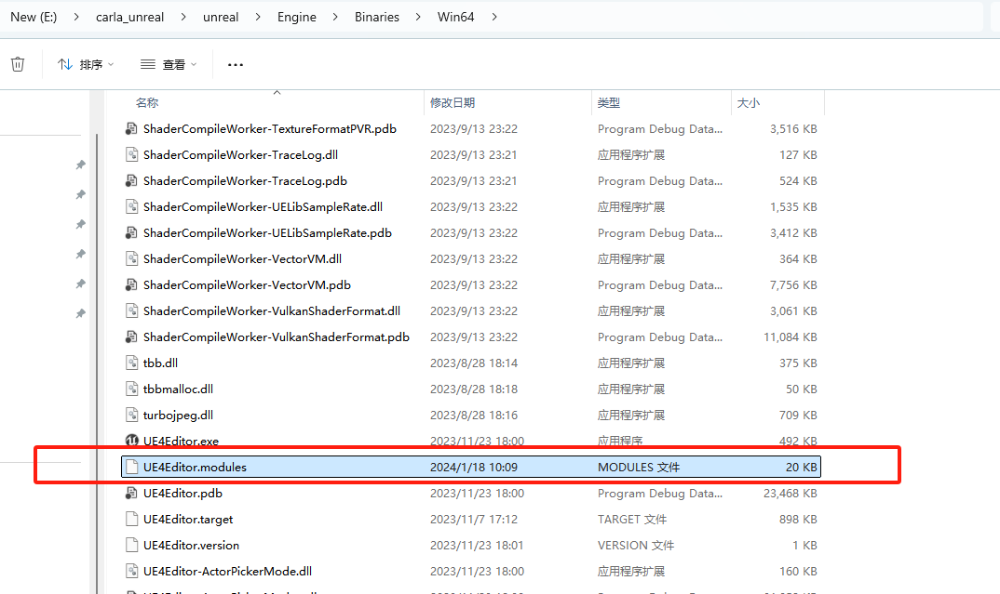
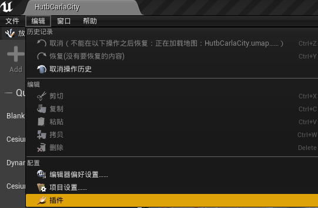
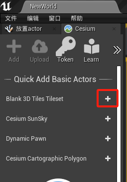

# 倾斜模型导入Carla

1.下载并解压 [Cesium for Unreal 插件](https://github.com/CesiumGS/cesium-unreal/releases/download/v1.18.0-ue4/CesiumForUnreal-426-v1.18.0-ue4.zip) 到CarlaUE引擎的plugins文件夹下：


2.将插件的BuildId修改与CarlaUE引擎的BuildId一致。
引擎的BuildId在如下路径：


需修改的BuildId


3.本地测试还需要修改其他几个内置插件的BuildId也要与引擎的一致。有如下几个地方：

```shell
carla_unreal\unreal\Engine\Plugins\Experimental\Landmass\Binaries\Win64
carla_unreal\unreal\Engine\Plugins\Experimental\Water\Binaries\Win64
carla_unreal\unreal\Engine\Plugins\Editor\BlueprintMaterialTextureNodes\Binaries\Win64
```

4.在CarlaUE中添加插件



添加完成后重启引擎。

5.添加插件对象到场景中,配置参数和模型路径：

`esiumGeoreference`设置为：`28.235238,  112.877178,  0`

`Source`设置为`File:///D:/ssd/model/tileset.json`。



!!! 注意
    从[链接](https://pan.baidu.com/s/1n2fJvWff4pbtMe97GOqtvQ?pwd=hutb) 中的`map`文件夹内下载`中电软件园_cesium_model.zip`并解压。这里测试用的是本地路径，也可以用静态资源服务。

6.将Trees.umap中放到本地文件夹下，菜单中点击`窗口->关卡`，从`内容浏览器`中将`Trees.umap`拖进导弹出界面，然后右键`Trees`关卡，选择`修改流送方法->固定加载`。

7.在`世界大纲视图`中选中`Cesium3DTileset`，将`Cesium`中的`Mobility`修改为`可移动`。

8.添加光源`DirectionalLight`、`ExponentialHeightFog`、`SkyAtmosphere`、`SkyLight`。

9.模型在CarlaUE中的场景效果


## 参考
- [Cesium for Unreal快速入门](https://zhuanlan.zhihu.com/p/365834299)