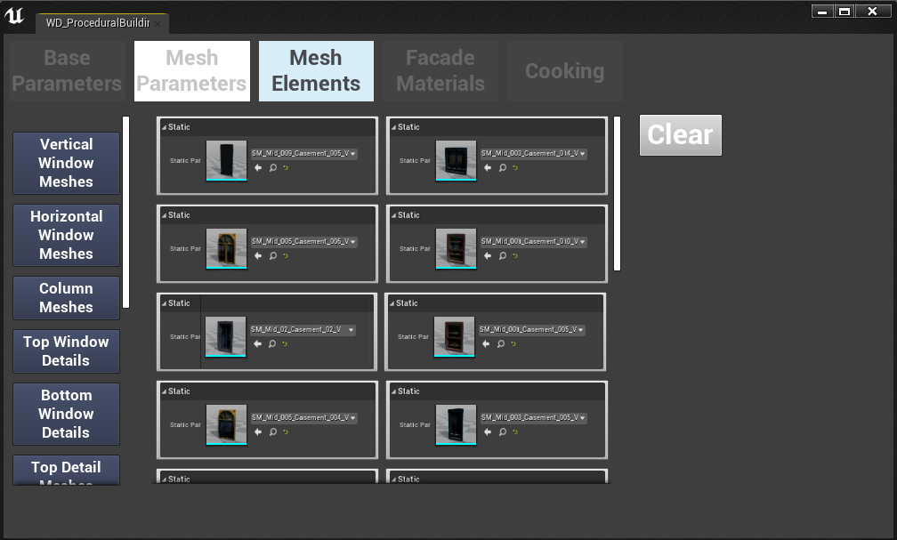
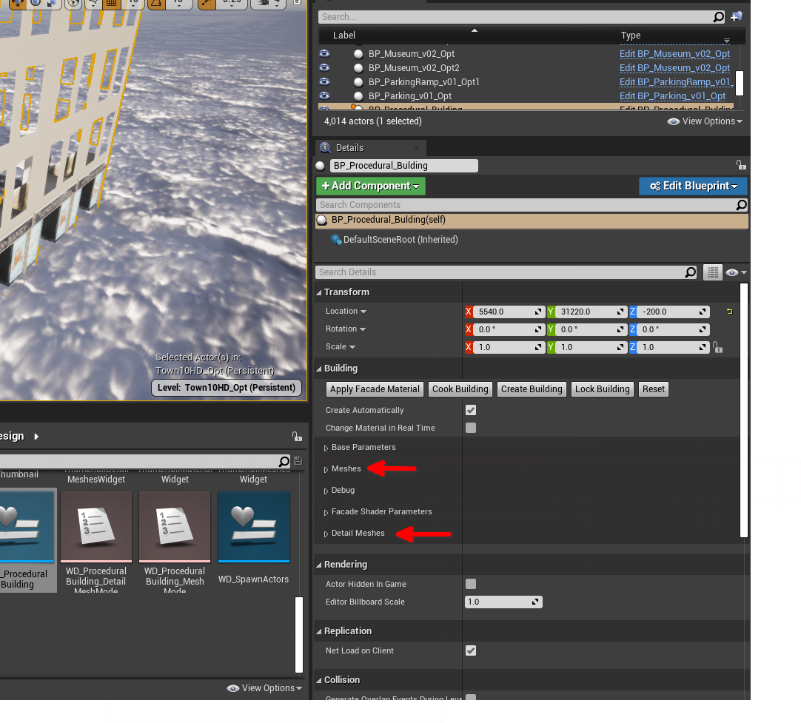
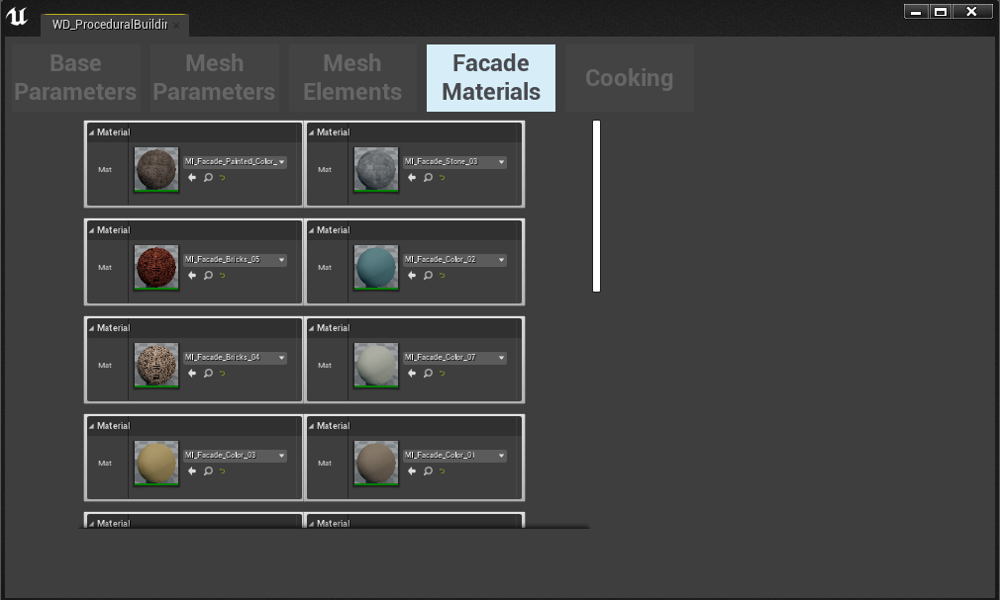

!!! 笔记
	__程序化建筑工具__ 目前是一个 __实验性功能__ ，现阶段尚未考虑 *投入生产*。因此它只能用于实验研究项目。

# [程序化建筑工具](https://carla.readthedocs.io/en/latest/adv_procedural_building_tool/)

__程序化建筑工具__ 有助于生成虚拟三维建筑，可以通过简单的界面对其尺寸和装饰风格进行调制，以创建近乎无限的变化。可以通过界面选择楼层的占地面积尺寸和高度。然后用户可以为建筑大堂、主体以及顶层或阁楼选择多种风格。可以从 Carla 资源库中为角窗和阳台等功能选择各种面板元素样式。

- [__打开工具__](#opening-the-procedural-building-tool)
- [__基本参数__](#base-parameters)
- [__网格参数__](#mesh-parameters)
- [__网格元素__](#mesh-elements)
	- [插槽](#sockets)
- [__外墙材料__](#facade-materials)
- [__烘焙__](#cooking)

## 打开程序化建筑工具

首先，您需要向场景添加程序建筑参与者。导航到`Content>Carla>Blueprints>LevelDesign`并拖动蓝图 *BP_ProceduralBuilding* 到地图中。将资产移动到您希望可视化建筑物的位置。选择一个有空间的地方，以便可以清楚地看到结果。然后，要打开该工具，请右键单击*WD_ProceduralBuilding*小部件并从上下文菜单中选择*Run editor utility widget*来启动程序构建工具。这将打开该工具的界面。

!!! 笔记
	您必须在打开工具之前完成此步骤，地图中必须存在*BP_ProceduralBuilding*蓝图的实例，工具才能运行。您还必须确保在继续之前在世界大纲视图（*World outliner*）中选择*BP_ProceduralBuilding*实体。

## 基本参数

在基本参数部分中，您可以选择建筑物的基本属性，例如占地面积和楼层高度。

!!! 笔记
	在网格参数部分（[mesh parameters](#mesh-parameters)）选择网格片段之前，调整基本参数时，您不会在虚幻引擎视口中看到任何变化。

可用参数如下：

- __Seed__: 设置程序生成的随机种子，这可以使建筑物具有相同设置的变化。
- __Num floors__: 设置建筑物的层数或楼层数，并从此定义建筑物的高度。
- __Length X/Y__: 定义建筑物在 X 和 Y 维度上的占地面积大小。这些是无单位的，数字表示重复部分的数量，每个部分是一列窗口。
- __Create automatically__: 如果选择此选项，建筑物将在视口中自动更新，以便您可以看到调整的效果。
- __Corners__: 允许将角件添加到建筑物中，您可以在[Mesh parameters](#mesh-parameters)部分中选择这些件。
- __Walls__: 将建筑物左/右/前/后的中间部分替换为可使用网格参数（[Mesh parameters](#mesh-parameters)）菜单选择的替代部分。
- __Doors__: 允许在大厅曾放置门的阵列。门放置在选定的索引位置。

## 网格参数

在界面的“网格参数(Mesh Parameters)”选项卡中，我们选择将用于覆盖建筑物外部的网格件。建筑物不同部分的网片分为 5 类：

- __Lobby__: 用于装饰建筑物大堂的网片。
- __Midsection__: 用于装饰建筑物中段、大堂和顶层之间的每一层的网状部件。
- __Penthouse__: 用于装饰顶层公寓层的网格件。
- __Doors__: 为大厅添加门的网状部件
- __Walls__: 用于装饰建筑物墙壁的网片

在每个类别中，您都会发现许多网片选项。单击一个或多个使其变为红色，这些将被添加到建筑物的相应部分。如果您选择多个选项，该工具将在选项之间随机交替。当您为建筑物的每个部分选择网格片段时，如果您在基本参数部分中选择了自动创建（*Create automatically*），您将在编辑器视口中看到建筑物正在成形。

## 网格元素

在此部分中，您可以选择建筑物的更详细元素，例如窗户、柱子、花盆、空调装置和天线。每种类型的装饰都有略微不同的属性。

建筑物细节的装饰有多种类型：

- __垂直/水平窗户网格__: 这些网格片定义了建筑物中窗框的样式。垂直窗户网格将占据比其宽度高的窗户空间，而水平窗户网格将占据比其高度更宽的窗户空间。如果您选择多个选项，它们将交替出现。

- __柱网格__: 这些仿真跨越建筑物高度的砖砌柱细节

- __顶部/底部窗户细节__: 这些网格用门楣和遮阳板装饰窗户的顶部，用窗台和植物箱装饰窗户的底部。

- __Window columns__: 分隔窗户的砖砌柱

- __Curtain meshes__: 安装在窗户内的窗帘和百叶窗

- __Pot meshes__: 在指定插座点添加到窗台和植物箱的花盆

- __Air conditioner meshes__: 在指定插座点处添加到窗户的空调装置

- __Pipe meshes__: 垂直向下延伸到建筑物的管道，仿真屋顶的排水管

- __Wire meshes__: 沿着建筑物垂直延伸的电线，仿真电视天线延伸和闪电接地线

- __Antenna meshes__: 从窗户伸出的电视天线

参数的工作原理如下：

 __常用参数__:

* __Percentage__: 控制将放置在建筑物上的件数，100% 表示所有可用空间将被占用
* __Offset__: 该作品相对于建筑物主体的空间偏移

__Blinds and curtains__:

* __Min/Max size__: 选择百叶窗或窗帘的最小/最大长度，值之间随机变化。1.0为全闭，0.0为全开。

__Pipes and wires__:

* __Index__: 定义将放置管道的建筑物的面
* __Offset side/front__: 从建筑物正面的中心向作品添加空间偏移

!!! 笔记
	在某些情况下，您可能会发现，当您选择细节网格部件（例如花盆、天线和空调装置）时，您看不到建筑物有任何变化。这很可能是因为您正在使用的部件没有添加您选择的部件所需的适当套接字。请参阅插槽部分（[sockets section](#sockets)）了解如何使用插槽。

### 套接字

插槽是锚点，用于定义将细节网格物体放置在另一个网格物体上的位置。要将套接字添加到程序建筑中的网格物体，请在选择程序建筑的情况下，转到详细信息面板（*details panel*），通常位于虚幻编辑器界面的右侧。在那里，您将找到“网格（*Meshes*）”和“细节网格（*Detail meshes*）”面板。打开相关部分，在您要放置插座的位置打开网片。

找到要在其上放置套接字的网格，然后双击该图标以在编辑器中将其打开。单击“创建套接字(*create socket*)”以添加套接字并使用以下约定命名：

* 空调机组（Air conditioning unit）： aa_*
* 天线（Antennas）： ant_*
* 花盆（Plant pots）： pot_*

将星号替换为索引，具体取决于您有多少个套接字，即 aa_0, aa_2, aa_3...

当您单击“创建套接字(*Create socket*)”时，套接字将在编辑器中使用三维句柄进行实例化。将插槽拖动到网格上的所需位置，这是您的细节部件将显示连接到单元的位置。

## 外墙材料

在外观材料选项卡中，您可以浏览和预览要装饰建筑物墙壁的材料。

## 烘焙

在烹饪选项卡中，您可以将选择的所有网格物体和材质组合到具有关联材质和纹理的单个静态网格物体中。还将为 LOD 创建建筑物的 LOD 纹理。在界面中指定将保存新建筑资源的文件夹名称。

一旦您完成了建筑物的制作，您就可以像任何其他 Carla 资产一样将建筑物的实例放置在地图中。

