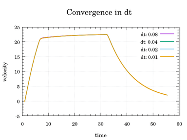
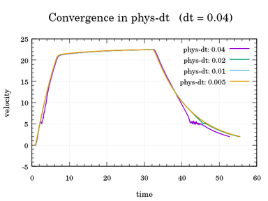
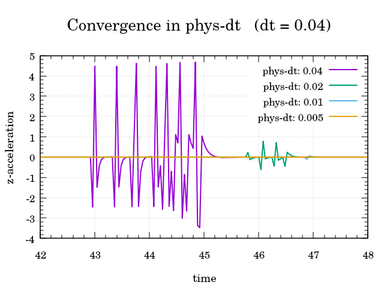

# 同步和时间步长 

本节介绍 Carla 中的两个基本概念。它们的配置定义了仿真中的时间如何流逝，以及服务器如何使仿真向前推进。

*   [__仿真和时间步长__](#simulation-time-step)
	*   [可变时间步长](#variable-time-step)
	*   [固定时间步长](#fixed-time-step)
	*   [仿真记录](#tips-when-recording-the-simulation)
	*   [物理子步](#physics-substepping)
*   [__客户端-服务器同步__](#client-server-synchrony)
	*   [设置同步模式](#setting-synchronous-mode)
	*   [使用同步模式](#using-synchronous-mode)
*   [__可能的配置__](#possible-configurations)
*   [__物理确定性__](#physics-determinism)

---
## 仿真时间步长 <span id="simulation-time-step"></span>

实时时间和仿真时间是有区别的。仿真世界有自己的时钟和时间，由服务器执行。计算两个仿真步骤需要一些实时时间。但是，在这两个仿真时刻之间也存在时间跨度，即时间步长。 

为了澄清这一点，服务器可能需要几毫秒来计算仿真的两个步骤。但是，比如这两个仿真时刻之间的时间步长可以配置为始终为一秒。  

时间步长可以是固定的，也可以是可变的，具体取决于用户的偏好。

!!! 笔记 

    时间步长和同步是相互交织的概念。请务必阅读这两个部分，以充分了解 Carla 的工作原理。  
### 可变时间步长 <span id="variable-time-step"></span>

Carla 中的默认模式。步骤之间的仿真时间将是服务器计算这些步骤所需的时间。

```py
settings = world.get_settings()
settings.fixed_delta_seconds = None # 设置为可变步长
world.apply_settings(settings)
```
`PythonAPI/util/config.py` 使用参数设置时间步长。0 表示可变时间步长。

```sh
cd PythonAPI/util && python3 config.py --delta-seconds 0
```

### 固定时间步长 <span id="fixed-time-step"></span>

每个仿真步骤之间经过的时间保持恒定。如果设置为 0.5 秒，每秒将有两个仿真帧。使用相同的时间增量对于从仿真中获取数据是最好的方式。物理和传感器数据将对应于仿真中易于理解的时刻。此外，如果服务器速度足够快，可以在更少的实际时间内仿真更长的时间段。

可以在世界设置中设置固定的时间步长。要将仿真设置为固定时间步长为 0.05 秒，请应用以下设置。在这种情况下，仿真器将花费20个步骤（1/0.05）来重现仿真世界中的一秒。

```py
settings = world.get_settings()
settings.fixed_delta_seconds = 0.05
world.apply_settings(settings)
```
这也可以使用 `PythonAPI/util/config.py` 提供的脚本进行设置。 

```sh
cd PythonAPI/util && python3 config.py --delta-seconds 0.05
```

### 仿真记录 <span id="tips-when-recording-the-simulation"></span>

Carla 具有[记录器](adv_recorder.md)功能，可以记录仿真，然后重新播放。但是，在寻找精度时，需要考虑一些事情。

* 有了**固定的时间步长**，重新播放它就很容易了。服务器可以设置为与原始仿真相同的时间步长。
* 使用**可变的时间步长**，事情会稍微复杂一些。

  * 如果服务器以可变的时间步长运行，则时间步长将与原始时间步长不同，因为逻辑周期会不时变化。然后，将使用记录的数据对信息进行插值。
  * 如果**服务器被迫重现完全相同的时间**步长，则仿真的步长将相同，但它们之间的实时时间会发生变化。时间步长应逐一传递。这些原始时间步长是原始仿真尽可能快运行的结果。由于表示这些所需的时间大多不同，因此仿真必然会以奇怪的时间波动再现。

### 物理子步 <span id="physics-substepping"></span>

为了精确计算物理效果，物理仿真必须在非常小的时间步内进行。当我们在仿真中每帧执行多次计算（例如传感器渲染，读取存储等）时，时间步长可能会成为一个问题。由于这个限制仅发生在物理仿真中，我们可以仅对物理计算应用子步。在默认情况下物理子步是打开的，并且被设定为每个时间步长最大 10 个物理子步，每个物理子步最大为0.01 秒。

当然，我们可以通过API调整这些设定：

```py
settings = world.get_settings()
settings.substepping = True
settings.max_substep_delta_time = 0.01
settings.max_substeps = 10
world.apply_settings(settings)
```

**注意，当启用同步模式时，我们设定仿真时间步长时需要遵循以下条件来保证物理仿真的准确性：**

```py
fixed_delta_seconds <= max_substep_delta_time * max_substeps
```

**注意，为了保证物理仿真的准确性，子步的时间间隔应该至少低于 0.01666，理想情况下低于0.01。**

为了演示最佳物理子步的效果，请考虑下面的图。下面的第一个图表显示了在不同固定仿真时间步长的仿真中速度随时间的变化。物理增量时间在所有仿真中都是恒定的，默认值为0.01。我们可以看到，速度不受仿真时间步长差异的影响。

>>>>>

第二张图显示了仿真中速度随时间的变化，仿真时间步长固定为0.04。我们可以看到，一旦物理增量时间超过0.01，速度常数开始出现偏差，随着物理增量时间的增加，偏差的严重程度也在增加。

>>>>>

我们可以通过在测量z-加速度时显示物理增量时间与固定仿真时间步长相同的差异的影响来再次证明这种偏差，只有当物理增量时间为0.01或更小时才会发生收敛。

>>>>>

---
## 客户端-服务器同步 <span id="client-server-synchrony"></span>

Carla 采用客户端-服务器架构。服务器运行仿真，客户端获取信息并对世界进行修改。本节涉及客户端和服务器之间的通信。

默认情况下，Carla 以异步模式运行。服务器尽可能快地运行仿真，而不等待客户端。在同步模式下，服务器在更新到下一个仿真步骤之前会等待客户端发送的“ready to go”的消息。

!!! 笔记
    同时运行多个client时，只能有一个client开启同步模式，因为server会对每个收到的“ready to go”信息进行反应，多个client开启同步模式将会发送过多“ready to go”信息导致同步失败。
### 设置同步模式 <span id="setting-synchronous-mode"></span>

同步模式和异步模式之间切换只需要改变 settings.synchronous_mode的值即可。

```py
settings = world.get_settings()
settings.synchronous_mode = True # Enables synchronous mode
world.apply_settings(settings)
```
!!! 警告

    如果启用了同步模式，并且正在运行交通管理器，则也必须将其设置为同步模式。阅读 [this](adv_traffic_manager.md#synchronous-mode) 以了解如何操作。

要禁用同步模式，只需将变量设置为 false 或使用脚本。 `PythonAPI/util/config.py`. 

```sh
cd PythonAPI/util && python3 config.py --no-sync # Disables synchronous mode
```
同步模式不能通过脚本启用，只能禁用。启用同步模式将使服务器等待客户机的响应。使用这个脚本，用户不能在需要的时候发送刻度。

### 使用同步模式 <span id="using-synchronous-mode"></span>

同步模式在客户端应用程序较慢以及需要不同元素之间的同步，如传感器等情况下尤为重要。如果客户端速度太慢而服务器不等待，信息将会溢出。客户端将无法管理所有内容，信息会丢失或混淆。类似的情况是，如果有很多传感器和异步操作，将无法确定所有传感器是否在仿真中使用来自同一时刻的数据。

以下代码片段扩展了前一段代码。客户端创建一个相机传感器，将当前步骤的图像数据存储在队列中，并在从队列中检索后勾选服务器。可以[在此处][syncmodelink]找到有关多个传感器的更复杂示例。

```py
settings = world.get_settings()
settings.synchronous_mode = True
world.apply_settings(settings)

camera = world.spawn_actor(blueprint, transform)
image_queue = queue.Queue()
camera.listen(image_queue.put)

while True:
    world.tick()
    image = image_queue.get()
```
[syncmodelink]: https://github.com/carla-simulator/carla/blob/master/PythonAPI/examples/synchronous_mode.py


!!! 重要

    来自基于GPU的传感器（主要是摄像头）的重要数据通常会延迟几帧。在这里，同步是至关重要的。


世界具有异步方法，可以让客户端等待服务器的时间步进，或在收到时执行某些操作。

```py
# Wait for the next tick and retrieve the snapshot of the tick.
world_snapshot = world.wait_for_tick()

# Register a callback to get called every time we receive a new snapshot.
world.on_tick(lambda world_snapshot: do_something(world_snapshot))
```

---
## 可能的配置  <span id="possible-configurations"></span>

时间步长和同步的配置，导致不同的设置。以下是对这些可能性的简要总结。

|          | **固定时间步长**                   | **可变时间步长** |
| -------- | ---------------------------- | ---------- |
| **同步模式** | 客户完全控制仿真及其信息。                | 不可靠仿真的风险。  |
| **异步模式** | 这是关于信息的好时间参考，服务器尽可能以最快的速度运行。 | 不容易重复的仿真。  |

<br>


* **同步模式+可变时间步长。**这几乎可以肯定是一种不可取的状态。当时间步长大于 0.1 秒时，物理无法正常运行。如果服务器必须等待客户端计算步骤，则很可能会发生这种情况。仿真时间和物理特性不会同步。仿真将不可靠。
* **异步模式+可变时间步长。**这是默认的 Carla 状态。客户端和服务器是异步的。仿真时间根据实时流动。重新执行仿真需要考虑浮点数算术误差，以及服务器之间时间步长的可能差异。
* **异步模式+固定时间步长。**服务器将尽可能快地运行。检索到的信息将很容易与仿真中的确切时刻相关联。如果服务器速度足够快，这种配置可以以更低的实时度仿真长时间。
* **同步模式+固定时间步长。**客户端将统治仿真。时间步长将是固定的。在客户端发送即时报价之前，服务器不会计算以下步骤。当同步和精度相关时，这是最佳模式。尤其是在处理缓慢的客户端或检索信息的不同元素时。

!!! 警告 

    在同步模式下，请始终使用固定的时间步长。如果服务器必须等待用户，并且它使用的是可变时间步长，则时间步长将太大。物理学是不可靠的。这个问题在时间步长限制部分有更好的解释。
---

## 物理确定性 <span id="physics-determinism"></span>

Carla 在特定情况下支持物理和碰撞确定性：

- **同步模式和固定的时间步长必须启用**：确定性要求客户端与服务器完全同步，以确保命令被正确应用并产生准确和可复制的结果。必须通过设置固定的时间步长来强制执行恒定的时间步长。如果不设置，时间步长将根据仿真性能在每个步骤自动计算。
- **在加载或重新加载世界之前，必须启用同步模式：**如果世界从一开始就不处于同步模式，则可能会出现不同的时间戳。这可能会在物理仿真和交通信号灯等对象的生命周期中产生微小的差异。
- **每一次新的重复都必须重新加载世界：**每次要重现仿真时，请重新加载世界。
- 命令**应该是批处理的，而不是一次发出一个命令：**虽然很少见，但在繁忙的仿真或过载的服务器中，单个发出的命令可能会丢失。如果命令在[`apply_batch_sync`](python_api.md/#carla.Client.apply_batch_sync)命令中批处理，则保证该命令被执行或返回失败响应。

以下是上述步骤的示例：

```py
client = carla.Client(HOST, PORT) # connect to the server
client.set_timeout(10.0)
world = client.get_world()

# Load the desired map
client.load_world("Town10HD_Opt")

# Set synchronous mode settings
new_settings = world.get_settings()
new_settings.synchronous_mode = True
new_settings.fixed_delta_seconds = 0.05
world.apply_settings(new_settings) 

client.reload_world(False) # reload map keeping the world settings

# Set up the traffic manager
traffic_manager = client.get_trafficmanager(TM_PORT)
traffic_manager.set_synchronous_mode(True)
traffic_manager.set_random_device_seed(SEED) # define TM seed for determinism

# Spawn your vehicles, pedestrians, etc.

# Simulation loop
while True:
	# Your code
	world.tick()
```

播放功能的一个具体示例：

```py
client = carla.Client(HOST, PORT) # connect to the server
client.set_timeout(10.0)
world = client.get_world()

# Load the desired map
client.load_world("Town10HD_Opt")

# Set synchronous mode settings
new_settings = world.get_settings()
new_settings.synchronous_mode = True
new_settings.fixed_delta_seconds = 0.05
world.apply_settings(new_settings) 

client.reload_world(False) # reload map keeping the world settings

client.replay_file(FILE_TO_PLAY, 0, 0, 0, False)
world.tick() # a tick is necessary for the server to process the replay_file command

# Simulation loop
while True:
	# Your code
	world.tick()
```

运行这些步骤将确保每次仿真运行的结果相同。

---

这就是关于仿真时间和客户端-服务器同步在 Carla 中的作用的全部信息。

打开 Carla，玩一会儿。欢迎在论坛中提出任何建议或疑问。

<div class="build-buttons">
<p>
<a href="https://github.com/carla-simulator/carla/discussions/" target="_blank" class="btn btn-neutral" title="跳转至 Carla 论坛">
Carla forum</a>
</p>
</div>
