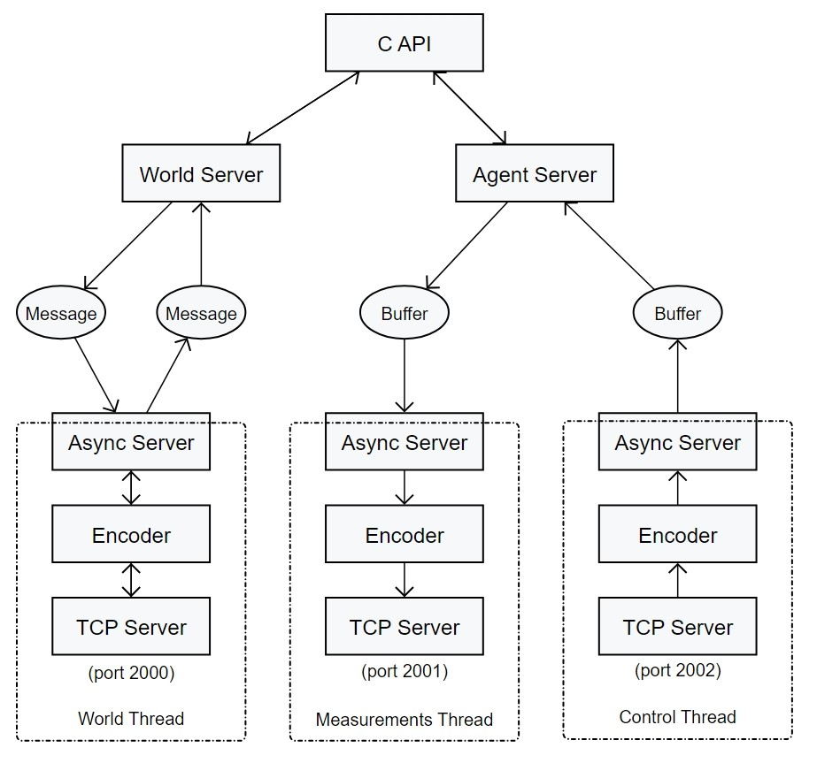

# CARLA 服务器
## 编译
提供了一些用于在 Linux 上构建和测试 CarlaServer 的脚本
```shell script
./Setup.sh
make
make check
```
安装脚本会下载并编译所有必需的依赖项。Makefile 调用 CMake 来构建 CarlaServer 并将其安装在“Util/Install”下。

## 协议
所有消息前都附加一个 32 位无符号整数（小端字节序），指示即将到来的消息的大小。

使用三个连续的端口，

- world-port (默认 2000)
- measurements-port = world-port + 1
- control-port = world-port + 2

每个端口都有一个关联的线程，可以异步发送/读取数据。

### 世界线程
服务器读取一个，写入一个。始终是 protobuf 消息。
```
[client] RequestNewEpisode
[server] SceneDescription
[client] EpisodeStart
[server] EpisodeReady
...repeat...
```

### 测量线程
服务器仅写入第一条测量消息，然后写入大量原始图像。
```
[server] Measurements
[server] raw images
...repeat...
```

每个图像都是一个 uint32 数组
```
[width, height, type, FOV, color[0], color[1],...]
```

其中 FOV 是相机水平视野的浮点数，每种颜色都是虚幻引擎中存储的FColor (BGRA)，可能的图像类型包括

```
type = 0  None                  (RGB without any post-processing)
type = 1  SceneFinal            (RGB with post-processing present at the scene)
type = 2  Depth                 (Depth Map)
type = 3  SemanticSegmentation  (Semantic Segmentation)
```

[此处] 详细解释了测量信息。

### 控制线程
服务器仅读取，客户端每帧发送控制消息。
```
[client] Control
...repeat...
```
在同步模式下，服务器每帧都会暂停执行，直到收到控制消息。

## 接口
该库封装在 C 语言中的单个包含文件 “carla/carla_server.h”中。

此文件包含用于向客户端读取和写入消息的基本接口，隐藏了网络和多线程部分。大多数函数都有一个超时参数，并会阻塞，直到相应的异步操作完成或达到超时要求。将超时设置为 0 可获得非阻塞调用。

CarlaServer 实例是用 `carla_make_server()` 创建的，使用后应被`carla_server_free(ptr)`销毁。

## 设计
C API 负责将请求分发到相应的服务器。有三个异步服务器，每个服务器都在自己的线程上运行。

 

从概念上讲，有两个服务器，即 *World Server* 和*Agent Server*。`World Server` 控制情节的初始化。每次通过 `RequestNewEpisode` 消息向 `World Server` 请求新情节时，都会启动新情节。情节准备就绪后，`World Server` 将启动 `Agent Server`。`Agent Server`有两个线程，一个用于发送测量流，另一个用于接收控制。两个代理线程都通过无锁双缓冲区与主线程通信，以加快消息和图像的流式传输。

消息（protobuf）的编码和网络操作是异步执行的。