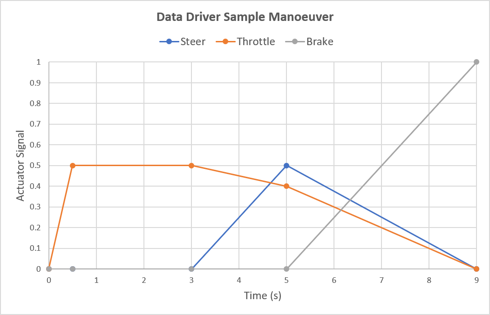
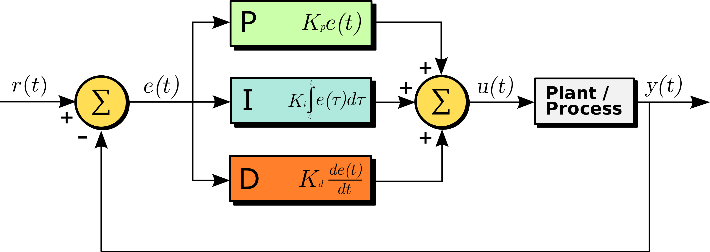

# 驱动子系统


- [__交互式驱动程序__](#four_wheel)
- [__基于数据（开环）的驱动器__](#two_wheel)
- [__闭环驱动模型__](#kinematic)

驾驶员输入（转向、油门和刹车）由驾驶员子系统提供，Chrono::Vehicle 中提供选项，包括交互式、数据驱动和闭环式（例如基于 PID 控制器的路径跟踪）。

驱动系统的基类 [ChDriver](https://api.projectchrono.org/classchrono_1_1vehicle_1_1_ch_driver.html) 对驱动系统模板提出了最低要求，特别是返回油门输入的能力（在[ 0 , 1 ]范围）、转向输入（标准化[ − 1 , + 1 ]范围，负值表示向左转向），以及制动输入（在[ 0 , 1 ]范围）。此外，驾驶员系统可以通过其`Synchronize`方法从任何其他系统接收信息（例如，车辆状态），并且可能具有内部动态（在其`Advance`方法中实现）。驾驶员系统的特定模板可以扩展生成的车辆输入集，例如包括当前选择的手动变速器档位、启用/禁用履带式车辆的交叉驱动能力等。

Chrono::Vehicle 包含多个驾驶员系统模板。对于以软实时方式运行的交互式模拟，它提供了一个驾驶员系统模板，该系统根据用户控制（键盘和鼠标或游戏控制器）产生车辆输入。
对于实验模拟设计，它提供了一个基于通过文本数据文件提供的输入的驾驶员系统模板，其中车辆输入通过线性插值获得。此类数据文件也可以通过交互运行期间收集的数据自动生成。

最后，Chrono::Vehicle 包含几个闭环驱动系统模型，基于对 PID 控制器的底层支持。这些模型包括速度控制器（可同时调节油门和制动输入以保持恒定的车速）和路径跟随控制器。后者可调整转向输入，使车辆遵循用户定义的贝塞尔曲线路径。

## 交互式驱动程序
交互式驱动程序 [ChInteractiveDriverIRR](https://api.projectchrono.org/classchrono_1_1vehicle_1_1_ch_interactive_driver_i_r_r.html) （用于基于 Irrlicht 的运行时可视化系统）和 [ChInteractiveDriverVSG](https://api.projectchrono.org/classchrono_1_1vehicle_1_1_ch_interactive_driver_v_s_g.html) （用于基于 VSG 的运行时可视化系统）可以通过用户输入控制（转向/加速/制动）模拟车辆。这些交互式驱动程序依赖于各自运行时可视化系统的键盘和控制器事件处理程序。

该驱动子系统模型的其他特性包括：

- 实验性控制器支持
- 能够锁定/解锁驱动器输入为其当前值（通过键控制`J`）
- 记录和回放用户输入的能力（使用嵌入式基于数据的驱动程序；见下文）

#### 键盘驱动程序
- 键`A`增加左转方向盘角度
- 键`D`增加右转方向盘角度
- 键`W`加速
- 键`S`减速

油门和刹车控制是耦合的，即加速时首先将刹车降至零，然后再增加油门输入（减速时反之亦然）。

### 控制器驱动程序
现代模拟器通常有多个（USB）设备用于控制汽车中的所有不同控制元件。它们配有踏板、方向盘、H 型换挡器、顺序换挡器、手刹和按钮盒（带有大量按钮来更改车载系统）的设备。Chrono 支持这一点，因为它能够将控制器轴和按钮分配给连接的多个设备。轴也可以校准，设置该轴的最小和最大（原始）值以及预期（缩放）输出值。

映射和校准是使用文件夹中的“controller.json”文件完成的，`data/vehicles`该文件允许您将控件分配给这些“控制器”的轴和按钮。我们提供了几个此类文件的示例，但通常您需要根据自己的设置自定义此文件：

- `controller_XboxOneForWindows.json`是一种相当标准的控制器设置，大多数用户应该很容易适应，它映射所有轴并包括顺序变速器设置以及在自动和手动变速箱之间切换的方式。
- `controller_WheelPedalsAndShifters.json`是一个更复杂的多控制器设置的示例，具有方向盘、三个踏板以及顺序和 H 型换档器设置。如果您想使用此示例，可能需要进行大量修改，但它展示了如何使用不同的控制器。

#### 示例控制器文件

```json
{
    "steering": {
        "name": "Steering Wheel", "axis": 0,
        "min": -32768, "max": 32767, "scaled_min": 1, "scaled_max": -1
    },
    "throttle": {
        "name": "Pedal Box", "axis": 2,
        "min": -1, "max": -32767, "scaled_min": 0, "scaled_max": 1
    },
    "brake": {
        "name": "Pedal Box", "axis": 2,
        "min": 0, "max": 32767, "scaled_min": 0, "scaled_max": 1
    },
    "clutch": {
        "name": "Pedal Box", "axis": 4,
        "min": 0, "max": 32767, "scaled_min": 0, "scaled_max": 1
    },
    "gearReverse": { "name": "H-Shifter", "button": 0 },
    "gear1": { "name": "H-Shifter", "button": 1 },
    "gear2": { "name": "H-Shifter", "button": 2 },
    "gear3": { "name": "H-Shifter", "button": 3 },
    "gear4": { "name": "H-Shifter", "button": 4 },
    "gear5": { "name": "H-Shifter", "button": 5 },
    "gear6": { "name": "H-Shifter", "button": 6 },
    "gear7": { "name": "H-Shifter", "button": 7 },
    "gear8": { "name": "H-Shifter", "button": 8 },
    "gear9": { "name": "H-Shifter", "button": 9 },
    "shiftUp": { "name": "Steering Wheel", "button": 4 },
    "shiftDown": { "name": "Steering Wheel", "button": 5 },
    "toggleManualGearbox": { "name": "Button Box", "button": 2 }
}
```

在文件的顶层，我们有一组控制器函数（，，，`steering`... ），对于每个函数，我们可以指定一个轴或按钮定义以及所有映射细节：`throttleshiftUp`

- 轴：`steering`，`throttle`，`brake`，`clutch`具有以下属性：
    - `name`是系统上控制器的名称；
    - `axis`是您想要映射到的轴的编号；
    - `min`和`max`是该轴的原始最小值和最大值；
    - `scaled_min`和`scaled_max`是该轴的输出最小值和最大值；
- 按钮：`shiftUp`，`shiftDown`，`gearReverse`，`gear1`，`gear2`... ，`gear9`具有`toggleManualGearbox`以下属性：
    - name是系统上控制器的名称；
    - button是您想要映射的按钮的编号；

关于控制变速箱的一句话：

- 如果您使用的是手动变速箱，则支持顺序换档器。您可以使用另一个按钮在自动变速箱和手动变速箱之间切换。
- 还有 H-shifter 支持。代码最多支持 9 个前进档，并支持换档（只要您完全踩下离合器）。

还有一个调试模式，每秒两次打印所有连接的控制器的轴和按钮的所有值。这在定义文件时非常有用，否则可能应该禁用。

#### 当前实施的局限性
所有控制器处理都与 IrrLicht 相关联，这意味着您需要使用它来实现可视化。这也意味着我们继承了 IrrLicht 处理控制器的所有限制。这主要反映在每个控制器支持的按钮数量上，但也可能存在其他限制。

## 基于数据（开环）的驱动器
一些重要的车辆测试操作基于时间相关的转向/油门/制动信号。不考虑任何类型的反馈。此驱动程序模型在 [ChDataDriver](https://api.projectchrono.org/classchrono_1_1vehicle_1_1_ch_data_driver.html) 中实现。

带有驾驶员输入的 ASCII 数据文件包含四列，分别为时间（s）、转向输入（无量纲量，单位为[ − 1 , 1 ]， 和− 1表示向左完全转向）、油门输入（无量纲量[ 0 , 1 ]， 和1表示全油门）和制动（无量纲量介于[ 0 , 1 ]， 和1表示最大制动力）。

下面列出了示例驱动程序数据文件

```json
 0.0    0.0    0.0     0.0    0.0
 0.5    0.0    0.5     0.0    0.0
 3.0    0.0    0.5     0.0    0.0
 5.0    0.5    0.4     0.0    0.0
 9.0    0.0    0.0     1.0    0.0
```



在任何给定时间，当前驾驶员输入（转向、油门和制动）都是通过对提供的数据进行分段线性插值获得的。除了最后一次输入之外，驾驶员输入将保持为其最后一个值。

## 闭环驱动模型

闭环驱动器模型需要控制策略并考虑反馈。反馈可能导致不稳定的行为，因此必须明智地选择控制器参数。示例参数已在广泛的用途中发挥作用。用户应从给定的示例参数集之一开始，并仅在必要时进行修改。

### 路径跟随控制器
为了使车辆遵循给定的路径，必须测量横向路径偏差并生成使偏差最小化的方向盘角度。解决此问题的一个众所周知的方法是 PID 控制器（P=比例、I=积分、D=微分）。采用纯 P 变量，只需设置 P 增益。这在许多情况下都有效，但纯 P 控制器永远无法将横向偏差降至零。残余偏差随 P 增益的增加而减小。如果 P 增益太大，车辆将开始围绕所需的车辆路径振荡。可以通过将 I 增益设置为 P 增益的 5% 到 10% 左右的值来消除残余路径偏差。通过设置 D 增益，如果发生路径振荡，可以施加阻尼。如果使用 I 增益，模拟操作不应超过约 2 分钟。如果需要更多时间，则应每 2 分钟重置一次控制器状态以避免不稳定。

下图（维基百科）展示了 Chrono 如何实现 PID 控制器：



- r(t) = 所需路径信号
- e(t) = 横向路径偏差
- y(t) = 实际路径信号
- u(t) = 转向信号

此图表（维基百科）显示了增益因素的影响：


人类驾驶员不仅会对偏差变化做出反应，还能进行预测。在 Chrono 中，这种能力是通过在车身前方设置一个参考点来测量偏差来模拟的。参考点与车辆参考系统的距离称为前视距离，是重要的控制器输入参数。

期望路径以贝塞尔曲线指定（参见 [ChBezierCurve](https://api.projectchrono.org/classchrono_1_1_ch_bezier_curve.html) ）。误差定义为“哨兵点”（位于车辆前进方向前视距离处的点）与“目标点”（哨兵点在期望路径上的投影）之间的偏差。


### 恒速控制器
为了保持给定的车速，可以使用 PID 控制器。与路径控制器的不同之处在于，它使用速度偏差而不是横向路径偏差。

- r(t) = 所需速度信号
- e(t) = 速度偏差
- y(t) = 实际速度信号
- u(t) = 油门/刹车信号

[ChPathFollowerDriver](https://api.projectchrono.org/classchrono_1_1vehicle_1_1_ch_path_follower_driver.html) 类实现了 PID 横向控制器与 PID 速度控制器的结合。它在双车道变换等极端操作中效果很好。

标准道路驾驶操作的一个有趣替代方案是[ChPathFollowerDriverSR](https://api.projectchrono.org/classchrono_1_1vehicle_1_1_ch_path_follower_driver_s_r.html) 。它有一个 PID 速度控制器，但采用考虑人和车辆特性的横向控制策略。预测使用前瞻时间而不是前瞻距离，这意味着有效前瞻距离随速度而变化。


### 最佳速度控制器
恒速控制器适用于许多标准驾驶操作。对于在长而弯曲的道路上行驶，车辆在整个过程中行驶的速度令人感兴趣。针对这种情况，已经开发了 [ChHumanDriver](https://api.projectchrono.org/classchrono_1_1vehicle_1_1_ch_human_driver.html) 类。横向控制器和速度控制器都使用人类行为、车辆属性和预期以及驾驶员的视野。横向控制器与 [ChPathFollowerDriverSR](https://api.projectchrono.org/classchrono_1_1vehicle_1_1_ch_path_follower_driver_s_r.html) 中实现的控制器相同。