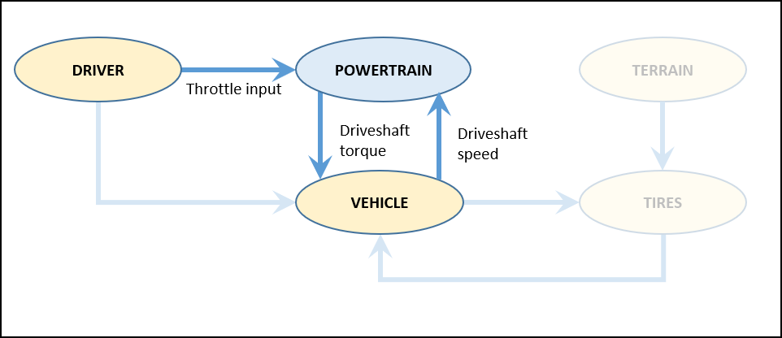
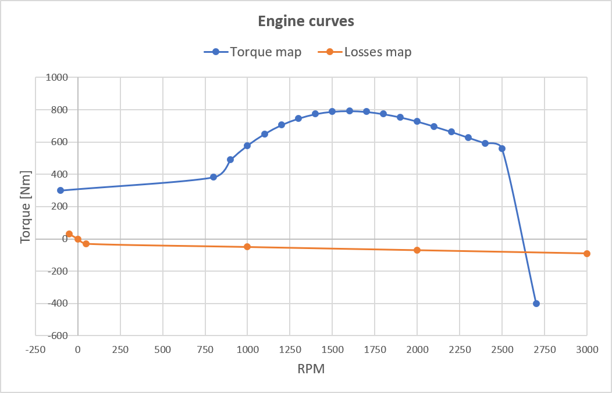
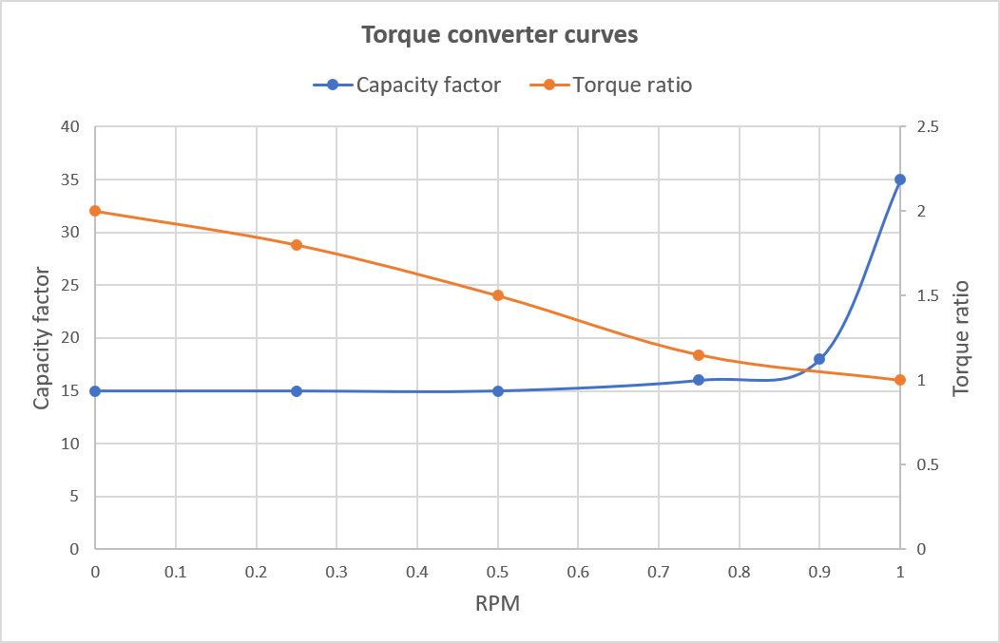
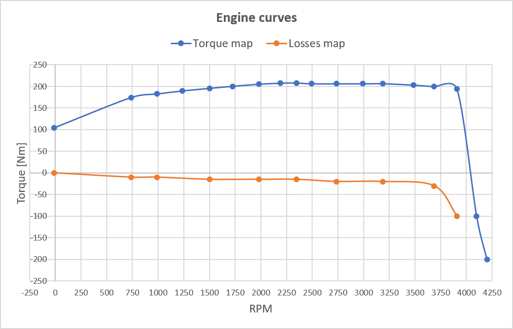
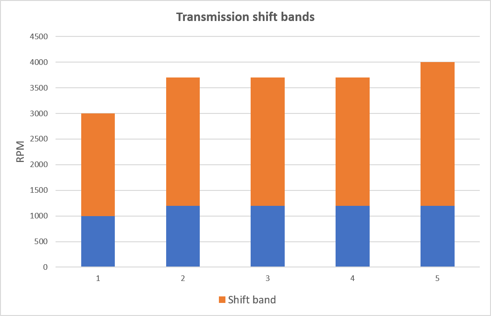

# 动力系统模型

- [__基于轴的动力总成模型__](#four_wheel)
- [__发动机图模型__](#two_wheel)
- [__简单的动力传动系统模型__](#kinematic)


动力传动系统连接到驱动系统（接收油门输入）和车辆系统的传动系子系统（接收驱动轴角速度并发送驱动轴扭矩）。



Chrono::Vehicle 旨在允许链接到第三方动力系统模型。与此类外部动力系统模型接口需要两个精简接口类，它们派生自[ChEngine](https://api.projectchrono.org/classchrono_1_1vehicle_1_1_ch_engine.html) 和[ChTransmission](https://api.projectchrono.org/classchrono_1_1vehicle_1_1_ch_transmission.html) 。

Chrono::Vehicle 为动力传动系统提供了几个模板，如下所述。

## 基于轴的动力总成模型
该动力系统模型基于各种 Chrono 1-D 轴元件 ( [ChShaft](https://api.projectchrono.org/classchrono_1_1_ch_shaft.html) ) 和专用轴连接元件。这些元件用于建模：

- 发动机 ( [ChShaftsThermalEngine](https://api.projectchrono.org/classchrono_1_1_ch_shafts_thermal_engine.html) )，通过速度扭矩曲线指定
- 扭矩转换器 ( [ChShaftsTorqueConverter](https://api.projectchrono.org/classchrono_1_1_ch_shafts_torque_converter.html) )，通过曲线指定容量系数作为速度比的函数，以及扭矩比作为速度比的函数
- 变速箱（手动或自动，具有任意数量的前进档和倒档）

电机模块通过特殊的 Chrono 约束（ [ChShaftBodyRotation](https://api.projectchrono.org/classchrono_1_1_ch_shaft_body_rotation.html) ）连接到底盘，从而允许模拟电机扭矩对底盘的影响。

请参阅 [ChEngineShafts](https://api.projectchrono.org/classchrono_1_1vehicle_1_1_ch_engine_shafts.html) 、[ChAutomaticTransmissionShafts](https://api.projectchrono.org/classchrono_1_1vehicle_1_1_ch_automatic_transmission_shafts.html) 和 [ChManualTransmissionShafts](https://api.projectchrono.org/classchrono_1_1vehicle_1_1_ch_manual_transmission_shafts.html) 。

下图显示了基于轴的动力传动系统模型与基于轴的轮式车辆模型的连接。


下面提供了基于轴的动力系统规范的示例 JSON 文件，说明了各种模板参数：
```json
{
  "Name": "HMMWV Shafts Engine",
  "Type": "Engine",
  "Template": "EngineShafts",
 
  "Motor Block Inertia": 10.5, // connection to chassis
  "Motorshaft Inertia": 1.1, // connection to transmission
 
  "Torque Map": [
    [ -100, 300 ],
    [ 800, 382 ],
    [ 900, 490 ],
    [ 1000, 579 ],
    [ 1100, 650 ],
    [ 1200, 706 ],
    [ 1300, 746 ],
    [ 1400, 774 ],
    [ 1500, 789 ],
    [ 1600, 793 ],
    [ 1700, 788 ],
    [ 1800, 774 ],
    [ 1900, 754 ],
    [ 2000, 728 ],
    [ 2100, 697 ],
    [ 2200, 664 ],
    [ 2300, 628 ],
    [ 2400, 593 ],
    [ 2500, 558 ],
    [ 2700, -400 ]
  ],
 
  "Losses Map": [
    [ -50, 30 ],
    [ 0, 0 ],
    [ 50, -30 ],
    [ 1000, -50 ],
    [ 2000, -70 ],
    [ 3000, -90 ]
  ]
}
```

```json
{
  "Name": "HMMWV Shafts Automatic Transmission",
  "Type": "Transmission",
  "Template": "AutomaticTransmissionShafts",
 
  "Transmission Block Inertia": 10.5, // connection to chassis
  "Input Shaft Inertia": 0.3,
  "Motorshaft Inertia": 0.5, // connection to engine
  "Driveshaft Inertia": 0.5, // connection to driveline
 
  "Torque Converter": {
    "Capacity Factor Map": [
      [ 0.00, 15.00 ],
      [ 0.25, 15.00 ],
      [ 0.50, 15.00 ],
      [ 0.75, 16.00 ],
      [ 0.90, 18.00 ],
      [ 1.00, 35.00 ]
    ],
    "Torque Ratio Map": [
      [ 0.00, 2.00 ],
      [ 0.25, 1.80 ],
      [ 0.50, 1.50 ],
      [ 0.75, 1.15 ],
      [ 1.00, 1.00 ]
    ]
  },
 
  "Gear Box": {
    "Forward Gear Ratios": [ 0.2, 0.4, 0.8 ],
    "Reverse Gear Ratio": -0.1,
    "Upshift RPM": 2500,
    "Downshift RPM": 1200,
    "Shift Latency": 1.0
  }
}
```

上述 JSON 文件中编码的曲线如下所示。





## 发动机图模型
这是一个简单动力系统模型的模板，基于速度扭矩发动机图。该模型没有扭矩转换器，可以有手动或自动变速器。它接受一个倒档和任意数量的前进档。在自动模式下，换档是根据指定的理想换档点进行的。

参见 [ChEngineSimpleMap](https://api.projectchrono.org/classchrono_1_1vehicle_1_1_ch_engine_simple_map.html) 和 [ChAutomaticTransmissionSimpleMap](https://api.projectchrono.org/classchrono_1_1vehicle_1_1_ch_automatic_transmission_simple_map.html) 。

下面提供了带有地图动力系统规范的示例 JSON 文件，说明了各种模板参数。

```json
{
  "Name": "UAZBUS Simple Map Engine",
  "Type": "Engine",
  "Template": "EngineSimpleMap",
 
  "Maximal Engine Speed RPM": 4000,
  "Map Full Throttle": [
        [     -10.0, 104.66 ],
        [ 7.365e+02, 1.744e+02 ],
        [ 9.876e+02, 1.827e+02 ], 
        [ 1.238e+03, 1.898e+02 ], 
        [ 1.500e+03, 1.957e+02 ], 
        [ 1.724e+03, 2.005e+02 ], 
        [ 1.980e+03, 2.052e+02 ], 
        [ 2.188e+03, 2.076e+02 ], 
        [ 2.348e+03, 2.081e+02 ], 
        [ 2.492e+03, 2.062e+02 ], 
        [ 2.737e+03, 2.062e+02 ], 
        [ 2.992e+03, 2.062e+02 ], 
        [ 3.189e+03, 2.064e+02 ], 
        [ 3.487e+03, 2.031e+02 ], 
        [ 3.684e+03, 1.995e+02 ], 
        [ 3.908e+03, 1.945e+02 ], 
        [    4100.0, -100.0 ],  
        [    4200.0, -200.0 ] 
  ],
  "Map Zero Throttle": [
        [     -10.0,    0.0 ],
        [ 7.365e+02,  -10.0 ],
        [ 9.880e+02,  -10.0 ],  
        [ 1.500e+03,  -15.0 ],  
        [ 1.980e+03,  -15.0 ],  
        [ 2.348e+03,  -15.0 ],  
        [ 2.737e+03,  -20.0 ],  
        [ 3.189e+03,  -20.0 ],  
        [ 3.685e+03,  -30.0 ],  
        [ 3.908e+03, -100.0 ] 
   ]
} 
```

```json
{
  "Name": "UAZBUS Simple Map Transmission",
  "Type": "Transmission",
  "Template": "AutomaticTransmissionSimpleMap",
 
  "Gear Box": {
    "Reverse Gear Ratio": -0.191,
    "Forward Gear Ratios": [0.125, 0.242, 0.379, 0.633, 1.0],
    "Shift Points Map RPM": [
      [ 1000, 3000 ],
      [ 1200, 3700 ],
      [ 1200, 3700 ],
      [ 1200, 3700 ],
      [ 1200, 4000 ]
    ]
  }
}
```

上述 JSON 文件中编码的曲线如下所示。





## 简单的动力传动系统模型
该模型采用简单的速度-扭矩依赖性，没有扭矩转换器和变速箱。

参见 [ChEngineSimple](https://api.projectchrono.org/classchrono_1_1vehicle_1_1_ch_engine_simple.html) 和 [EngineSimple](https://api.projectchrono.org/classchrono_1_1vehicle_1_1_engine_simple.html) 。

下面提供了一个具有 CVT 类动力系统规范的示例 JSON 文件，说明了各种模板参数。

```json
{
  "Name": "HMMWV Simple Engine",
  "Type": "Engine",
  "Template": "EngineSimple",
 
  "Maximum Engine Torque": 330,
  "Maximum Engine Power": 110000,
  "Maximum Engine Speed": 10000
}
```

