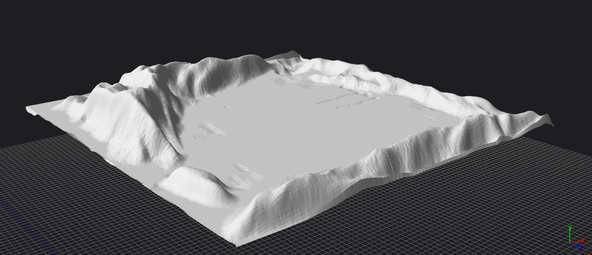
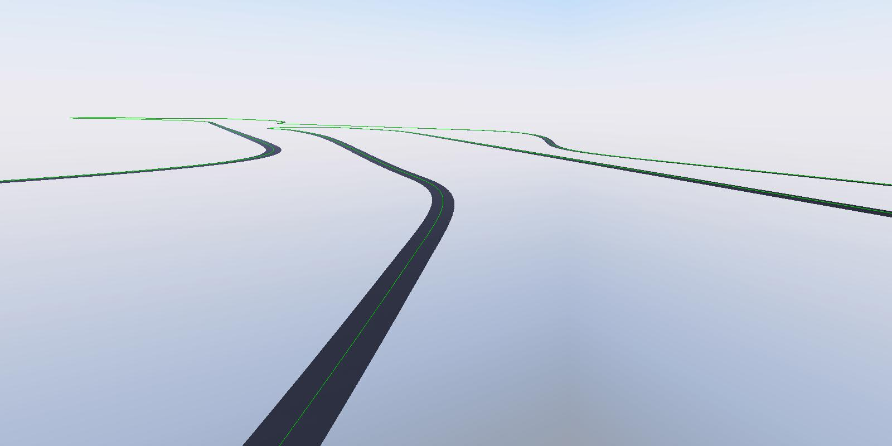
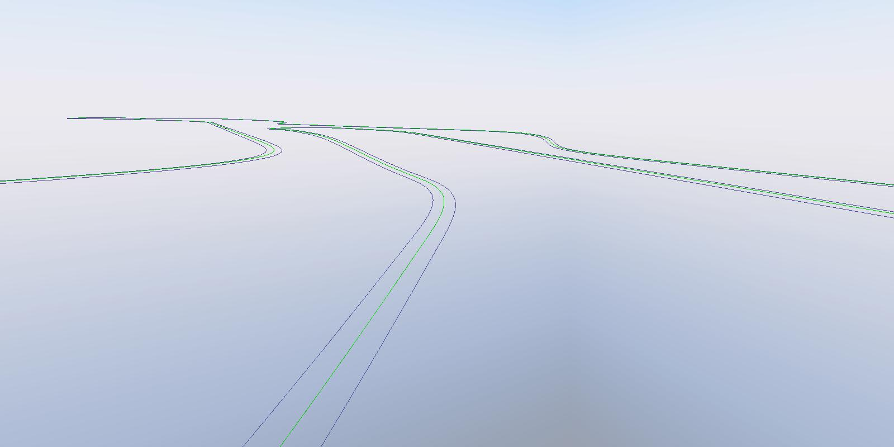
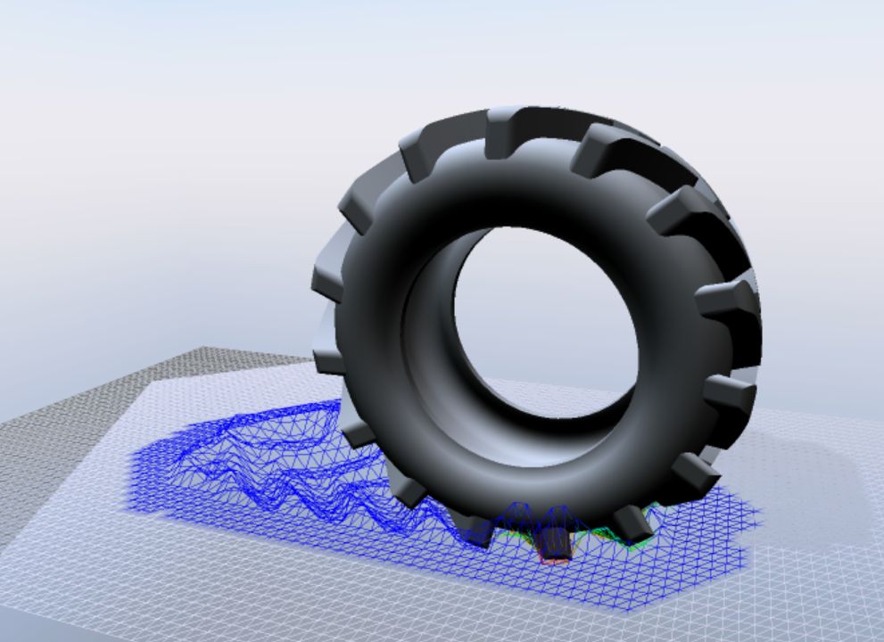
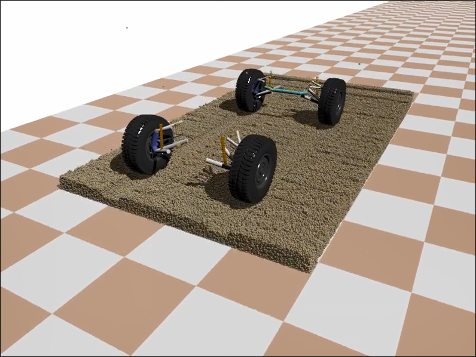
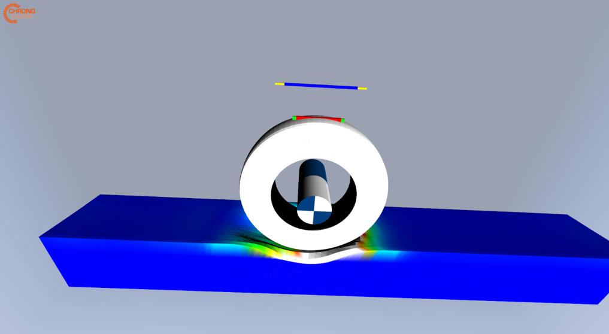

# 地形模型

- [__平坦地势__](#four_wheel)
- [__坚硬的地形__](#two_wheel)
- [__可变形 SCM（土壤接触模型）__](#kinematic)
- [__粒状地形__](#X_wheel)
- [__可变形 FEA（ANCF 实体元素）__](#X_wheel)


Chrono::Vehicle 中的地形对象必须提供以下方法：

- 返回指定位置正下方的点的地形高度
- 返回指定位置正下方的点的地形法线
- 返回指定位置正下方点的地形摩擦系数，其中假定给定位置在当前世界框架中表达。

参见基类 [ChTerrain](https://api.projectchrono.org/classchrono_1_1vehicle_1_1_ch_terrain.html) 的定义。

但请注意，这些量仅与所谓的 [半经验轮胎模型](https://api.projectchrono.org/wheeled_tire.html#vehicle_tire_empirical) 的相互作用有关。因此，它们不适用于可变形地形（SCM、颗粒或基于 FEA）的情况，因为可变形地形只能与 [刚性](https://api.projectchrono.org/wheeled_tire.html#wheeled_tire_rigid) 或 [FEA](https://api.projectchrono.org/wheeled_tire.html#wheeled_tire_fea) 轮胎模型以及履带式车辆配合使用（因为它们依赖于底层的 Chrono 碰撞和接触系统）。

此外，某些轮胎模型可能会使用摩擦系数值来修改轮胎特性，但不会对地形与其他物体的相互作用产生影响（包括未明确使用它的轮胎模型）。

ChTerrain 基类还定义了一个函子对象 [ChTerrain::FrictionFunctor](https://api.projectchrono.org/classchrono_1_1vehicle_1_1_ch_terrain_1_1_friction_functor.html) ，它提供了一个用于指定位置相关摩擦系数的接口。用户必须实现从此基类派生的自定义类，并实现虚拟方法`operator()`以返回给定位置正下方点的摩擦系数（x , y, z）位置（假定在当前世界框架中表达）。

## 平坦地势
[FlatTerrain](https://api.projectchrono.org/classchrono_1_1vehicle_1_1_flat_terrain.html) 是一个水平面模型，具有无限延伸，位于用户指定的高度。[FlatTerrain ::GetCoefficientFriction](https://api.projectchrono.org/classchrono_1_1vehicle_1_1_flat_terrain.html#a6ed899c2419f4cfc203ade3a5e6f6f90) 方法返回构造时指定的恒定摩擦系数，或者，如果 `FrictionFunctor` 已注册对象，则返回其返回值。

由于平坦地形模型不带有任何碰撞和接触信息，因此它只能与 [半经验轮胎模型](https://api.projectchrono.org/wheeled_tire.html#vehicle_tire_empirical) 一起使用。

## 坚硬的地形
[RigidTerrain](https://api.projectchrono.org/classchrono_1_1vehicle_1_1_rigid_terrain.html) 是具有任意几何形状的刚性地形模型。刚性地形被指定为一组面片，每个面片可以是以下之一：

- 一个矩形框，可能已旋转；“驱动”表面是框的顶面（在世界的垂直方向上）
- 从用户指定的 Wavefront OBJ 文件中读取的三角形网格
- 通过程序从用户指定的灰度 BMP 图像生成的三角网格

刚性地形模型可与任何 Chrono::Vehicle 轮胎模型以及履带式车辆一起使用。

盒状面片由顶面（驱动面）中心、顶面法线和面片尺寸（长度、宽度和可选厚度）指定。盒状面片也可以由多个相邻的图块创建，每个图块都是 Chrono 盒状接触形状；对于水平范围较大的盒状面片，建议这样做，因为该尺寸的单个碰撞形状可能会导致碰撞检测算法出现错误。

下图显示了网格刚性地形贴片的示例。假设网格相对于 ISO 参考框架提供，并且没有“悬垂”（换句话说，垂直射线最多与网格相交一个点）。用户还可以选择将地形网格的“厚度”指定为扫描球体的半径。为此半径指定一个小的正值可以显著提高碰撞检测算法的稳健性。



高度图补丁通过灰度 BMP 图像（如下所示）、补丁的水平范围（长度和宽度）和高度范围（最小和最大高度）指定。三角形网格是通过编程生成的，方法是为输入 BMP 图像中的每个像素创建一个网格顶点，在水平面上拉伸网格以匹配给定的范围，并在垂直方向上拉伸网格，使得最小高度对应于完美的黑色像素颜色，最大高度对应于完美的白色像素。


**高度和法线计算**。[RigidTerrain::GetHeight](https://api.projectchrono.org/classchrono_1_1vehicle_1_1_rigid_terrain.html#a4a2d2513aa2d06165cb8fb0edd5d4f3d) 和 [RigidTerrain::GetNormal](https://api.projectchrono.org/classchrono_1_1vehicle_1_1_rigid_terrain.html#a4be5aaea4ec498f149d096e2b22334ab) 的实现依赖于相对昂贵的光线投射操作：在所有组成面片上从上方投射垂直光线，并报告相交点的高度和法线。对于盒子面片，光线投射使用自定义分析实现，该实现会找到光线与盒子域顶面的交点；对于基于网格的面片，光线投射将推迟到底层碰撞系统。如果没有相交的面片，这些函数将返回0和世界的垂直方向。

**位置相关的摩擦系数**。刚性地形模型支持对象的定义`FrictionFunctor`。如果没有提供这样的函子，[RigidTerrain::GetCoefficientFriction](https://api.projectchrono.org/classchrono_1_1vehicle_1_1_rigid_terrain.html#a2f8b4b9a7e3c75e37655aa8dd43d5d10) 将使用射线投射方法来识别正确的补丁，并返回该补丁的（恒定）摩擦系数。如果提供了函子，RigidTerrain::GetCoefficientFriction 只会返回其值。但是，处理与地形的接触（例如，使用刚性轮胎或履带式车辆时）相对昂贵：每次调用碰撞检测算法时（即每个模拟步骤一次），都会遍历 Chrono 系统中所有接触的列表以拦截所有涉及刚性地形补丁碰撞模型的接触；对于这些接触，复合材料属性会被修改以考虑接触点处的地形摩擦系数。

刚性地形可以通过编程构建，一次定义一个补丁，或者在 JSON 文件中指定，如下所示：

```json
{
  "Name": "Rigid plane",
  "Type": "Terrain",
  "Template": "RigidTerrain",
 
  "Patches": [
    // Patch 1:  box
    {
      "Location": [ -15, 0, 0 ],
      "Orientation": [ 1, 0, 0, 0 ],
 
      "Geometry": {
        "Dimensions": [ 60, 20, 2 ]
      },
 
      "Contact Material": {
        "Coefficient of Friction": 0.9,
        "Coefficient of Restitution": 0.01,
        "Properties": {
          "Young Modulus": 2e7,
          "Poisson Ratio": 0.3
        },
        "Coefficients": {
          "Normal Stiffness": 2e5,
          "Normal Damping": 40.0,
          "Tangential Stiffness": 2e5,
          "Tangential Damping": 20.0
        }
      },
 
      "Visualization": {
        "Color": [ 1.0, 0.5, 0.5 ],
        "Texture File": "terrain/textures/tile4.jpg",
        "Texture Scaling": [ 60, 20 ]
      }
    },
 
    // Patch 2: box
    {
      "Location": [ 20, 0, 0.1 ],
      "Orientation": [ 1, 0, 0, 0 ],
 
      "Geometry": {
        "Dimensions": [ 20, 30, 2 ]
      },
 
      "Contact Material": {
        "Coefficient of Friction": 0.9,
        "Coefficient of Restitution": 0.01,
        "Properties": {
          "Young Modulus": 2e7,
          "Poisson Ratio": 0.3
        },
        "Coefficients": {
          "Normal Stiffness": 2e5,
          "Normal Damping": 40.0,
          "Tangential Stiffness": 2e5,
          "Tangential Damping": 20.0
        }
      },
 
      "Visualization": {
        "Color": [ 1.0, 0.5, 0.5 ]
      }
    },
 
    // Patch 3: height-map
    {
      "Location": [ 0, 42, 0 ],
      "Orientation": [ 1, 0, 0, 0 ],
 
      "Geometry": {
        "Height Map Filename": "terrain/height_maps/bump64.bmp",
        "Size": [ 64, 64 ],
        "Height Range": [ 0, 3 ]
      },
 
      "Contact Material": {
        "Coefficient of Friction": 0.9,
        "Coefficient of Restitution": 0.01,
        "Properties": {
          "Young Modulus": 2e7,
          "Poisson Ratio": 0.3
        },
        "Coefficients": {
          "Normal Stiffness": 2e5,
          "Normal Damping": 40.0,
          "Tangential Stiffness": 2e5,
          "Tangential Damping": 20.0
        }
      },
 
      "Visualization": {
        "Color": [ 1.0, 1.0, 1.0 ],
        "Texture File": "terrain/textures/grass.jpg",
        "Texture Scaling": [ 64, 64 ]
      }
    },
 
    // Patch 4: Mesh
    {
      "Location": [ 0, -42, 0 ],
      "Orientation": [ 1, 0, 0, 0 ],
 
      "Geometry": {
        "Mesh Filename": "terrain/meshes/bump.obj"
      },
 
      "Contact Material": {
        "Coefficient of Friction": 0.9,
        "Coefficient of Restitution": 0.01,
        "Properties": {
          "Young Modulus": 2e7,
          "Poisson Ratio": 0.3
        },
        "Coefficients": {
          "Normal Stiffness": 2e5,
          "Normal Damping": 40.0,
          "Tangential Stiffness": 2e5,
          "Tangential Damping": 20.0
        }
      },
      "Visualization": {
        "Color": [ 0.5, 0.5, 0.8 ],
        "Texture File": "terrain/textures/dirt.jpg",
        "Texture Scaling": [ 200, 200 ]
      }
    }
  ]
}
```

## CRG 地形
[CRGTerrain](https://api.projectchrono.org/classchrono_1_1vehicle_1_1_c_r_g_terrain.html) 是根据OpenCRG道路规范构建的程序化地形模型。要使用此地形模型，用户必须安装 OpenCRG SDK 并在 CMake 配置期间启用其使用（请参阅 Chrono::Vehicle [安装说明](https://api.projectchrono.org/module_vehicle_installation.html) ）。

CRG 地形从规范文件（例如下面列出的文件）创建道路轮廓（具有相关宽度的 3D 路径），并实现函数 [CRGTerrain::GetHeight](https://api.projectchrono.org/classchrono_1_1vehicle_1_1_c_r_g_terrain.html#ab4cbc1a9e3f36502e7314afb33b360e9) 和[CRGTerrain::GetNormal](https://api.projectchrono.org/classchrono_1_1vehicle_1_1_c_r_g_terrain.html#a651324a3cf9503a7c59abfe11c41efc0) 以使用此规范。请注意，crg规范文件可以是 ASCII 或二进制。

```json
* Emacs major mode to be selected automagically: -*-CASCaDE-*-
* $Id: handmade_curved_minimalist.crg 21 2009-06-23 15:03:13Z jorauh $
$CT
CRG file example for road surface description (width: 3m, length: 22m)
with curved reference line and grid of (0.25m...1.0m) x 1.0m.
 
A minimalist file can have an empty $CT, a minimalist $ROAD_CRG block,
and no comments marked by asterisk "*" in column 1 or marked by "!" in
other columns. So this file is completely equivalent to its commented
version in handmade_curved.crg .
 
Copyright 2005-2009 OpenCRG - Daimler AG - Jochen Rauh
 
Licensed under the Apache License, Version 2.0 (the "License");
you may not use this file except in compliance with the License.
You may obtain a copy of the License at
 
    http://www.apache.org/licenses/LICENSE-2.0
 
Unless required by applicable law or agreed to in writing, software
distributed under the License is distributed on an "AS IS" BASIS,
WITHOUT WARRANTIES OR CONDITIONS OF ANY KIND, either express or implied.
See the License for the specific language governing permissions and
limitations under the License.
 
More Information on OpenCRG open file formats and tools can be found at
 
    http://www.opencrg.org
$
$ROAD_CRG
REFERENCE_LINE_INCREMENT = 1.0
$
$KD_Definition
#:LRFI
D:reference line phi,rad
D:long section at v = -1.500,m
D:long section at v = -1.250,m
D:long section at v = -1.000,m
D:long section at v =  0.000,m
D:long section at v =  1.000,m
D:long section at v =  1.250,m
D:long section at v =  1.500,m
$
**unused** 0.0000000 0.0000000 0.0000000 0.0000000 0.0000000 0.0000000 0.0000000
 0.0000000 0.0000000 0.0000000 0.0000000 0.0111111 0.0000000 0.0000000 0.0000000
 0.0110000 0.0000000 0.0000000 0.0111111 0.0111111 0.0111111 0.0000000 0.0000000
 0.0220000 0.0000000 0.0111111 0.0111111 0.0111111 0.0111111 0.0111111 0.0000000
 0.0330000 0.0000000 0.0000000 0.0111111 0.0111111 0.0111111 0.0000000 0.0000000
 0.0440000 0.0111111 0.0000000 0.0000000 0.0111111 0.0000000 0.0000000 0.0111111
 0.0550000 0.0111111 0.0111111 0.0000000 0.0000000 0.0000000 0.0111111 0.0222222
 0.0660000 0.0111111 0.0111111 0.0111111 0.0000000 0.0111111 0.0222222 0.0333333
 0.0770000 0.0111111 0.0111111 0.0000000 0.0000000 0.0000000 0.0111111 0.0222222
 0.0880000 0.0111111 0.0000000 0.0000000 0.0111111 0.0000000 0.0000000 0.0111111
 0.0990000 0.0000000 0.0000000 0.0111111 0.0222222 0.0111111 0.0000000 0.0000000
 0.1100000 0.0000000 0.0111111 0.0222222 0.0222222 0.0222222 0.0111111 0.0000000
 0.1100000 0.0000000 0.0000000 0.0111111 0.0222222 0.0111111 0.0000000 0.0000000
 0.0990000 0.0111111 0.0000000 0.0000000 0.0111111 0.0000000 0.0000000-0.0111111
 0.0880000 0.0111111 0.0111111 0.0000000 0.0000000 0.0000000-0.0111111-0.0222222
 0.0770000 0.0111111 0.0111111 0.0111111 0.0000000-0.0111111-0.0222222-0.0333333
 0.0660000 0.0111111 0.0111111 0.0000000 0.0000000 0.0000000-0.0111111-0.0222222
 0.0550000 0.0111111 0.0000000 0.0000000 0.0111111 0.0000000 0.0000000-0.0111111
 0.0440000 0.0000000 0.0000000 0.0111111 0.0222222 0.0111111 0.0000000 0.0000000
 0.0330000 0.0000000 0.0111111 0.0222222 0.0333333 0.0222222 0.0111111 0.0000000
 0.0220000 0.0000000 0.0000000 0.0111111 0.0222222 0.0111111 0.0000000 0.0000000
 0.0110000 0.0000000 0.0000000 0.0000000 0.0111111 0.0000000 0.0000000 0.0000000
 0.0000000 0.0000000 0.0000000 0.0000000 0.0000000 0.0000000 0.0000000 0.0000000
```

CRG 地形可以视为三角形网格（代表道路“带”）或一组 3D 贝塞尔曲线（代表中心线和道路两侧）。CRGTerrain 的其他功能包括：

- 能够导出道路网格（作为三角形网格）
- 能够导出中心线（作为贝塞尔曲线）
- 道路长度和宽度的报告方法

下图展示了使用三角网格或道路边界曲线的 CRG 道路的运行时可视化。





由于CRG地形模型目前不携带任何碰撞和接触信息，因此它只能与半经验轮胎模型一起使用。

## 可变形 SCM（土壤接触模型）
在 [SCMTerrain](https://api.projectchrono.org/classchrono_1_1vehicle_1_1_s_c_m_terrain.html) 中，地形由隐式规则笛卡尔网格表示，其变形通过其节点的垂直偏转实现。该土壤模型借鉴了 Chrono 中的通用碰撞引擎，其轻量级公式允许近乎实时地计算车辆与地形的接触力。为了解决内存和计算效率问题，从未明确创建网格。相反，只在哈希图中维护已变形的节点。此外，碰撞系统中的光线投射（SCM 计算中最昂贵的操作）是多线程的。为了高效地可视化变形的地形，Chrono SCM 子系统提供了逐步更新可视化网格的方法，并且在使用外部可视化系统时报告上一个时间步内变形的节点子集。

下图所示，轮胎在可变形土壤中留下车辙，说明了 SCM 的 Chrono 版本的网格结构。



SCM 基于半经验模型，参数很少，因此很容易根据实验结果进行校准。它可以被视为 Bekker-Wong 模型的推广，适用于任意三维形状的车轮（或履带板）。对于在可变形土壤上移动的车轮，Bekker 公式提供了压力与土壤垂直变形之间的关系：


这里σ是接触面压力，y 是车轮下沉，$k_c$是表示土壤粘结效应的经验系数，kφ是表示土壤刚度的经验系数，n是表达硬化效应的指数，它随着土壤的压实而非线性地增加。最后，b是矩形接触足迹较短边的长度（因为原始 Bekker 理论假设圆柱形轮胎在平坦地形上滚动）。

对于通用接触足迹，长度b不能像原始 Bekker 模型那样解释；相反，我们通过首先获取所有连接的接触面（使用泛洪算法）并使用近似值来估计这个长度

b = 2A / L

这里A是接触面积的面积，L 是它的周长。

Chrono SCM 实现的其他一些功能包括：

- 初始未变形网格可以创建为
    - 常规平铺网格（填充平面矩形）
    - 从高度图（以灰度 BMP 图像提供）
    - 以编程方式
- 支持任意方向的地形参考平面；默认情况下，地形被定义为（x , y）平面是ISO框架
- 支持移动面片方法，其中光线投射（成本最高的操作）被限制在指定的范围内——相对于车辆移动的矩形面片或边界框的投影
- 支持指定与位置相关的土壤参数；这可以通过提供自定义回调类来实现，该回调类实现一种返回给定位置的所有土壤参数的方法（x , y）地形参考平面中指定的点。参见SCMTerrain::SoilParametersCallback

由于与这种地形类型的交互是通过底层的 Chrono 接触系统完成的，因此它可以与刚性或FEA轮胎模型以及履带式车辆结合使用。

## 粒状地形
[GranularTerrain](】GranularTerrain实现了矩形颗粒材料块，并利用了 Chrono 对所谓的离散元法 (DEM) 模拟的广泛支持。目前，此地形模型仅限于单分散球形颗粒材料。
) 实现了矩形颗粒材料块，并利用了 Chrono 对所谓的离散元法 (DEM) 模拟的广泛支持。目前，此地形模型仅限于单分散球形颗粒材料。

由于模拟大规模颗粒动力学需要大量计算，Chrono::Vehicle 中的 GranularTerrain 对象支持“移动块”方法，其中模拟可以限制在颗粒材料箱中，该材料箱会根据指定物体（通常是车辆底盘）的位置不断重新定位。目前，移动块只能在X（前进）方向。

下面是使用移动面片特征在 GranularTerrain 上进行车辆加速测试的示例。此模拟使用超过 700,000 个粒子和 [Chrono::Multicore](https://api.projectchrono.org/group__multicore__module.html) 模块进行多核并行模拟。



GranularTerrain 的其他功能包括：

- 分层生成初始粒子位置，粒子位置在水平面上均匀分布，且保证不小于粒子半径的两倍
- 包含固定在边界箱上的颗粒（以抑制整个颗粒材料床的滑动）；由于目前的限制，此功能不应与移动补丁选项结合使用
- 箱边界的分析定义和自定义碰撞检测机制
- 报告地形高度（定义为最大是所有粒子位置的值）

由于与这种地形类型的交互是通过底层的 Chrono 接触系统完成的，因此它可以与刚性或FEA轮胎模型以及履带式车辆结合使用。


## 可变形 FEA（ANCF 实体元素）
[FEATerrain](https://api.projectchrono.org/classchrono_1_1vehicle_1_1_f_e_a_terrain.html) 基于 [ChElementHexaANCF_3813_9](https://api.projectchrono.org/classchrono_1_1vehicle_1_1_f_e_a_terrain.html) 类型的专用 FEA 砖块元素提供可变形地形模型。
该地形模型允许：

将盒子域离散化为用户指定的元素数量
指定材料特性（密度、弹性模量、泊松比、屈服应力、硬化斜率、膨胀角和摩擦角）
添加 Chrono FEA 网格可视化资产
由于与这种地形类型的交互是通过底层的 Chrono 接触系统完成的，因此它可以与 [刚性](https://api.projectchrono.org/wheeled_tire.html#wheeled_tire_rigid) 或 [FEA](https://api.projectchrono.org/wheeled_tire.html#wheeled_tire_rigid) 轮胎模型以及履带式车辆结合使用。




