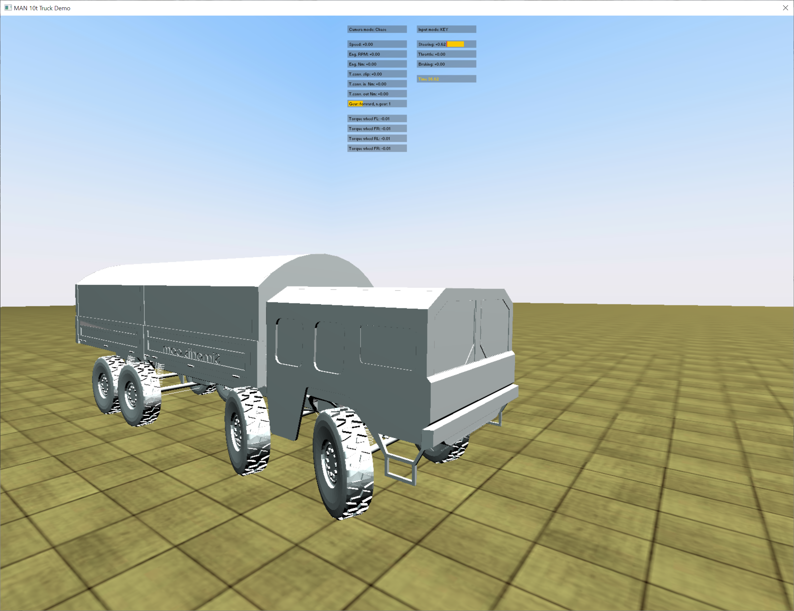
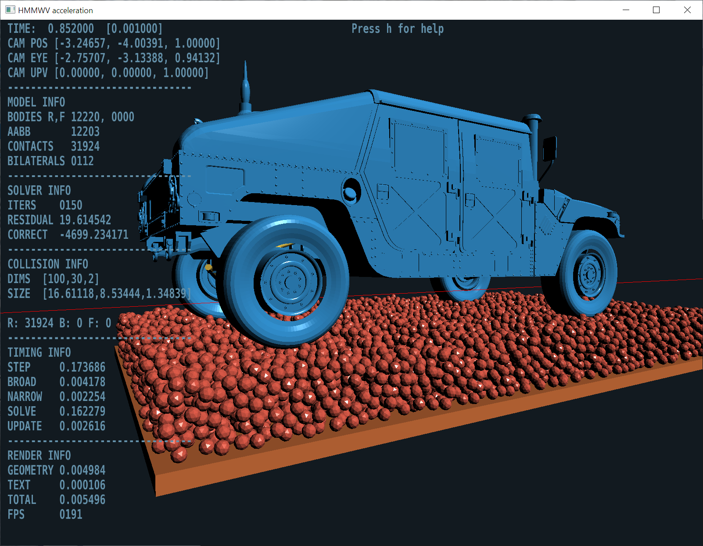

# [可视化](https://api.projectchrono.org/vehicle_visualization.html)

- [__基于 Irrlicht 的运行时可视化__](#four_wheel)
- [__基于 OpenGL 的运行时可视化__](#two_wheel)
- [__使用 POV-Ray 进行离线渲染__](#kinematic)

## 基于 Irrlicht 的运行时可视化
基于车辆 Irrlicht 的运行时可视化分别使用针对轮式车辆和履带式车辆的定制 Irrlicht 应用程序 [ChWheeledVehicleIrrApp](https://api.projectchrono.org/classchrono_1_1vehicle_1_1_ch_wheeled_vehicle_visual_system_irrlicht.html) 和 [ChTrackedVehicleIrrApp](https://api.projectchrono.org/classchrono_1_1vehicle_1_1_ch_tracked_vehicle_visual_system_irrlicht.html) 。

这些是基本 [ChIrrApp](https://api.projectchrono.org/classchrono_1_1irrlicht_1_1_ch_visual_system_irrlicht.html) 应用程序的扩展，允许：

- 使用以车辆为中心的摄像机位置（视点）
- 显示其他（车辆特定的）统计数据，例如车速、当前驾驶员输入、动力传动系统扭矩、车轮和链轮扭矩等。

以下图像是来自 Chrono::Vehicle 模拟的快照。

## 基于 OpenGL 的运行时可视化
Chrono::Vehicle 模拟还可以使用 Chrono::OpenGL 模块在运行时进行可视化。这提供了更快捷、计算效率更高的可视化，尤其是对于大规模模拟（例如涉及车辆与颗粒地形交互的模拟）。

以下图像是来自 Chrono::Vehicle 模拟的快照。

## 使用 POV-Ray 进行离线渲染
离线渲染需要以下步骤：

- 收集要渲染的每一帧的系统数据
- 可选地，以特定于所需渲染引擎的格式准备网格数据文件
- 后期处理数据文件以渲染每一帧的场景
- 可选地，将多帧图像组合成动画

Chrono::Vehicle 为该工作流模型和 [POV-Ray](http://www.povray.org/) 光线追踪程序提供有限的支持。

**准备输出数据文件**

- 在每个需要后期处理的模拟帧上，调用函数 [WriteVisualizationAssets](https://api.projectchrono.org/namespacechrono_1_1utils.html#a13043bebc73f0f60f6f9d23446c7465a) 。
- 此函数将输出一个包含用户提供的名称的逗号分隔值（CSV）文件。
- 输出文件包含有关 Chrono 系统中所有物体的信息（位置和方向）、所有相关可视化资产（位置、方向、类型和资产特定参数）以及选定的关节类型。请注意，网格可视化资产通过其各自的网格名称进行识别。

**准备网格数据文件**

要使用 POV-Ray 进行渲染，必须将与网格可视化资产相对应的 Wavefront OBJ 文件转换为 POV-Ray 输入文件中的宏。这可以通过以下方式完成

- 使用函数 [WriteMeshPovray](https://api.projectchrono.org/namespacechrono_1_1utils.html#ae95bc6579c3b74742bf5bb391b7d8c3c)
- 使用 [PoseRay](https://sites.google.com/view/poseray) 等专用工具

如果使用下面描述的渲染脚本，这些网格宏 POV-Ray 输入文件的名称应与相应的网格名称相同。此外，这样的网格 POV-Ray 输入文件必须定义单个宏（名称与网格名称相同）；因此，需要手动编辑 PoseRay 生成的文件（例如，参见 Chrono 发行版提供的示例`data/vehicle/hmmwv/POV-Ray/hmmwv_chassis.inp`）。

** 使用 POV-Ray 对文件进行后期处理** 

Chrono 发行版包含（在目录中src/demos/vehicle/）一个示例 POV-Ray 脚本（renderZ.pov），可用于（批量）处理 WriteVisualizationAssets 生成的格式的输出数据文件。此脚本假定所有数据均在右手框架中提供，Z 向上（ISO 参考框架），并执行所有必要的转换为 POV-Ray 的 Y 向上左手框架。

该脚本提供以下用户控件：

- 渲染单帧或一系列帧（批处理）
- 打开/关闭身体参考框架的渲染
- 打开/关闭全局参考框架的渲染
- 打开/关闭资产渲染
- 打开/关闭固定在地面上的资产的渲染
- 打开/关闭支持关节的渲染
- 打开/关闭弹簧和减震器的渲染
- 指定表示关节的几何形状的尺寸
- 相机位置和观察点
- 启用/禁用阴影
- 可选渲染环境（地面和天空）

