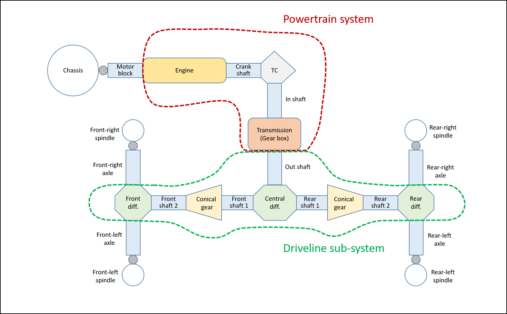

# 传动系统模型

- [__四轮轴传动系统__](#four_wheel)
- [__基于双轮轴的传动系统__](#two_wheel)
- [__四轮运动传动系统__](#kinematic)
- [__X 轮运动传动系统__](#X_wheel)

## 四轮轴传动系统

该传动系统模板使用各种 Chrono 1-D 轴元素 ( [ChShaft](https://api.projectchrono.org/classchrono_1_1_ch_shaft.html) ) 和专用轴连接元素建模。这些元素用于建模差速器 ( [ChShaftsPlanetary](https://api.projectchrono.org/classchrono_1_1_ch_shafts_planetary.html) )、锥形齿轮 ( [ChShaftsGearboxAngled](https://api.projectchrono.org/classchrono_1_1_ch_shafts_gearbox_angled.html) ) 和差速锁离合器 ( [ChShaftsClutch](https://api.projectchrono.org/classchrono_1_1_ch_shafts_clutch.html) )。

参见 [ChShaftsDriveline4WD](https://api.projectchrono.org/classchrono_1_1vehicle_1_1_ch_shafts_driveline4_w_d.html) 和 [ShaftsDriveline4WD](https://api.projectchrono.org/classchrono_1_1vehicle_1_1_shafts_driveline4_w_d.html) 。

下图显示了基于轴的 4WD 传动系统与基于轴的动力传动系统模型的连接。




以下示例 JSON 规范文件说明了基于 4WD 轴的传动系统可用的各种模板参数：
```json
{
  "Name":                       "HMMWV AWD Driveline",
  "Type":                       "Driveline",
  "Template":                   "ShaftsDriveline4WD",
 
  "Shaft Direction":
  {
    "Motor Block":              [1, 0, 0],
    "Axle":                     [0, 1, 0]
  },
 
  "Shaft Inertia":
  {
    "Driveshaft":               0.5,
    "Front Driveshaft":         0.5,
    "Rear Driveshaft":          0.5,
    "Central Differential Box": 0.6,
    "Front Differential Box":   0.6,
    "Rear Differential Box":    0.6
  },
 
  "Gear Ratio":
  {
    "Front Conical Gear":       0.2,
    "Rear Conical Gear":        0.2
  },
 
  "Axle Differential Locking Limit":    100,
  "Central Differential Locking Limit": 100
}
```


## 基于双轮轴的传动系统
该传动系统模板类似于基于 4WD 轴的传动系统模型，但只能驱动与单个车轴相关的车轮。该车轴是任意的，因此该传动系统模型可用于模拟前轮驱动和后轮驱动车辆。

参见 [ChShaftsDriveline2WD](https://api.projectchrono.org/classchrono_1_1vehicle_1_1_ch_shafts_driveline2_w_d.html) 和 [ShaftsDriveline2WD](https://api.projectchrono.org/classchrono_1_1vehicle_1_1_shafts_driveline2_w_d.html) 。

具有 2WD 轴传动系统规范的示例 JSON 文件是：


```json
{
  "Name":                       "HMMWV RWD Driveline",
  "Type":                       "Driveline",
  "Template":                   "ShaftsDriveline2WD",
 
  "Shaft Direction":
  {
    "Motor Block":              [1, 0, 0],
    "Axle":                     [0, 1, 0]
  },
 
  "Shaft Inertia":
  {
    "Driveshaft":               0.5,
    "Differential Box":         0.6
  },
 
  "Gear Ratio":
  {
    "Conical Gear":             0.2
  },
 
  "Axle Differential Locking Limit":  100
}
```


## 四轮运动传动系统
此模板可用于为 4WD 传动系统建模。它使用恒定的前/后扭矩分配（0 到 1 之间的值）和 Torsen 限滑差速器的简单模型。

参见 [ChSimpleDriveline](https://api.projectchrono.org/classchrono_1_1vehicle_1_1_ch_simple_driveline.html) 和 [SimpleDriveline](https://api.projectchrono.org/classchrono_1_1vehicle_1_1_simple_driveline.html) 。

具有 2WD 轴传动系统规范的示例 JSON 文件是：

```json
{
  "Name":                       "HMMWV 4WD Driveline",
  "Type":                       "Driveline",
  "Template":                   "SimpleDriveline",
 
  "Front Torque Fraction":       0.5,
 
  "Front Differential Max Bias": 2.0,
  "Rear Differential Max Bias":  2.0
}
```

## X 轮运动传动系统
此简单传动系统模板可用于模拟 XWD 传动系统，可驱动一个或多个车轴。它使用根据驱动轴数量确定的恒定扭矩分配和 Torsen 限滑差速器的简单模型。

参见 [ChSimpleDrivelineXWD](https://api.projectchrono.org/classchrono_1_1vehicle_1_1_ch_simple_driveline_x_w_d.html) 和 [SimpleDrivelineXWD](https://api.projectchrono.org/classchrono_1_1vehicle_1_1_simple_driveline_x_w_d.html) 。

具有 2WD 轴传动系统规范的示例 JSON 文件是：

```json
{
  "Name":                       "MAN 5t, 7t, 10t XWD Driveline",
  "Type":                       "Driveline",
  "Template":                   "SimpleDrivelineXWD",
 
  "Differential Max Bias":  2.0
}
```
