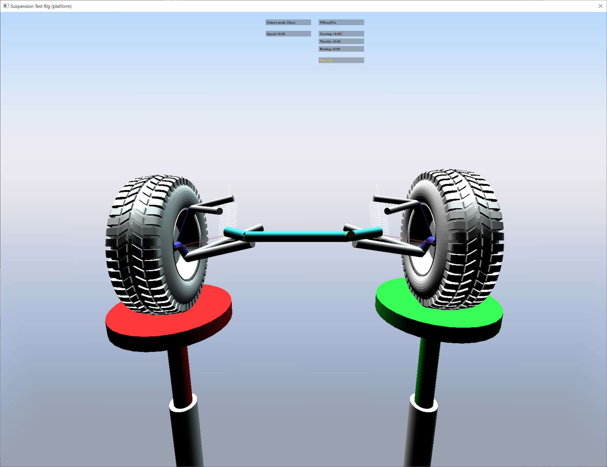
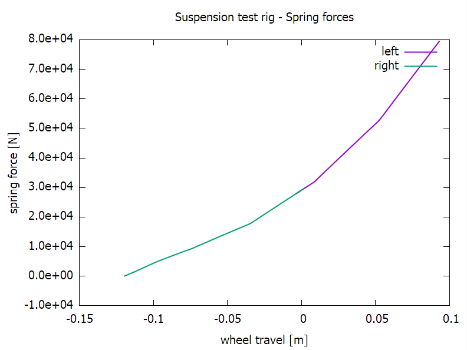
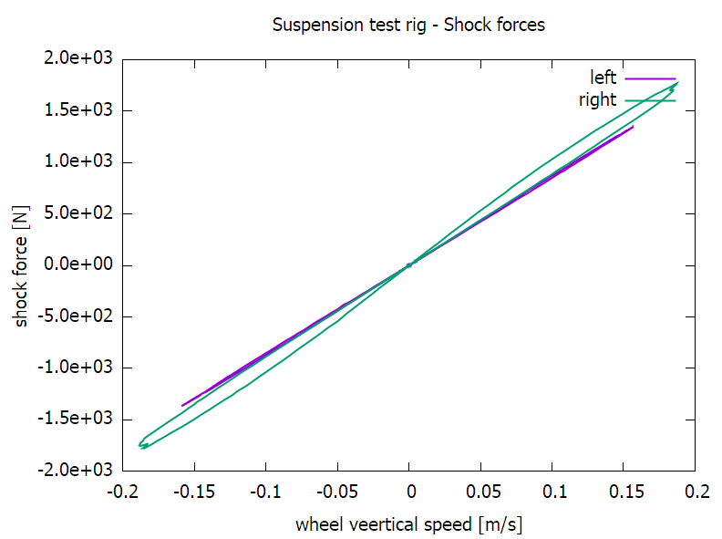
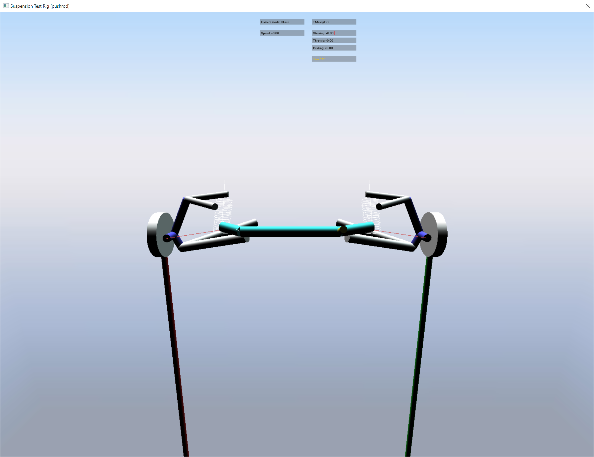
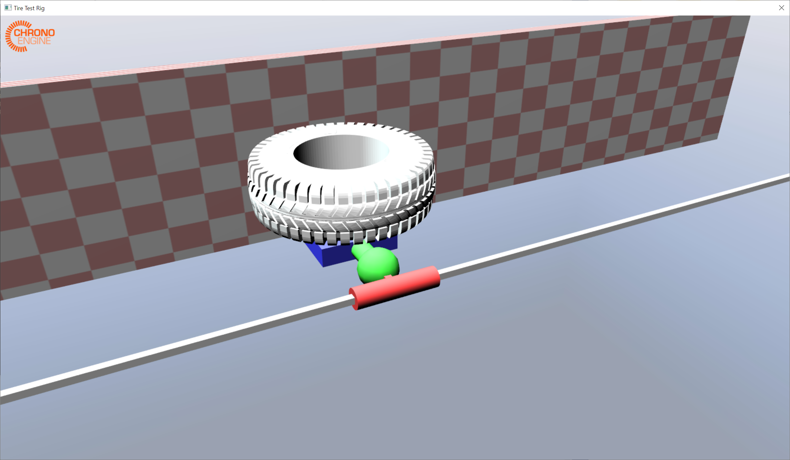
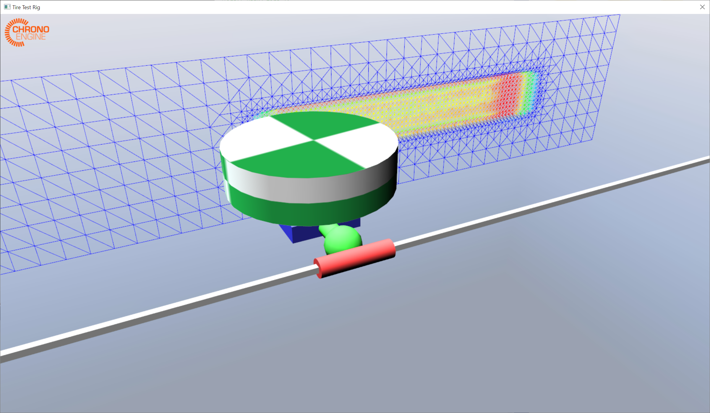

# 测试台架

- [__悬架试验台__](#four_wheel)
- [__轮胎试验台__](#two_wheel)

## 悬架试验台
[ChSuspensionTestRig](https://api.projectchrono.org/classchrono_1_1vehicle_1_1_ch_suspension_test_rig.html) 是一种用于测试整个车辆悬架组件的装置。可以指定要测试的悬架：

- 通过独立的 JSON 文件（可能包含或不包含转向子系统）
- 作为车辆 JSON 规范文件中的指定轴
- 作为现有车辆的指定车轴（必须已初始化）

悬架试验台有两种型号：

- [ChSuspensionTestRigPlatform](https://api.projectchrono.org/classchrono_1_1vehicle_1_1_ch_suspension_test_rig_platform.html) 使用两个独立的刚性平台，通过与轮胎的相互作用来驱动悬架机构。请参阅 demo_VEH_SuspensionTestRigPlatform。
- [ChSuspensionTestRigPushrod](https://api.projectchrono.org/classchrono_1_1vehicle_1_1_ch_suspension_test_rig_pushrod.html) 将直接驱动力施加到车轮主轴上。请参阅 demo_VEH_SuspensionTestRigPushrod。

下图显示了 ChSuspensionTestRigPlatform 模拟（使用前双叉臂悬架和 TMeasy 轮胎）的快照和示例输出图。

下图是使用前双叉臂悬架的 ChSuspensionTestRigPushrod 模拟的快照。

## 轮胎试验台
[ChTireTestRig](https://api.projectchrono.org/classchrono_1_1vehicle_1_1_ch_tire_test_rig.html) 是一种用于测试单个轮胎与 [刚性](https://api.projectchrono.org/vehicle_terrain.html#vehicle_terrain_rigid) 、[SCM 可变形](https://api.projectchrono.org/vehicle_terrain.html#vehicle_terrain_scm) 或 [粒状地形](https://api.projectchrono.org/vehicle_terrain.html#vehicle_terrain_granular) 相互作用的装置。所有可用的 Chrono::Vehicle [轮胎模型](https://api.projectchrono.org/wheeled_tire.html) 都可以与此测试装置一起使用，但只能与一致的地形模型结合使用。

轮胎试验台允许纵向速度、车轮角速度和车轮滑移角随时间变化，支持纵向速度和角速度的自动选择，以强制执行指定的纵向滑移值，并允许指定外倾角（在模拟期间保持不变）。

参见 demo_VEH_TireTestRig 和 demo_VEH_TireTestRig_Multicore。

下面的图片是单轮胎测试的快照，分别在刚性地形上使用 Pac02 轮胎和在 SCM 可变形地形上使用刚性轮胎。

