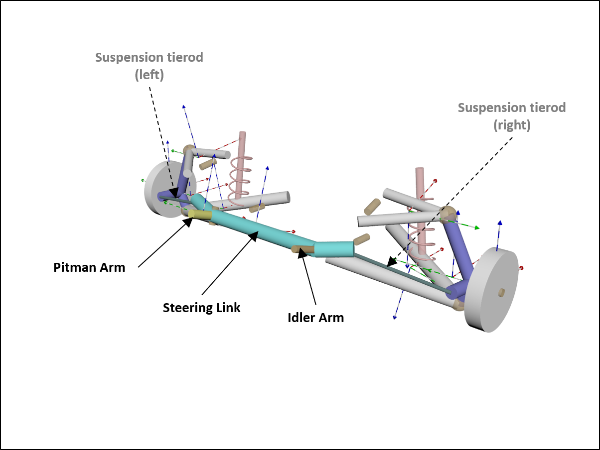
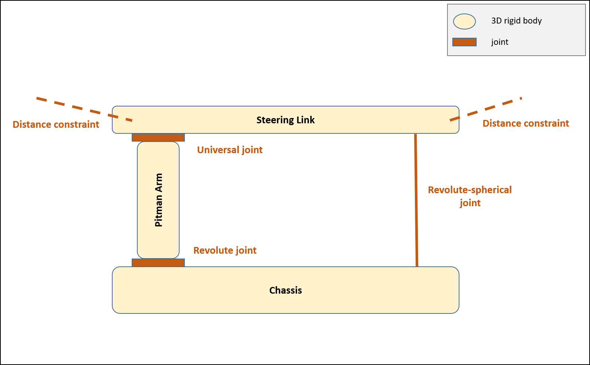
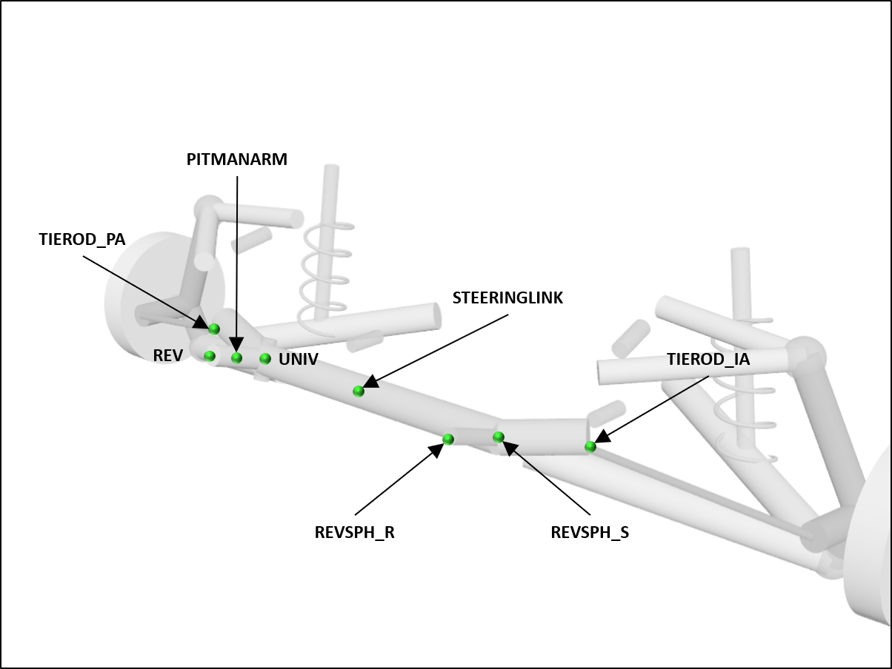
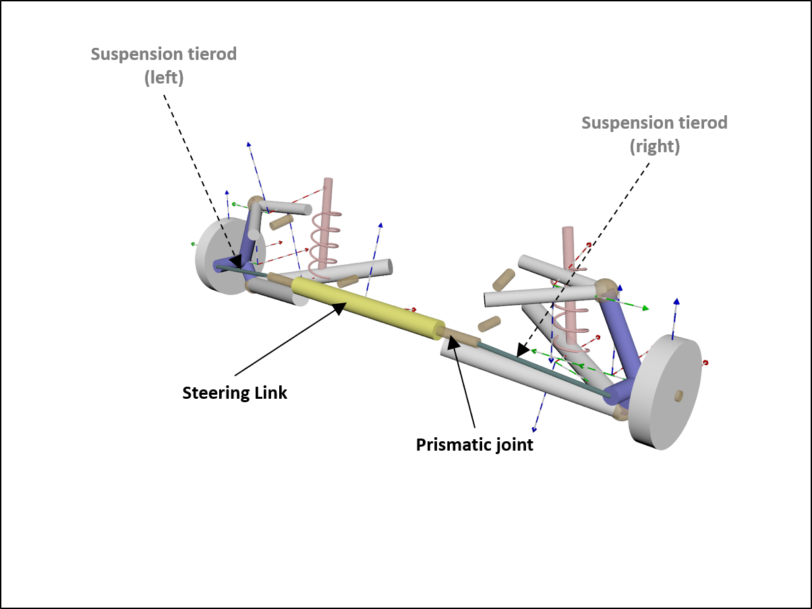
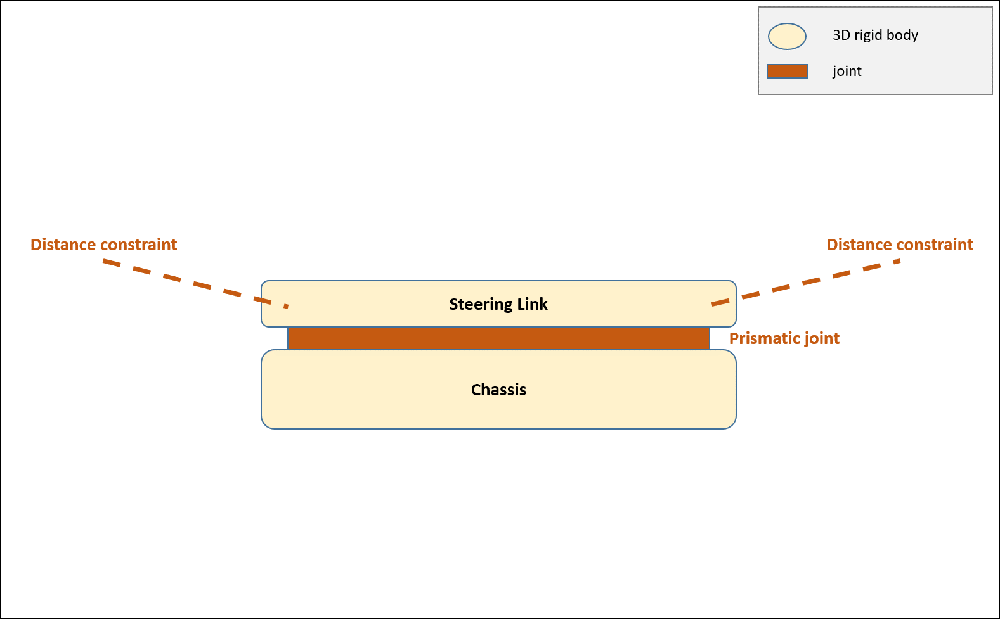
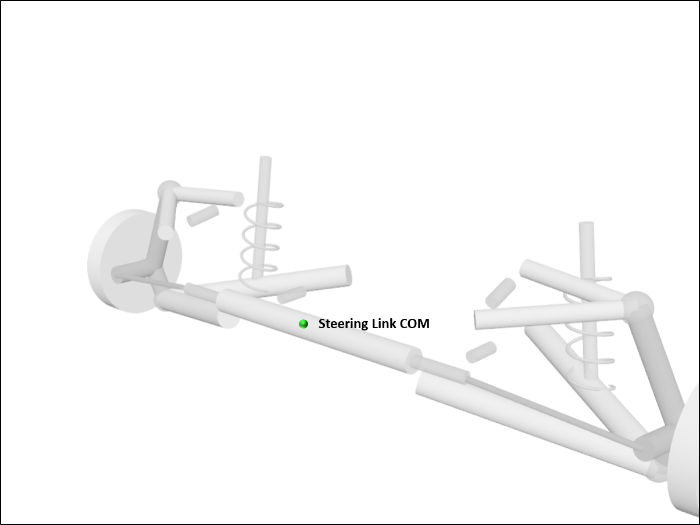
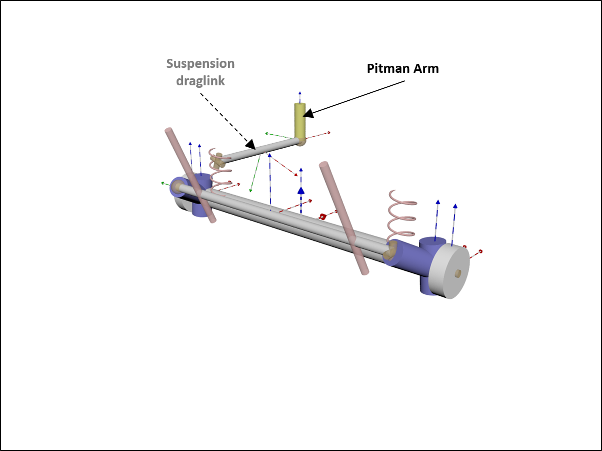
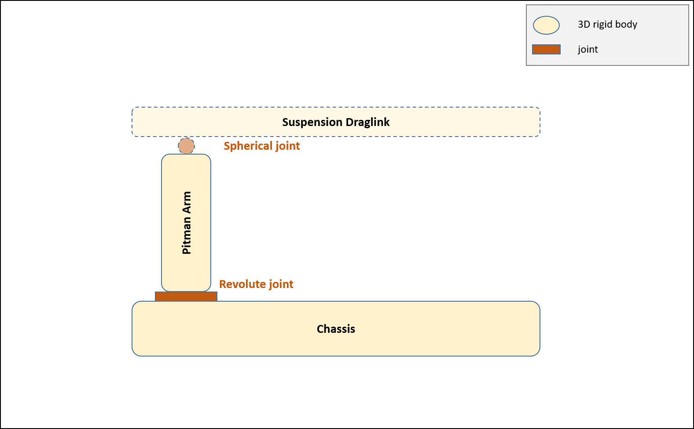
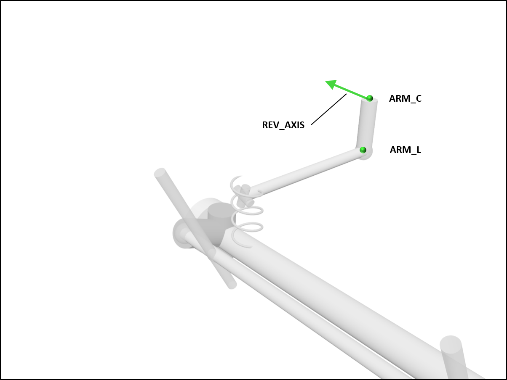

# 转向机构模型

- [__转向臂__](#pitman_arm)
- [__齿条齿轮__](#rack_pinion)
- [__旋臂__](#rotary_arm)

基类 [ChSteering](https://api.projectchrono.org/classchrono_1_1vehicle_1_1_ch_steering.html) 规定任何派生的转向机构类（转向机构模板）都应提供一个转向连杆体，可转向悬架可以与其连接（通常通过悬架的转向连杆）。

派生转向机构类型定义特定类型的转向机构的主体、关节、力元素和拓扑。所有位置均假定相对于机构参考系提供（派生转向机构类型可以自由选择此框架的位置和方向）。

通过指定机构组件参考系相对于底盘参考系的位置和方向（参见 [ISO 参考系](https://api.projectchrono.org/vehicle_overview.html#vehicle_ISO_frame) 的定义），将转向机构组件安装到车辆底盘上。

轮式车辆可能有多个转向机构，每个转向机构与不同的转向车轴相关联。同样，单个转向机构可以连接到多个转向车轴。

## 转向臂 <span id="pitman_arm"></span>

该转向机构为四连杆机构，转向连杆体通过转向臂和惰臂与底盘相连。转向臂体通过万向节与转向连杆相连，通过旋转关节与底盘相连。驾驶员转向输入用于控制旋转关节的角度。在 Chrono::Vehicle 转向臂模板中，惰臂采用复合旋转球关节建模。

参见 [ChPitmanArm](https://api.projectchrono.org/classchrono_1_1vehicle_1_1_ch_pitman_arm.html) 和 [PitmanArm](https://api.projectchrono.org/classchrono_1_1vehicle_1_1_pitman_arm.html) 。



本转向机构模板的拓扑结构为：



承力点如下：



具有 PitmanArm 转向机构规范的示例 JSON 文件如下：

```json
{
  "Name":                       "HMMWV Pitman Arm Steering",
  "Type":                       "Steering",
  "Template":                   "PitmanArm",
 
  "Vehicle-Frame Inertia":      false,
 
  "Steering Link":
  {
    "Mass":                     3.681,
    "COM":                      [0.129, 0, 0],
    "Moments of Inertia":       [0.252, 0.00233, 0.254],
    "Products of Inertia":      [0, 0, 0],
    "Radius":                   0.03
  },
 
  "Pitman Arm":
  {
    "Mass":                     1.605,
    "COM":                      [0.064, 0.249, 0],
    "Moments of Inertia":       [0.00638, 0.00756, 0.00150],
    "Products of Inertia":      [0, 0, 0],
    "Radius":                   0.02
  },
 
  "Revolute Joint":
  {
    "Location":                 [0, 0.249, 0],
    "Direction":                [0, 0, 1],
    "Maximum Angle (deg)":      30
  },
 
  "Universal Joint":
  {
    "Location":                 [ 0.129, 0.249, 0],
    "Direction Arm":            [0, 0, 1],
    "Direction Link":           [1, 0, 0]
  },
 
  "Revolute-Spherical Joint":
  {
    "Location Chassis":         [0, -0.325, 0],
    "Location Link":            [0.129, -0.325, 0],
    "Direction":                [0, 0, 1]
  },
 
  "Tierod Locations":
  {
    "Pitman Side":              [0.195,  0.448, 0.035],
    "Idler Side":               [0.195, -0.448, 0.035]
  }
}
```

## 齿条齿轮 <span id="rack_pinion"></span>
Chrono::Vehicle 齿条齿轮转向模板是齿条齿轮转向机构的运动学模型。转向连杆体通过棱柱关节连接到底盘。齿条位移计算如下：

d= r （α最大限度s )

其中r是小齿轮半径，α最大限度 是最大小齿轮角，并且s ∈ [ − 1 , 1 ]是驾驶员的转向输入。该位移用于控制转向连杆的平移。

参见 [ChRackPinion](https://api.projectchrono.org/classchrono_1_1vehicle_1_1_ch_rack_pinion.html) 和 [RackPinion](https://api.projectchrono.org/classchrono_1_1vehicle_1_1_rack_pinion.html) 。



本转向机构模板的拓扑结构为：



受力点如下：



具有 RackPinion 转向机构规范的示例 JSON 文件如下：

```json
{
  "Name":                       "HMMWV Rack-Pinion Steering",
  "Type":                       "Steering",
  "Template":                   "RackPinion",
 
  "Steering Link":
  {
    "Mass":                     9.072,
    "COM":                      0,
    "Inertia":                  [1, 1, 1],
    "Radius":                   0.03,
    "Length":                   0.896
  },
 
  "Pinion":
  {
    "Radius":                   0.1,
    "Maximum Angle (deg)":      50
  }
}
```


## 旋臂 <span id="rotary_arm"></span>
旋转臂转向是一种绕轴旋转的简单杠杆臂。它与实心摇臂轴和实心前束轴配合使用。它通常用作卡车、农用拖拉机和联合收割机的转向系统。

参见 [ChRotaryArm](https://api.projectchrono.org/classchrono_1_1vehicle_1_1_ch_rotary_arm.html) 和 [RotaryArm](https://api.projectchrono.org/classchrono_1_1vehicle_1_1_rotary_arm.html) 。



本转向机构模板的拓扑结构为：



受力点如下：



具有 RotaryArm 转向机构规范的示例 JSON 文件如下：

```json
{
  "Name":                       "UAZBUS Rotary-Arm Steering",
  "Type":                       "Steering",
  "Template":                   "RotaryArm",
 
  "Pitman Arm":
  {
    "Mass":                     5.0,
    "Inertia":                  [0.00638, 0.00756, 0.00150],
    "Inertia Products":         [0, 0, 0],
    "Radius":                   0.03,
    "Axis of Rotation":         [0, 1, 0],           // arm-chassis revolute joint
    "Point of Rotation":        [0.6, 0.5325, 0.4],  // location of chassis connection
    "Point to Draglink":        [0.6, 0.5325, 0.2],  // location of draglink connection
    "Maximum Angle (deg)":      12.5
  }
  
}
```


