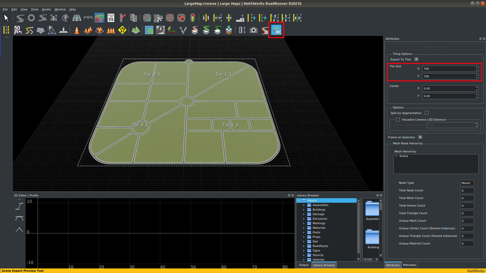
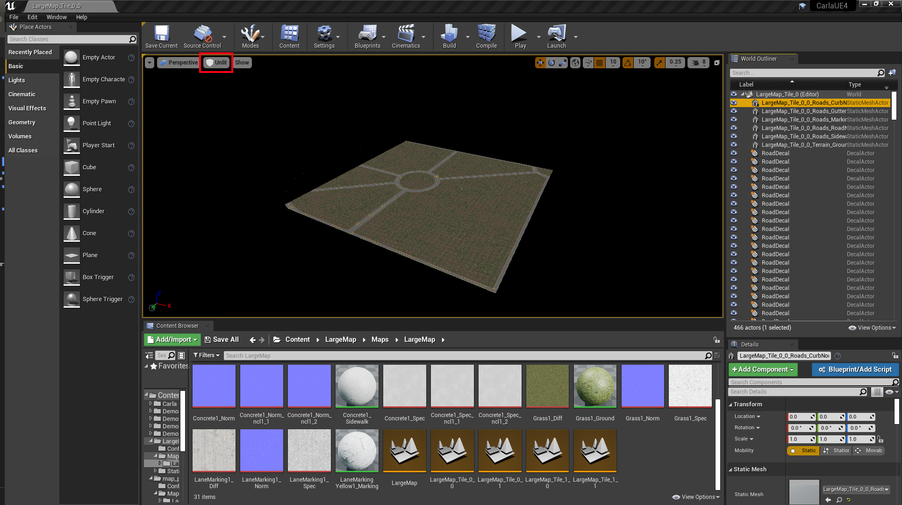

# [为 Carla 创建大地图](https://carla.readthedocs.io/en/latest/content_authoring_large_maps/) 

Carla 中大地图（如城镇 11 和 12）的操作方式与标准地图（如城镇 10）不同。地图被划分为图块，即地图的细分，通常大小设置为约 1 至 2 公里。这些图块划分了地图，以便仅将需要的地图部分加载到图形内存中以进行高效渲染。不需要的图块保持休眠状态并准备在需要时加载。通常，会加载自我车辆位置中的图块旁边的图块，但如果需要，可以加载更多图块。当 Carla 启动时，可以在设置中修改此行为。

# 在 RoadRunner 中创建大地图

RoadRunner 是推荐用于创建要导入 Carla 的大地图的软件。本指南概述了如何使用 RoadRunner 创建大地图以及如何在虚幻引擎编辑器中导入和处理大地图。

- [__在 RoadRunner 中构建大地图__](#build-a-large-map-in-roadrunner)
- [__在 RoadRunner 中导出大地图__](#export-a-large-map-in-roadrunner)
- [__将大地图导入 Carla__](#import-a-large-map-into-carla)
    - [文件和文件夹](#files-and-folders)
    - [创建 JSON 描述（可选）](#create-the-json-description-optional)
    - [进行导入](#making-the-import)
- [__在虚幻编辑器中处理大地图__](#handling-a-large-map-in-the-unreal-editor)
- [__打包一张大地图__](#package-a-large-map)
---

## 在 RoadRunner 中构建大地图

如何在 RoadRunner 中构建复杂地图的具体细节超出了本指南的范围，但是，[RoadRunner 文档][rr_tutorials]中提供了视频教程。从表面上看，在 RoadRunner 中构建大地图与构建标准地图基本相同，只是比例更大。差异主要在于地图的导出方式。


这里我们创建了一张大约 1.2 公里大小的大地图。当我们导出它时，它会被分割成图块，我们将选择 700m 的图块大小，因此地图应该分割成大约 4 个图块。

如果您正在构建带有高程的大地图，建议的地图最大尺寸为 20x20 km<sup>2</sup>。大于此大小的地图可能会导致 RoadRunner 在导出时崩溃。

[rr_tutorials]: https://www.mathworks.com/support/search.html?fq=asset_type_name:video%20category:roadrunner/index&page=1&s_tid=CRUX_topnav

---

## 在 RoadRunner 中导出大地图

以下是从 RoadRunner 导出自定义大地图的基本指南。

[exportlink]: https://www.mathworks.com/help/roadrunner/ug/Exporting-to-CARLA.html

通过单击世界设置工具（[_World settings tool_](https://www.mathworks.com/help/roadrunner/ref/worldsettingstool.html) ）并拖动蓝色边界框的边缘以包含要导出的整个区域，确保选择导出完整地图。准备好后，单击“应用世界更改”（ _Apply World Changes_ ）。


使用场景导出预览工具有助于了解如何将地图划分为图块以供导出。调整“平铺选项”（*Tiling Options*）菜单中的“平铺大小”（*Tile Size*）参数，找到适合您地图的平铺大小，按“刷新场景”（*Refresh Scene*）查看调整的影响。



!!! 笔记
    __Tile size__: 您使用的图块大小是一个判断调用，以确保地图在 Carla 中使用时能够有效工作。如果您的地图包含密集的 3D 资源（例如建筑物和植被），您可能会受益于较小的图块大小，以防止加载不必要的资源。但是，这可能会增加构建地图所需工作的复杂性。Carla 引擎支持的最大瓦片尺寸为 2 公里，我们建议瓦片尺寸为 1 公里左右。

当您准备好导出时：

__1.__ 导出 `.fbx` 几何文件：

  - 在主工具栏中，选择 `File` -> `Export` -> `Firebox (.fbx)`

__2.__ 在弹出的窗口中：

>- 检查以下选项：
    - _通过分段分割_（_Split by Segmentation_）: 通过语义分割来划分网格并改进行人导航。
    - _二维纹理的力量_（_Power of Two Texture Dimensions_）: 提高性能。
    - _嵌入纹理_（_Embed Textures_）: 确保纹理嵌入到网格中。
    - _导出到图块_（_Export to Tiles_）: 选择图块的大小。Carla 可以使用的最大尺寸为 2000 x 2000。
    - _导出单个图块_（_Export Individual Tiles_）: 生成在 Carla 中流式传输大地图所需的单个图块。

>>>>>>

__3.__ 导出 `.xodr` OpenDrive 地图文件：

  - 在主工具栏中，选择 `File` -> `Export` -> `OpendDRIVE (.xodr)`

在您选择导出的文件夹中，您现在将有几个新文件，一个 `.xodr` 文件和几个 `.fbx` 文件：


!!! 警告
    确保 `.xodr` 和 `.fbx` 文件具有相同的名称根。

现在您已经在 Roadrunner 中创建了大地图，您可以将其导入 Carla 中。RoadRunner 创建的文件应转移到用于构建 Carla 的根目录的 `Import` 目录内。

---

# 将大地图导入 Carla

RoadRunner 中生成的大地图可以导入到 Carla 的源代码构建中，并打包在 Carla 独立包中分发和使用。该过程与标准地图非常相似，只是添加了图块和批量导入的特定术语。

## 文件和文件夹

所有要导入的文件应放置在 Carla 根目录的 `Import` 文件夹中。这些文件应包括：

- 多个 `.fbx` 文件中的地图网格代表地图的不同图块。
- OpenDRIVE 定义位于单个`.xodr`文件中。

!!! 警告
    您不能同时导入大地图和标准地图。

地图图块的命名约定非常重要。每个地图图块应根据以下约定命名：

```
<mapName>_Tile_<x-coordinate>_<y-coordinate>.fbx
``` 

默认情况下，RoadRunner 应符合此命名约定，但在准备导入 Carla 之前值得仔细检查，因为此阶段引起的问题稍后修复起来可能会很乏味。最终地图中的图块将如下图所示排列：

>>>>>>

生成的`Import`文件夹中包含一个包含由四个图块组成的大地图的包，其结构应类似于以下结构：

```sh
Import
│
└── Package01
  ├── Package01.json
  ├── LargeMap_Tile_0_0.fbx
  ├── LargeMap_Tile_0_1.fbx
  ├── LargeMap_Tile_1_0.fbx
  ├── LargeMap_Tile_1_1.fbx
  └── LargeMap.xodr

```

!!! 笔记
    `package.json`文件并不是绝对必要的。如果未创建 `package.json` 文件，自动导入过程将创建一个。package.json在下一节中了解有关构建自己 `package.json` 的结构的更多信息。

---

## 创建 JSON 描述（可选）

`.json`描述是在导入过程中自动创建的，但也可以选择手动创建描述。现有`.json`描述将覆盖导入过程中作为参数传递的任何值。

该`.json`文件应创建在包的根文件夹中。文件名将是包分发名称。文件的内容描述了 __地图__ 和 __道具__ 的 JSON 数组，其中包含每个地图和道具的基本信息。

__Maps__ 需要以下参数：

- __name:__ 地图的名称。这必须与和`.fbx`和`.xodr`文件相同.xodr。
- __xodr:__ `.xodr` 文件的路径
- __use_carla_materials:__ 如果为 __True__，地图将使用 Carla 材质。否则，它将使用 RoadRunner 材料。
- __tile_size:__ 图块的大小。默认值为 2000 (2kmx2km)。
- __tiles:__ 组成整个地图的 `.fbx` tile文件的列表。

__Props__ 属于本教程的一部分。请参阅 [本](tuto_A_add_props.md) 教程了解如何添加新道具。

生成的`.json`文件应类似于以下内容：

```json
{
  "maps": [
      {
        "name": "LargeMap",
        "xodr": "./LargeMap.xodr",
        "use_carla_materials": true,
        "tile_size": 700,
        "tiles": [ 
        "./LargeMap_Tile_0_0.fbx",
        "./LargeMap_Tile_0_1.fbx",
        "./LargeMap_Tile_1_0.fbx",
        "./LargeMap_Tile_1_1.fbx"
        ]
      }
  ],
  "props": []
}
```


---

## 进行导入

将所有文件放入该`Import`文件夹后，在根 Carla 文件夹中运行以下命令：

```sh
make import
```

根据您的系统，虚幻引擎可能会消耗太多内存而无法一次导入所有文件。您可以通过运行以下命令选择批量导入文件：

```sh
make import ARGS="--batch-size=200"
```

该`make import`命令还存在两个标志：

- `--package=<package_name>` 指定包的名称。默认情况下，此项设置为`map_package`。两个包不能具有相同的名称，因此使用默认值将导致后续导入时出错。__强烈建议更改包的名称__。通过运行以下命令来使用此标志：

```sh
make import  ARGS="--package=<package_name>"
```

- `--no-carla-materials` 指定您不想使用默认的 Carla 材质（道路纹理等）。您将改用 RoadRunner 材料。__仅当您不提供自己的__[`.json` 文件](tuto_M_manual_map_package.md)时才需要此标志。`.json`文件中的任何值都将覆盖此标志。通过运行以下命令来使用此标志：

```sh
make import  ARGS="--no-carla-materials"
```

所有文件都将被导入并准备在虚幻编辑器中使用。地图包将在  `Unreal/CarlaUE4/Content` 中创建。将创建一个底图图块<mapName>，作为所有图块的流级别。基础图块将包含天空、天气和大地图参与者，并准备好在仿真中使用。

!!! 笔记
    目前不建议使用虚幻编辑器中为标准地图提供的自定义工具，例如道路画家、程序建筑等。

---


## 在虚幻编辑器中处理大地图

现在您已导入新地图，您将在内容浏览器中的默认命名 `map_package` 文件夹内找到该地图。如果您在导入命令中使用参数 `"--package=<package_name>"`，该文件夹将有一个备用名称。在此文件夹内，打开该`Maps`文件夹并打开该文件夹内的文件夹。在里面你会发现几个橙色的关卡文件。


整个地图将有一个关卡文件，而从 RoadRunner 导出的每个图块将有一个关卡文件。要将建筑物和植被等资产添加到地图中，请双击要处理的图块的关卡文件（例如本例中`LargeMap_Tile_0_0`），以便将其加载到编辑器中。默认情况下，图块没有任何照明设置，因此您可能需要将视图模式从 更改`Lit`为`Unlit`才能在加载图块后看到它。现在，您可以按照 [与标准地图相同的过程](tuto_content_authoring_maps.md#importing-assets-and-adding-them-to-the-map) 向地图添加详细信息，请确保保存对正在处理的图块所做的修改，然后加载下一个图块并重复该过程。您无法一次性处理整个地图，因此加载（通过双击）整个地图的关卡文件（后面不带后缀 的文件`_Tile_X_Y`）对于装饰地图将没有用处。



---

## 加载整个地图并运行仿真

如果您想加载地图并开始仿真进行实验，您应该加载整个地图的关卡文件。双击带有根地图名称的关卡文件（后面不带后缀的文件`_Tile_X_Y`）并等待其加载。对于非常大的地图，加载有时可能需要几秒钟甚至几分钟。加载后，单击虚幻编辑器工具栏中的播放选项。仿真现在将从您的新大地图开始。

!!! 笔记
    如果您是第一次从虚幻引擎编辑器运行仿真，建议在开始仿真之前先逐个加载每个图块（通过双击它们），直到加载完所有图块。这会在后台执行某些操作，例如烘焙网格距离场和图块的着色器。如果您一开始不逐一加载图块，这些操作可能会在运行时执行，这可能会导致虚幻引擎挂起或崩溃。

## 打包一张大地图

要打包大地图以便可以在 Carla 独立包中使用，请遵循与标准地图相同的过程 - 运行以下命令：

```sh
make package ARGS="--packages=<mapPackage>"
```

这将创建一个压缩在`.tar.gz`文件中的独立包。Linux 下文件将保存在`Dist` 和 Windows下保存在 `/Build/UE4Carla/` 文件夹中。然后可以将它们分发和打包以在独立的 Carla 包中使用。

---

如果您对大地图导入和打包过程有任何疑问，那么您可以在 [论坛](https://github.com/carla-simulator/carla/discussions) 中提问。

<div class="build-buttons">
<p>
<a href="https://github.com/carla-simulator/carla/discussions" target="_blank" class="btn btn-neutral" title="Go to the CARLA forum">
Carla 论坛</a>
</p>
</div>


