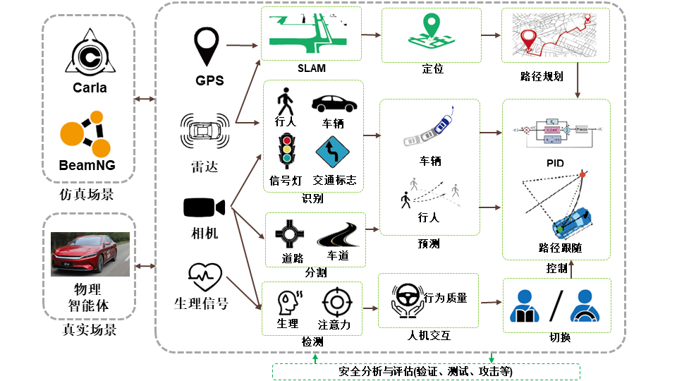
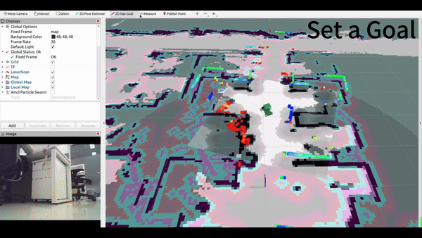
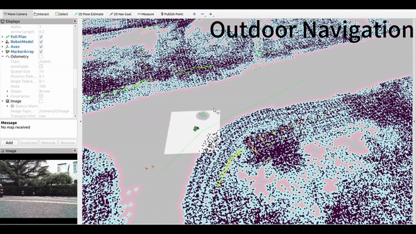
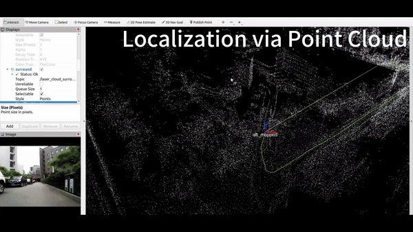

# [智能驾驶系统](https://tis.ios.ac.cn/iss/) 

智能自动驾驶系统（Intelligent Self-driving System, ISS）是一个用Python 和 C++ 编写的模块化框架，旨在构建一个适合研究的可扩展工作空间。该框架将包含用于自动驾驶相关任务的传统和深度学习算法，例如感知、定位、映射、预测、规划和控制。对外部库依赖性最小的模块化设计可以为研究人员评估自动驾驶系统的算法提供透明、干净的工作空间。

* [__安装__](iss_install.md)
* [__算法__](iss_install.md)
    * [感知](algorithms/perception.md)
    * [定位](algorithms/localization.md)
    * [预测](algorithms/prediction.md)
    * [规划](algorithms/planning.md)
    * [控制](algorithms/control.md)

## 仿真器示例

目前，智能驾驶系统框架能够使用仿真器生成的数据来部署和测试算法。将 Carla 仿真器的传感器数据集成到我们的框架中后，我们可以评估一系列算法。此外，可以采用相应的控制算法来操纵仿真车辆。以下是一些演示。

<!--  --> 

 Carla 模拟器中 PointPillar 3D 检测算法的实时演示 

 

 展示本地行为规划的演示 

 

## 微型车演示
除了仿真结果之外，如果来自真实微型汽车的传感器数据通过 ROS 传输回 ISS，则 ISS 框架可以利用传感器数据完成各种任务并对物理微型汽车进行控制。我们在下面展示了三个视频，展示了 ISS 与真实微型汽车的互动。

两个演示分别展示了在室内和室外环境中导航的实体微型车

使用来自物理微型车的数据展示 A-LOAM SLAM 算法的演示

