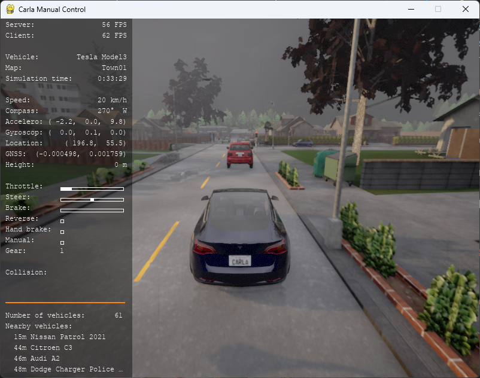
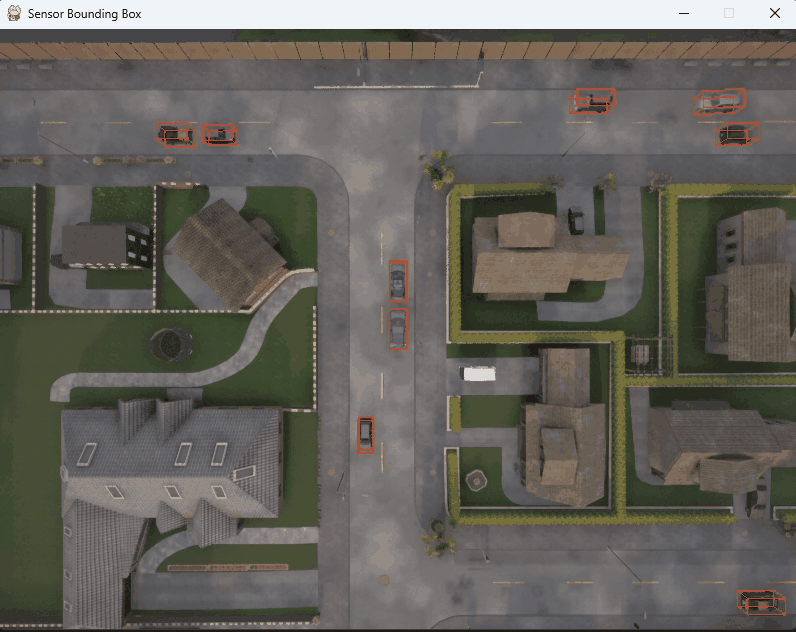

## [交互式脚本](https://github.com/Morphlng/Carla-Interactive-Script/) 


### generate_traffic.py
生成交通流量。
```shell
python examples/generate_traffic.py --host localhost --port 2000 -n 50 -w 20 --safe
```

### manual_control.py
手动控制车辆的示例。
```shell
python examples/manual_control.py --host localhost --port 2000 --rolename hero --keep_ego_vehicle
```


### Sensor_bounding_box.py
脚本将根据用户指定的视角 `view`（上方`above`、后面`behind`）附加一个 RGB 相机，并在距离`distance`之内绘制所有的参与者。
```shell
python examples/sensor_bounding_box.py --host localhost --port 2000 --rolename hero --view above --distance 100 --res 800x600 --fov 90
```



!!! 注意
    运行之前，需要先运行 `manual_control.py` 生成一辆英雄车辆，否则运动报错：`Actor hero not found`。 并且将原始脚本的环境路径`../src`改为``..`。


### rgb_camera_example.py

该脚本为您提供了如何在 Carla 中可视化各种 RGB 相机传感器的示例。
```shell
python examples/rgb_camera_example.py --host localhost --port 2000 --rolename hero
```


### waypoint_follow.py
该脚本实现了一个简单的路径点跟踪方法。它将沿着地图上的航点行驶，并在到达航点终点时停止。
```shell
python examples/waypoint_follow.py --host localhost --port 2000 --rolename hero --map Town01 --json_file data/town01_waypoints.json --sync --fixed_delta_seconds=0.05 --spawn --visualize --camera_follow
```
!!! 注意
    运行之前需要先试用`python config.py -m Town01`将地图切换到 Town01 。


### 3d_lidar.py
此脚本提供了如何使用 Open3D 可视化激光雷达点云和雷达数据的示例。
```shell
python examples/3d_lidar.py --host localhost --port 2000 --rolename hero --keep_ego_vehicle
```

