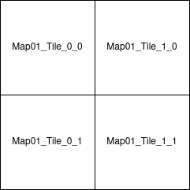

# [导入/打包大地图](https://carla.readthedocs.io/en/latest/large_map_import/) 

RoadRunner 中生成的大地图可以导入到 Carla 的源代码编译版本中，并打包在 Carla 独立包中分发和使用。该过程与标准地图的过程非常相似，只是添加了图块和批量导入的特定术语。

- [__文件和文件夹__](#files-and-folders)
- [__创建 JSON 描述（可选）__](#create-the-json-description-optional)
- [__进行导入__](#making-the-import)
- [__打包一张大地图__](#package-a-large-map)

---

## 文件和文件夹

所有要导入的文件应放置在 Carla 根目录的`Import`文件夹中。这些文件应包括：

- 多个`.fbx`文件中的地图网格代表地图的不同图块。
- OpenDRIVE 定义位于单个`.xodr`文件中。

!!! 警告
    您不能同时导入大地图和标准地图。

地图图块的命名约定非常重要。每个地图图块应根据以下约定命名：

```
<mapName>_Tile_<x-coordinate>_<y-coordinate>.fbx
```

请注意，更正的 __y 坐__ 标是指 y 轴上较低的图块。例如，`Map01_Tile_0_1`会坐在 `Map01_Tile_0_0` 的下面。

>>>>>>>>

生成的`Import`文件夹中包含一个包含由四个图块组成的大地图的包，其结构应类似于以下结构：

```sh
Import
│
└── Package01
  ├── Package01.json
  ├── Map01_Tile_0_0.fbx
  ├── Map01_Tile_0_1.fbx
  ├── Map01_Tile_1_0.fbx
  ├── Map01_Tile_1_1.fbx
  └── Map01.xodr

```

!!! 笔记
    该`package.json`文件并不是绝对必要的。如果未创建`package.json`文件，自动导入过程将创建一个。在下一节中了解有关构建自己`package.json`的结构的更多信息。

---

## 创建 JSON 描述（可选）

`.json`描述是在导入过程中自动创建的，但也可以选择手动创建描述。现有`.json`描述将覆盖导入过程中作为参数传递的任何值。

该`.json`文件应创建在包的根文件夹中。文件名将是包分发名称。文件的内容描述了 __Maps__ 和 __Props__ 的 JSON 数组，其中包含每个地图和道具的基本信息。

__Maps__ 需要以下参数：

- __name:__ 地图的名称。这必须与`.fbx`和`.xodr`文件相同。
- __xodr:__ `.xodr` 文件的路径。
- __use_carla_materials:__ 如果为 __True__，地图将使用 Carla 材质。否则，它将使用 RoadRunner 材质。
- __tile_size:__ 图块的大小。默认值为 2000 (2kmx2km)。
- __tiles:__ 组成整个地图的`.fbx`图块文件的列表。

__Props__ 不属于[本](tuto_A_add_props.md)教程的一部分。请参阅本教程了解如何添加新道具。

生成的`.json`文件应类似于以下内容：

```json
{
  "maps": [
      {
        "name": "Map01",
        "xodr": "./Map01.xodr",
        "use_carla_materials": true,
        "tile_size": 2000,
        "tiles": [ 
        "./Map01_Tile_0_0.fbx",
        "./Map01_Tile_0_1.fbx",
        "./Map01_Tile_1_0.fbx",
        "./Map01_Tile_1_1.fbx"
        ]
      }
  ],
  "props": []
}
```


---

## 进行导入

将所有文件放入`Import`文件夹后，在根 Carla 文件夹中运行以下命令：

```sh
make import
```

根据您的系统，虚幻引擎可能会消耗太多内存而无法一次导入所有文件。您可以通过运行以下命令选择批量导入文件：

```sh
make import ARGS="--batch-size=200"
```

该`make import`命令还存在两个标志：

- `--package=<package_name>` 指定包的名称。默认情况下，此项设置为`map_package`。两个包不能具有相同的名称，因此使用默认值将导致后续导入时出错。__强烈建议更改包的名称__。通过运行以下命令来使用此标志：

```sh
make import  ARGS="--package=<package_name>"
```

- `--no-carla-materials` 指定您不想使用默认的 Carla 材质（道路纹理等）。您将改用 RoadRunner 材料。仅当您 __不提供__ 自己的[`.json` 文件](tuto_M_manual_map_package.md)时才需要此标志。`.json`文件中的任何值都将覆盖此标志。通过运行以下命令来使用此标志：

```sh
make import  ARGS="--no-carla-materials"
```

所有文件都将被导入并准备在虚幻编辑器中使用。地图包将在`Unreal/CarlaUE4/Content` 中创建。将创建一个底图图块`<mapName>`，作为所有图块的流级别。基础图块将包含天空、天气和大地图参与者，可供参与者使用。

!!! 笔记
    目前不建议使用虚幻编辑器中为标准地图提供的自定义工具，例如道路画家、程序化建筑等。

---

## 打包一张大地图

要打包大地图以便可以在 Carla 独立包中使用，请运行以下命令：

```sh
make package ARGS="--packages=<mapPackage>"
```

这将创建一个压缩在`.tar.gz`文件中的独立包。在 Linux 中文件将保存在`Dist`目录下，在 Windows 中文件保存在`/Build/UE4Carla/`。然后可以将它们分发和打包以在独立的 Carla 包中使用。

---

如果您对大地图导入打包过程有任何疑问，那么您可以在 [论坛](https://github.com/carla-simulator/carla/discussions) 中提问。

<div class="build-buttons">
<p>
<a href="https://github.com/carla-simulator/carla/discussions" target="_blank" class="btn btn-neutral" title="Go to the CARLA forum">
Carla 论坛</a>
</p>
</div>


