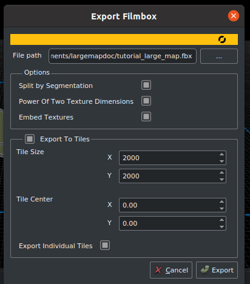

# 在 RoadRunner 创建大地图

RoadRunner 是推荐的软件，用于创建要导入 Carla 的大地图。本指南概述了 RoadRunner 是什么，在构建大地图时需要考虑的事情，以及如何导出自定义的大地图，以便导入 Carla。 

- **[RoadRunner 简介](#introduction-to-roadrunner)**
- [**开始之前**](#before-you-start)
- **[在  RoadRunner 中创建一个大地图](#build-a-large-map-in-roadrunner)**
- **[在 RoadRunner 中导出一个大地图](#export-a-large-map-in-roadrunner)**
- **[下一个步骤](#next-steps)**
---
## RoadRunner简介

RoadRunner是一个交互式编辑器，可以让您设计3D场景来仿真和测试自动驾驶系统。它可以用来创建道路布局和伴随的opdrive和几何信息。[在这里了解更多关于RoadRunner的信息](rr_home)。

RoadRunner是MATLAB校园许可的一部分，因此许多大学可以提供无限制的学术访问。[检查](rr_eligibility)一下你的大学是否有访问权限。如果有任何关于可访问性的问题或麻烦，请联系automated-driving@mathworks.com。[还有一个试用版]([rr_trial_version)。

参加 Carla 排行榜的每个人都可以获得RoadRunner的许可证。[点击这里了解更多信息](rr_leaderboard)。

[rr_home]: https://www.mathworks.com/products/roadrunner.html
[rr_trial_version]: https://www.mathworks.com/products/roadrunner.html
[rr_eligibility]: https://www.mathworks.com/academia/tah-support-program/eligibility.html
[rr_leaderboard]: https://www.mathworks.com/academia/student-competitions/carla-autonomous-driving-challenge.html

---
## 开始之前 

您需要安装RoadRunner。您可以按照Mathworks网站上的[安装指南](rr_docs)进行操作。

[rr_docs]: https://www.mathworks.com/help/roadrunner/ug/install-and-activate-roadrunner.html

---

## 在RoadRunner中创建一个大地图

如何在RoadRunner中构建一个大地图的细节超出了本指南的范围，但是，在[RoadRunner文档](rr_tutorials)中有视频教程。

如果您正在构建带有高程的大地图，则建议地图的最大尺寸为20km × 20km。大于这个值的地图可能会导致RoadRunner在导出时崩溃。

[rr_tutorials]: https://www.mathworks.com/support/search.html?fq=asset_type_name:video%20category:roadrunner/index&amp;page=1&amp;s_tid=CRUX_topnav

---

## 在RoadRunner中导出一个大地图

下面是从RoadRunner导出自定义大地图的基本指南。

[exportlink]: https://www.mathworks.com/help/roadrunner/ug/Exporting-to-CARLA.html

一旦你在RoadRunner中制作了你的地图，你就可以导出它了。请注意，道路布局在导出后不能修改。导出前，请确保:

- 地图以(0,0)为中心，以确保地图可以在虚幻引擎中正确地可视化。
- 映射定义是正确的。
- 地图验证是正确的，密切关注连接和几何形状。

>>>>

一旦地图准备好了，点击opdrive预览工具按钮来可视化opdrive道路网络，并给一切最后一次检查。

>>>>

!!! 笔记
    _opdrive预览工具_使它更容易测试地图的完整性。如果路口有任何错误，点击‘Maneuver Tool’，然后点击‘Rebuild Maneuver Roads’。

通过点击[世界设置工具](https://www.mathworks.com/help/roadrunner/ref/worldsettingstool.html)并拖动蓝色边界框的边缘以包含您想要导出的整个区域，确保选择完整的地图进行导出。当它准备好了，点击Apply World Changes。

当您准备导出时:

__1.__ 导出 `.fbx`文件:

  - 在主工具栏中选择,选择 `File` -> `Export` -> `Firebox (.fbx)`

__2.__在弹出的窗口中:

>- 检查以下选项:
    - _Split by Segmentation_: 通过语义分割对网格进行划分，改善行人导航。
    - _Power of Two Texture Dimensions_: 提高了性能。
    - _Embed Textures_: 确保纹理嵌入到网格中。
    - _Export to Tiles_: 选择瓷砖的大小。Carla 可以使用的最大尺寸是2000 x 2000。
    - _Export Individual Tiles_: 生成在 Carla 中流式传输大地图所需的单个块。

>>>>>>

__3.__ 导出 `.xodr`文件:

  - 在主工具栏中选择 `File` -> `Export` -> `OpendDRIVE (.xodr)`

!!! 警告
    确保 `.xodr` 和 `.fbx` 的文件名称相同。
---

## 下一个步骤

现在可以将地图导入 Carla 了。有关详细信息，请参阅[导入大地图指南](arge_map_import.md)。

---

如果你对这个过程有任何疑问，那么你可以在 [论坛](https://github.com/carla-simulator/carla/discussions) 上提问。

<a href="https://github.com/carla-simulator/carla/discussions" target="_blank" class="btn btn-neutral" title="Go to the CARLA forum">
Carla 论坛</a>

