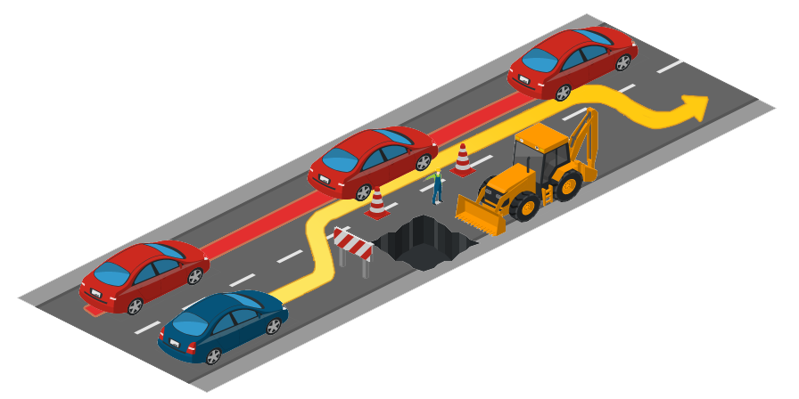

# 概述
Carla 自动驾驶排行榜的主要目标是评估自动驾驶人员在现实交通场景中的驾驶熟练程度。排行榜作为社区的开放平台，对自动驾驶汽车代理进行公平且可重复的评估，简化了不同方法之间的比较。排行榜目前为 2.0 版本，仍支持 1.0 版本。

# 任务
Carla 自动驾驶排行榜要求自动驾驶代理驾驶通过一组预定义的路线。对于每条路线，代理将在起点进行初始化，并引导其行驶至目的地点，并通过 GPS 样式坐标、地图坐标或路线指令提供路线描述。路线是在多种情况下定义的，包括高速公路、城市地区、住宅区和乡村环境。排行榜评估各种天气条件下的自动驾驶代理，包括日光场景、日落、雨、雾和夜晚等。

# 应用场景
代理将面临基于 NHTSA 类型的多种交通场景。可以在此页面中查看交通场景的完整列表，但这里有一些示例。

* 车道合并。
* 变道。
* 在交通路口进行协商。
* 在环岛进行协商。
* 处理交通灯和交通标志。
* 给紧急车辆让行。
* 应对行人、骑自行车的人和其他因素。

Carla 自动驾驶排行榜中的交通状况图解。

# 参与方式
排行榜提供两种参与方式：SENSORS 和 MAP。这些方式的不同之处在于您的代理可以从平台请求的输入数据类型。

此外，两种模式的代理都将收到高级路线描述，指示路径必须遵循的关键点才能到达目的地。该路线表示为元组列表，并且有两种变体。

对于第一种情况，元组的第一个元素包含一个路径点，表示为纬度、经度和分量 z。

    [({'z': 0.0, 'lat': 48.99822669411668, 'lon': 8.002271601998707}, RoadOption.LEFT),
     ({'z': 0.0, 'lat': 48.99822669411668, 'lon': 8.002709765148996}, RoadOption.RIGHT),
     ...
     ({'z': 0.0, 'lat': 48.99822679980298, 'lon': 8.002735250105061}, RoadOption.STRAIGHT)]

第二种情况与前一种情况非常相似，但不使用 GPS 坐标，而是用世界坐标表示路线。

    [({'x': 153.7, 'y': 15.6, 'z': 0.0}, RoadOption.LEFT),
     ({'x': 148.9, 'y': 67.8, 'z': 0.0}, RoadOption.RIGHT),
     ...
     ({'x': 180.7, 'y': 45.1, 'z': 1.2}, RoadOption.STRAIGHT)]

!!! 笔记
    两个连续路径点之间的距离可能长达数百米。不要依赖这些作为您驾驭环境的主要机制。

第二个元素包含高级命令。可用的高级命令集是：

* RoadOption.CHANGELANELEFT：向左移动一条车道。
* RoadOption.CHANGELANERIGHT：向右移动一条车道。
* RoadOption.LANEFOLLOW：继续在当前车道上行驶。
* RoadOption.LEFT：在交叉路口左转。
* RoadOption.RIGHT：在交叉路口右转。
* RoadOption.STRAIGHT：在交叉路口保持直行。

!!! 笔记
    您不得使用 Carla 模拟器提供的任何特权信息，包括规划器或任何类型的基本事实。使用这些功能的提交将被拒绝，团队将被禁止进入该平台。

## 传感器轨迹
在此轨迹上，代理可以请求访问以下传感器。

!!! 笔记
    每个传感器的单位都受到限制，以控制计算预算。

## 地图轨迹
提供与 SENSORS 轨迹相同的传感器组。此外，代理可以请求访问高精地图，该地图以解析为字符串的 OpenDRIVE 文件形式提供。

!!! 笔记
    您完全负责解析此文件或将其转换为对您的代理有用的表示形式。

## 资格赛赛道
排行榜 2.0 设有 2 条资格赛赛道，您的代理将需要通过具有简单驾驶场景的看不见的地图安全地导航一条简单的路线。每个 SENSOR 和 MAP 轨道都有其各自的限定符。您必须在预选赛中达到最低驾驶分数，才能允许向排行榜 2.0 主赛道提交代理。

为了节省计算资源，预选赛将允许使用比主要竞争对手更严格的传感器套件，包括 0-4 个 RGB 摄像头、0-2 个雷达和 0-1 个激光雷达，以及全球导航卫星系统、IMU 和速度计（以及用于 MAP 赛道的 OpenDRIVE）。我们鼓励您使用限定符来确保您的自动驾驶堆栈已正确配置并在排行榜上正常运行。

# 评估和指标
代理的驾驶熟练程度可以通过多种指标来表征。对于这个排行榜，我们选择了一组有助于了解驾驶不同方面的指标。虽然所有路由都具有相同类型的指标，但它们各自的值是单独计算的。具体指标如下：

* **驾驶分数**：\({R_i P_i},\) — 排行榜的主要指标，作为路线完成与违规处罚之间的乘积。这里\(Ri\)是 \(i−th\) 路线的完成百分比，而\(Pi\)是 \(i−th\) 路线的违规处罚。

* **路线完成**：客服人员完成的路线距离的百分比。

* **违规处罚**: \(\prod_j^{\text{ped., ..., stop}} ({p_i^j})^{\text{#infractions}_j}.\) — 排行榜跟踪多种类型的违规行为该指标将代理触发的所有违规行为汇总为几何级数。代理的理想基础分数是1.0，每犯下一种类型的违规，该分数都会降低。

当所有路由完成后，还会生成前三种类型中每一种的全局度量，即所有单独路由组合的算术平均值。全局驾驶分数是对您与其他参与者进行分类的主要指标。

## 违规和关闭事件
Carla 排行榜提供了一系列违规行为的单独指标。其中每一个都有一个惩罚系数，每次发生时都会应用该系数。按严重程度排序，违规行为如下。

* **与行人相撞**— 0.50.
* **与其他车辆相撞**— 0.60.
* **与静态元素的碰撞**- 0.65.
* **闯红灯**—— 0.70。
* **运行停车标志**— 0.80.

某些场景的行为可以无限期地阻止自我车辆。这些场景将有 4 分钟的超时时间，之后自动车辆将被释放以继续路线。但是，如果超过时限，则会受到处罚：

* **场景超时**—0.7

预计代理将保持最低速度以适应附近的交通。代理的速度将与附近车辆的速度进行比较。未能保持适当的速度将受到处罚。所施加的惩罚取决于速度差的大小，最高可达以下值：

**未能保持最低速度**—0.7
特工应该给从后面驶来的紧急车辆让路。不让紧急车辆通过将受到处罚：

**未能给紧急车辆让路**—0.7
除此之外，还有一种额外的违规行为，它没有系数，而是影响路线完成（\(R_i\)）的计算。

**越野驾驶**- 如果代理驾驶越野，则在计算路线完成分数时将不会考虑该路线的百分比。

此外，某些事件会中断模拟，从而阻止代理继续进行。在这些情况下，正在模拟的路线将被关闭，排行榜将移至下一条，正常触发。

* **路线偏差** 30- 如果客服人员偏离指定路线超过米。
* **代理被阻止** 180— 如果代理在模拟秒内没有采取任何操作。
* **模拟超时**——如果在几秒钟内无法建立客户端-服务器通信60。
* **路线超时**- 如果路线模拟花费太长时间才能完成。
每次发生上述任何情况时，都会记录一些详细信息，这些详细信息将显示为列表，供您查看路线的各个指标。以下是代理闯红灯并偏离路线的路线示例。

    "infractions": {
      "Collisions with layout": [],
      "Collisions with pedestrians": [],
      "Collisions with vehicles": [],
      "Red lights infractions": [
            "Agent ran a red light 203 at (x=341.25, y=209.1, z=0.104)"
      ],
      "Stop sign infractions": [],
      "Off-road infractions": [],
      "Min speed infractions": [],
      "Yield to emergency vehicle infractions": [],
      "Scenario timeouts": [],
      "Route deviations": [
            "Agent deviated from the route at (x=95.92, y=165.673, z=0.138)"
      ],
      "Agent blocked": [],
      "Route timeouts": []
    }

!!! 笔记
    全局违规行为将各个路线的数据压缩为单个值，并以每公里的事件数给出。

# 开始使用
为了熟悉排行榜，我们建议您仔细阅读“入门”部分。请花足够的时间确保一切在本地按预期运行。

准备好后，请检查“提交”部分以了解如何准备提交。

## 排行榜 1.0
排行榜目前为 2.0 版本。排行榜 1.0 版仍然可以支持您之前的工作。请参阅“开始”和“提交”页面以获取排行榜 1.0 版本的提交信息。

## 条款和条件
感谢我们的赞助商和合作者的慷慨解囊，Carla 自动驾驶排行榜作为一项向研究界提供的服务免费提供。

每个提交都将在 AWS 中使用 g5.12xlarge 实例进行评估 。这使用户可以访问具有现代 GPU 和 CPU 的专用节点。

每个月向团队提交的提交数量有限（目前为 5 份）。

提交津贴每月自动补充。 Carla 排行榜的组织者保留向团队分配额外津贴的权利。该组织还保留修改每月提交津贴默认值的权利。

严格禁止滥用或攻击 Carla 排行榜的基础设施，包括用于运行服务的所有软件和硬件。偏离 Carla 排行榜精神的行为可能会导致团队解散。

如需进一步说明，请阅读条款和条件。

[性能排行榜](https://paperswithcode.com/sota/autonomous-driving-on-carla-leaderboard) 