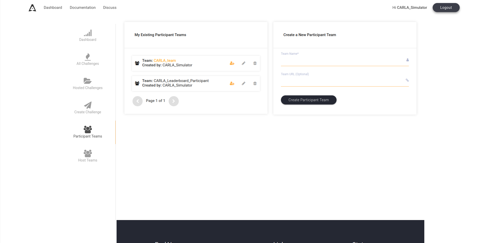
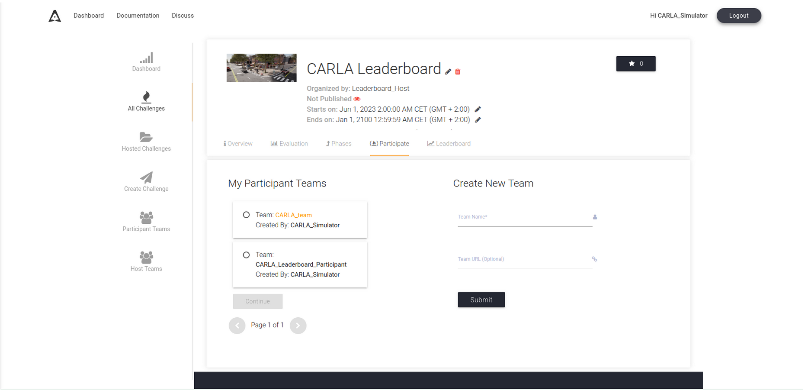
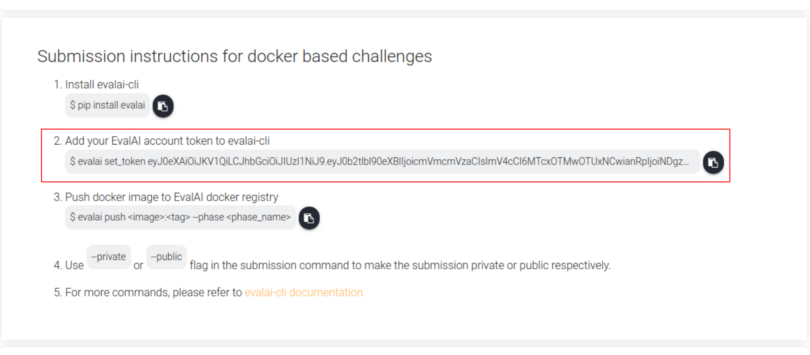
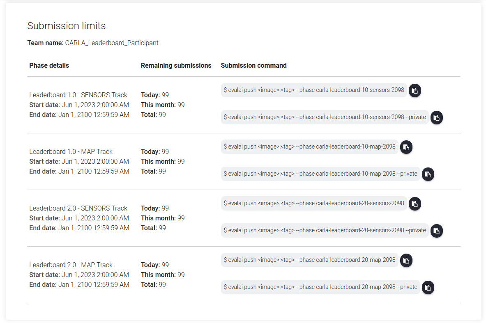

# 为排行榜2.0版提交智能体

!!! 笔记
    将您的智能体提交给 Carla 自动驾驶排行榜，即表示您接受了使用条款。本页介绍了提交Leaderboard 2.0版本的智能体，如果您使用的是Leaderboard1.0版本，请参阅本提交指南。

## 一般步骤
为了创建并提交您的智能体，您应该拥有排行榜项目和 scenario_runner 的副本。如果不是这种情况，请先访问“入门”部分。

1. 创建一个 dockerfile 来构建您的智能体

为了让 Carla 排行榜评估您的智能体，需要将其封装在 Docker 镜像中。要想成功，您必须能够在 docker 内运行带有排行榜的智能体。您可以从头开始创建图像，也可以遵循以下准则：

* 将您的代码托管在 `${LEADERBOARD_ROOT}`外面。我们将该目录称为`${TEAM_CODE_ROOT}`对于基于 ROS 的智能体，这应该是您的 ROS 工作区。
* 利用存储库中提供的示例 Docker 文件之一，其中场景运行器和排行榜所需的所有依赖项均已设置。基于 Python 的智能体可以使用此示例 Docker，而基于 ROS 的智能体可以在此处使用其 Docker 。包括智能体所需的依赖项和附加包。我们建议您在由标签“_BEGINNING OF USER COMMANDS_”和“_END OF USER COMMANDS_”分隔的区域中添加新命令。
* 更新变量`TEAM_AGENT`以设置智能体文件和`TEAM_CONFIG`，如果需要配置文件进行初始化。不要更改路径“`/workspace/team_code`”的其余部分。
* 确保您想要获取的任何内容都在内部，`${HOME}/agent_sources.sh`因为在其他任何地方添加的源都不会被调用。在云中运行智能体之前会自动获取此文件。


!!! 注意
    请注意，当您将条目提交到云时，您对排行榜或场景运行程序存储库所做的任何更改都将被覆盖。

## 将您的智能体构建到 docker 镜像中

dockerfile 准备就绪后，您现在可以通过运行`make_docker.sh`脚本来创建它，该脚本会在该名称下生成 docker 映像`leaderboard-user`。

```shell
${LEADERBOARD_ROOT}/scripts/make_docker.sh [--ros-distro|-r ROS_DISTRO]
```

该脚本确保正确定义所有所需的环境变量，然后将其内容复制到创建的 Dockerfile 中。建议将这些环境变量作为您的`${HOME}/.bashrc`文件的一部分，并包含以下内容：

* `${CARLA_ROOT}`
* `${SCENARIO_RUNNER_ROOT}`
* `${LEADERBOARD_ROOT}`
* `${TEAM_CODE_ROOT}`
* `${ROS_DISTRO}` （仅 ROS 智能体需要）

请随意调整此脚本以复制您认为合适的其他文件和资源。

!!! 注意
    您可以通过在计算机上本地运行排行榜来测试您的 docker 映像

我们还想重点介绍 [排行榜智能体](https://github.com/carla-simulator/leaderboard-agents) 存储库，其中包含多个旨在与 Leaderboard 2.0 配合使用的智能体，以及将它们封装在 Docker 中所需的文件。


##  在Eval AI注册新用户
我们Eval AI的合作伙伴开发了排行榜的用户界面。要提交内容，您需要在网站上注册用户。

!!! 注意
    请务必填写您的用户隶属关系，否则您可能不会被接受参加挑战。

## 创建新团队

在 Eval AI 注册用户后，通过单击“参与者团队”部分创建一个新团队，如下所示。所有参与者都需要在 Carla 排行榜 2.0 中注册一个团队。


AlphaDrive UI 中的团队创建屏幕。

## 申请加入 Carla 排行榜

转至“所有挑战”部分并找到 Carla 排行榜挑战，或使用 [此链接](https://eval.ai/web/challenges/challenge-page/2098/overview) 。选择“参与”，然后选择一个参与团队来申请挑战。您需要等待 Carla 排行榜管理员验证您的团队。一旦您的团队通过验证，您就可以开始提交。


基准部分。

## 提交您的意见

一旦您的团队经过验证，您就可以提交。在“概述”选项卡中，您将找到有关 Carla 排行榜的一般信息，请前往“提交”部分进行提交。您将在那里找到提交说明。

您需要使用 pip 安装 EvalAI CLI：

```shell
pip install evalai
```

接下来，您需要使用以下命令通过令牌来识别您的用户：

```shell
evalai set_token <token>
```
您可以从 EvalAI 网站的“提交”部分检索您的令牌。您可以直接从提交说明中复制并粘贴命令：



CLI 提交说明。

!!! 注意
    该令牌是特定于您的用户的，每个用户都会在网站的此部分中看到不同的令牌。不要共享令牌，否则提交作者将会产生混淆。

使用以下命令推送 Docker 镜像：

```shell
evalai push <image>:<tag> --phase <phase_name>
```

您可以在四个轨迹之间进行选择（在 EvalAI 网站中称为阶段）：

* 排行榜 2.0 - 传感器
* 排行榜2.0 - 地图

* 排行榜 1.0 - 传感器
* 排行榜 1.0 - 地图

对于排行榜 2.0 赛道，您必须首先完成相应的资格任务：

* 排行榜 2.0 - SENSORS 预选赛赛道
* 排行榜 2.0 - MAP 预选赛赛道

!!! 注意
    在涉及排行榜的年度比赛期间，某些赛道可能会暂时关闭。请密切关注排行榜网站和 Discord 论坛，了解赛道何时可能关闭提交。

您可以直接从以下部分复制并粘贴，以确保提交到正确的轨道，并将`<image>`和替换`<tag>`为适合您的 Docker 映像的值：



要提交到每个轨迹的 CLI 命令。


## 检查您提交的数据

创建提交后，您可以转到此`My Submissions`部分查看所有提交的详细信息。

状态显示提交状态的高级说明。所有提交都从状态开始，一旦在后端开始运行，`SUBMITTED`就会更改为。完成后，如果仿真过程中一切顺利，它将更改为`PARTIALLY_EVALUATED`，或者如果发生意外情况，则更改为 `FINISHEDFAILED` 。

失败的提交可以恢复，这将继续提交，而不重复已经完成的路线。这些将具有`RESUMED`状态，而不是`SUBMITTED`直到它们开始运行。

用户可以随时取消提交、停止提交并将其状态更改为`CANCELLED`。

任何提交都可以重新启动，使用相同提交的 docker 创建一个新的提交。如果提交正在运行，它将自动取消。

为了获得提交的结果，请访问 `Stdout file` 提供的链接。该文件包含有关提交的一些一般信息，包括使用的传感器、路线进度和最终结果，以及每条路线的状态和性能的术语表。

最后，如果您想公开提交的内容，请选中该`Show on Leaderboard`框，它现在将显示在`Leaderboard`挑战部分中。请随意编辑提交内容，其中包含有关方法名称、描述以及项目或出版物的 URL 的任何信息。

