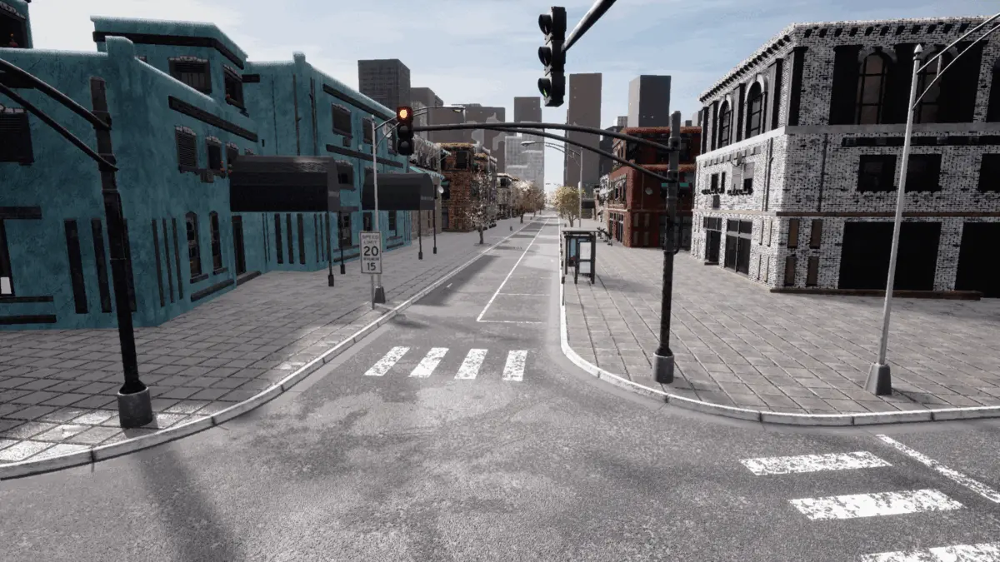
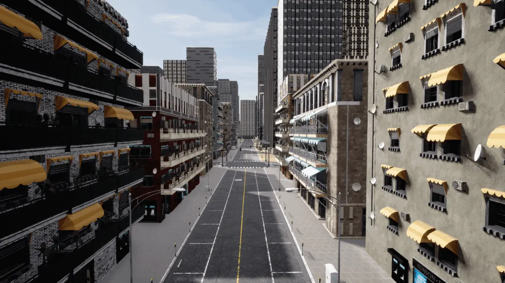
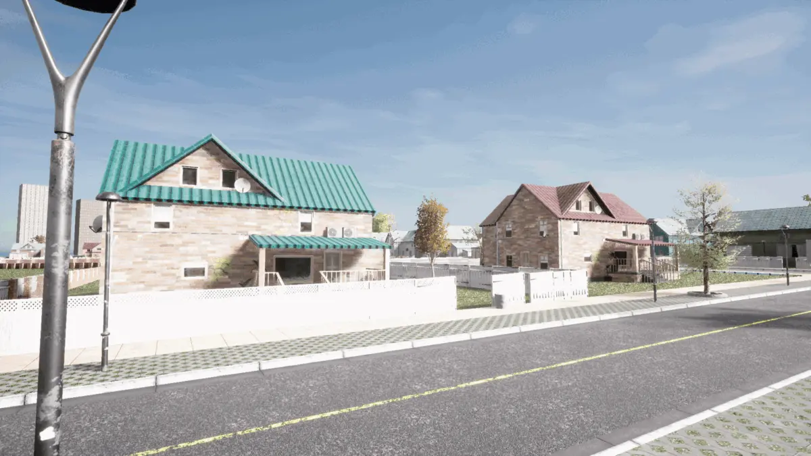
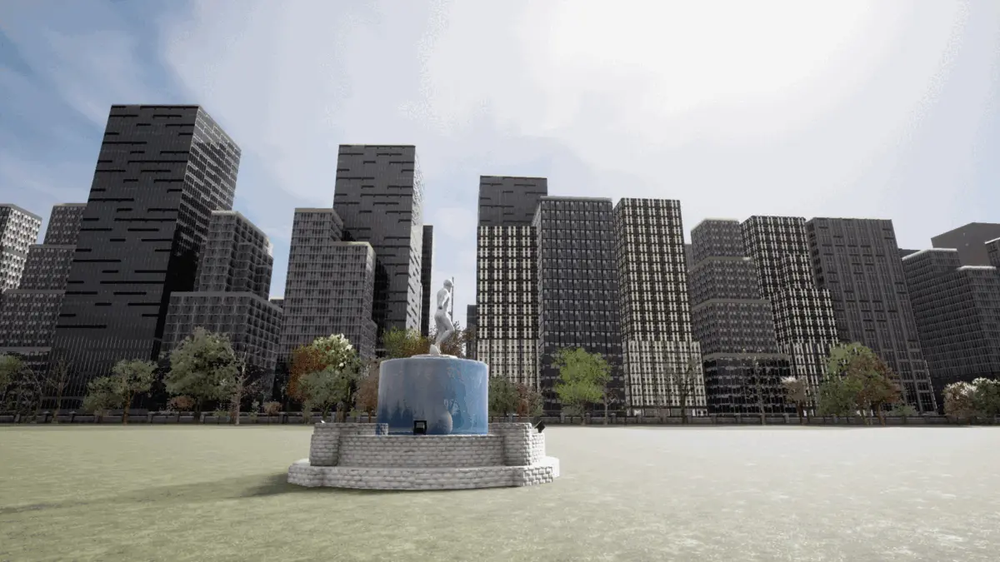
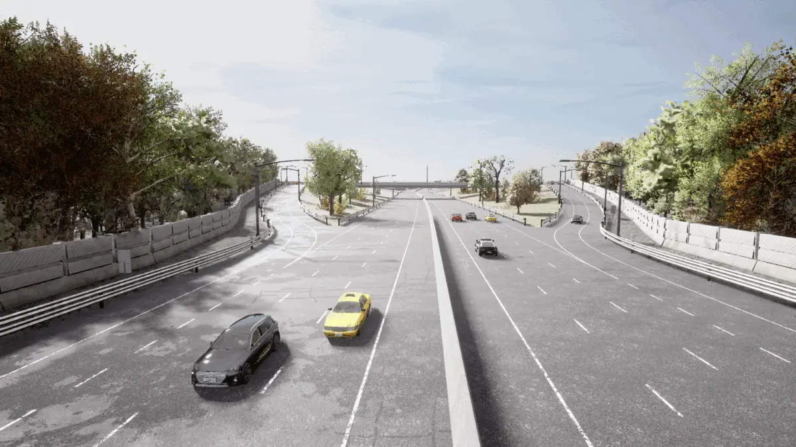
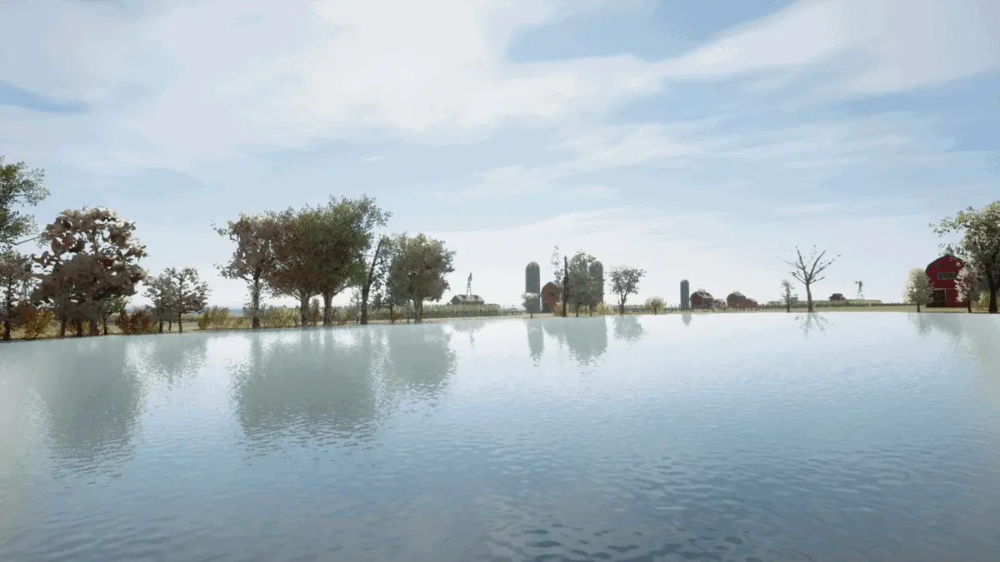

# 城镇 13


城镇 13 是一张尺寸为 10x10 km<sup>2</sup> 的大地图。它分为 36 个图块，大多数尺寸为 2x2 km<sup>2</sup>（某些边缘图块较小）。有许多与城市形成鲜明对比的区域，包括城市、住宅区和乡村地区，还有环绕城市的大型高速公路系统和环形公路。建筑风格反映了北美许多大中城市的建筑风格。


!!! 笔记
    城镇 13 被设计为城镇 12 的附属设施，这样它们就可以作为 __训练-测试对__。这些城镇有许多共同特征，但在建筑风格、道路纹理、路面纹理和植被方面也有许多差异。使用其中一个生成训练数据，然后使用另一个进行测试，非常适合暴露开发自动驾驶技术栈时可能出现的过度拟合问题。

## 导航器

导航器交互式地图可用于浏览城镇并导出坐标以在 CARLA 仿真器中使用。

__使用导航器__:

* `left mouse button` - 单击并按住，向左、向右、向上或向下拖动以移动地图
* `scroll mouse wheel` - 向下滚动缩小，向上滚动放大鼠标指针下方的位置
* `double click` - 双击地图上的某个点来记录坐标，您将在文本和地图正下方的代码块中找到坐标

__区域颜色参考__:

* <span style="color:#595d5e; background-color:#595d5e;">&nbsp</span>   [摩天大楼](#high-rise-downtown)
* <span style="color:#d2dddc; background-color:#d2dddc;">&nbsp</span>   [高密度住宅](#high-density-residential)
* <span style="color:#838c8b; background-color:#838c8b;">&nbsp</span>   [社区建筑](#community-buildings)
* <span style="color:#17d894; background-color:#17d894;">&nbsp</span>   [低密度住宅](#low-density-residential)
* <span style="color:#df6a19; background-color:#df6a19;">&nbsp</span>   [公园](#parks)
* <span style="color:#839317; background-color:#839317;">&nbsp</span>   [农村土地](#rural-and-farmland)
* <span style="color:#265568; background-color:#265568;">&nbsp</span>   [水域](#water)


__CARLA 坐标__: 

* __X__:  <span id="carlacoord_x" style="animation: fadeMe 2s;">--</span>
* __Y__:  <span id="carlacoord_y" style="animation: fadeMe 2s;">--</span>


双击兴趣点后，导航器将显示相应的 CARLA 坐标并在以下代码块中更新它们。将代码复制并粘贴到笔记本或 Python 终端中，将观众移动到所需的位置。您首先需要 [连接客户端并设置世界对象](tuto_first_steps.md#launching-carla-and-connecting-the-client) ：

```py
# CARLA 坐标: X 0.0, Y 0.0
spectator = world.get_spectator()
loc = carla.Location(0.0, 0.0, 300.0)
rot = carla.Rotation(pitch=-90, yaw=0.0, roll=0.0)
spectator.set_transform(carla.Transform(loc, rot))
```
## 城镇 13 区

#### 市中心高层建筑：

城镇 13 的市中心区域是一大片高层摩天大楼，在一致的道路网格上排列成街区，类似于许多美国和欧洲大城市的市中心区域。


#### 社区建筑：

社区建筑是一组 2-4 层的公寓楼，色彩缤纷的波西米亚风格，底层为商业，毗邻市中心区。



#### 高密度住宅：

城镇 13 的高密度住宅区拥有许多 2 至 10 层的公寓楼，街道上还设有咖啡馆和零售店等商业地产。许多住宅区都设有带有遮阳帘的阳台，类似于阳光明媚的南欧国家。



#### 低密度住宅：

城镇 13 的低密度住宅区反映了许多欧洲城市的郊区，一层和两层的住宅被围栏花园和车库包围。



#### 公园：

密集的住宅区和市中心被绿色公共空间的小岛所分割，绿叶与城市建筑并置。



#### 高速公路和交叉路口：

城镇 13 拥有广泛的高速公路系统，包括 3-4 车道高速公路、大型环岛和横跨大片水域的堤道。



#### 农村和农田：

城镇 13 还有一些农村地区，有特色农田建筑，如木制谷仓和农舍、风车、粮仓、玉米田、干草垛和乡村围栏。这些地区有未标记的乡村土路和用于城际交通的单车道城际道路。


#### 水域：

城镇 13 中有多个水域，包括一个带有中心岛的大湖和农村地区的几个池塘。



<style>
@keyframes fadeMe {
  from {
    color: #77aaff;
  }
  to {
    color: #000000;
  }
}

</style>
<script>
window.addEventListener('load', function () {

    var text_coord_x = document.getElementById("carlacoord_x")
    var text_coord_y = document.getElementById("carlacoord_y")
    const code_coords = document.getElementsByClassName("hljs-number")
    const code_comment = document.getElementsByClassName("hljs-comment")
  
    const image = document.querySelector('[src$="map"]');
    const canv = document.createElement('canvas');

    canv.setAttribute('height', image.height)
    canv.setAttribute('width', image.width)
    image.parentNode.replaceChild(canv, image)

    var state = {mDown: false, button: 0, lastX: 0, lastY:0, canvX: 0, canvY: 0, zoom: 1.0, mdownX: 0, mdownY: 0, pX: 0.5, pY: 0.5, dblClick: false, listObj: false, touch: false}

    ctx = canv.getContext('2d')
    ctx.drawImage(image, 0, 0, canv.width, canv.height)

    canv.addEventListener('mousemove', (event) => {
        dX = event.clientX - state.lastX
        dY = event.clientY - state.lastY
        state.lastX = event.clientX
        state.lastY = event.clientY

        if(state.mDown && state.button == 0) {
            state.canvX += dX
            state.canvY += dY
            ctx.clearRect(0, 0, canv.width, canv.height)
            ctx.drawImage(image,  state.canvX, state.canvY, canv.width * state.zoom, canv.height * state.zoom)
            state.touch = true;
        }
    })

    canv.addEventListener('mousedown', (event) => {

        state.button = event.button;
        state.mDown = true;
        state.touch = true;

        var rect = canv.getBoundingClientRect();
            
        state.mdownX = event.clientX - rect.left;
        state.mdownY = event.clientY - rect.top;

        state.pX = (state.mdownX - state.canvX) / (canv.width * state.zoom);
        state.pY = (state.mdownY - state.canvY) / (canv.height * state.zoom);
    })

    canv.addEventListener('mouseup', (event) => {
        state.mDown = false;
    })

    canv.addEventListener('wheel', (event) => {
        
        state.mDown = false;

        var rect = canv.getBoundingClientRect();

        dX = event.clientX - rect.left;
        dY = event.clientY - rect.top;

        state.pX = (dX - state.canvX) / (canv.width * state.zoom);
        state.pY = (dY - state.canvY) / (canv.height * state.zoom);

        if(state.touch){
            event.preventDefault();
            if(event.wheelDelta > 0){
                state.zoom *= 1.15 
            } else {
               state.zoom *= 0.85
            }

            if(state.zoom < 1.0){state.zoom = 1.0;}
            if(state.zoom > 30.0){state.zoom = 30.0}

            ctx.clearRect(0, 0, canv.width, canv.height)

            state.canvX = - canv.width * state.zoom * state.pX + dX;
            state.canvY = - canv.height * state.zoom * state.pY + dY;

            ctx.drawImage(image,  state.canvX, state.canvY, canv.width * state.zoom, canv.height * state.zoom);
        }
        
    })

    canv.addEventListener('dblclick', (event) => {
        
        text_coord_x = document.getElementById("carlacoord_x")
        text_coord_y = document.getElementById("carlacoord_y")

        const carlaX = 14556.0868 * state.pX + -7.34734913 * state.pY - 6655.00941;
        const carlaY = 2.19186383 * state.pX + 12431.3323 * state.pY - 4524.46039;

        code_coords[0].textContent = carlaX.toFixed(1)
        code_coords[1].textContent = carlaY.toFixed(1)
        code_comment[0].textContent = "# CARLA coordinates - X: " + carlaX.toFixed(1) + " Y: " + carlaY.toFixed(1)

        var newX = text_coord_x.cloneNode(true)
        var newY = text_coord_y.cloneNode(true)

        newX.textContent = carlaX.toFixed(1)
        newY.textContent = carlaY.toFixed(1)

        var parentX = text_coord_x.parentNode
        var parentY = text_coord_y.parentNode

        parentX.replaceChild(newX, text_coord_x);
        parentY.replaceChild(newY, text_coord_y);

        //console.log(state.pX + ", " + state.pY)

    })

})
</script>

