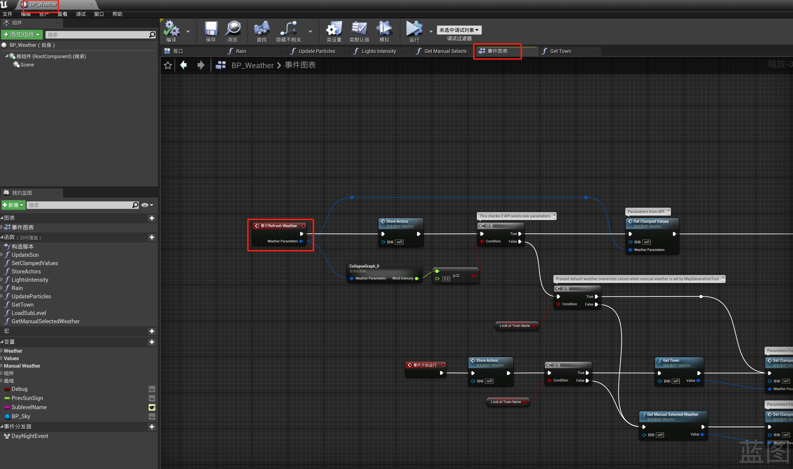

# 天气

调用流程`World.set_weather()`、World.cpp 的`World::SetWeather()`
、D:\work\workspace\carla\LibCarla\source\carla\client\detail\Client.cpp 的 `Client::SetWeatherParameters()`

在 [Wewather.cpp](https://github.com/OpenHUTB/carla_cpp/blob/cd67e7a09f047dc9b0826f94c10f3232fc37bda6/Unreal/CarlaUE4/Plugins/Carla/Source/Carla/Weather/Weather.cpp#L97C29-L98C1) 中的 [`void RefreshWeather(const FWeatherParameters &WeatherParameters)`](https://github.com/OpenHUTB/carla_cpp/blob/cd67e7a09f047dc9b0826f94c10f3232fc37bda6/Unreal/CarlaUE4/Plugins/Carla/Source/Carla/Weather/Weather.h#L59C3-L60C1) 调用真正改变天气的蓝图，它是一个在蓝图中实现的事件`UFUNCTION(BlueprintImplementableEvent)`。

BlueprintImplementableEvent 是 Unreal Engine 中的一种特殊的修饰符，用于在 C++ 代码中声明一个可以在 Blueprint 中实现的事件。这意味着你可以在 C++ 类中定义一个事件，并允许开发者在 Blueprint 中提供该事件的具体实现，而不需要编写 C++ 代码来实现该逻辑。这样就能够将游戏逻辑的实现与 C++ 代码解耦，使得逻辑的实现更加灵活，特别是在面向设计师的开发流程中非常有用。

!!! 笔记
    解耦（Decoupling）是软件设计中的一个重要概念，指的是通过设计使得系统的不同模块或组件之间的依赖关系最小化，从而提高系统的灵活性、可扩展性和可维护性。解耦的目的是使得系统中的各个部分能够相对独立地变化、替换或扩展，而不需要修改其他部分的代码。在游戏开发和其他软件开发中，解耦通常是通过接口、抽象、事件和依赖注入等技术实现的。通过解耦，开发人员可调用。

BlueprintNativeEvent和BlueprintImplementableEvent区别在于：
BlueprintNativeEvent多了个c++实现，可以同时调用c++和蓝图的函数；
BlueprintImplementableEvent不能c++实现，只能调用蓝图函数。

## 参考
- [自定义地图：天气和景观](../tuto_M_custom_weather_landscape.md)

