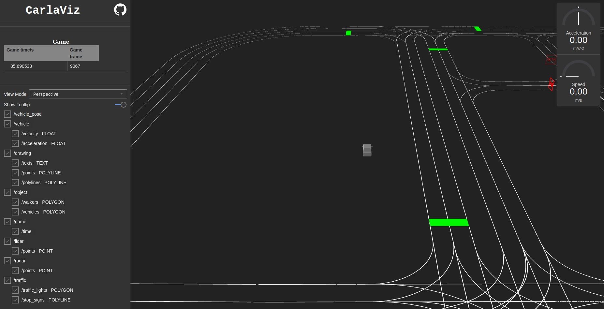

# carlaviz

carlaviz 插件用于在网络浏览器中可视化仿真。创建了一个具有场景的一些基本表示的窗口。参与者可以即时更新，可以检索传感器数据，还可以在场景中绘制附加文本、线条和折线。

*   [__一般信息__](#general-information)  
	*   [支持](#support)  
*   [__获取 carlaviz__](#get-carlaviz)  
	*   [先决条件](#prerequisites)  
	*   [下载插件](#download-the-plugin)  
*   [__工具__](#utilities)  

---
## 一般信息

*   __贡献者__ — Minjun Xu, also known as [wx9698](https://github.com/wx9698).  
*   __许可证__ — [MIT](https://en.wikipedia.org/wiki/MIT_License).  

### 支持

*   __Linux__ — Carla 0.9.6, 0.9.7, 0.9.8, 0.9.9, 0.9.10.  
*   __Windows__ — Carla 0.9.9, 0.9.10.  
*   __从源代码构建__ — 最新更新。

---
## 获取 carlaviz

### 先决条件

*   __Docker__ — 访问文档并 [安装 Docker](https://docs.docker.com/get-docker/).  
*   __操作系统__ — 任何能够运行 Carla 的操作系统都应该可以工作。
*   __Websocket-client__ — ```pip3 install websocket_client```。如果系统中尚未安装 [pip](https://pip.pypa.io/en/stable/installing/) 。  

### 下载插件

打开终端并根据要运行的 Carla 版本拉取 carlaviz 的 Docker 映像。


```bash
# 仅拉取和所使用的Carla包匹配的镜像。
docker pull mjxu96/carlaviz:0.9.6
docker pull mjxu96/carlaviz:0.9.7
docker pull mjxu96/carlaviz:0.9.8
docker pull mjxu96/carlaviz:0.9.9
docker pull mjxu96/carlaviz:0.9.10

# 如果工作在从源代码构建的 Carla 上，则拉取该镜像
docker pull mjxu96/carlaviz:latest
```

!!! 重要
    目前在 Windows 中仅支持 0.9.9 和 0.9.10。

Carla 至 0.9.9（包含）设置为单流。对于更高版本，实现了传感器的多流。 

* __在单流中__, 一个传感器只能被一个客户端听到。当另一个客户端已经听到传感器时，例如在运行 `manual_control.py` 时，carlaviz 被迫复制传感器以检索数据，并且性能可能会受到影响。 

* __在多流中__，多个客户端可以听到一个传感器。carlaviz 不需要重复这些，并且性能不会受到影响。

!!! 笔记
    或者，在 Linux 上，用户可以按照 [此处](https://github.com/carla-simulator/carlaviz/blob/master/docs/build.md) 的说明构建 carlaviz ，但使用 Docker 映像将使事情变得更加容易。

---
## 运行 carlaviz

__1. 运行 Carla。__

*   __a) 在 Carla 包中__ — 转至 Carla 文件夹并使用 `CarlaUE4.exe`(Windows) 或`./CarlaUE4.sh`(Linux) 启动仿真。  

*   __b) 在从源代码构建的包中__ — 转到 Carla 文件夹，使用 `make launch` 运行虚幻编辑器，并按`Play`。

__2. 运行 carlaviz.__ 根据已下载的 Docker 镜像，在另一个终端中运行以下命令。

更改先前下载的镜像的名称 `<name_of_Docker_image>`，例如 `mjxu96/carlaviz:latest` 或 `mjxu96/carlaviz:0.9.10`。

```sh
# 在 Linux 系统
docker run -it --network="host" -e CARLAVIZ_HOST_IP=localhost -e CARLA_SERVER_IP=localhost -e CARLA_SERVER_PORT=2000 <name_of_Docker_image>

# 在 Windows/MacOS 系统
docker run -it -e CARLAVIZ_HOST_IP=localhost -e CARLA_SERVER_IP=host.docker.internal -e CARLA_SERVER_PORT=2000 -p 8080-8081:8080-8081 -p 8089:8089 <name_of_Docker_image>
```

如果一切都已正确设置，carlaviz 将显示类似于以下内容的成功消息。


!!! 警告
    请记住编辑前面的命令以匹配正在使用的 Docker 映像。


__3. 从本地打开__ 打开 Web 浏览器并转到 `http://127.0.0.1:8080/` 。carlaviz 默认在 `8080` 端口运行。输出应类似于以下内容。



---
## 工具

一旦插件运行，它就可以用于可视化仿真、其中的参与者以及传感器检索的数据。该插件在右侧显示一个可视化窗口，场景实时更新，左侧显示一个侧边栏，其中包含要显示的项目列表。其中一些项目将出现在可视化窗口中，其他项目（主要是传感器和游戏数据）出现在项目列表上方。
以下是可用于可视化的选项列表。可能会显示其他元素，例如

*   __View Mode__ — 更改可视化窗口中的视角。
	*   `Top Down` — 空中视角。
	*   `Perspective` — 自由的视角。
	*   `Driver` — 第一人称视角。  

*   __/vehicle__ — 显示自我车辆的属性。可视化窗口中包括速度计和加速度计，以及 IMU、GNSS 和碰撞检测传感器检索的数据。
	*   `/velocity` — 自我车辆的速度。
	*   `/acceleration` — 自我车辆的加速。
*   __/drawing__ — 在使用 [CarlaPainter](https://github.com/wx9698/carlaviz/blob/master/examples/carla_painter.py) 绘制的可视化窗口中显示其他元素。
	*   `/texts` — 文本元素。
	*   `/points` — 点元素。
	*   `/polylines` — 折线元素。 
*   __/objects__  — 在可视化窗口中显示参与者。 
	*   `/walkers` — 更新行人。
	*   `/vehicles` — 更新车辆。
*   __/game__  — 显示游戏数据。
	*   `/time` — 当前仿真时间和帧。
*   __/lidar__ — LIDAR 传感器数据。
	*   `/points` — LIDAR 传感器检测到的点云。 
*   __/radar__ — LIDAR 传感器数据。
	*   `/points` — 雷达传感器检测到的点云。  
*   __/traffic__  — 地标数据。
	*   `/traffic_light` — 在可视化窗口中显示地图的交通灯。
	*   `/stop_sign` — 在可视化窗口中显示地图的停车标志。

尝试生成一些参与者。这些将在可视化窗口中自动更新。
```sh
cd PythonAPI/examples
# 在同步模式仿真下生成参与者
python3 generate_traffic.py -n 10 -w 5
```


生成一个手动控制的自我车辆并四处移动，以查看插件如何更新传感器数据。
```sh
cd PythonAPI/examples
python3 manual_control.py
```


贡献者 ( [wx9698](https://github.com/wx9698) ) 创建了一个附加类 [CarlaPainter](https://github.com/wx9698/carlaviz/blob/master/examples/carla_painter.py) ，它允许用户绘制要在可视化窗口中显示的元素。其中包括文本、点和折线。按照 [此示例](https://github.com/carla-simulator/carlaviz/blob/master/examples/example.py) 生成带有 LIDAR 的自我车辆，并绘制 LIDAR 数据、车辆的轨迹和速度。


---

这就是关于 carlaviz 插件的全部信息。如果有任何疑问，请随时在论坛中发布。

<div class="build-buttons">
<p>
<a href="https://github.com/carla-simulator/carla/discussions/" target="_blank" class="btn btn-neutral" title="Go to the CARLA forum">
Carla 论坛</a>
</p>
</div>
