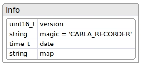
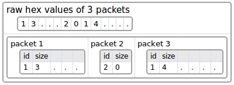
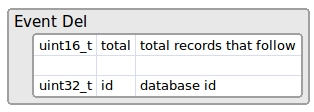
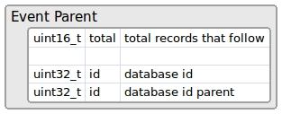
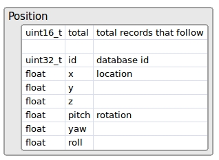
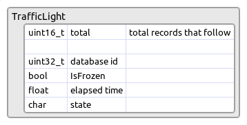
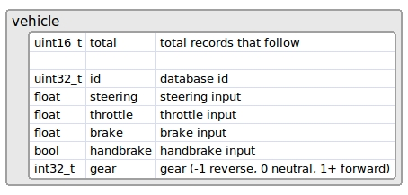
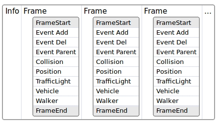

# [记录器二进制文件格式](https://carla.readthedocs.io/en/latest/ref_recorder_binary_file_format/) 

记录器系统将重放仿真所需的所有信息保存在二进制文件中，对多字节值使用小端字节顺序。

*   [__1- 二进制字符串__](#1-strings-in-binary)  
*   [__2- 信息头__](#2-info-header)  
*   [__3- 数据包__](#3-packets)  
	*   [数据包 0 - 帧开始](#packet-0-frame-start)  
	*   [数据包 1 - 帧结束](#packet-1-frame-end)  
	*   [数据包 2 - 事件添加](#packet-2-event-add)  
	*   [数据包 3 - 事件删除](#packet-3-event-del)  
	*   [数据包 4 - 事件父级](#packet-4-event-parent)  
	*   [数据包 5 - 事件碰撞](#packet-5-event-collision)  
	*   [数据包 6 - 位置](#packet-6-position)  
	*   [数据包 7 - 交通灯](#packet-7-trafficlight)  
	*   [数据包 8 - 车辆动画](#packet-8-vehicle-animation)  
	*   [数据包 9 - 行人动画](#packet-9-walker-animation)  
*   [__4- 帧布局__](#4-frame-layout)  
*   [__5- 文件布局__](#5-file-layout)  

在下一张代表文件格式的图像中，我们可以快速查看所有详细信息。图像中可视化的每个部分将在以下部分中进行解释：

总之，该文件格式有一个小头，其中包含一般信息（版本、魔术字符串、日期和使用的地图）和不同类型的数据包集合（目前我们使用 10 种类型，但将来会继续增长） 。

---
## 1- 二进制字符串

字符串首先使用其长度进行编码，然后是其字符（不以空字符结尾）。例如，字符串“Town06”将保存为十六进制值：06 00 54 6f 77 6e 30 36

---
## 2- 信息头

信息标头包含有关录制文件的一般信息。基本上，它包含版本和一个魔术字符串，用于将该文件标识为记录器文件。如果标题发生变化，那么版本也会发生变化。此外，它还包含一个日期时间戳，以及从 1900 年开始的秒数，并且还包含一个字符串，其中包含用于记录的地图名称。

示例信息头是：

---
## 3- 数据包

每个数据包以两个字段（5 个字节）的小标头开头：

* **id**: 数据包类型
* **size**: 数据包数据的大小

头信息后面跟着**数据**。数据是可选的，**大小**为 0 表示数据包中没有**数据**。如果**大小**大于 0，则表示数据包有**数据**字节。因此，需要根据数据包的类型重新解释**数据**。

数据包的头很有用，因为我们可以在播放时忽略那些我们不感兴趣的数据包。我们只需要读取数据包的头（前 5 个字节）并跳过数据包的数据跳转到下一个数据包：

数据包的类型有：

我们建议用户自定义数据包使用超过 100 的 **id**，因为这个列表将来会不断增长。

### 数据包 0 - 帧开始

该数据包标记新帧的开始，并且它将是开始每个帧的第一个数据包。所有数据包都需要放置在**Frame Start**和**Frame End**之间。

因此，经过时间 + 持续时间 = 下一帧经过的时间。

### 数据包 1 - 帧结束

该帧没有数据，仅标记当前帧的结束。这有助于重放器在新一帧开始之前知道每一帧的结束。通常，下一帧应该是帧起始数据包以开始新帧。

### 数据包 2 - 事件添加

这个数据包说明了我们需要在当前帧创建多少个参与者。

字段**总计**表示后面有多少条记录。每条记录都以**id**字段开头，即参与者在录制时所拥有的 id（在播放时，该 id 可以在内部更改，但我们需要使用此 id ）。参与者的**类型**可以有以下可能的值：

  * 0 = 其他
  * 1 = 车辆
  * 2 = 行人
  * 3 = 交通灯
  * 4 = 无效

之后，继续我们想要创建参与者的**位置**和**旋转**。

在我们得到参与者的描述之后。描述 **uid** 是描述的数字 ID，而 **id** 是文本 ID，例如"vehicle.seat.leon"。

然后是其**属性**的集合，例如颜色、轮子数量、角色等。属性的数量是可变的，应该类似于以下内容：

* number_of_wheels = 4
* sticky_control = true
* color = 79,33,85
* role_name = autopilot

### 数据包 3 - 事件删除

这个数据包说明了这一帧需要销毁多少个参与者。

它有记录**总数**，每条记录都有要删除的参与者的ID 。

例如，这个数据包可能是这样的：

数字 3 将数据包标识为事件删除。数字 16 是数据包数据的大小（4 个字段，每个字段 4 字节）。因此，如果我们不想处理这个数据包，我们可以跳过接下来的 16 个字节，直接进入下一个数据包的开头。接下来的 3 表示后面的总记录，每条记录都是要删除的参与者的 id。因此，我们需要在这一帧中删除参与者 100、101 和 120。

### 数据包 4 - 事件父级

该数据包说明哪个参与者是另一个参与者（父母）的孩子。

第一个 id 是子参与者，第二个 id 是父参与者。

### 数据包 5 - 事件碰撞

如果两个参与者之间发生碰撞，它将被注册到这个数据包中。目前，只有具有碰撞传感器的参与者才会报告碰撞，因此目前只有英雄车辆会自动连接该传感器。

**id**只是一个用于在内部标识每次碰撞的序列。同一帧中可能会发生同一对参与者之间的多次碰撞，因为物理帧速率是固定的，并且同一渲染帧中通常存在多个物理子步骤。

### 数据包 6 - 位置

该数据包记录场景中存在的**车辆**和**行人**类型的所有参与者的位置和方向。

### 数据包 7 - 交通灯

该数据包记录了场景中所有**交通灯**的状态。这意味着它存储状态（红色、橙色或绿色）以及等待更改为新状态的时间。

### 数据包 8 - 车辆动画

该数据包记录了车辆、自行车和山地自行车的动画。该数据包存储了**油门**、**方向盘**、**删车**、**手刹**和**排挡**输入，然后在播放时设置它们。

### 数据包 9 - 行人动画

该数据包记录了行人的动画。它只是保存动画中使用的行人的**速度**。

---
## 4- 帧布局

一个帧由多个数据包组成，其中所有数据包都是可选的，除了那些在该帧中具有**开始**和**结束**的数据包之外，它们必须始终存在。

**事件** 数据包仅存在于它们发生的帧中。

**位置** 和 **交通灯** 数据包应该存在于所有帧中，因为它们需要移动所有参与者并将交通灯设置为其状态。它们是可选的，但如果它们不存在，那么重放器将无法移动或设置交通灯的状态。

**动画**包也是可选的，但默认情况下它们会被记录。这样行人就会被动画化，并且车轮也会跟随车辆的方向。

---
## 5- 文件布局

文件的布局以**信息头**开始，然后是分组的数据包集合。每组中的第一个是**帧开始**数据包，最后一个是**帧结束**数据包。在这两者之间，我们还可以找到其余的数据包。

通常，最好首先拥有有关事件的所有数据包，然后再拥有有关位置和状态的数据包。

事件包是可选的，因为它们在发生时出现，所以我们可以有这样的布局：

在**第 1 帧**中，创建了一些参与者并重新设置了父级，因此我们可以在图像中观察其事件。在**第 2 帧**中没有事件。在**第 3 帧**中，一些参与者发生了碰撞，因此碰撞事件会随该信息一起出现。在**第 4 帧**中，参与者被摧毁。
