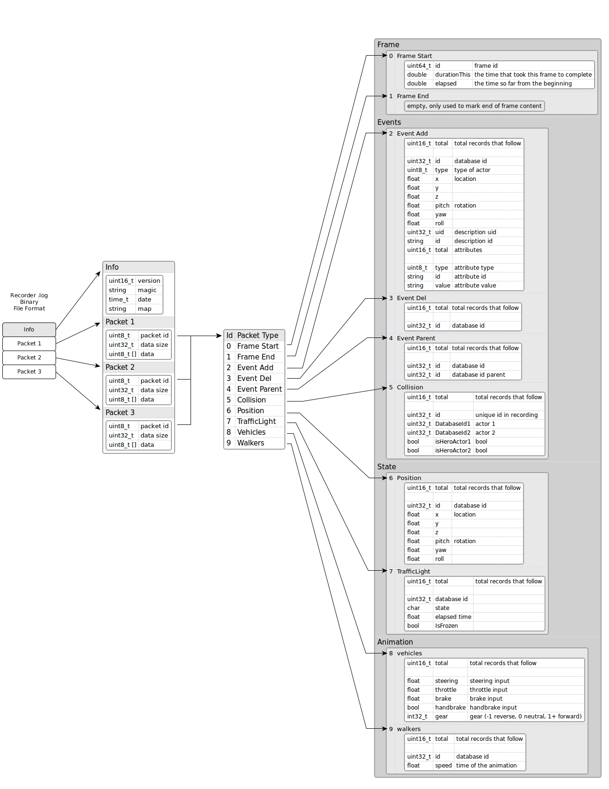
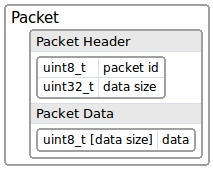
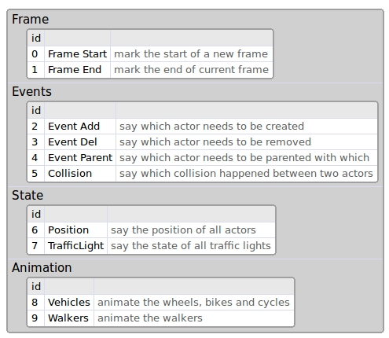
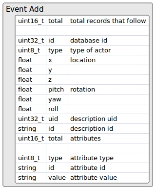
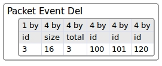
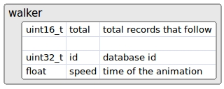
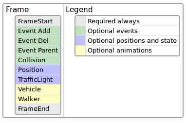
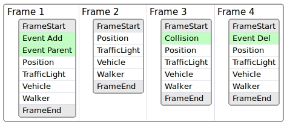

# [记录器二进制文件格式](https://carla.readthedocs.io/en/latest/ref_recorder_binary_file_format/) 

记录器系统将重放仿真所需的所有信息保存在二进制文件中，对多字节值使用小端字节顺序。

*   [__1- 二进制字符串__](#1-strings-in-binary)  
*   [__2- 信息头__](#2-info-header)  
*   [__3- 数据包__](#3-packets)  
	*   [数据包 0 - 帧开始](#packet-0-frame-start)  
	*   [数据包 1 - 帧结束](#packet-1-frame-end)  
	*   [数据包 2 - 事件添加](#packet-2-event-add)  
	*   [数据包 3 - 事件删除](#packet-3-event-del)  
	*   [数据包 4 - 事件父级](#packet-4-event-parent)  
	*   [数据包 5 - 事件冲突](#packet-5-event-collision)  
	*   [数据包 6 - 位置](#packet-6-position)  
	*   [数据包 7 - 交通灯](#packet-7-trafficlight)  
	*   [数据包 8 - 车辆动画](#packet-8-vehicle-animation)  
	*   [数据包 9 - 行人动画](#packet-9-walker-animation)  
*   [__4- 帧布局__](#4-frame-layout)  
*   [__5- 文件布局__](#5-file-layout)  

在下一张代表文件格式的图像中，我们可以快速查看所有详细信息。图像中可视化的每个部分将在以下部分中进行解释：

总之，该文件格式有一个小头，其中包含一般信息（版本、魔术字符串、日期和使用的地图）和不同类型的数据包集合（目前我们使用 10 种类型，但将来会继续增长） 。

---
## 1- 二进制字符串

字符串首先使用其长度进行编码，然后是其字符（不以空字符结尾）。例如，字符串“Town06”将保存为十六进制值：06 00 54 6f 77 6e 30 36

---
## 2- 信息头

信息标头包含有关录制文件的一般信息。基本上，它包含版本和一个魔术字符串，用于将该文件标识为记录器文件。如果标题发生变化，那么版本也会发生变化。此外，它还包含一个日期时间戳，以及从 1900 年开始的秒数，并且还包含一个字符串，其中包含用于记录的地图名称。

示例信息头是：

---
## 3- 数据包

每个数据包以两个字段（5 个字节）的小标头开头：

* **id**: 数据包类型
* **size**: 数据包数据的大小

头信息后面跟着**数据**。数据是可选的，**大小**为 0 表示数据包中没有**数据**。如果**大小**大于 0，则表示数据包有**数据**字节。因此，需要根据数据包的类型重新解释**数据**。

数据包的头很有用，因为我们可以在播放时忽略那些我们不感兴趣的数据包。我们只需要读取数据包的头（前 5 个字节）并跳过数据包的数据跳转到下一个数据包：

数据包的类型有：

我们建议用户自定义数据包使用超过 100 的 **id**，因为这个列表将来会不断增长。

### 数据包 0 - 帧开始

该数据包标记新帧的开始，并且它将是开始每个帧的第一个数据包。所有数据包都需要放置在**Frame Start**和**Frame End**之间。

因此，经过时间 + 持续时间 = 下一帧经过的时间。

### 数据包 1 - 帧结束

该帧没有数据，仅标记当前帧的结束。这有助于重放器在新一帧开始之前知道每一帧的结束。通常，下一帧应该是帧起始数据包以开始新帧。

### 数据包 2 - 事件添加

这个数据包说明了我们需要在当前帧创建多少个参与者。

字段**总计**表示后面有多少条记录。每条记录都以**id**字段开头，即参与者在录制时所拥有的 id（在播放时，该 id 可以在内部更改，但我们需要使用此 id ）。参与者的**类型**可以有以下可能的值：

  * 0 = 其他
  * 1 = 车辆
  * 2 = 行人
  * 3 = 交通灯
  * 4 = 无效

之后，继续我们想要创建参与者的**位置**和**旋转**。

在我们得到参与者的描述之后。描述 **uid** 是描述的数字 ID，而 **id** 是文本 ID，例如"vehicle.seat.leon"。

然后是其**属性**的集合，例如颜色、轮子数量、角色等。属性的数量是可变的，应该类似于以下内容：

* number_of_wheels = 4
* sticky_control = true
* color = 79,33,85
* role_name = autopilot

### 数据包 3 - 事件删除

这个数据包说明了这一帧需要销毁多少个参与者。

它有记录**总数**，每条记录都有要删除的参与者的ID 。

例如，这个数据包可能是这样的：

数字 3 将数据包标识为事件删除。数字 16 是数据包数据的大小（4 个字段，每个字段 4 字节）。因此，如果我们不想处理这个数据包，我们可以跳过接下来的 16 个字节，直接进入下一个数据包的开头。接下来的 3 表示后面的总记录，每条记录都是要删除的参与者的 id。因此，我们需要在这一帧中删除参与者 100、101 和 120。

### 数据包 4 - 事件父级

该数据包说明哪个参与者是另一个参与者（父母）的孩子。

The first id is the child actor, and the second one will be the parent actor.

### 数据包 5 - Event Collision

If a collision happens between two actors, it will be registered in this packet. Currently only
actors with a collision sensor will report collisions, so currently only hero vehicles have that
sensor attached automatically.

The **id** is just a sequence to identify each collision internally.
Several collisions between the same pair of actors can happen in the same frame, because physics
frame rate is fixed and usually there are several physics substeps in the same rendered frame.

### 数据包 6 - Position

This packet records the position and orientation of all actors of type **vehicle** and
**walker** that exist in the scene.

### 数据包 7 - TrafficLight

This packet records the state of all **traffic lights** in the scene. Which means that it
stores the state (red, orange or green) and the time it is waiting to change to a new state.

### 数据包 8 - Vehicle animation

This packet records the animation of the vehicles, bikes and cycles. This packet stores the
**throttle**, **sterring**, **brake**, **handbrake** and **gear** inputs, and then set them at playback.

### 数据包 9 - Walker animation

This packet records the animation of the walker. It just saves the **speed** of the walker
that is used in the animation.

---
## 4- Frame Layout

A frame consists of several packets, where all of them are optional, except the ones that
have the **start** and **end** in that frame, that must be there always.

**Event** packets exist only in the frame where they happen.

**Position** and **traffic light** packets should exist in all frames, because they are
required to move all actors and set the traffic lights to its state.
They are optional but if they are not present then the replayer will not be able to move
or set the state of traffic lights.

The **animation** packets are also optional, but by default they are recorded. That way the walkers
are animated and also the vehicle wheels follow the direction of the vehicles.

---
## 5- File Layout

The layout of the file starts with the **info header** and then follows a collection of packets in
groups. The first in each group is the **Frame Start** packet, and the last in the group is
the **Frame End** packet. In between, we can find the rest of packets as well.

Usually, it is a good idea to have all packets regarding events first, and then the packets
regarding position and state later.

The event packets are optional, since they appear when they happen, so we could have a layout
like this one:

In **frame 1** some actors are created and reparented, so we can observe its events in the image.
In **frame 2** there are no events. In **frame 3** some actors have collided so the collision event
appears with that info. In **frame 4** the actors are destroyed.
