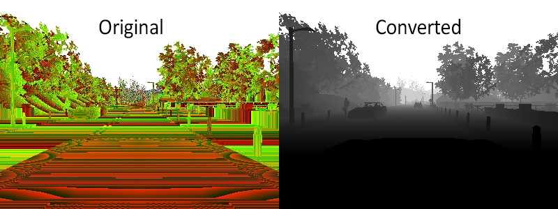
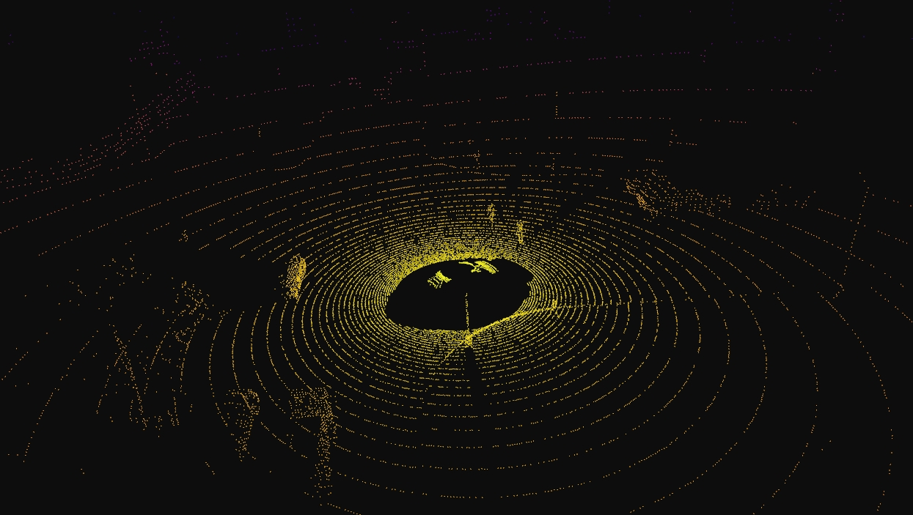
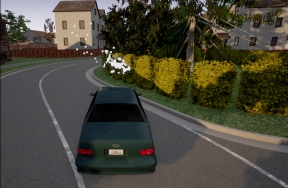
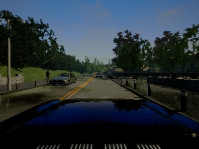
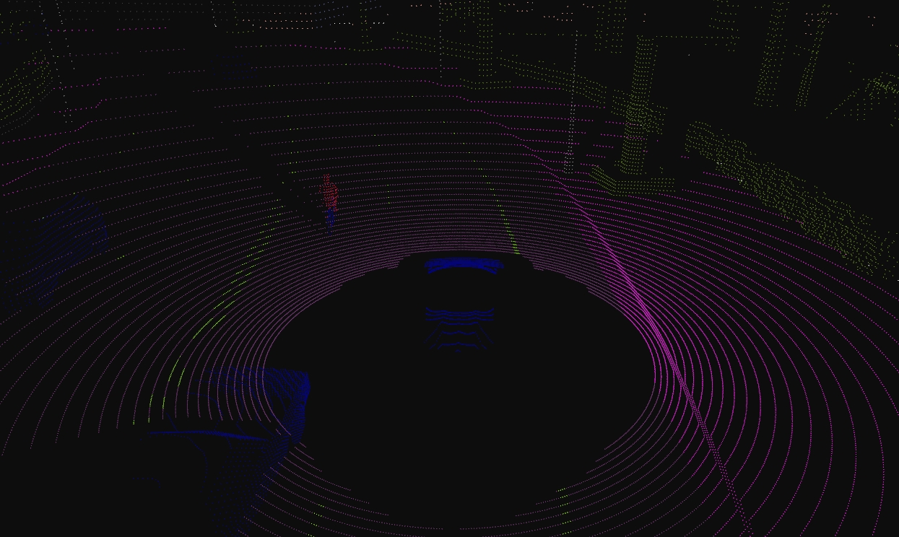
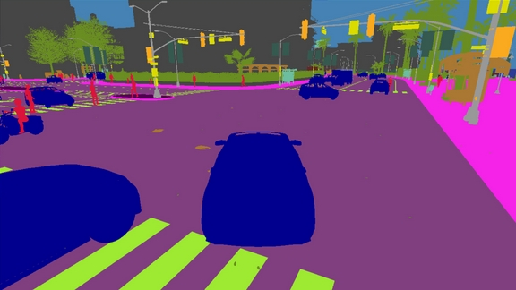
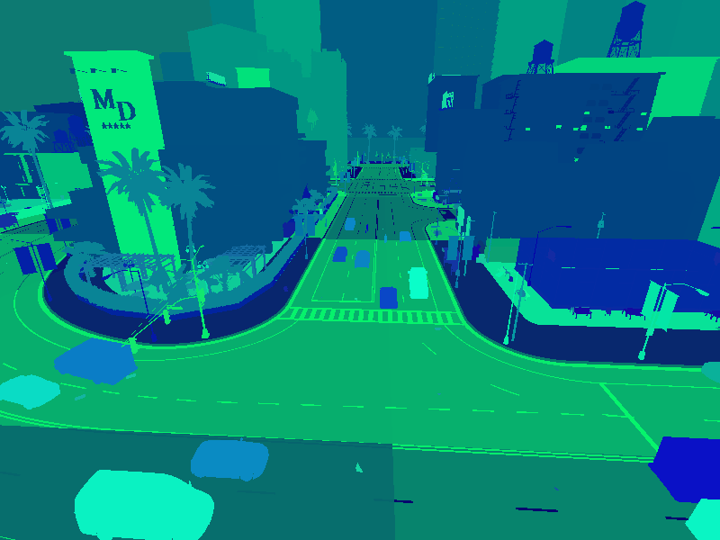
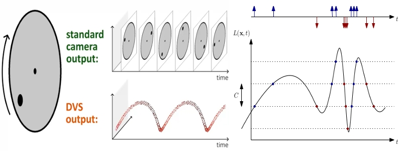
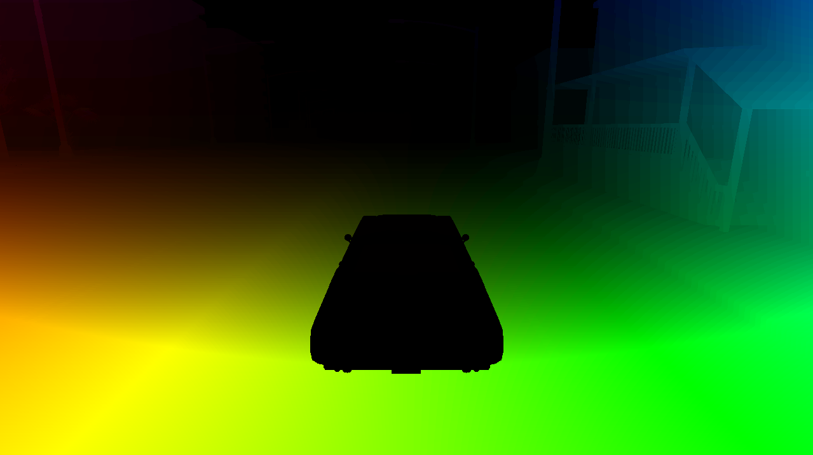

# [传感器参考](https://carla.readthedocs.io/en/latest/ref_sensors/) 

- [__碰撞检测器__](#collision-detector)
- [__深度相机__](#depth-camera)
- [__全球导航卫星系统传感器__](#gnss-sensor)
- [__惯性测量单元传感器__](#imu-sensor)
- [__压线检测器__](#lane-invasion-detector)
- [__激光雷达传感器__](#lidar-sensor)
- [__障碍物检测器__](#obstacle-detector)
- [__雷达传感器__](#radar-sensor)
- [__RGB相机__](#rgb-camera)
- [__责任敏感安全传感器__](#rss-sensor)
- [__语义激光雷达传感器__](#semantic-lidar-sensor)
- [__语义分割相机__](#semantic-segmentation-camera)
- [__实例分割相机__](#instance-segmentation-camera)
- [__动态视觉传感器相机__](#dvs-camera)
- [__光流相机__](#optical-flow-camera)
- [__鱼眼相机__](#fisheye-camera)
- [__V2X 传感器__](#v2x-sensor)
    - [协同感知](#cooperative-awareness-message)
    - [自定义消息](#custom-v2x-message)

!!! 重要
    所有传感器都使用虚幻引擎坐标系（__x__ - *向前*，__y__ - *向右*，__z__ - *向上*），并返回本地空间中的坐标。使用任何可视化软件时，请注意其坐标系。许多反转 Y 轴，因此直接可视化传感器数据可能会导致镜像输出。

---
## 碰撞检测器 <span id="collision-detector"></span>

* __蓝图：__ sensor.other.collision
* __输出：__ 每次碰撞的 [carla.CollisionEvent](python_api.md#carla.CollisionEvent) 。

每当其父参与者与世界上的某些物体发生碰撞时，该传感器都会记录一个事件。每个碰撞传感器每帧每次碰撞都会产生一个碰撞事件。通过与多个其他参与者的碰撞，可以在单个帧中产生多个碰撞事件。为了确保检测到与任何类型的对象的碰撞，服务器为建筑物或灌木丛等元素创建“假”参与者，以便可以检索语义标签来识别它。

碰撞检测器没有任何可配置的属性。

#### 输出属性

| 传感器数据属性            | 类型  | 描述                                                  |
| ----------------------- | ----------------------- |-----------------------------------------------------|
| `frame`            | int   | 进行测量时的帧编号。                                          |
| `timestamp`        | double | 自回合开始以来测量的模拟时间（以秒为单位）。                              |
| `transform`        | [carla.Transform](<../python_api#carlatransform>)  | 测量时传感器在世界坐标中的位置和旋转。                                 |
| `actor`            | [carla.Actor](<../python_api#carlaactor>)    | 测量碰撞的参与者（传感器的父级）。                                   |
| `other_actor`      | [carla.Actor](<../python_api#carlaactor>)    | 与父级相撞的参与者。 |
| `normal_impulse`     | [carla.Vector3D](<../python_api#carlavector3d>)    | 碰撞的正常脉冲结果。             |


---
## 深度相机 <span id="depth-camera"></span>

* __蓝图：__ sensor.camera.depth
* __输出：__ 每步的图像 [carla.Image](python_api.md#carla.Image) （除非`sensor_tick`另有说明）。

相机提供场景的原始数据，编码每个像素到相机的距离（也称为**深度缓冲区**或 **z 缓冲区**）以创建元素的深度图。

该图像使用 RGB 颜色空间的 3 个通道（从低字节到高字节）对每个像素的深度值进行编码：_R -> G -> B_。以米为单位的实际距离可以通过以下方式解码：

```
normalized = (R + G * 256 + B * 256 * 256) / (256 * 256 * 256 - 1)
in_meters = 1000 * normalized
```

然后，应使用[carla.colorConverter](python_api.md#carla.ColorConverter)将输出[carla.Image](python_api.md#carla.Image)保存到磁盘，该 [carla.colorConverter](python_api.md#carla.ColorConverter) 会将存储在 RGB 通道中的距离转换为包含该距离的 __[0,1]__ 浮点数，然后将其转换为灰度。[carla.colorConverter](python_api.md#carla.ColorConverter) 中有两个选项可获取深度视图：__Depth__ 和 __Logaritmic depth__。两者的精度都是毫米级的，但对数方法可以为更近的物体提供更好的结果。

```py
...
raw_image.save_to_disk("path/to/save/converted/image",carla.Depth)
```





#### 相机基本属性


| 蓝图属性       | 类型    | 默认 | 描述                                                                      |
| ----------------------------- | ----------------------------- | ----------------------------- |-------------------------------------------------------------------------|
| `image_size_x`            | int     | 800     | 图像宽度（以像素为单位）。                                                           |
| `image_size_y`            | int     | 600     | 图像高度（以像素为单位）。                                                           |
| `fov`   | float   | 90\.0   | 水平视野（以度为单位）。                                                            |
| `sensor_tick` | float   | 0\.0    | 传感器捕获之间的模拟秒数（节拍）。 |


#### 相机镜头畸变属性


| 蓝图属性      | 类型         | 默认	      | 描述  |
| ------------------------- | ------------------------- | ------------------------- | ------------------------- |
| `lens_circle_falloff`    | float        | 5\.0         | 范围： [0.0, 10.0]       |
| `lens_circle_multiplier` | float        | 0\.0         | 范围： [0.0, 10.0]       |
| `lens_k`     | float        | \-1.0        | 范围： [-inf, inf]       |
| `lens_kcube` | float        | 0\.0         | 范围： [-inf, inf]       |
| `lens_x_size`            | float        | 0\.08        | 范围： [0.0, 1.0]        |
| `lens_y_size`            | float        | 0\.08        | 范围： [0.0, 1.0]        |


#### 输出属性


| 传感器数据属性            | 类型  | 描述                                                                                       |
| ----------------------- | ----------------------- |------------------------------------------------------------------------------------------|
| `frame`            | int   | 进行测量时的帧编号。                                                                               |
| `timestamp`        | double | 自回合开始以来测量的模拟时间（以秒为单位）。                                                                 |
| `transform`        | [carla.Transform](<../python_api#carlatransform>)  | 测量时传感器在世界坐标中的位置和旋转。 |
| `width`            | int   | 图像宽度（以像素为单位）。                                                                   |
| `height`           | int   | 图像高度（以像素为单位）。                                                                  |
| `fov` | float | 水平视野（以度为单位）。                                                     |
| `raw_data`         | bytes | BGRA 32 位像素阵列。                                                             |


---
## 全球导航卫星系统传感器 <span id="gnss-sensor"></span>

* __蓝图：__ sensor.other.gnss
* __Output:__ 每一步的全球导航卫星系统的测量 [carla.GNSSMeasurement](python_api.md#carla.GnssMeasurement) （`sensor_tick`另有说明）。

报告其父对象的当前 [gnss 位置](https://www.gsa.europa.eu/european-gnss/what-gnss) 。这是通过将度量位置添加到 OpenDRIVE 地图定义中定义的初始地理参考位置来计算的。


#### 全球导航卫星系统属性


| 蓝图属性      | 类型   | 默认            | 描述                   |
| ------------------- | ------------------- | ------------------- |----------------------|
| `noise_alt_bias`   | float  | 0\.0   | 海拔高度噪声模型中的平均参数。      |
| `noise_alt_stddev` | float  | 0\.0   | 海拔高度噪声模型中的标准偏差参数。    |
| `noise_lat_bias`   | float  | 0\.0   | 纬度噪声模型中的平均参数。        |
| `noise_lat_stddev` | float  | 0\.0   | 纬度噪声模型中的标准偏差参数。      |
| `noise_lon_bias`   | float  | 0\.0   | 经度噪声模型中的平均参数。        |
| `noise_lon_stddev` | float  | 0\.0   | 经度噪声模型中的标准偏差参数。      |
| `noise_seed`       | int    | 0      | 伪随机数生成器的初始化程序。       |
| `sensor_tick`      | float  | 0\.0   | 传感器捕获之间的模拟秒数（节拍）。 |

<br>

#### 输出属性


| 传感器数据属性            | 类型  | 描述                     |
| ----------------------- | ----------------------- |------------------------|
| `frame`            | int   | 进行测量时的帧编号。             |
| `timestamp`        | double | 自回合开始以来测量的模拟时间（以秒为单位）。 |
| `transform`        | [carla.Transform](<../python_api#carlatransform>)  | 测量时传感器在世界坐标中的位置和旋转。    |
| `latitude`         | double | 参与者的纬度。                |
| `longitude`        | double | 参与者的经度。                |
| `altitude`         | double | 参与者的海拔高度。              |


---
## [惯性测量单元传感器](https://github.com/carla-simulator/carla/blob/dev/Unreal/CarlaUE4/Plugins/Carla/Source/Carla/Sensor/InertialMeasurementUnit.cpp) <span id="imu-sensor"></span>

* __蓝图：__ sensor.other.imu
* __输出：__ 每一步的惯性测量单元测量值 [carla.IMUMeasurement](python_api.md#carla.IMUMeasurement) （除非传感器节拍`sensor_tick`另有说明）。

提供加速度计、陀螺仪和指南针将为父对象检索的测量值。数据是从对象的当前状态收集的。

#### 惯性测量单元属性


| 蓝图属性 | 类型    | 默认             | 描述                    |
| -------------------------------- | -------------------------------- | -------------------------------- |-----------------------|
| `noise_accel_stddev_x`          | float   | 0\.0    | 加速度（X 轴）噪声模型中的标准偏差参数。 |
| `noise_accel_stddev_y`          | float   | 0\.0    | 加速度（Y 轴）噪声模型中的标准偏差参数。 |
| `noise_accel_stddev_z`          | float   | 0\.0    | 加速度（Z 轴）噪声模型中的标准偏差参数。 |
| `noise_gyro_bias_x` | float   | 0\.0    | 陀螺仪噪声模型中的平均参数（X 轴）。   |
| `noise_gyro_bias_y` | float   | 0\.0    | 陀螺仪噪声模型中的平均参数（Y 轴）。   |
| `noise_gyro_bias_z` | float   | 0\.0    | 陀螺仪噪声模型中的平均参数（Z 轴）。   |
| `noise_gyro_stddev_x`           | float   | 0\.0    | 陀螺仪噪声模型中的标准偏差参数（X 轴）。 |
| `noise_gyro_stddev_y`           | float   | 0\.0    | 陀螺仪噪声模型中的标准偏差参数（Y 轴）。 |
| `noise_gyro_stddev_z`           | float   | 0\.0    | 陀螺仪噪声模型中的标准偏差参数（Z 轴）。 |
| `noise_seed`        | int     | 0       | 伪随机数生成器的初始化程序。        |
| `sensor_tick`       | float   | 0\.0    | 传感器捕获之间的模拟秒数（节拍）。  |

<br>

#### 输出属性

| 传感器数据属性                                                                                                                                                 | 类型  | 描述                                       |
|---------------------------------------------------------------------------------------------------------------------------------------------------------| ----------------------- |------------------------------------------|
| `frame`                                                                                                                                                 | int   | 进行测量时的帧编号。                               |
| `timestamp`                                                                                                                                             | double | 自回合开始以来测量的模拟时间（以秒为单位）。                   |
| `transform`                                                                                                                                             | [carla.Transform](<../python_api#carlatransform>)  | 测量时传感器在世界坐标中的位置和旋转。                      |
| [`accelerometer`](https://github.com/carla-simulator/carla/blob/dev/Unreal/CarlaUE4/Plugins/Carla/Source/Carla/Sensor/InertialMeasurementUnit.cpp#L102) | [carla.Vector3D](<../python_api#carlavector3d>)    | 测量线性加速度（以 `m/s^2` 为单位）。                  |
| [`gyroscope`](https://github.com/carla-simulator/carla/blob/dev/Unreal/CarlaUE4/Plugins/Carla/Source/Carla/Sensor/InertialMeasurementUnit.cpp#L147)     | [carla.Vector3D](<../python_api#carlavector3d>)    | 测量角速度（以 `rad/sec` 为单位）。                  |
| [`compass`](https://github.com/carla-simulator/carla/blob/dev/Unreal/CarlaUE4/Plugins/Carla/Source/Carla/Sensor/InertialMeasurementUnit.cpp#L167)                                                                                                                                            | float | 以弧度为单位的方向。北是0弧度。 |

* 加速度计算方法：
$$ d_2 (i) = -2.0 \times [ { y_1 \over {h_1 \times h_2 } }  -  { y_2 \over { h_2 \times (h_1+h_2) } }  -  {y_0 \over { h_1 \times (h_1 + h_2) }} ] .$$

其中，\(h_1\) 为当前时间增量，\(h_2\)为前一个时间增量。

!!! 注意
     对于指南针，北为 0 弧度。东为 *pi* /2 弧度，南为 *pi* 弧度，西为 3 *pi* /2 弧度。在 Carla 的全局坐标系中，北为 Y 轴减小的方向。东为 X 轴增加的方向。转换为度数的指南针值等于 `90 - 偏航`。 

---
## 压线检测器 <span id="lane-invasion-detector"></span>

* __蓝图：__ sensor.other.lane_invasion
* __输出：__ 每次交叉路口的 [carla.LaneInvasionEvent](python_api.md#carla.LaneInvasionEvent) 。


每次其父级穿过车道标记时都会注册一个事件。传感器使用地图的 OpenDRIVE 描述提供的道路数据，通过考虑车轮之间的空间来确定主车辆是否正在侵入另一车道。然而，有一些事情需要考虑：

* OpenDRIVE 文件和地图之间的差异将导致不规则现象，例如在地图中不可见的交叉车道。
* 输出检索交叉车道标记列表：计算在 OpenDRIVE 中完成，并将四个车轮之间的整个空间视为一个整体。因此，可能有不止一条车道同时穿过。

该传感器没有任何可配置属性。

!!! 重要
    该传感器完全在客户端工作。

#### 输出属性

| 传感器数据属性            | 类型  | 描述                                            |
| ----------------------- | ----------------------- |-----------------------------------------------|
| `frame`            | int   | 进行测量时的帧编号。                                    |
| `timestamp`        | double | 自回合开始以来测量的模拟时间（以秒为单位）。                        |
| `transform`        | [carla.Transform](<../python_api#carlatransform>)  | 测量时传感器在世界坐标中的位置和旋转。                           |
| `actor`            | [carla.Actor](<../python_api#carlaactor>)    | 侵入另一车道的车辆（父参与者）。                            |
| `crossed_lane_markings`          | list([carla.LaneMarking](<../python_api#carlalanemarking>))      | 已穿越的车道标记列表。 |


---
## 激光雷达传感器 <span id="lidar-sensor"></span>

* __蓝图：__ sensor.lidar.ray_cast
* __输出：__ 每一步 [carla.LidarMeasurement](python_api.md#carla.LidarMeasurement) （除非`sensor_tick` 另有说明）。

激光雷达测量包含一个包，其中包含在某个时间间隔内生成的所有点1/FPS。在此间隔期间，物理不会更新，因此测量中的所有点都反映场景的相同“静态图片”。
`points_per_channel_each_step = points_per_second / (FPS * channels)`

此输出包含模拟点云，因此可以对其进行迭代以检索它们的列表 [`carla.Location`](python_api.md#carla.Location)：

```py
for location in lidar_measurement:
    print(location)
```

激光雷达测量的信息被编码为 4D 点。前三个是 xyz 坐标中的空间点，最后一个是旅行过程中的强度损失。该强度通过以下公式计算。
<br>


`a` — 衰减系数。这可能取决于传感器的波长和大气条件。可以使用激光雷达属性对其进行修改`atmosphere_attenuation_rate`。 
`d` — 从击中点到传感器的距离

为了获得更好的真实感，可以删除云中的点。这是模拟外部扰动造成的损失的简单方法。这可以结合两个不同的来完成。

*   __General drop-off__ — 随机掉落的分数比例。这是在跟踪之前完成的，这意味着不会计算被丢弃的点，从而提高性能。如果是`dropoff_general_rate = 0.5`，则扣掉一半的分数。
*   __Instensity-based drop-off__ — 对于检测到的每个点，根据计算的强度的概率执行额外的下降。该概率由两个参数确定。`dropoff_zero_intensity`是强度为零的点被丢弃的概率。`dropoff_intensity_limit`是阈值强度，超过该阈值将不会掉落任何分数。范围内的点被丢弃的概率是基于这两个参数的线性比例。

此外，该`noise_stddev`属性还使噪声模型能够模拟现实传感器中出现的意外偏差。对于正值，每个点都会沿着激光射线的矢量随机扰动。结果是激光雷达传感器具有完美的角度定位，但距离测量存在噪音。

可以调整激光雷达的旋转以覆盖每个模拟步骤的特定角度（使用 [固定的时间步长](adv_synchrony_timestep.md) ）。例如，每步旋转一次（整圈输出，如下图），旋转频率和模拟的 FPS 应该相等。 <br> __1.__ 设置传感器的频率 `sensors_bp['lidar'][0].set_attribute('rotation_frequency','10')`. <br> __2.__ 使用 `python3 config.py --fps=10` 运行模拟。



#### 激光雷达属性


| 蓝图属性  | 类型   | 默认    | 描述                                                                                           |
| ----------------------------------------------------------------- | --------------------------------------------------------------- | ----------------------------------------------------------------- |----------------------------------------------------------------------------------------------|
| `channels`         | int    | 32     | 激光器数量。                                                                                       |
| `range`            | float  | 10.0  | 测量/光线投射的最大距离以米为单位（Carla 0.9.6 或更低版本为厘米）。                                                     |
| `points_per_second` | int    | 56000  | 所有激光器每秒生成的点。                                                                                 |
| `rotation_frequency`            | float  | 10.0  | 激光雷达旋转频率。                                                                                    |
| `upper_fov`        | float  | 10.0  | 最高激光的角度（以度为单位）。                                                                              |
| `lower_fov`        | float  | -30.0 | 最低激光的角度（以度为单位）。                                                                              |
| `horizontal_fov`   | float | 360.0 | 水平视野（以度为单位），0 - 360。                                                                         |
| `atmosphere_attenuation_rate`     | float  | 0.004 | 测量每米激光雷达强度损失的系数。检查上面的强度计算。 |
| `dropoff_general_rate`          | float  | 0.45  | 随机丢弃的点的一般比例。                                                                                 |
| `dropoff_intensity_limit`       | float  | 0.8   | 对于基于强度的下降，高于该阈值的强度值没有任何点被下降。                                                                 |
| `dropoff_zero_intensity`        | float  | 0.4   | 对于基于强度的下降，每个强度为零的点被下降的概率。                                                                    |
| `sensor_tick`      | float  | 0.0   | 传感器捕获之间的模拟秒数（节拍）。                                                                          |
| `noise_stddev`     | float  | 0.0   | 噪声模型的标准偏差，用于干扰沿其光线投射矢量的每个点。 |


#### 输出属性

| 传感器数据属性            | 类型  | 描述                                                |
| ----------------------- | ----------------------- |---------------------------------------------------|
| `frame`            | int   | 进行测量时的帧编号。                                        |
| `timestamp`        | double | 自回合开始以来测量的模拟时间（以秒为单位）。                            |
| `transform`        | [carla.Transform](<../python_api#carlatransform>)  | 测量时传感器在世界坐标中的位置和旋转。                               |
| `horizontal_angle`   | float | 当前帧中激光雷达的 XY 平面中的角度（弧度）。                          |
| `channels`         | int   | 激光雷达的通道（激光器）数量。                                  |
| `get_point_count(channel)`       | int   | 每个通道捕获此帧的点数。 |
| `raw_data`         | bytes | 32 位浮点数组（每个点的 XYZI）。     |


<br>

## 障碍物检测器 <span id="obstacle-detector"></span>

* __蓝图：__ sensor.other.obstacle
* __输出：__ 每个障碍物的 [carla.ObstacleDetectionEvent](python_api.md#carla.ObstacleDetectionEvent) （除非`sensor_tick`另有说明）。

每当父级参与者前方有障碍时，都会注册一个事件。为了预测障碍物，传感器在母车前方创建一个胶囊形状，并用它来检查碰撞。为了确保检测到与任何类型的对象的碰撞，服务器为建筑物或灌木丛等元素创建“假”参与者，以便可以检索语义标签来识别它。


| 蓝图属性          | 类型       | 默认    | 描述                                                                     |
| -------------------------------- | -------------------------------- | -------------------------------- |------------------------------------------------------------------------|
| `distance` | float      | 5          | 轨迹距离。                                                                  |
| `hit_radius`     | float      | 0\.5       | 轨迹的半径。                                                                 |
| `only_dynamics`  | bool       | False      | 如果为 true，则轨迹将仅考虑动态对象。                                                  |
| `debug_linetrace` | bool       | False      | 如果为 true，则轨迹将可见。                                                       |
| `sensor_tick`    | float      | 0\.0       | 传感器捕获之间的模拟秒数（节拍）。 |

<br>

#### 输出属性

| 传感器数据属性            | 类型  | 描述                                                    |
| ----------------------- | ----------------------- |-------------------------------------------------------|
| `frame`            | int   | 进行测量时的帧编号。                                            |
| `timestamp`        | double | 自回车开始以来测量的模拟时间（以秒为单位）。                                |
| `transform`        | [carla.Transform](<../python_api#carlatransform>)  | 测量时传感器在世界坐标中的位置和旋转。                                   |
| `actor`            | [carla.Actor](<../python_api#carlaactor>)    | 检测到障碍物的参与者（父级参与者）。                                    |
| `other_actor`      | [carla.Actor](<../python_api#carlaactor>)    | 参与者被检测为障碍物。                                           |
| `distance`         | float | 从参与者 `actor` 到其他参与者 `other_actor` 的距离。 |


<br>

## 雷达传感器 <span id="radar-sensor"></span>

* __蓝图：__ sensor.other.radar
* __输出：__ 每一步 [carla.RadarMeasurement](python_api.md#carla.RadarMeasurement) （除非`sensor_tick`另有说明）。

传感器创建一个圆锥视图，该视图被转换为视野中的元素及其相对于传感器的速度的二维点图。这可用于塑造元素并评估它们的运动和方向。由于使用极坐标，这些点将集中在视图中心周围。

测量的点作为[carla.RadarDetection](python_api.md#carla.RadarDetection)数组包含在[carla.RadarMeasurement](python_api.md#carla.RadarMeasurement)中，该数组指定它们的极坐标、距离和速度。雷达传感器提供的原始数据可以轻松转换为 __numpy__ 可管理的格式：
```py
# 为了获得 numpy [[vel, azimuth, altitude, depth],...[,,,]]:
points = np.frombuffer(radar_data.raw_data, dtype=np.dtype('f4'))
points = np.reshape(points, (len(radar_data), 4))
```

提供的脚本`manual_control.py`使用此传感器来显示正在检测的点，并在静态时将其绘制为白色，在向物体移动时将其绘制为红色，在远离物体时将其绘制为蓝色：



| 蓝图属性       | 类型    | 默认 | 描述                                 |
| ----------------------------- | ----------------------------- | ----------------------------- |------------------------------------|
| `horizontal_fov`          | float   | 30\.0   | 水平视野（以度为单位）。                       |
| `points_per_second`       | int     | 1500    | 所有激光器每秒生成的点。                       |
| `range` | float   | 100     | 测量/光线投射的最大距离（以米为单位）。               |
| `sensor_tick` | float   | 0\.0    | 传感器捕获之间的模拟秒数（节拍）。               |
| `vertical_fov`            | float   | 30\.0   | 垂直视野（以度为单位）。 |

<br>

#### 输出属性

| 传感器数据属性 | 类型            | 描述     |
| ---------------- | ---------------- | ---------------- |
| `raw_data`      | [carla.RadarDetection](<../python_api#carlaradardetection>) | 检测到的点列表。      |

<br>

| RadarDetection 属性 | 类型    | 描述      |
|-------------------|-------| ---------------------------- |
| `altitude`        | float | 	以弧度表示的高度角。   |
| `azimuth`         | float | 方位角（以弧度表示）。    |
| `depth`           | float | 距离以米为单位。         |
| `velocity`        | float | 朝向传感器的速度。 |


---
## RGB 相机 <span id="rgb-camera"></span>

* __蓝图：__ sensor.camera.rgb
* __输出：__ 每一步 [carla.Image](python_api.md#carla.Image) （除非`sensor_tick`另有说明）。

“RGB”相机充当捕获场景图像的常规相机。
[carla.colorConverter](python_api.md#carla.ColorConverter)

如果 `enable_postprocess_effects` 启用，为了真实感，一组后处理效果将应用于图像：

* __Vignette:__ 使屏幕边框变暗。
* __Grain jitter:__ 为渲染添加一些噪点。
* __Bloom:__ 强烈的光线会灼烧它们周围的区域。
* __Auto exposure:__ 修改图像伽玛以模拟眼睛对较暗或较亮区域的适应。
* __Lens flares:__ 模拟明亮物体在镜头上的反射。
* __Depth of field:__ 模糊靠近或远离相机的物体。


`sensor_tick`告诉我们希望传感器捕获数据的速度有多快。值为 1.5 意味着我们希望传感器每半秒捕获一次数据。默认情况下，值 0.0 表示尽可能快。



其实现原理参考 [视觉传感器器系列实现原理分析](./sensor/camera_analysis.md) 。

#### 相机基本属性


<br>

| 蓝图属性  | 类型     | 默认  | 描述                                                                      |
| ----------------------------------------------------- | ----------------------------------------------------- | ----------------------------------------------------- |-------------------------------------------------------------------------|
| `bloom_intensity`    | float    | 0\.675   | 光晕后处理效果的强度，`0.0`用于禁用它。                                                  |
| `fov`    | float    | 90\.0    | 水平视野（以度为单位）。                                                            |
| `fstop`  | float    | 1\.4     | 相机镜头的打开。典型镜头的光圈`1/fstop`为 f/1.2（更大的光圈）。较大的数字将减少景深效果。                    |
| `image_size_x`       | int      | 800      | 图像宽度（以像素为单位）。                                                           |
| `image_size_y`       | int      | 600      | 图像高度（以像素为单位）。                                                           |
| `iso`    | float    | 100\.0   | 相机传感器的灵敏度。                                                              |
| `gamma`  | float    | 2\.2     | 相机的目标伽玛值。                                                               |
| `lens_flare_intensity`           | float    | 0\.1     | 镜头眩光后处理效果的强度，`0.0`用于禁用它。                                                |
| `sensor_tick`        | float    | 0\.0     | 传感器捕获之间的模拟秒数（节拍）。 |
| `shutter_speed`      | float    | 200\.0   | 相机快门速度，以秒为单位 (1.0/s)。                            |


#### 相机镜头畸变属性


<br>

| 蓝图属性      | 类型         | 默认      | 描述  |
| ------------------------------------------------------- | ------------------------------------------------------- | ------------------------------------------------------- | ------------------------------------------------------- |
| `lens_circle_falloff`    | float        | 5\.0         | 范围： [0.0, 10.0]       |
| `lens_circle_multiplier` | float        | 0\.0         | 范围： [0.0, 10.0]       |
| `lens_k`     | float        | \-1.0        | 范围： [-inf, inf]       |
| `lens_kcube` | float        | 0\.0         | 范围： [-inf, inf]       |
| `lens_x_size`            | float        | 0\.08        | 范围： [0.0, 1.0]        |
| `lens_y_size`            | float        | 0\.08        | 范围： [0.0, 1.0]        |


#### 高级相机属性

由于这些效果是由虚幻引擎提供的，请务必检查他们的文档：

  * [自动曝光][AutomaticExposure.Docs]
  * [影视级景深方案][CinematicDOFMethod.Docs]
  * [颜色分级和电影色调映射器][ColorGrading.Docs]

[AutomaticExposure.Docs]: https://docs.unrealengine.com/en-US/Engine/Rendering/PostProcessEffects/AutomaticExposure/index.html
[CinematicDOFMethod.Docs]: https://docs.unrealengine.com/en-US/Engine/Rendering/PostProcessEffects/DepthOfField/CinematicDOFMethods/index.html
[ColorGrading.Docs]: https://docs.unrealengine.com/en-US/Engine/Rendering/PostProcessEffects/ColorGrading/index.html

| 蓝图属性  | 类型           | 默认        | 描述                                                                                                                                                    |
| ------------------------------------------------------------- | ------------------------------------------------------------- | ------------------------------------------------------------- |-------------------------------------------------------------------------------------------------------------------------------------------------------|
| `min_fstop`    | float          | 1\.2           | 最大光圈。                                                                                                                                                 |
| `blade_count`  | int            | 5  | 构成隔膜机构的叶片数量。                                                                                                                                          |
| `exposure_mode`      | str            | `histogram`    | 可以是 `manual` 或or `histogram`。更多内容请参见[UE4 文档](<https://docs.unrealengine.com/en-US/Engine/Rendering/PostProcessEffects/AutomaticExposure/index.html>)。 |
| `exposure_compensation`          | float          | **Linux:** \+0.75<br>**Windows:** 0\.0        | 曝光的对数调整。0：无调整，-1：2 倍更暗，-2：4 更暗，1：2 倍更亮，2：4 倍更亮。                                                                                                       |
| `exposure_min_bright`            | float          | 10\.0           | 在`exposure_mode: "histogram"`。自动曝光的最低亮度。眼睛能适应的最低限度。必须大于 0 且小于或等于`exposure_max_bright`。                                                                |
| `exposure_max_bright`            | float          | 12\.0           | 在\`exposure\_mode: "histogram"\`中。自动曝光的最大亮度。眼睛能适应的最高限度。必须大于 0 且大于或等于 \`exposure\_min\_bright\`。                                                       |
| `exposure_speed_up`  | float          | 3\.0           | 在 `exposure_mode: "histogram"`。。从黑暗环境到明亮环境的适应速度。                                                                                                      |
| `exposure_speed_down`            | float          | 1\.0           | 在 `exposure_mode: "histogram"`。从明亮环境到黑暗环境的适应速度。                                                                                                       |
| `calibration_constant`           | float          | 16\.0          | 18% 反照率的校准常数。                                                                                                                                         |
| `focal_distance`     | float          | 1000\.0        | 景深效果应清晰的距离。以厘米（虚幻引擎单位）为单位测量。                                                                                                                          |
| `blur_amount`  | float          | 1\.0           | 运动模糊的强度/强度。                                                                                                                                           |
| `blur_radius`  | float          | 0\.0           | 1080p 分辨率下的半径（以像素为单位），根据距相机的距离模拟大气散射。                                                                                                                 |
| `motion_blur_intensity`          | float          | 0\.45          | 运动模糊的强度 [0,1]。                                                                                                                                        |
| `motion_blur_max_distortion`       | float          | 0\.35          | 运动模糊引起的最大失真。屏幕宽度的百分比。                                                                                                                                 |
| `motion_blur_min_object_screen_size`           | float          | 0\.1           | 对于运动模糊，对象必须具有屏幕宽度的百分比，较低的值意味着较少的绘制调用。                                                                                                                 |
| `slope`        | float          | 0\.88          | 色调映射器 S 曲线的陡度。值越大，斜率越陡（越暗）[0.0, 1.0]。                                                                                                                 |
| `toe`          | float          | 0\.55          | 调整色调映射器中的深色 [0.0, 1.0]。                                                                                                                               |
| `shoulder`     | float          | 0\.26          | 调整色调映射器中的明亮颜色 [0.0, 1.0]。                                                                                                                             |
| `black_clip`   | float          | 0\.0           | 不应调整此值。设置交叉发生和黑色色调开始切断其值的位置 [0.0, 1.0]。                                                                                                               |
| `white_clip`   | float          | 0\.04          | 设置交叉发生的位置，并且白色色调开始切断其值。大多数情况下会有细微的变化 [0.0, 1.0]。                                                                                                      |
| `temp`         | float          | 6500\.0        | 白平衡与场景中光线的温度有关。**白光**：当与光温匹配时。**暖光**：当高于场景中的光线时，呈淡黄色。**冷光**：低于光线时。蓝色。                                                                                 |
| `tint`         | float          | 0\.0           | 白平衡温度色调。调整青色和洋红色的颜色范围。这应该与白平衡温度属性一起使用以获得准确的颜色。在某些光温下，颜色可能看起来更黄或更蓝。这可用于平衡最终的颜色，使其看起来更自然。                                                               |
| `chromatic_aberration_intensity`   | float          | 0\.0           | 用于控制色彩偏移的缩放因子，在屏幕边框上更明显。                                                                                                                              |
| `chromatic_aberration_offset`      | float          | 0\.0           | 到发生效果的图像中心的正则化距离。                                                                                                                                  |
| `enable_postprocess_effects`       | bool           | True           | 后处理效果激活。                                                                                                                      |

<br>

[AutomaticExposure.gamesetting]: https://docs.unrealengine.com/en-US/Engine/Rendering/PostProcessEffects/AutomaticExposure/index.html#gamesetting

#### 输出属性

| 传感器数据属性	            | 类型  | 描述                                                                                                        |
| ----------------------- | ----------------------- |-----------------------------------------------------------------------------------------------------------|
| `frame`            | int   | 进行测量时的帧编号。                                                                                                |
| `timestamp`        | double | 自回合开始以来测量的模拟时间（以秒为单位）。 |
| `transform`        | [carla.Transform](<../python_api#carlatransform>)  | 测量时传感器在世界坐标中的位置和旋转。                  |
| `width`            | int   | 图像宽度（以像素为单位）。                                                                                    |
| `height`           | int   | 图像高度（以像素为单位）。                                                                                   |
| `fov` | float | 水平视野（以度为单位）。                                                                      |
| `raw_data`         | bytes | BGRA 32 位像素阵列。                                                                              |


---
## 责任敏感安全传感器 <span id="rss-sensor"></span>

*   __蓝图：__ sensor.other.rss
*   __输出：__ 每一步 [carla.RssResponse](python_api.md#carla.RssResponse) （除非`sensor_tick`另有说明）。

!!! 重要
    强烈建议在阅读本文之前先阅读具体的 [任敏感安全文档](adv_rss.md) ，（自 Carla 0.9.15 起已被弃用）。

该传感器集成了 Carla 中的 [责任敏感安全 C++ 库](https://github.com/intel/ad-rss-lib) 。它在 Carla 中默认被禁用，并且必须显式构建才能使用。

责任敏感安全传感器计算车辆的责任敏感安全状态并检索当前的责任敏感安全响应作为传感器数据。[carla.RssRestrictor](python_api.md#carla.RssRestrictor)将使用此数据来调整[carla.VehicleControl](python_api.md#carla.VehicleControl) ，然后再将其应用于车辆。

这些控制器可以通过*自动驾驶*堆栈或用户输入生成。例如，下面有一段来自 的代码片段`PythonAPI/examples/rss/manual_control_rss.py`，其中在必要时使用责任敏感安全修改用户输入。

__1.__ 检查 __RssSensor__ 是否生成包含限制的有效响应。
__2.__ 收集车辆的当前动态和车辆物理特性。
__3.__ 使用 RssSensor 的响应以及车辆当前的动态和物理特性对车辆控制施加限制。

```py
rss_proper_response = self._world.rss_sensor.proper_response if self._world.rss_sensor and self._world.rss_sensor.response_valid else None
if rss_proper_response:
...
        vehicle_control = self._restrictor.restrict_vehicle_control(
            vehicle_control, rss_proper_response, self._world.rss_sensor.ego_dynamics_on_route, self._vehicle_physics)
```


#### carla.RssSensor 类


该传感器的蓝图没有可修改的属性。但是，它实例化的 [carla.RssSensor](python_api.md#carla.RssSensor) 对象具有 Python API 参考中详细介绍的属性和方法。以下是它们的摘要。

| [carla.RssSensor 变量](<../python_api#carlarsssensor>)     | 类型    | 描述                                                                                                                     |
| ---------------------------------------- | ---------------------------------------- |------------------------------------------------------------------------------------------------------------------------|
| `ego_vehicle_dynamics`    | [ad.rss.world.RssDynamics](<https://intel.github.io/ad-rss-lib/ad_rss/Appendix-ParameterDiscussion/>)  | 应用于自我车辆的责任敏感安全参数                                                                                                       |
| `other_vehicle_dynamics`  | [ad.rss.world.RssDynamics](<https://intel.github.io/ad-rss-lib/ad_rss/Appendix-ParameterDiscussion/>)  | 适用于其他车辆的责任敏感安全参数                                                                                                       |
| `pedestrian_dynamics`     | [ad.rss.world.RssDynamics](<https://intel.github.io/ad-rss-lib/ad_rss/Appendix-ParameterDiscussion/>)  | 适用于行人的责任敏感安全参数                                                                                                         |
| `road_boundaries_mode`    | [carla.RssRoadBoundariesMode](<../python_api#carlarssroadboundariesmode>)      | 启用/禁用 [留在道路上](<https://intel.github.io/ad-rss-lib/ad_rss_map_integration/HandleRoadBoundaries>) 功能。默认为**关闭**。 |

<br>


```py
# rss_sensor.py 代码片段
# 当监听到一个新的carla.RssResponse时，更新 carla.RssSensor
def _on_rss_response(weak_self, response):
...
        self.timestamp = response.timestamp
        self.response_valid = response.response_valid
        self.proper_response = response.proper_response
        self.ego_dynamics_on_route = response.ego_dynamics_on_route
        self.rss_state_snapshot = response.rss_state_snapshot
        self.situation_snapshot = response.situation_snapshot
        self.world_model = response.world_model
```

!!! 警告
    该传感器在客户端完全工作。服务器中没有蓝图。对属性的更改将在调用*listen()* __后__ 生效。

此类中可用的方法与车辆的路线有关。责任敏感安全计算始终基于本车通过道路网络的路线。

传感器允许通过提供一些关键点来控制所考虑的路线，这些关键点可能是[carla.Transform](python_api.md#carla.Transform)中的 [carla.Waypoint](python_api.md#carla.Waypoint)。最好在交叉点之后选择这些点，以强制路线采取所需的转弯。

| [carla.RssSensor 方法](<../python_api#carlarsssensor>)     | 描述       |
| ----------------------------------------- | ----------------------------------------- |
| `routing_targets` | 获取用于路由的当前路由目标列表。       |
| `append_routing_target` | 将附加位置附加到当前路由目标。 |
| `reset_routing_targets` | 删除附加的路由目标。             |
| `drop_route`      | 放弃当前路由并创建一条新路由。 |
| `register_actor_constellation_callback`           | 注册回调来自定义计算。            |
| `set_log_level`   | 设置日志级别。     |
| `set_map_log_level`     | 设置用于地图相关日志的日志级别。     |


<br>

---


```py
# 更新当前路线
self.sensor.reset_routing_targets()
if routing_targets:
    for target in routing_targets:
        self.sensor.append_routing_target(target)
```

!!! 笔记
    如果未定义路由目标，则会创建随机路由。

#### 输出属性

| [carla.RssResponse 属性](<../python_api#carlarssresponse>)           | 类型  | 描述       |
| ------------------------------------- | ------------------------------------- | ------------------------------------- |
| `response_valid`  | bool  | 响应数据的有效性。      |
| `proper_response` | [ad.rss.state.ProperResponse](<https://intel.github.io/ad-rss-lib/doxygen/ad_rss/structad_1_1rss_1_1state_1_1ProperResponse.html>)   | 责任敏感安全为车辆计算的正确响应，包括加速限制。         |
| `rss_state_snapshot`    | [ad.rss.state.RssStateSnapshot](<https://intel.github.io/ad-rss-lib/doxygen/ad_rss/structad_1_1rss_1_1state_1_1RssStateSnapshot.html>)           | 责任敏感安全状态为当前时间点。这是责任敏感安全计算的详细的单独输出。  |
| `situation_snapshot`    | [ad.rss.situation.SituationSnapshot](<https://intel.github.io/ad-rss-lib/doxygen/ad_rss/structad_1_1rss_1_1situation_1_1SituationSnapshot.html>) | 当前时间点的责任敏感安全情况。这是用于 责任敏感安全 计算的经过处理的输入数据。    |
| `world_model`     | [ad.rss.world.WorldModel](<https://intel.github.io/ad-rss-lib/doxygen/ad_rss/structad_1_1rss_1_1world_1_1WorldModel.html>)           | 当前时间点的 责任敏感安全 世界模型。这是 责任敏感安全 计算的输入数据。       |
| `ego_dynamics_on_route` | [carla.RssEgoDynamicsOnRoute](<../python_api#carlarssegodynamicsonroute>)    | 关于路线的当前自我车辆动态。 |


如果注册了 actor_constellation_callback，则会触发以下调用：

1. 默认计算 (`actor_constellation_data.other_actor=None`)
2. 每个参与者的计算

```py
# rss_sensor.py 代码片段
# 注册该函数为 actor_constellation_callback
def _on_actor_constellation_request(self, actor_constellation_data):
    actor_constellation_result = carla.RssActorConstellationResult()
    actor_constellation_result.rss_calculation_mode = ad.rss.map.RssMode.NotRelevant
    actor_constellation_result.restrict_speed_limit_mode = ad.rss.map.RssSceneCreation.RestrictSpeedLimitMode.IncreasedSpeedLimit10
    actor_constellation_result.ego_vehicle_dynamics = self.current_vehicle_parameters
    actor_constellation_result.actor_object_type = ad.rss.world.ObjectType.Invalid
    actor_constellation_result.actor_dynamics = self.current_vehicle_parameters

    actor_id = -1
    actor_type_id = "none"
    if actor_constellation_data.other_actor != None:
        # 为特定的参与者定制 actor_constellation_result
        ...
    else:
        # 默认
        ...
    return actor_constellation_result
```


---
## 语义激光雷达传感器 <span id="semantic-lidar-sensor"></span>

* __蓝图：__ sensor.lidar.ray_cast_semantic
* __输出：__ 每步 [carla.SemanticLidarMeasurement](python_api.md#carla.SemanticLidarMeasurement) （除非`sensor_tick`另有说明）。


该传感器模拟使用射线投射实现的旋转激光雷达，公开有关射线投射命中的所有信息。它的行为与 [激光雷达传感器](#lidar-sensor) 非常相似，但它们之间有两个主要区别。

*   语义激光雷达检索到的原始数据每个点包含更多数据。
	*   该点的坐标（与普通激光雷达一样）。
	*   入射角与表面法线之间的余弦值。
	*   实例和语义基础事实。基本上是 Carla 对象命中的索引及其语义标签。
*   语义激光雷达既不包含强度、衰减也不包含噪声模型属性。

这些点是通过为垂直 FOV 中分布的每个通道添加激光来计算的。旋转是通过计算激光雷达在一帧中旋转的水平角度来模拟的。点云是通过在每个步骤中对每个激光进行光线投射来计算的。
```sh
points_per_channel_each_step = points_per_second / (FPS * channels)
```

激光雷达测量包含一个包，其中包含在某个时间 `1/FPS` 间隔内生成的所有点。在此间隔期间，物理不会更新，因此测量中的所有点都反映场景的相同“静态图片”。

此输出包含激光雷达语义检测云，因此，可以对其进行迭代以检索其列表 [`carla.SemanticLidarDetection`](python_api.md#carla.SemanticLidarDetection)：

```py
for detection in semantic_lidar_measurement:
    print(detection)
```

可以调整激光雷达的旋转以覆盖每个模拟步骤的特定角度（使用 [固定的时间步长](adv_synchrony_timestep.md) ）。例如，每步旋转一次（整圈输出，如下图），旋转频率和模拟的FPS应该相等。 <br>
__1.__ 设置传感器的频率 `sensors_bp['lidar'][0].set_attribute('rotation_frequency','10')`。 <br>
__2.__ 使用 `python3 config.py --fps=10` 运行模拟。



#### 语义激光雷达属性


<br>

| 蓝图属性  | 类型           | 默认 | 描述                                       |
| ------------------------------------- | ------------------ | ------------------- |------------------------------------------|
| `channels`         | int   | 32    | 激光器数量。                                   |
| `range`            | float | 10.0 | 测量/光线投射的最大距离以米为单位（Carla 0.9.6 或更低版本为厘米）。 |
| `points_per_second`    | int   | 56000 | 所有激光器每秒生成的点。                             |
| `rotation_frequency`   | float | 10.0 | 激光雷达旋转频率。                                |
| `upper_fov`        | float | 10.0 | 最高激光的角度（以度为单位）。                          |
| `lower_fov`        | float | -30.0 | 最低激光的角度（以度为单位）。                          |
| `horizontal_fov`   | float | 360.0 | 水平视野（以度为单位），0 - 360。                     |
| `sensor_tick`      | float | 0.0  | 传感器捕获之间的模拟秒数（节拍）。                     |


<br>


#### 输出属性


| 传感器数据属性  | 类型           | 描述                                                                                                                                                                                                                                                                                                            |
| ------------------------------------- | ------------------------------------- |---------------------------------------------------------------------------------------------------------------------------------------------------------------------------------------------------------------------------------------------------------------------------------------------------------------|
| `frame`        | int            | 进行测量时的帧编号。                                                                                                                                                                                                                                                                                                    |
| `timestamp`    | double         | 自回合开始以来测量的模拟时间（以秒为单位）。                                                                                                                                                                                                    |
| `transform`    | [carla.Transform](<../python_api#carlatransform>)     | 测量时传感器在世界坐标中的位置和旋转。                                                                                                                                                                                                                      |
| `horizontal_angle`         | float          | 当前帧中 LIDAR 的 XY 平面中的角度（弧度）。                                                                                                                                                                                                                                            |
| `channels`     | int            | LIDAR 的通道（激光器）数量。                                                                                                                                                                                                                                                                     |
| `get_point_count(channel)` | int            | 当前帧中捕获的每个通道的点数。                                                                                                                                                                                                                                                   |
| `raw_data`     | bytes          | 包含具有实例和语义信息的点云的数组。对于每个点，存储四个 32 位浮点数。 <br>  XYZ 坐标。 <br> 入射角的余弦。 <br> Unsigned int 包含命中对象的索引。 <br>  Unsigned int 包含对象 it 的语义标签。 |


## 语义分割相机 <span id="semantic-segmentation-camera"></span>

*   __蓝图：__ sensor.camera.semantic_segmentation
*   __输出：__ 每步 [carla.Image](python_api.md#carla.Image) （除非 `sensor_tick` 另有说明）。

该摄像机根据其标签以不同的颜色显示它，从而对可见的每个物体进行分类（例如，行人与车辆的颜色不同）。当模拟开始时，场景中的每个元素都会使用标签创建。所以当参与者产生时就会发生这种情况。对象按其在项目中的相对文件路径进行分类。例如，存储在中的网格`Unreal/CarlaUE4/Content/Static/Pedestrians`被标记为`Pedestrian`。



服务器提供的图像的标签信息 __编码在红色通道中__： 红色值为 的像素`x`属于带有标签的对象`x`。这个原始的[carla.Image](python_api.md#carla.Image)可以在[carla.ColorConverter](python_api.md#carla.ColorConverter) 中的 __CityScapesPalette__ 的帮助下存储和转换，以应用标签信息并通过语义分割显示图片。

```py
...
raw_image.save_to_disk("path/to/save/converted/image",carla.cityScapesPalette)
```

目前可以使用以下标签（注意：从版本0.9.13到0.9.14数字所对应的标签发生了很大变化）：

| 值    | 标签           | 转换后的颜色            | 描述                                                                                  |
|------|--------------|-------------------|-------------------------------------------------------------------------------------|
| `0`  | Unlabeled    | `(0, 0, 0)`       | 考虑尚未分类的元素`Unlabeled`。该类别应该是空的或至少包含没有冲突的元素。                                          |
| `1`  | Roads        | `(128, 64, 128)`  | 汽车通常行驶的部分地面。 <br> 比如，任何方向的车道和街道。                                                    |
| `2`  | SideWalk     | `(244, 35, 232)`  | 指定供行人或骑自行车者使用的地面的一部分。不仅通过标记，还通过一些障碍物（例如路缘石或杆子）将道路与道路分隔开。该标签包括可能划定的路边、交通岛（步行部分）和步行区。 |
| `3`  | Building     | `(70, 70, 70)`    | 房屋、摩天大楼等建筑物以及附着在其上的元素。 <br> 例如空调、脚手架、遮阳篷或梯子等。                                       |
| `4`  | Wall         | `(102, 102, 156)` | 独立的立墙。不是建筑物的一部分。                                                                    |
| `5`  | Fence        | `(100, 40, 40)`   | 障碍物、栏杆或其他直立结构。基本上是包围地面区域的木材或电线组件。                                                   |
| `6`  | Pole         | `(153, 153, 153)` | 主要为垂直方向的小型杆。如果杆有水平部分（通常用于交通灯杆），则也被视为杆。 <br> 例如标志杆、交通灯杆。                             |
| `7`  | TrafficLight | `(250, 170, 30)`  | 没有灯杆的交通灯箱。                                                                          |
| `8`  | TrafficSign  | `(220, 220, 0)`   | 由州/市当局安装的标志，通常用于交通管制。此类别不包括附有标志的杆。 <br> 例如交通标志、停车标志、方向标志...                         |
| `9`  | Vegetation   | `(107, 142, 35)`  | 树木、树篱、各种垂直植被。考虑地面植被`Terrain`。                                                       |
| `10` | Terrain      | `(145, 170, 100)` | 草、地面植被、土壤或沙子。这些区域不适合行驶。该标签包括可能的限制性路缘石。                                              |
| `11` | Sky          | `(70, 130, 180)`  | 开阔的天空。包括云和太阳。                                                                       |
| `12` | Pedestrian   | `(220, 20, 60)`   | 步行或乘坐/驾驶任何类型的车辆或移动系统的人。 <br> 例如自行车或踏板车、滑板、马、旱冰鞋、轮椅等。                                |
| `13` | Rider     | `(0, 0, 142)`     | 人类乘坐/驾驶任何类型的车辆或移动系统。<br>  例如：自行车或踏板车、滑板、马、轮滑、轮椅等。                                  |
| `14` | Car          | `(0, 0, 142)`     | 汽车、大蓬货车                                                                             |
| `15` | Truck          | `(0, 0, 70)`      | 卡车                                                                                  |
| `16` | Bus          | `(0, 60, 100)`    | 公交车                                                                                 |
| `17` | Truck          | `(0, 80, 100)`    | 火车                                                                                  |
| `18` | Motorcycle          | `(0, 0, 230)`     | 摩托车                                                                                 |
| `19` | Bicycle          | `(119, 11, 32)`    | 自行车                                                                                 |
| `20` | Static       | `(110, 190, 160)` | 场景中的元素和道具是不可移动的。 <br> 例如消防栓、固定长凳、喷泉、公交车站等。                                          |
| `21` | Dynamic      | `(170, 120, 50)`  | 位置容易随时间变化的元素。 <br> 例如可移动垃圾桶、手推车、袋子、轮椅、动物等。                                          |
| `22` | Other        | `(55, 90, 80)`    | 一切不属于任何其他类别的东西。                                                                     |
| `23` | Water        | `(45, 60, 150)`   | 水平水面。 <br> 例如湖泊、海洋、河流。                                                              |
| `24` | RoadLine     | `(157, 234, 50)`  | 道路上的标记。                                                                             |
| `25` | Ground       | `(81, 0, 81)`     | 与任何其他类别不匹配的任何水平地面结构。例如，车辆和行人共享的区域，或通过路缘与道路分隔的平坦环岛。                                  |
| `26` | Bridge       | `(150, 100, 100)` | 只有桥的结构。栅栏、人、车辆以及其上的其他元素都被单独标记。                                                      |
| `27` | RailTrack    | `(230, 150, 140)` | 各种非汽车行驶的铁轨。 <br> 例如地铁和火车铁轨。                                                         |
| `28` | GuardRail    | `(180, 165, 180)` | 所有类型的护栏/防撞栏。                                                                        |


<br>

!!! 笔记
    阅读 [本](tuto_D_create_semantic_tags.md) 教程以创建新的语义标签。

#### 相机基本属性

| 蓝图属性       | 类型    | 默认 | 描述                                                                      |
| ----------------------------- | ----------------------------- | ----------------------------- |-------------------------------------------------------------------------|
| `fov`   | float   | 90\.0   | 水平视野（以度为单位）。                                                            |
| `image_size_x`            | int     | 800     | 图像宽度（以像素为单位）。                                                           |
| `image_size_y`            | int     | 600     | 图像高度（以像素为单位）。                                                           |
| `sensor_tick` | float   | 0\.0    | 传感器捕获之间的模拟秒数（滴答声）。 |


---

#### 相机镜头畸变属性

| 蓝图属性      | 类型         | 默认      | 描述  |
| ---------------------------- | ---------------------------- | ---------------------------- | ---------------------------- |
| `lens_circle_falloff`    | float        | 5\.0         | 范围： [0.0, 10.0]       |
| `lens_circle_multiplier` | float        | 0\.0         | 范围： [0.0, 10.0]       |
| `lens_k`     | float        | \-1.0        | 范围： [-inf, inf]       |
| `lens_kcube` | float        | 0\.0         | 范围： [-inf, inf]       |
| `lens_x_size`            | float        | 0\.08        | 范围： [0.0, 1.0]        |
| `lens_y_size`            | float        | 0\.08        | 范围： [0.0, 1.0]        |


---

#### 输出属性

| 传感器数据属性            | 类型  | 描述                                                                                       |
| ----------------------- | ----------------------- |------------------------------------------------------------------------------------------|
| `fov` | float | 水平视野（以度为单位）。                                                                             |
| `frame`            | int   | 进行测量时的帧编号。                                                                               |
| `height`           | int   | 图像高度（以像素为单位）。                                                                            |
| `raw_data`         | bytes | BGRA 32 位像素阵列。                                                                           |
| `timestamp`        | double | 自回合开始以来测量的模拟时间（以秒为单位）。                                                                 |
| `transform`        | [carla.Transform](<../python_api#carlatransform>)  | 测量时传感器在世界坐标中的位置和旋转。 |
| `width`            | int   | 图像宽度（以像素为单位）。                                                                   |

---

## 实例分割相机 <span id="instance-segmentation-camera"></span>

*   __蓝图：__ sensor.camera.instance_segmentation
*   __输出：__ 每一步一个 [carla.Image](python_api.md#carla.Image) （除非 `sensor_tick` 另有说明）。

该相机根据类别和实例 ID 对视野中的每个对象进行分类。当模拟开始时，场景中的每个元素都会被创建为一个标签。因此，当生成一个参与者时就会发生这种情况。对象根据其在项目中的相对文件路径进行分类。例如，存储在 `Unreal/CarlaUE4/Content/Static/Pedestrians` 中的网格被标记为行人 `Pedestrian`。



服务器提供一张 __在红色通道中编码了__ 标签信息的图像：红色值为 `x` 的像素属于带有标签 `x` 的对象。像素的绿色和蓝色值定义对象的唯一 ID。例如，8 位 RGB 值为 [10, 20, 55] 的像素是一辆具有唯一实例 ID `20-55` 的车辆（语义标签为 10）。

#### 基本相机属性

| 蓝图属性       | 类型    | 默认值  | 描述                                                                     |
| ----------------------------- | ----------------------------- |------|------------------------------------------------------------------------|
| `fov`   | float   | 90\.0 | 水平视野（以度为单位）。                                                           |
| `image_size_x`            | int     | 800  | 图像宽度（以像素为单位）。                                                          |
| `image_size_y`            | int     | 600  | 图像高度（以像素为单位）。                                                          |
| `sensor_tick` | float   | 0\.0 | 传感器捕获之间的模拟秒数（节拍）。 |


---

#### 相机镜头畸变属性

| 蓝图属性      | 类型         | 默认值   | 描述  |
| ---------------------------- | ---------------------------- |-------| ---------------------------- |
| `lens_circle_falloff`    | float        | 5\.0  | 范围：[0.0, 10.0]       |
| `lens_circle_multiplier` | float        | 0\.0  | 范围：[0.0, 10.0]       |
| `lens_k`     | float        | \-1.0 | 范围：[-inf, inf]       |
| `lens_kcube` | float        | 0\.0  | 范围： [-inf, inf]       |
| `lens_x_size`            | float        | 0\.08 | 范围： [0.0, 1.0]        |
| `lens_y_size`            | float        | 0\.08 | 范围： [0.0, 1.0]        |


---

#### 输出属性

| 传感器数据属性            | 类型  | 描述        |
| ----------------------- | ----------------------- | ----------------------- |
| `fov` | float | 水平视野（以度为单位）。         |
| `frame`            | int   | 测量发生时的帧号。      |
| `height`           | int   | 图像高度（以像素为单位）。          |
| `raw_data`         | bytes | BGRA 32 位像素数组。     |
| `timestamp`        | double | 自情节开始以来的测量模拟时间（以秒为单位）。        |
| `transform`        | [carla.Transform](<../python_api#carlatransform>)  | 测量时传感器在世界坐标中的位置和旋转。 |
| `width`            | int   | 图像宽度（以像素为单位）。           |

---

## 动态视觉传感器相机 <span id="dvs-camera"></span>

*   __蓝图：__ sensor.camera.dvs
*   __输出：__ 每步 [carla.DVSEventArray](python_api.md#carla.DVSEventArray) （除非`sensor_tick`另有说明）。

[动态视觉传感器](https://baike.baidu.com/item/%E5%8A%A8%E6%80%81%E8%A7%86%E8%A7%89%E4%BC%A0%E6%84%9F%E5%99%A8/23490201) （Dynamic Vision Sensor, DVS）或事件相机是一种工作方式与传统相机完全不同的传感器。事件相机不是以固定速率捕获强度图像，而是以事件流的形式异步测量强度变化，对每个像素的亮度变化进行编码。与标准摄像机相比，事件摄像机具有独特的属性。它们具有非常高的动态范围（140 分贝对 60 分贝（dB, 十分之一 decibel Bell，贝表示的是两个物理量的比值，基准值用分贝表示的话是0dB））、无运动模糊和高时间分辨率（微秒级）。因此，事件相机是即使在具有挑战性的高速场景和高动态范围环境下也能提供高质量视觉信息的传感器，为基于视觉的算法提供了新的应用领域。

动态视觉传感器摄像机输出事件流。当对数强度`L`的变化达到预定义的恒定阈值（通常在 15% 到 30% 之间）时，在时间戳`t`处的像素`x`,`y`处触发事件`e=(x,y,t,pol)`。

``
L(x,y,t) - L(x,y, t-\delta t) = pol C
``

`t-\delta t` 是该像素上最后一个事件被触发的时间，`pol`是根据亮度变化的符号来判断事件的极性(polarity)。`+1`当亮度增加时极性为正，`-1`当亮度减少时极性为负。工作原理如下图所示。标准相机以固定速率输出帧，从而在场景中不存在运动时发送冗余信息。相比之下，事件摄像机是数据驱动的传感器，能够以微秒延迟响应亮度变化。在绘图中，只要（带符号的）亮度变化随时间`t`超过一维`x`的对比度(contrast )阈值`C`，就会生成正（或负）事件（蓝点、红点） 。观察信号快速变化时事件率如何增长。



动态视觉传感器的当前实现在两个连续同步帧之间以统一采样方式工作。因此，为了模拟真实事件相机的高时间分辨率（微秒级），传感器需要以高频率执行（比传统相机的频率高得多）。实际上，Carla 汽车行驶速度越快，事件数量就会增加。因此，传感器频率应随着场景的动态而相应增加。用户应该在时间精度和计算成本之间找到平衡。

提供的脚本 [`manual_control.py`](https://github.com/OpenHUTB/carla_doc/blob/master/src/examples/manual_control.py) 使用动态视觉传感器摄像头来展示如何配置传感器、如何获取事件流以及如何以图像格式（通常称为事件框架）描述此类事件。

[manual_control]: https://github.com/carla-simulator/carla/blob/master/PythonAPI/examples/manual_control.py

请注意，由于动态视觉传感器摄像机的采样方法，如果两个连续同步帧之间没有像素差异，摄像机将不会返回图像。这总是发生在第一帧中，因为没有前一帧可供比较，并且在帧之间没有移动的情况下也是如此。


动态视觉传感器是一个相机，因此具有 RGB 相机中可用的所有属性。然而，事件摄像机的工作原理几乎没有什么独有的属性。

#### 动态视觉传感器相机属性

| 蓝图属性    | 类型	    | 默认  | 描述          |
| ---------------------- | ---------------------- | ---------------------- | ---------------------- |
| `positive_threshold`   | float   | 0\.3    | 与亮度变化增量相关的正阈值 C，范围为 (0-1)。     |
| `negative_threshold`   | float   | 0\.3    | 与亮度变化减少相关的负阈值 C，范围为(0-1)。     |
| `sigma_positive_threshold`         | float   | 0       | 正事件的白噪声标准差，范围为 (0-1)。        |
| `sigma_negative_threshold`         | float   | 0       | 负事件的白噪声标准差，范围为 (0-1)。        |
| `refractory_period_ns`             | int     | 0\.0    | 不应期（像素在触发事件后无法触发事件的时间），以纳秒为单位。它限制了触发事件的最高频率。   |
| `use_log`            | bool    | true    | 是否以对数强度刻度工作。  |
| `log_eps`            | float   | 0\.001  | 用于将图像转换为对数的 Epsilon 值： `L = log(eps + I / 255.0)`.<br>  其中 `I` 是 RGB 图像的灰度值： <br>`I = 0.2989*R + 0.5870*G + 0.1140*B`. |

<br>

---

## 光流相机 <span id="optical-flow-camera"></span>

光流相机捕捉从相机的角度感知的运动。该传感器记录的每个像素都对投影到图像平面的该点的速度进行编码。像素的速度在 [-2,2] 范围内编码。为了获得以像素为单位的运动，可以将该信息与图像大小一起缩放至[-2 * image_size, 2 * image_size]。



#### 光流相机属性

| 蓝图属性 | 类型 | 默认 | 描述                                                                      |
| ------------------- | ---- | ------- |-------------------------------------------------------------------------|
| `image_size_x` | int | 800 | 图像宽度（以像素为单位）。                                                           |
| `image_size_y` | int | 600 | 图像高度（以像素为单位）。                                                           |
| `fov` | float | 90.0 | 水平视野（以度为单位）。                                                            |
| `sensor_tick` | float | 0.0 | 传感器捕获之间的模拟秒数（节拍）。 |

#### 光流相机镜头畸变属性

| 蓝图属性      | 类型         | 默认      | 描述  |
| ------------------------------------------------------- | ------------------------------------------------------- | ------------------------------------------------------- | ------------------------------------------------------- |
| `lens_circle_falloff`    | float        | 5\.0         | 范围： [0.0, 10.0]       |
| `lens_circle_multiplier` | float        | 0\.0         | 范围： [0.0, 10.0]       |
| `lens_k`     | float        | \-1.0        | 范围： [-inf, inf]       |
| `lens_kcube` | float        | 0\.0         | 范围： [-inf, inf]       |
| `lens_x_size`            | float        | 0\.08        | 范围： [0.0, 1.0]        |
| `lens_y_size`            | float        | 0\.08        | 范围： [0.0, 1.0]        |

#### 输出属性

| 传感器数据属性 | 类型 | 描述                                                                                       |
| --------------------- | ---- |------------------------------------------------------------------------------------------|
| `frame` | int | 进行测量时的帧编号。                                                                               |
| `timestamp` | double | 自回合开始以来测量的模拟时间（以秒为单位）。                                                                 |
| `transform` | [carla.Transform](<../python_api#carlatransform>) | 测量时传感器在世界坐标中的位置和旋转。 |
| `width` | int | 图像宽度（以像素为单位）。                                                                   |
| `height` | int | 图像高度（以像素为单位）。                                                                  |
| `fov` | float | 水平视野（以度为单位）。                                                     |
| `raw_data` | bytes | 包含两个浮点值的 BGRA 64 位像素数组。                                 |

<br>


---

## [鱼眼相机](https://github.com/carla-simulator/carla/pull/3755/files) <span id="fisheye-camera"></span>

[鱼眼相机镜头](https://zhuanlan.zhihu.com/p/340751380) 是由十几个不同的透镜组合而成，在成像的过程中，入射光线经过不同程度的折射，投影到尺寸有限的成像平面上，使得鱼眼镜头拥有更大的视野范围。
与针孔相机原理不同，鱼眼镜头采用非相似成像，在成像过程中引入畸变，通过对直径空间的压缩，突破成像视角的局限，从而达到广角成像。
所以鱼眼镜头是一种极端的广角镜头，通常焦距小于等于16mm并且视角接近或等于180°（在工程上视角超过140°的镜头即统称为鱼眼镜头）。

* __蓝图：__ sensor.camera.fisheye
* __输出：__ 每一步一个 [carla.ImageCube](python_api.md#carla.ImageCube) (除非`sensor_tick`另有说明).


Fisheye 相机充当常规鱼眼相机，从场景中捕捉图像。
[carla.colorConverter](python_api.md#carla.ColorConverter)

这里的 `sensor_tick` 表示我们希望传感器以多快的速度捕获数据。值为 1.5 表示我们希望传感器每 1.5 秒捕获一次数据。默认情况下，值为 0.0 表示尽可能快。


#### 基本相机属性

| 蓝图属性  | 类型     | 默认  | 描述          |
| ----------------------------------------------------- | ----------------------------------------------------- | ----------------------------------------------------- | ----------------------------------------------------- |
| `max_angle`    | float    | 200\.0    | 最大角度（以度为单位）。   |
| `x_size`       | float      | 1000\.0    | 图像宽度（以像素为单位）。           |
| `y_size`       | float      | 600\.0    | 图像高度（以像素为单位）。          |


#### 相机镜头畸变属性

| 蓝图属性      | 类型         | 默认      | 描述                      |
| ------------------------------------------------------- | ------------------------------------------------------- | ------------------------------------------------------- |-------------------------|
| `f_x`    | float    | 300\.0   | 焦距的 x 长度（以像素为单位）。       |
| `f_y`    | float    | 300\.0   | 焦距在的 y 长度（以像素为单位）。      |
| `c_x`    | float    | 600\.0   | 光学中心的 x 坐标（主点），以像素为单位。  |
| `c_y`    | float    | 400\.0   | 光学中心的 y 坐标（主点），以像素为单位。  |
| `d_1`    | float    | 0\.0   | 畸变系数。                   |
| `d_2`    | float    | 0\.0   | 畸变系数。 |
| `d_3`    | float    | 0\.0   | 畸变系数。 |
| `d_4`    | float    | 0\.0   | 畸变系数。 |


<br>

---

## V2X 传感器 <span id="v2x-sensor"></span>

车联万物 (Vehicle-to-everything, V2X) 通信是未来协作智能交通系统应用的一个重要方面。在实际车辆中，这需要每辆车上都有一个专用的车载单元 (onboard unit, OBU)，能够通过无线信道发送和接收信息。根据地区（欧洲、中国、美国），使用不同的物理技术、协议和应用程序消息格式。

CARLA 目前支持模拟简单的广播无线信道和两条应用消息。尚不支持网络访问和转发协议。两条实现的消息分别是符合欧洲标准 ETSI 的 [*协作感知消息*](#cooperative-awareness-message) 和 [*自定义消息*](#custom-v2x-message) 类型，可用于传输任意字符串数据（例如 JSON）。V2X 通信有两种不同的传感器，可以单独使用，每种应用消息类型各一个。

基本上，无线通道包含两个传感器的以下计算：

    ReceivedPower = OtherTransmitPower + combined_antenna_gain - loss

    IF (ReceivedPower >= receiver_sensitivity)
        THEN message is received

要模拟 V2X 通信，至少需要生成两个相同类型的 V2X 传感器（至少一对发送器-接收器）。由于接收功率是在接收器端 V2X 传感器上计算的，因此只有接收器端传感器上指定的天线增益才会纳入此计算中。可以配置传输功率和接收器灵敏度（请参阅 [蓝图属性](#v2x-sensors-blueprint-attributes) ）。

*损耗* 计算取决于 
* 发送方和接收方之间的可见性条件：视线（无障碍物）、被建筑物遮挡的非视线或被车辆遮挡的非视线，以及 

* 场景：高速公路、乡村或城市环境

虽然在 Carla 中模拟了可见性，但用户可以配置场景（参见 [蓝图属性](#v2x-sensors-blueprint-attributes) ），以及无线信道的其他几个属性。


### 传感器（子）类型 

#### 协同感知消息 <span id="cooperative-awareness-message"></span>

*   __蓝图：__ sensor.other.v2x
*   __输出：__ [carla.CAMData](python_api.md#carla.CAMData), 根据 ETSI CAM (European Telecommunications Standards Institute , Cooperative Awareness Message，欧洲通信标准协会，[协作感知消息](https://fanqienovel.com/reader/7110149289141079072) ) 标准触发，除非另有配置

根据 ETSI 标准的触发条件：
- 航向角变化 > 4°
- 位置差 > 4 m
- 速度变化 > 5 m/s
- 经过时间 > CAM 生成时间（可配置）
-  低频容器经过时间 > 500 ms

对于 CAM V2X 传感器，使用额外的蓝图属性：

| 蓝图属性     | 类型   | 默认值      | 描述                                                                                                                               |
|-------------------------|--------|----------|----------------------------------------------------------------------------------------------------------------------------------|
| <td colspan=4> 	消息生成 | 
| gen\_cam\_min           | float  | 0.1      | 两个连续 CAM 之间的最短时间间隔（秒）                                                                                                            |
| gen\_cam\_max           | float  | 1.0      | 两个连续 CAM 之间的最大时间间隔（秒）                                                                                                            |
| fixed\_rate             | bool   | false [true] | 在每个 Carla 节拍中生成一个 CAM（仅用于调试目的，会导致速度变慢）  |
| <td colspan=4> 数据生成 | 
| `noise_vel_stddev_x` | float  | 0\.0     | 噪声模型中速度的标准偏差参数（X 轴）。                                                           |
| `noise_accel_stddev_x`          | float   | 0\.0     | 加速度（X 轴）噪声模型中的标准偏差参数。                                                      |
| `noise_accel_stddev_y`          | float   | 0\.0     | 加速度噪声模型中的标准偏差参数（Y 轴）。                                                       |
| `noise_accel_stddev_z`          | float   | 0\.0     | 加速度（Z 轴）噪声模型中的标准偏差参数。                                                       |
| `noise_yawrate_bias`   | float  | 0\.0     | 噪声模型中偏航角速度的平均参数。                                                                                  |
| `noise_yawrate_stddev` | float  | 0\.0     | 偏航角速度噪声模型中的标准偏差参数。                                                                    |
| `noise_alt_bias`   | float  | 0\.0     | 噪声模型中海拔的平均参数。                                                                                  |
| `noise_alt_stddev` | float  | 0\.0     | 海拔噪声模型中的标准偏差参数。                                                                    |
| `noise_lat_bias`   | float  | 0\.0     | 纬度噪声模型中的平均参数。                                                                                  |
| `noise_lat_stddev` | float  | 0\.0     | 纬度噪声模型中的标准差参数。                                                                    |
| `noise_lon_bias`   | float  | 0\.0     | 噪声模型中经度的平均参数。                                                                                 |
| `noise_lon_stddev` | float  | 0\.0     | 噪声模型中经度的标准差参数。                                                                   |
| `noise_head_bias`   | float  | 0\.0     | 航向噪声模型中的平均参数。                                                                                   |
| `noise_head_stddev` | float  | 0\.0     | 航向噪声模型中的标准偏差参数。                                                                     |

#### 自定义 V2X 消息 <span id="custom-v2x-message"></span>

*   __蓝图：__ sensor.other.v2x_custom
*   __输出：__ [carla.CustomV2XData](python_api.md#carla.CustomV2XData)，在调用 *send()* 后触发下一个滴答信息

##### 方法
- <a name="carla.Sensor.send"></a>**<font color="#7fb800">send</font>**(<font color="#00a6ed">**self**</font>, <font color="#00a6ed">**callback**</font>)
用户每次发送消息时必须调用的函数。此函数需要一个包含对象类型 [carla.SensorData](#carla.SensorData) 的参数来处理。
    - **参数：**
        - `data` (_function_) - 被调用的函数带有一个包含传感器数据的参数。

自定义 V2X 消息传感器的工作方式与其他传感器略有不同，因为它除了*侦听*函数之外还具有*发送*函数，需要先调用发送函数，然后其他此类传感器才能接收任何内容。只有在调用*发送*时才会触发自定义消息的传输。发送给*发送*函数的每条消息仅向当前生成的所有自定义 V2X 消息传感器传输一次。

示例：

    bp = world.get_blueprint_library().find('sensor.other.v2x_custom')
    sensor = world.spawn_actor(bp, carla.Transform(), attach_to=parent)
    sensor.send("Hello CARLA")

### V2X 传感器蓝图属性

| 蓝图属性     | 类型   | 默认值 | 描述                                                                                                                                                |
|-------------------------|--------|---|---------------------------------------------------------------------------------------------------------------------------------------------------|
| transmit\_power         | float  | 21.5 | 发送方传输功率（单位：dBm）                                                                                                                                   |
| receiver\_sensitivity   | float  | -99 | 接收器灵敏度（单位：dBm）                                                                                                                                    |
| frequency\_ghz          | float  | 5.9 | 传输频率（GHz）。5.9 GHz 是多个物理信道的标准。                                                                                                                     |
| noise\_seed             | int    | 0 | 噪声初始化的随机参数                                                                                                                                        |
| filter\_distance        | float  | 500 | 最大传输距离（以米为单位），上面的路径损耗计算因模拟速度而略过                                                                                                                   |
| <td colspan=4> __路径损耗模型参数__ | | ||
| combined\_antenna\_gain | float  | 10.0 | 发射机和接收机天线的组合增益（以 dBi 为单位），辐射效率和方向性的参数                                                                                                             |
| d\_ref                  | float  |  1.0  | 对数距离路径损耗模型的参考距离（单位：米）                                                                                                                             |
| path\_loss\_exponent    | float  | 2.7 | 由于建筑物遮挡导致的非视距损耗参数                                                                                                                                 |
| scenario                | string | urban | 选项：[urban, rustic, highly available]，定义衰落噪声参数                                                                                                     |
| path\_loss\_model       | string | geometric | 使用的通用路径损耗模型。选项：[geometric, winor]                                                                                                                 |
| use\_etsi\_fading       | bool   | true | 使用 ETSI 出版物中提到的衰落参数（true），或使用自定义衰落标准偏差                                                                                                            |
| custom\_fading\_stddev  | float  | 0.0 | 衰减标准偏差的自定义值，仅当`use_etsi_fading`设置为 `false` 时才使用 |

