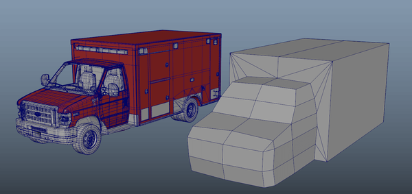
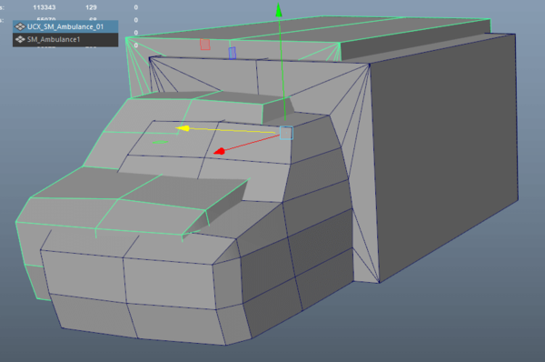
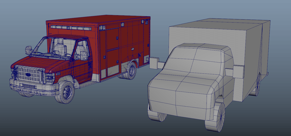
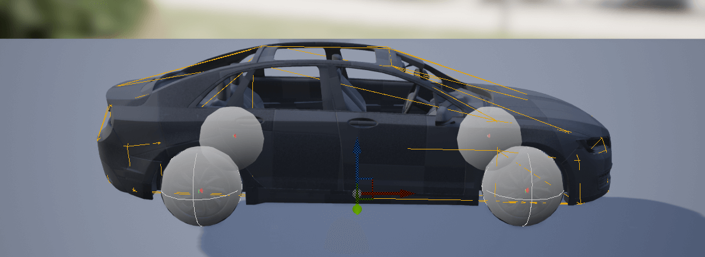
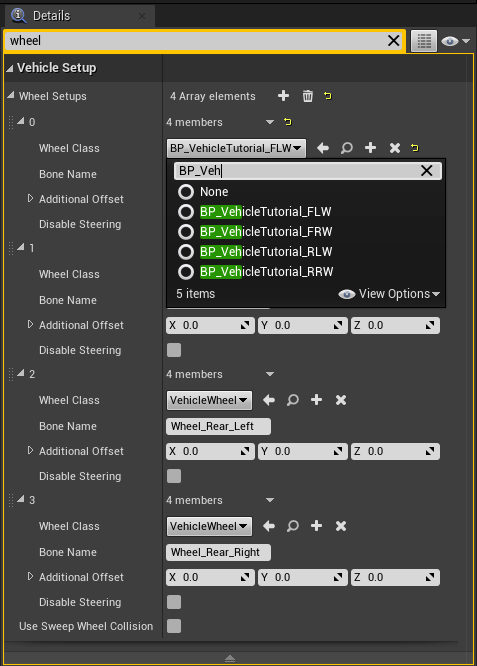

# [添加新车](https://carla.readthedocs.io/en/latest/tuto_A_add_vehicle/)

这个教程详细介绍了如何向 Carla 添加新的车辆。教程分为两个部分，一个用于四轮车辆，另一个用于两轮车辆。教程概述了建模车辆时必须满足的基本要求，以确保车辆在 Carla 中运行良好，并提供了在将车辆导入虚幻引擎后所需的配置说明。

*   [__添加 4 轮车辆__](#add-a-4-wheeled-vehicle)
  *   [绑定并建模车辆](#bind-and-model-the-vehicle)
  *   [导入并配置车辆](#import-and-configure-the-vehicle)
*   [__添加 2 轮车辆__](#add-a-2-wheeled-vehicle)

!!! 重要
    本教程仅适用于使用源代码构建并有权访问虚幻引擎编辑器的用户。
---
## 添加 4 轮车辆

添加到 CARLA 的车辆需要使用可在 [__此处__]((https://carla-assets.s3.eu-west-3.amazonaws.com/fbx/VehicleSkeleton.rar)) 找到的通用基础骨架。此链接将下载一个名为 `VehicleSkeleton.rar` 的文件夹，其中包含两种不同格式的基本框架，一种为 ASCII，另一种为二进制。您使用的格式取决于您的 3D 建模软件要求。

__骨架骨骼的位置可以更改，但任何其他操作（例如旋转、添加新骨骼或更改当前层次结构）都会导致错误。__

---

### 绑定并建模车辆

本节详细介绍了车辆建模阶段的最低要求，以确保其可以在 Carla 中成功使用。该过程包括将骨架正确绑定到车辆的底座和车轮、创建物理资源和光线投射传感器网格，以及导出为正确的格式。

__1. 导入基础骨架。__

将基础骨架导入您首选的三维建模软件中。常见的编辑器包括 Maya 和 Blender。

__2. 绑定骨骼。__

根据下面的命名法将骨骼绑定到车辆网格的相应部分。确保轮子的骨骼在网格内居中。

*   __左前轮：__ `Wheel_Front_Left`
*   __右前轮：__ `Wheel_Front_Right`
*   __左后轮：__ `Wheel_Rear_Left`
*   __右后轮：__ `Wheel_Rear_Right`
*   __网格的其余部分：__ `VehicleBase`

!!! 警告
    不要对骨骼名称或层次结构进行任何更改，也不要添加任何新骨骼。

__3.  为您的车辆建模。__

车辆应拥有大约 50,000 - 100,000 个 tris。我们使用实际汽车的尺寸和比例来建模车辆。

我们建议您将车辆分为以下材质：

>1. __Bodywork__: 车辆的金属部分。该材质已更改为虚幻引擎材质。可以添加徽标和细节，但为了可见，必须使用虚幻引擎编辑器中的 Alpha 通道将它们绘制为不同的颜色。
- __Glass_Ext__: 一层玻璃，可以从车辆外部看到内部。
- __Glass_Int__: 一层玻璃，允许从车辆内部到外部的可见性。
- __Lights__: 头灯、指示灯等。
- __LightGlass_Ext__: 一层玻璃，允许从外部到内部的灯光可见性。
- __LightGlass_Int__: 一层玻璃，允许从内部到外部看到光。
- __LicensePlate__: 29x12 厘米的矩形平面。您可以使用 Carla 提供的 `.fbx` 以获得最佳结果，请在 [此处](https://carla-assets.s3.eu-west-3.amazonaws.com/fbx/LicensePlate.rar) 下载。纹理将在虚幻引擎中自动分配。
- __Interior__: 任何其他不适合上述部分的细节都可以进入 _内饰_.


材料（Material）应使用格式 `M_CarPart_CarName` 命名，例如 `M_Bodywork_Mustang`。

纹理（Textures）应使用格式 `T_CarPart_CarName`命名，例如 `T_Bodywork_Mustang`。纹理的大小应为 2048x2048。

虚幻引擎会自动创建(Level of Details, LOD)，但您也可以在 3D 编辑器中手动创建它们。Tri 计数如下：

- __LOD 0__: 100,000 tris
- __LOD 1__: 80,000 tris
- __LOD 2__: 60,000 tris
- __LOD 3__: 30,000 tris


__4. 创建物理资源网格。__

物理资源网格是一个附加网格，允许虚幻引擎计算车辆的物理特性。它应该尽可能简单，减少多边形数量，并且应该覆盖除车轮之外的整个车辆。请参阅下图的示例。

>>

物理资源网格应导出为单独的`.fbx`文件。最终文件应满足以下要求：

- 有一个基础网格。这应该是物理资源网格的副本。它应该与原始车辆具有相同的名称。
- 物理资源网格体必须使用格式  `UCX_<vehicle_name>_<number_of_mesh>`命名， __否则虚幻引擎将无法识别。__
- 网格不得超出原始模型的边界。
- 网格应与原始模型具有相同的位置。

>>

将最终 `.fbx` 网格导出为名为 `SMC_<vehicle_name>.fbx`的文件。

__5. 为光线投射传感器创建网格。__

光线投射传感器网格设置将由光线投射传感器（RADAR、LiDAR 和 Semantic LiDAR）检测到的车辆形状。该网格应该具有比物理资产网格稍微更明确的几何形状，以提高传感器模拟的真实感，但出于性能原因，不如汽车网格那么详细。

创建光线投射传感器网格时请考虑以下几点：

- 网格应覆盖车辆的各个方面，包括车轮、后视镜和格栅。
- 轮子应为不超过 16 圈的圆柱体。
- 如果需要，可以将各种网格连接在一起。
- 网格不得超出原始模型的边界。
- 网格应该与原始网格具有相同的位置。

>>

将最终网格导出名为 `SM_sc_<vehicle_name>.fbx` 的 `.fbx` 文件。

__5. 导出车辆网格。__

选择所有主要车辆网格和骨架底座并导出为`.fbx`。

---

### 导入并配置车辆

本节详细介绍了将车辆导入虚幻引擎以在 CARLA 中使用的过程。在虚幻引擎编辑器中执行这些步骤。

__1. 创建车辆文件夹。__

在 `Content/Carla/Static/Vehicles/4Wheeled` 里创建一个名为 `<vehicle_name>` 的新文件夹。

__2. 导入 `.fbx`。__

Inside the new vehicle folder, import your main vehicle skeleton `.fbx` by right-clicking in the **_Content Browser_** and selecting **_Import into Game/Carla/Static/Vehicles/4Wheeled/<vehicle_name\>_**.

In the dialogue box that pops up:

- Set **_Import Content Type_** to `Geometry and Skinning Weights`.
- Set **_Normal Import Method_** to `Import Normals`.
- Optionally set **_Material Import Method_** to `Do not create materials`. Uncheck **_Import Textures_** to avoid Unreal Engine creating default materials.

The Skeletal Mesh will appear along with two new files, `<vehicle_name>_PhysicsAssets` and `<vehicle_name>_Skeleton`.

Import the rest of your `.fbx` files separately from the main vehicle skeleton `.fbx` file.

__3. Set the physical asset mesh.__

>1. Open `<vehicle_name>_PhysicsAssets` from the **_Content Browser_**.
- Right-click on the `Vehicle_Base` mesh in the **_Skeleton Tree_** panel and go to **_Copy Collision from StaticMesh_**.
- Search for and select your `SMC_<vehicle_name>` file. You should see the outline of the physical asset mesh appear in the viewport.
- Delete the default capsule shape from the `Vehicle_Base`.
- Select all the wheels:
    - Go to the **_Tools_** panel and change the **_Primitive Type_** to `Sphere`.
    - Go to the **_Details_** panel and change **_Physics Type_** to `Kinematic`.
    - Set **_Linear Damping_** to `0`. This will eliminate any extra friction on the wheels.
- Enable **_Simulation Generates Hit Event_** for all meshes.
- Click **_Re-generate Bodies_**.
- Adjust the wheel sphere to the size of the wheel.
- Save and close the window.

>

__4. Create the Animation Blueprint.__

>1. In the **_Content Browser_**, right-click inside your vehicle folder and select **_Animation -> Animation Blueprint_**.
- In **_Parent Class_** search for and select `VehicleAnimInstance`.
- In **_Target Skeleton_** search for and select `<vehicle_name>_Skeleton`.
- Press **_OK_** and rename the blueprint as `AnimBP_<vehicle_name>`.

__5. Configure the Animation Blueprint.__

To ease the process of configuring the animation blueprint, we will copy an existing one from a native CARLA vehicle:

>1. Go to `Content/Carla/Static/Vehicle` and choose any CARLA vehicle folder. Open its Animation Blueprint.
- In the **_My Blueprint_** panel, double click on **_AnimGraph_**. You will see the graph come up in the viewport.
- Click and drag to select the **_Mesh Space Ref Pose_**, **_Wheel Handler_**, and **_Component To Local_** components. Right-click and select **_Copy_**.
- Go back to your own vehicle Animation Blueprint and paste the copied contents into the graph area.
- Click and drag from the standing figure in the **_Component To Local_** component to the figure in **_Output Pose_** to join the components together.
- Click **_Compile_** in the top left corner. You should now see a pulsating line flowing through the entire sequence.
- Save and close the window.

>>

__6. Prepare the vehicle and wheel blueprints.__

>1. In the **_Content Browser_**, go to `Content/Carla/Blueprints/Vehicles` and create a new folder `<vehicle_name>`.
- Inside the folder, right-click and go to **_Blueprint Class_**. Open the **_All Classes_** section in the pop-up.
- Search for `BaseVehiclePawn` and press **_Select_**.
- Rename the file as `BP_<vehicle_name>`.
- Go to the folder of any of the native CARLA vehicles in `Carla/Blueprints/Vehicles`. From the **_Content Browser_**, copy the four wheel blueprints into the blueprint folder for your own vehicle. Rename the files to replace the old vehicle name with your own vehicle name.

>>

__7. Configure the wheel blueprints.__

>1. In your vehicle blueprint folder, open all four of the wheel blueprints.
- In the **_Class Defaults_** panel, set **_Collision Mesh_** to `Wheel_Shape`. __Omitting this step will cause the vehicle wheels to sink into the ground__.
- Adjust the values for wheel shape radius, width, mass, and damping rate according to your vehicle specifications.
- Set **_Tire Config_** to `CommonTireConfig`
- On the front wheels set **_Steer Angle_** according to your preferences (default is `70`). Uncheck **_Affected by Handbrake_**.
- On the rear wheels set **_Steer Angle_** to `0`. Check **_Affected by Handbrake_**.
- When setting the suspension values, you can use the values [here](tuto_D_customize_vehicle_suspension.md) as a guide.
- Compile and save.

>>

__8. Configure vehicle blueprint.__

>1. From the **_Content Browser_**, open your `BP_<vehicle_name>`.
- In the **_Components_** panel, select **_Mesh (VehicleMesh) (Inherited)_**.
- In the **_Details_** panel, go to **_Skeletal Mesh_** and search for and select the base skeleton file of your vehicle (located in the `Carla/Static/Vehicles/4Wheeled/<vehicle_name>` folder).
- Go to **_Anim Class_** in the **_Details_** panel. Search for and select your `AnimBP_<vehicle_name>` file.
- In the **_Components_** panel, select **_Custom Collision (Inherited)_**.
- Select **_Static Mesh_** in the **_Details_** panel and search for your `SM_sc_<vehicle_name>` raycast sensor mesh.
- In the **_Components_** panel, select **_VehicleMovement (MovementComp) (Inherited)_**.
- In the **_Details_** panel, search for `wheel`. You will find settings for each of the wheels. For each one, click on **_Wheel Class_** and search for the `BP_<vehicle_name>_<wheel_name>` file that corresponds to the correct wheel position.

>>>>

If you have any additional meshes for your vehicle (doors, lights, etc.,) separate from the base mesh:

>1. Drag them into the **_Mesh (VehicleMesh) (Inherited)_** hierarchy in the **_Components_** panel.
- Select the extra meshes in the hierarchy and search for `Collision` in the **_Details_** panel.
- Set **_Collision Presets_** to `NoCollision`.
- Select any lights meshes in the hierarchy. Search for `Tag` in the **_Details_** panel and add the tag `emissive`.

Click **_Save_** and **_Compile_**.


__9. Add the vehicle to the Blueprint Library__.

>1. In `Content/Carla/Blueprint/Vehicle`, open the `VehicleFactory` file.
- In the **_Generate Definitions_** tab, double click **_Vehicles_**.
- In the **_Details_** panel, expand the **_Default Value_** section and add a new element to the vehicles array.
- Fill in the **_Make_** and **_Model_** of your vehicle.
- Fill in the **_Class_** value with your `BP_<vehicle_name>` file.
- Optionally, provide a set of recommended colors for the vehicle.
- Compile and save.

>

__10. Test the vehicle__.

Launch CARLA, open a terminal in `PythonAPI/examples` and run the following command:

```sh
python3 manual_control.py --filter <model_name> # The make or model defined in step 9
```

!!! Note
    Even if you used upper case characters in your make and model, they need to be converted to lower case when passed to the filter.

---

## Add an N wheeled vehicle

Adding an N wheeled vehicle follows the same import pipeline as that for 4 wheeled vehicles above with a few steps that are different. 

__5.__ __Configure the Animation Blueprint for an N wheeled vehicle__

Search for `BaseVehiclePawnNW` and press **_Select_**.


__6.__ __Prepare the vehicle and wheel blueprints__

Go to the folder of any native CARLA vehicles in Carla/Blueprints/Vehicles. From the Content Browser, copy the four wheel blueprints into the blueprint folder for your own vehicle. Rename the files to replace the old vehicle name with your own vehicle name.

Copy the four wheels and copy again for additional wheels. In the case of a 6 wheeled vehicle, you will need 6 different wheels: FLW, FRW, MLW, MRW, RLW, RRW.


__7.__ __Configure the wheel blueprints__

Follow section __7__ as above for the 4 wheeled vehicle. The key difference in the case of an N wheeled vehicle is those affected by handbrake and steering parameters. In some vehicles (like for example a long wheelbase truck) the front 2 pairs of wheels will steer, and one set may steer more than others. The rearmost pairs may be affected by handbrake, the specifics will depend upon the vehicle you are modelling.

__8.__ __Configure vehicle blueprint__

In the Details panel, search for `wheel`. You will find settings for each of the wheels. For each one, click on Wheel Class and search for the BP_<vehicle_name>_<wheel_name> file that corresponds to the correct wheel position.

This is correct, but just to specify, in the case of N wheeled vehicles, you need to set ALL the wheels. This is an example with a 6 wheeled vehicle:


Finally, an additional consideration is setting the differential. In the case of a 4 wheeled vehicle, we have different presets of differentials (Limited Slip, Open 4W etc.) but with N wheeled vehicles, you need to choose on which wheels you want to apply torque. In this case, we have chosen only the middle and rear wheels have torque, while the front wheels don’t, you can specify other configurations. The numbers are going to be the same as the image above this text (e.g. 0 will be the Front Left Wheel, as specified above).


All other parameters such as engine, transmission, steering curve, are the same as 4 wheeled vehicles. 

---
## Add a 2 wheeled vehicle

Adding 2 wheeled vehicles is similar to adding a 4 wheeled one but due to the complexity of the animation you'll need to set up aditional bones to guide the driver's animation. [Here](https://carla-assets.s3.eu-west-3.amazonaws.com/fbx/BikeSkeleton.rar) is the link to the reference skeleton for 2 wheeled vehicles.

As with the 4 wheeled vehicles, orient the model towards positive "x" and every bone axis towards
positive x and with the z axis facing upwards.

```yaml
Bone Setup:
  - Bike_Rig:                   # The origin point of the mesh. Place it in the point 0 of the scenecomment
    - BikeBody:                 # The model's body centre.
      - Pedals:                 # If the vehicle is a bike bind the pedalier to this bone, will rotate with the bike acceleration.
        - RightPedal:           # Sets the driver's feet position and rotates with the pedalier if the vehicle is a bike.
        - LeftPedal:            # ^
      - RearWheel:              # Rear Wheel of the vehicle
      - Handler:                # Rotates with the frontal wheel of the vehicle bind the vehicle handler to it.
        - HandlerMidBone:       # Positioned over the front wheel bone to orient the handler with the wheel
        - HandlerRight:         # Sets the position of the driver's hand, no need to bind it to anything.
        - HandlerLeft:          # ^
      - Frontwheel:             # Frontal wheel of the vehicle.
      - RightHelperRotator:     # This four additional bones are here for an obsolete system of making the bike stable by using aditional invisible wheels
        - RightHelprWheel:      # ^
      - LeftHelperRotator:      # ^
        - LeftHelperWheel:      # ^
      - Seat:                   # Sets the position of the drivers hip bone. No need to bind it to anything but place it carefully.
```

__1.__ Import fbx as Skelletal Mesh to its own folder inside `Content/Carla/Static/Vehicles/2Wheeled`. When importing select "General2WheeledVehicleSkeleton" as skelleton A Physics asset should be automatically created and linked.  

__2.__ Tune the Physics asset. Delete the automatically created ones and add boxes to the `BikeBody` bone trying to match the shape as possible, make sure generate hit events is enabled. 
  Add a sphere for each wheel and set their "Physics Type" to "Kinematic".  

__3.__ Create folder `Content/Blueprints/Vehicles/<vehicle-model>`  

__4.__ Inside that folder create two blueprint classes derived from "VehicleWheel" class. Call them `<vehicle-model>_FrontWheel` and `<vehicle-model>_RearWheel`. Set their "Shape Radius" to exactly match the mesh wheel radius (careful, radius not diameter). Set their "Tire Config" to "CommonTireConfig". On the front wheel uncheck "Affected by Handbrake" and on the rear wheel set "Steer Angle" to zero.  

__5.__ Inside the same folder create a blueprint class derived from `Base2WheeledVehicle` call it `<vehicle-model>`. Open it for edit and select component "Mesh", setup the "Skeletal Mesh"
  and the "Anim Class" to the corresponding ones. Then select the VehicleBounds component and set the size to cover vehicle's area as seen from above.

__6.__ Select component "VehicleMovement", under "Vehicle Setup" expand "Wheel Setups", setup each wheel.  

*   __0:__ Wheel Class=`<vehicle-model>_FrontWheel`, Bone Name=`FrontWheel`  
*   __1:__ Wheel Class=`<vehicle-model>_FrontWheel`, Bone Name=`FrontWheel`  
*   __2:__ Wheel Class=`<vehicle-model>_RearWheel`, Bone Name=`RearWheel`  
*   __3:__ Wheel Class=`<vehicle-model>_RearWheel`, Bone Name=`RearWheel`  
  (You'll notice that we are basically placing two wheels in each bone. The vehicle class unreal provides does not support vehicles with wheel numbers different from 4 so we had to make it believe the vehicle has 4 wheels)

__7.__ Select the variable "is bike" and tick it if your model is a bike. This will activate the
  pedalier rotation. Leave unmarked if you are setting up a motorbike.

__8.__ Find the variable back Rotation and set it as it fit better select the component SkeletalMesh
  (The driver) and move it along x axis until its in the seat position.  

__9.__ Test it, go to CarlaGameMode blueprint and change "Default Pawn Class" to the newly
  created bike blueprint.
