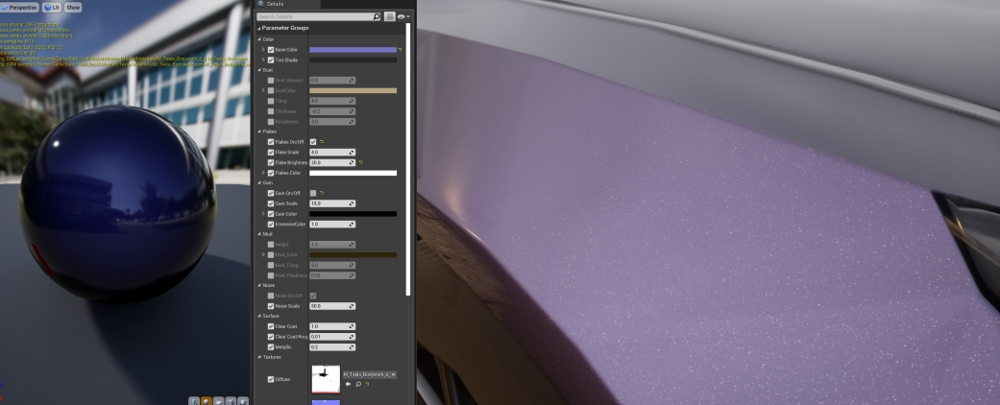
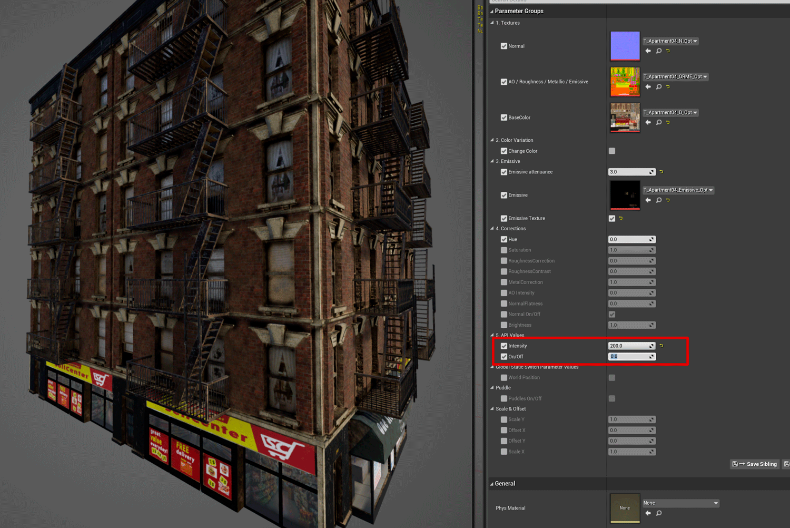

# 材质定制

CARLA 团队准备每个资产在某些默认设置下运行。但是，从源代码构建的用户可以修改这些内容以最适合他们的需求。 

*   [__汽车材质__](#car-materials)  
*   [__定制汽车材质__](#customize-car-materials)  
	*   [外观特性](#exterior-properties)  
*   [__建筑材质__](#building-materials)  
*   [__定制建筑材料__](#customize-a-building-material)  

!!! 重要
    本教程仅适用于使用源代码构建并有权访问虚幻编辑器的用户。

---
## 汽车材质

在 CARLA 中，有一组主材料用作车辆不同部件的模板。为每个车辆模型创建一个实例，然后更改为所需的结果。主要材质可以在 `Content/Carla/Static/GenericMaterials/Vehicles` （位于源代码的`Unreal/CarlaUE4`目录中）中找到，如下所示。

<i>适用于汽车的主材料。</i>

*   __M_CarExterior_Master__ — 应用于车身的材质。  
*   __M_CarInterior_Master__ — 应用于汽车内部的材质。 
*   __M_CarLightsGlass_Master__ — 应用于覆盖车灯的玻璃的材质。  
*   __M_CarWindows_Master__ — 应用于窗户的材质。  
*   __M_CarLicensePlate_Master__ — 应用于车牌的材质。  
*   __M_VehicleLights_Master__ — 作为发射纹理应用于汽车灯的材质。  
*   __M_VehicleLights_Sirens_Master__ — 应用于警报器的材质（如果适用）。  

---
## 定制汽车材质

创建主材料的实例并将它们存储在新模型的相应文件夹中。以下是蓝图库中为警车创建的实例，*vehicle.dodge_charger.police*。

<i>警车蓝图的实例材料。</i>

材料的通用文档以及如何使用它们可以在 [虚幻引擎文档](https://docs.unrealengine.com/en-US/Engine/Rendering/Materials/index.html) 中找到。所有材料都可以进行很大程度的修改，但只有外观材料的性能值得一提。其他材料具有某些可以更改的属性，例如玻璃材料的不透明度和颜色，但不建议这样做，除非有特定用途。

### 外观特性

外观材料应用于车身，是最可定制的一种（双击`M_CarExterior_Master`，进入`参数默认值`选项卡）。

*   __Base color__ — 车身的基色。
*   __Tint shade__ — 色调的可见度根据可视角度而变化。

<i>带有粉红色调的红色汽车。左侧，色调已禁用，右侧，色调已启用。</i>

*   __Global Dust__ — 涂在汽车上的污垢纹理。灰尘会堆积在几何体的顶部，而在底部几乎不会被注意到。如果旋转几何体，灰尘将出现在车辆顶部的部件上。
	*   `Dust_Amount` — 纹理的不透明度。  
	*   `DustColor` — 灰尘纹理的基色。 
	*   `Tiling` — 灰尘纹理图案的大小和重复。  
	*   `Thickness` — 灰尘的密度。  
	*   `Roughness` — 由于灰尘而减少汽车的金属反射。  

<i>汽车材料中的灰尘特性。</i>

*   __Global Flakes__ — 汽车金属漆上闪闪发光的薄片。  
	*   `Flakes On/Off` — 启用或禁用该功能。  
	*   `Flake Scale` —  薄片的大小。
	*   `Flake Brightness` — 闪光的强度。
	*   `Flakes Color` — 粒子的基色。

<i>汽车材料中的薄片特性。</i>

*   __Global Gain__ — 汽车底漆的噪音。
	*   __Gain On/Off__ — 启用或禁用该功能。  
	*   __Scale__ — 增益的大小。  
	*   __Color__ — 增益的基色。  

<i>汽车材质中的增益属性。</i>

*   __Global Mud__ — 涂在汽车上的泥浆纹理。泥浆从车的底部到顶部出现。 
	*   `Height` — 汽车出现泥浆的部分。 
	*   `Mud_Color` — 泥浆纹理的底色。 
	*   `Mud_Tiling` — 泥浆纹理图案的大小和重复。  
	*   `Mud_Thickness` — 泥浆的密度。 

<i>汽车材质中的泥浆特性。</i>

*   __Global Noise__ — 应用于材质法线的噪声。打造橙皮效果。 
	*   `Noise On/Off` — 启用或禁用该功能。
	*   `Noise Scale` — 通过更改法线贴图创建的凹凸大小。

<i>汽车材质的噪声特性。</i>

*   __Global Surface__ — 涂在车辆油漆上的光泽和透明涂层。这是 [汽车喷漆](https://en.wikipedia.org/wiki/Automotive_paint) 的最后一步。 
	*   `Clear Coat` — 涂层的不透明度。
	*   `Clear Coat Roughness` — 所得材质的粗糙度（光泽度）。
	*   `Metallic` — 所得材质的反射。

<i>应用于材质表面涂层的可视化。</i>

---
## 建筑材质

应用于建筑物的材质由四种基本纹理组成，这些纹理组合在一起确定材质的基本属性（例如打开`Content/Carla/Static/Building/SM_Apartment01_1`）。

*   __Diffuse__ — 包含材质的基本绘画。 
	*   `RGB` — 带有基色的通道。
	*   `Alpha` — 此通道定义一个掩膜，允许修改白色部分的颜色。这对于从相同材料创建一些变体非常有用。

*   __ORME__ — 使用特定通道映射材质的不同属性。
	*   `Ambient occlusion` — 包含在 `R` 通道中。
	*   `Roughness` — 包含在 `G` 通道中。  
	*   `Metallic map` — 包含在 `B` 通道中。  
	*   `Emissive mask` — 包含在 `Alpha` 通道中。该掩模允许改变白色部分的发射颜色和强度。

*   __Normal__ — 包含材质的法线贴图。
	*   `RGB` — 法线贴图信息。 

*   __Emissive__ — 如果适用，此纹理用于设置纹理的自发光基色。  
	*   `RGB` — 纹理中发射元素的颜色信息。 

---
## 定制建筑材料

与汽车材料类似，如果需要，建筑材料可以进行很大的改变，但仅当用户具有虚幻引擎方面的一些专业知识时才建议这样做。但是，建筑物使用的两个主要着色器可以进行一些自定义（例如在虚幻编辑器的`内容浏览器`中打开`Content/Carla/Static/GenericMaterials/00_MasterOpt/M_GlassMaster`）。 

*   __玻璃着色器__ — `M_GlassMaster`.  
	*   `Opacity` — 在白色区域漫反射 __Diffuse__ `Alpha`纹理上启用颜色改变。
	*   `Color` — 基于白色区域漫反射 __Diffuse__ `Alpha`纹理应用色调。

*   __建筑着色器__ — `M_MaterialMaster`  
	*   `Global 2. Color Variation/Change Color` — 在白色区域漫反射( __Diffuse__ ) 的`Alpha`纹理上启用颜色改变。
	*   `Global 2. Color Variation/Color` — 基于白色区域漫反射 __Diffuse__ `Alpha`纹理应用色调。
	*   `Global 3. Emissive/Emissive Texture` — 启用 __自发光(Emissive)__ 纹理的使用。 
	*   `Global 3. Emissive/EmissiveColor` — 基于 __ORME__ `Emissive mask` 的白色区域应用色调。
	*   `Global 3. Emissive/Emissive attenuance` — __BP_Lights__ 中除以强度因子以获得适当的发射值。
	*   `Global 4. Corrections/RoughnessCorrection` — 更改粗糙度贴图的强度。  
	*   `Global 4. Corrections/MetallicCorrection` — 更改金属贴图的强度。  
	*   `NormalFlatness` — 更改法线贴图的强度。  

---

这是用户定制车辆和建筑物材料的最显着方式的总结。

任何可能出现的疑问都非常欢迎在论坛中提出。

<a href="https://github.com/carla-simulator/carla/discussions/" target="_blank" class="btn btn-neutral" title="Go to the CARLA forum">
CARLA 论坛</a>

