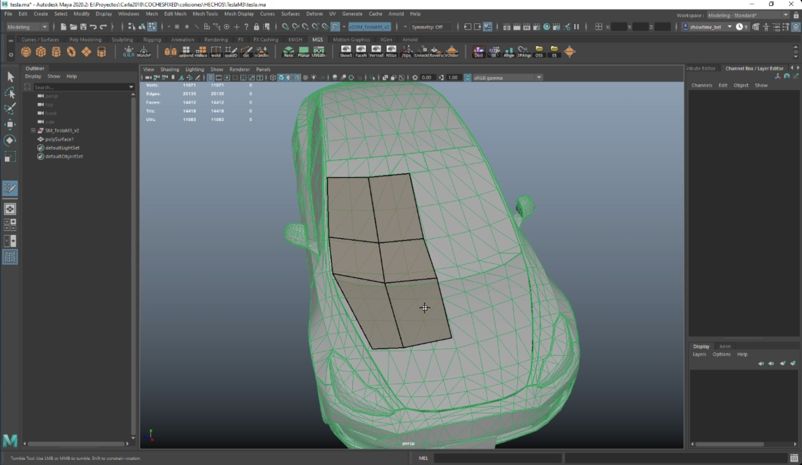
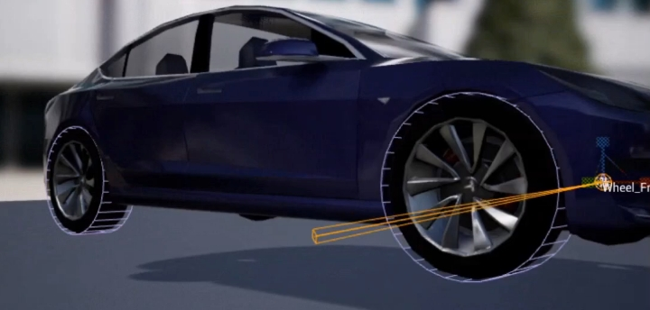
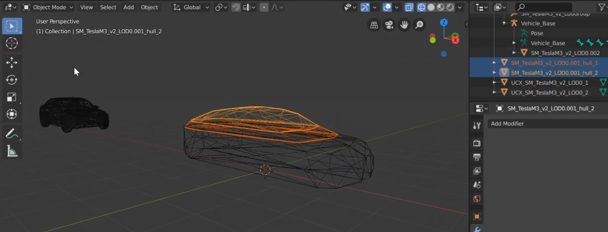
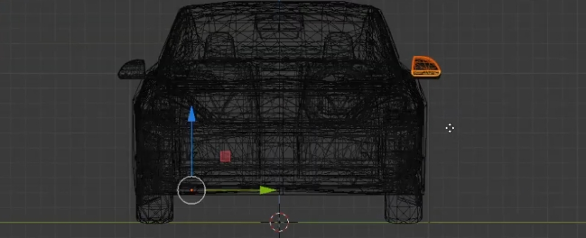
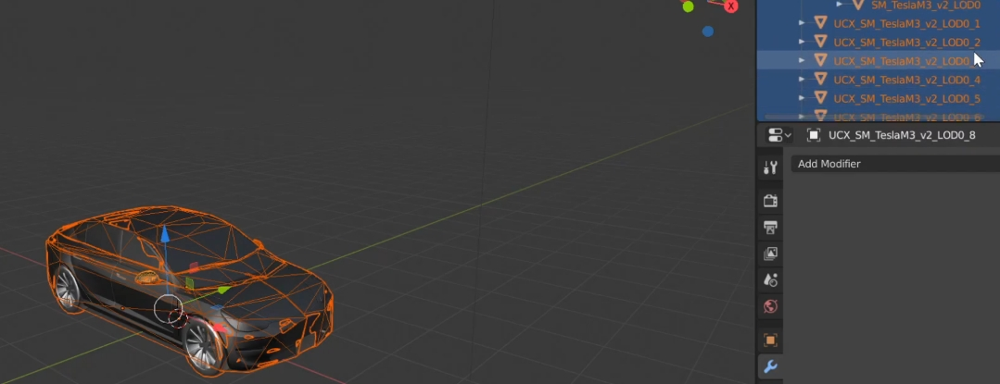
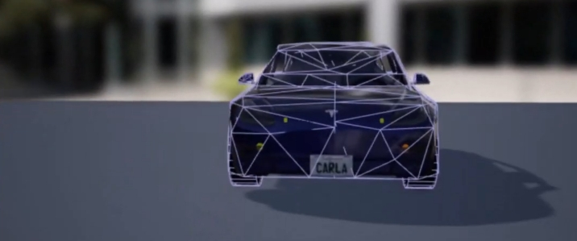

# 生成详细的碰撞体

本教程介绍如何为车辆创建更准确的碰撞边界（相对于对象的原始形状）。它们可以用作物理碰撞器，与碰撞检测兼容，也可以用作基于光线投射的传感器（例如激光雷达）的辅助碰撞器，以检索更准确的数据。新的碰撞机可以集成到 CARLA 中，以便所有社区都能从中受益。在 [此处](cont_contribution_guidelines.md) 了解有关如何为内容存储库做出贡献的更多信息。 

有两种方法可以创建新的碰撞器，但它们并不完全等效。

*   __光线投射碰撞器__ — 这种方法需要一些基本的三维建模技能。车辆中添加了辅助碰撞器，以便基于光线投射的传感器（例如激光雷达）检索更精确的数据。 
*   __物理碰撞器__ — 这种方法遵循贡献者 __[Yan Kaganovsky / yankagan](https://github.com/yankagan)__ 创建的 [教程](https://bitbucket.org/yankagan/carla-content/wiki/Home) ，无需手动建模即可创建网格。然后，该网格用作车辆的主碰撞器，用于物理和传感器检测（除非添加辅助碰撞器）。

---

*   [__光线投射碰撞器__](#raycast-colliders)  
	*   [1-导出车辆 FBX](#1-export-the-vehicle-fbx)  
	*   [2-生成低密度网格](#2-generate-a-low-density-mesh)  
	*   [3-将网格导入虚幻引擎](#3-import-the-mesh-into-ue)  
	*   [4-添加网格作为碰撞体](#4-add-the-mesh-as-collider)  

---

*   [__物理碰撞体__](#physics-colliders)  
	*   [0-先决条件](#0-prerequisites)  
	*   [1-在虚幻编辑器中定义轮子的自定义碰撞](#1-define-custom-collision-for-wheels-in-unreal-editor)  
	*   [2-将车辆导出为 FBX](#2-export-the-vehicle-as-fbx)  
	*   [3 到 4-导入到 Blender 并创建自定义边界](#3-to-4-import-to-blender-and-create-custom-boundary)  
	*   [5-从 Blender 导出到 FBX](#5-export-from-blender-to-fbx)  
	*   [6 到 8-导入碰撞体并定义物理](#6-to-8-import-collider-and-define-physics)  

---
## 光线投射碰撞体

### 1-导出车辆 FBX

首先需要以车辆的原始网格作为参考。出于学习目的，本教程导出 CARLA 车辆的网格。
__1.1__ 在虚幻引擎中打开 CARLA 并转到 `Content/Carla/Static/Vehicles/4Wheeled/<model_of_vehicle>`。
__1.2__ 在 `SM_<model_of_vehicle>` 点击 `right-click` 将车辆网格导出为 FBX。

### 2-生成低密度网格

__2.1__ 打开三维建模软件，并使用原始网格作为参考，建模一个与原始网格保持可靠的低密度网格。

__2.2__ 将新网格保存为FBX。将网格命名为 `sm_sc_<model_of_vehicle>.fbx`。例如 `sm_sc_audiTT.fbx`.  

!!! 笔记
    至于车轮和附加元件（例如车顶、挡泥板等），新网格应该非常准确地遵循几何形状。放置简单的立方体是不行的。

### 3-将网格导入虚幻引擎

__3.1__ 在虚幻引擎中打开 CARLA 并转到 `Content/Carla/Static/Vehicles/4Wheeled/<model_of_vehicle>`.  
__3.2__ 点击 `right-click` 导入新网格 `SM_sc_<model_of_vehicle>.fbx`。

### 4-添加网格作为碰撞体

__4.1__ 进入 `Content/Carla/Blueprints/Vehicles/<model_of_vehicle>` 并打开名为 `BP_<model_of_vehicle>` 的车辆的蓝图。  

__4.2__ 选择 `CustomCollision` 元素并在 `Static mesh` 属性中添加 `SM_sc_<model_of_vehicle>.fbx`。

__4.3__ 点击上方工具栏中的 `Compile` 并保存更改。

!!! 笔记
    对于摩托车和自行车等车辆，使用相同的组件 `CustomCollision` 更改车辆本身的碰撞器网格。

---
## 物理碰撞体

!!! 重要
    本教程基于 __[yankagan](https://github.com/yankagan)__ 的 [贡献](https://bitbucket.org/yankagan/carla-content/wiki/Home) ！贡献者还希望感谢 __Francisco E__ 关于 [如何在虚幻引擎中导入自定义碰撞](https://www.youtube.com/watch?v=SEH4f0HrCDM) 的教程。  

[该视频](https://www.youtube.com/watch?v=CXK2M2cNQ4Y) 展示了遵循本教程后所取得的结果。

### 0-先决条件

*   在 [Linux](build_linux.md) 或 [Windows](build_windows.md) 上 __从源代码构建 CARLA__。
*   可从 [官方网站](https://www.blender.org/download/) 免费获取 __Blender 2.80 或更新版本__ （开源 3D 建模软件）。
*   按照 [此处](https://github.com/andyp123/blender_vhacd) 的说明使用 __Blender 的 VHACD 插件__。该插件使用凸包集合自动创建选定对象的近似值。[阅读更多](https://github.com/kmammou/v-hacd) 。

!!! Note
    This [series](https://www.youtube.com/watch?v=ppASl6yaguU) and [Udemy course](https://www.udemy.com/course/blender-3d-from-zero-to-hero/?pmtag=MRY1010) may be a good introduction to Blender for newcomers. 

### 1-在虚幻编辑器中定义轮子的自定义碰撞

__Step 1.__ *(in UE)* — Add collision boundaries for the wheels. The steps are detailed in the following video.  

### 2-将车辆导出为 FBX

__Step 2.__ *(in UE)* — Export the skeletal mesh of a vehicle to an FBX file.  
__2.1__ Go to `Content/Carla/Static/Vehicles/4Wheeled/<model_of_vehicle>`.  
__2.2__ Press `right-click` on `SM_<model_of_vehicle>` to export the vehicle mesh as FBX.  

### 3 到 4-导入到 Blender 并创建自定义边界

__Step 3.__ *(in Blender)* — Import the FBX file into Blender.  
__Step 4.__ *(in Blender)* — Add convex hull meshes to form the new collision boundary (UE requirement for computational efficiency). This is the hardest step. If the entire car is selected, the collision boundary created by VHACD will be imprecise and messy. It will contain sharp edges which will mess-up the drive on the road. It's important that the wheels have smooth boundaries around them. Using convex decomposition on the car's body the mirrors would still not look right. For computer vision, the details of the vehicle are important. For said reason, these step has been divided into two parts. 

__4.1__ Cut out the bottom parts of the wheels, the side mirrors and the top part of the car's body to create the first boundary using the VHACD tool. Cut out the bottom half of the car to create the second boundary (top part of the car) using the VHACD tool.  

__4.2__ Create separate boundaries for side mirrors using the VHACD tool.  

!!! Warning
    Be very careful about naming the object. Each boundary should have begin with `UCX_`, and the rest of the name has to be __exactly__ the same as the original mesh.  

### 5-从 Blender 导出到 FBX

__Step 5.__ *(in Blender)* — Export the custom collision boundaries into an FBX file.  
__5.1__ Select only the original vehicle and all the newly added objects for collision.  
__5.2__ In the export menu, check `selected objects` and select only "Mesh".  

### 6 到 8-导入碰撞体并定义物理

__Step 6.__ *(in UE)* — Import the new FBX into CARLA as an Unreal asset file (static mesh).  
__Step 7.__ *(in UE)* — Import the custom collider into the physics asset for the specific vehicle, so that it is used for computations.  
__Step 8.__ *(in UE)* — Create constraints that connect the different joints and define the physics of all parts.  

---

That is a wrap on how to change the default colliders for vehicles in CARLA.  

Open CARLA and mess around for a while. If there are any doubts, feel free to post these in the forum. 

<a href="https://github.com/carla-simulator/carla/discussions/" target="_blank" class="btn btn-neutral" title="Go to the CARLA forum">
CARLA forum</a>

