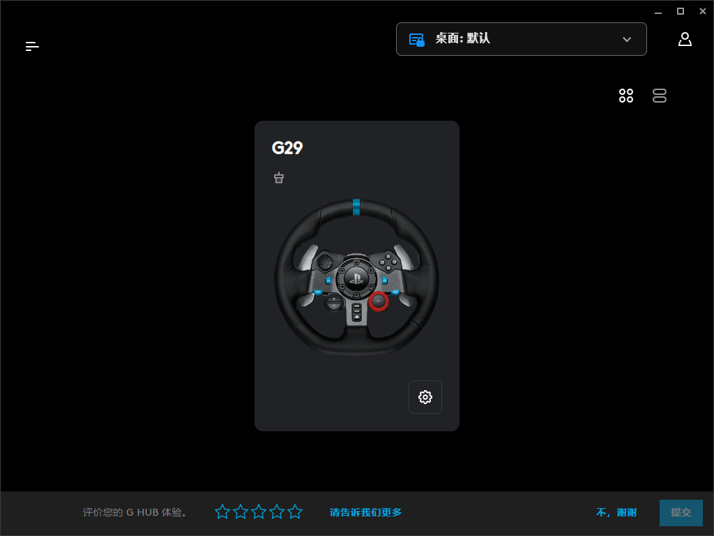
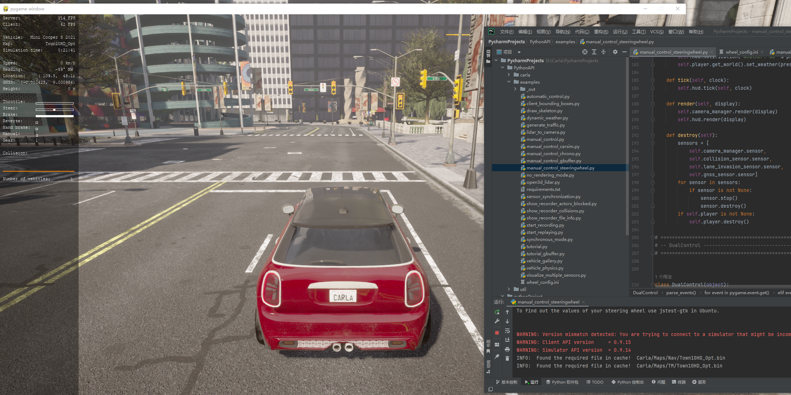

# carla 与罗技 G29 方向盘的力反馈

ubuntu 环境下使用 jstest-gtk、ROS 进行方向盘控制参考[链接](https://blog.csdn.net/qq_44237695/article/details/129103700) 。

本教程在windows环境下联调，原先的想法是在windows环境下安装ros2，通过罗技的sdk来替换jstest-gtk，重写ros2节点来实现。罗技g29sdk可参考[链接](https://blog.csdn.net/qq_41250354/article/details/104652071)

但由于C++的g29 sdk强制要求界面，carla在控制方向盘时也要求指定 pygame 界面，[G29python代码](https://github.com/cengizozel/LogiDrivePy) 用的C# dll修改，初始化过程不需要界面。同时由于是 python 写的，可以绕开ros2这个过程，减少非常多的学习量。

具体联调过程：

环境：

python3.7、carla0.9.14、罗技G-hub驱动、G29方向盘


首先去罗技官网安装方向盘启动，安装好后驱动界面显示G29方向盘，同时方向盘转动自检。



python环境中安装CARLA与logidrivepy

```
pip install carla
pip install logidrivepy
```

这里要创建一个ini的配置文件。

wheel_config.ini

```
[G29 Racing Wheel]
steering_wheel = 0
throttle = 2
brake = 3
reverse = 5
handbrake = 4
```

其中数字可能需要自己试这里`steering_wheel`表示方向盘方向、`throttle`表示油门和`brake`刹车已经是正确的设置了。要保证这个设置和`.py`文件在同一个目录下否则会报错。


下载carla-API后，运行carla客户端


随后运行`PythonAPI/examples/manual_control_steeringwheel.py`文件



此时即可开启车辆。


## 自动驾驶力反馈

另启一个文件，复制以下代码

```
import sys
import carla
sys.path.append('../logidrivepy')
from logidrivepy import LogitechController
import time


class SimpleController:
    def __init__(self, k):
        # k 是比例增益，用于调整控制器的响应速度
        self.k = k

    def control(self, aim, now):
        # 计算位置差值
        error = now - aim

        # 计算输出力
        force = self.k * error

        return force

class ForceFeedback:
    def __init__(self):
        self.position = None
        self.torque = None

class Node():
    def __init__(self, client):
        self.client = client
        self.world = client.get_world()
        self.actor = self.get_hero()

    def get_hero(self):
        for actor in self.world.get_actors():
            if actor.attributes.get("role_name") in ["hero", "ego_vehicle"]:
                return actor

    def timer_cb(self):
        out_msg = ForceFeedback()

        steering_angle = self.actor.get_control().steer
        out_msg.position = steering_angle
        out_msg.torque = 0.8

    def get_position(self):
        steering_angle = self.actor.get_control().steer
        position = steering_angle
        return position


def main(args=None):
    controller = LogitechController()
    controller.steering_initialize()

    print("\n---Logitech Spin Test---")

    client = carla.Client("127.0.0.1", 2000)
    client.set_timeout(2.0)

    carla_car = Node(client)
    # 创建一个PID控制器
    sc = SimpleController(k=1)

    # 在每个时间步中，更新控制器并使用新的力
    while True:
        aim = carla_car.get_position() * 150
        now = (controller.LogiGetStateENGINES(0).contents.lX) / 327.50
        if (abs(aim)<1):
            controller.LogiPlaySoftstopForce(0,0)
            controller.logi_update()
            time.sleep(0.1)
            controller.LogiStopSoftstopForce(0)
            controller.logi_update()
            print("Target: {}, Current State: {}".format(aim, now))
        else:
            force = sc.control(now, aim)
            controller.LogiPlayConstantForce(0, -int(force)*2)
            controller.logi_update()
            print("Force: {}, Target: {}, Current State: {}".format(force, aim, now))
            time.sleep(0.1)
    controller.steering_shutdown()

if __name__ == "__main__":
    main()
```

在`pygame`界面按键盘`P`开启自动驾驶，此时方向盘会随着车辆自行转动。

这个代码是测试用的效果不太好，有更好效果需求得换更好的控制代码了。


