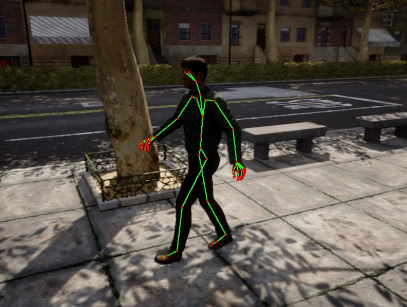

# 行人骨骼控制

在本教程中，我们介绍如何通过 Carla Python API 手动控制行人的骨骼并为其设置动画。所有可用类和方法的参考可以在 [Python API 参考](python_api.md) 中找到 。

*   [__行人骨骼结构__](#walker-skeleton-structure)  
*   [__手动控制行人骨骼__](#manually-control-walker-bones)  
	*   [连接到模拟器](#connect-to-the-simulator)  
	*   [生成行人](#spawn-a-walker)  
	*   [控制行人骨骼](#control-walker-skeletons)  

!!! 笔记
    **本文档假设用户熟悉 Python API。**。 <br>
    用户在阅读本文档之前应阅读第一步教程： 
    [核心概念](foundations.md)。进行行人建模请参考[链接](./tuto_content_authoring_pedestrians.md) 。

---
## 行人骨骼结构  <span id="walker-skeleton-structure"></span>

所有行人都具有相同的骨骼层次结构和骨骼名称。下面是骨架层次结构的图像。骨骼的层次结构图参考[链接](./tuto_content_authoring_pedestrians.md) 。

```
crl_root
└── crl_hips__C
    ├── crl_spine__C
    │   └── crl_spine01__C
    │       ├── ctrl_shoulder__L
    │       │   └── crl_arm__L
    │       │       └── crl_foreArm__L
    │       │           └── crl_hand__L
    │       │               ├── crl_handThumb__L
    │       │               │   └── crl_handThumb01__L
    │       │               │       └── crl_handThumb02__L
    │       │               │           └── crl_handThumbEnd__L
    │       │               ├── crl_handIndex__L
    │       │               │   └── crl_handIndex01__L
    │       │               │       └── crl_handIndex02__L
    │       │               │           └── crl_handIndexEnd__L
    │       │               ├── crl_handMiddle_L
    │       │               │   └── crl_handMiddle01__L
    │       │               │       └── crl_handMiddle02__L
    │       │               │           └── crl_handMiddleEnd__L
    │       │               ├── crl_handRing_L
    │       │               │   └── crl_handRing01__L
    │       │               │       └── crl_handRing02__L
    │       │               │           └── crl_handRingEnd__L
    │       │               └── crl_handPinky_L
    │       │                   └── crl_handPinky01__L
    │       │                       └── crl_handPinky02__L
    │       │                           └── crl_handPinkyEnd__L
    │       ├── crl_neck__C
    │       │   └── crl_Head__C
    │       │       ├── crl_eye__L
    │       │       └── crl_eye__R
    │       └── crl_shoulder__R
    │           └── crl_arm__R
    │               └── crl_foreArm__R
    │                   └── crl_hand__R
    │                       ├── crl_handThumb__R
    │                       │   └── crl_handThumb01__R
    │                       │       └── crl_handThumb02__R
    │                       │           └── crl_handThumbEnd__R
    │                       ├── crl_handIndex__R
    │                       │   └── crl_handIndex01__R
    │                       │       └── crl_handIndex02__R
    │                       │           └── crl_handIndexEnd__R
    │                       ├── crl_handMiddle_R
    │                       │   └── crl_handMiddle01__R
    │                       │       └── crl_handMiddle02__R
    │                       │           └── crl_handMiddleEnd__R
    │                       ├── crl_handRing_R
    │                       │   └── crl_handRing01__R
    │                       │       └── crl_handRing02__R
    │                       │           └── crl_handRingEnd__R
    │                       └── crl_handPinky_R
    │                           └── crl_handPinky01__R
    │                               └── crl_handPinky02__R
    │                                   └── crl_handPinkyEnd__R
    ├── crl_thigh__L
    │   └── crl_leg__L
    │       └── crl_foot__L
    │           └── crl_toe__L
    │               └── crl_toeEnd__L
    └── crl_thigh__R
        └── crl_leg__R
            └── crl_foot__R
                └── crl_toe__R
                    └── crl_toeEnd__R
```

---
## 手动控制行人骨骼 <span id="manually-control-walker-bones"></span>

以下是如何通过 Carla Python API 更改行人骨骼变换的详细分步示例。

### 连接到模拟器 <span id="connect-to-the-simulator"></span>

导入本例中使用的必要库

```py
import carla
import random
```

初始化 Carla 客户端

```py
client = carla.Client('127.0.0.1', 2000)
client.set_timeout(2.0)
```

### 生成行人  <span id="spawn-a-walker"></span>

在地图的一个生成点生成一个随机行人。

```py
world = client.get_world()
blueprint = random.choice(self.world.get_blueprint_library().filter('walker.*'))
spawn_points = world.get_map().get_spawn_points()
spawn_point = random.choice(spawn_points) if spawn_points else carla.Transform()
world.try_spawn_actor(blueprint, spawn_point)
```

### 控制行人骨骼  <span id="control-walker-skeletons"></span>

可以通过将 `WalkerBoneControl` 类的实例传递给行人的 `apply_control` 函数来修改行人的骨架。`WalkerBoneControl` 类包含要修改的骨骼的变换。它的 `bone_transforms` 成员是成对值元组的列表，其中第一个值是骨骼名称，第二个值是骨骼变换。可以在每个刻度上调用 `apply_control` 函数来为行人的骨骼设置动画。每个变换的位置和旋转都是相对于其父变换的。因此，当修改父骨骼的变换时，子骨骼在模型空间中的变换也会相对改变。

在下面的示例中，行人的手设置为围绕前轴旋转 90 度，并且位置设置为原点。

```py
control = carla.WalkerBoneControl()
first_tuple = ('crl_hand__R', carla.Transform(rotation=carla.Rotation(roll=90)))
second_tuple = ('crl_hand__L', carla.Transform(rotation=carla.Rotation(roll=90)))
control.bone_transforms = [first_tuple, second_tuple]
world.player.apply_control(control)
```

行人骨架控制代码 [链接](https://github.com/OpenHUTB/carla_doc/blob/master/src/pedestrian/walker_control.py) 。


## 可视化行人骨架



可视化骨架代码 [链接](https://github.com/OpenHUTB/carla_doc/blob/master/src/pedestrian/draw_skeleton.py) 。