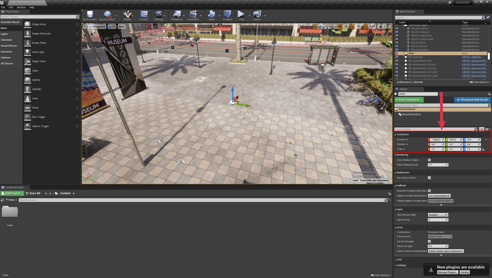

# 通过 API 获取行人真实骨骼

为了训练自动驾驶车辆，必须确保它们不仅能够识别建筑物、道路和汽车，还能够识别人行道和过马路的行人，以确保所有道路使用者的安全。Carla 仿真器提供人工智能控制的行人，以人体形态填充您的仿真和训练数据。在许多计算机视觉应用中，人体姿态估计是一个重要因素，包括自动驾驶、安全、人群控制和多个机器人应用。

Carla 的 API 提供了从仿真中的行人获取真实骨架的功能。骨架由一组骨骼组成，每个骨骼都有一个根节点或顶点以及一个定义骨骼姿势（或方向）的向量。这些骨骼控制仿真行人的四肢和身体的运动。通过将各个骨骼的集合收集在一起，可以构建虚拟人姿势的模型，该模型可用于与神经网络估计的姿势模型进行比较，甚至用于训练神经网络进行姿势估计。

在本教程中，我们将完成在地图中生成行人、设置 AI 控制器来移动行人、然后获取真实骨架并将骨骼投影到 2D 相机捕获上的步骤。

## 设置仿真器

首先，按照您的标准工作流程启动 Carla 仿真器，无论是在独立模式下还是在虚幻编辑器中。我们将导入几个实用程序库以用于数学和绘图。为了让我们更好地控制仿真，我们将在本教程中使用 [__同步模式__](adv_synchrony_timestep.md) 。这意味着我们的 Python 客户端控制仿真器的时间进程。

```py
import carla
import random
import numpy as np
import math
import queue
import cv2 #OpenCV to manipulate and save the images

# Connect to the client and retrieve the world object
client = carla.Client('localhost', 2000)
world = client.get_world()

# Set up the simulator in synchronous mode
settings = world.get_settings()
settings.synchronous_mode = True # Enables synchronous mode
settings.fixed_delta_seconds = 0.05
world.apply_settings(settings)

# We will aslo set up the spectator so we can see what we do
spectator = world.get_spectator()
```

## 在 Carla 仿真器中生成行人

首先，我们想在仿真中生成一个行人。这可以使用 `world.get_random_location_from_navigation()` 在随机位置完成，也可以使用从虚幻编辑器收集的坐标来选择。在虚幻编辑器中，将一个空参与者添加到要生成行人的位置，然后使用右侧的检查器查询坐标。



!!! 笔记
    虚幻编辑器以厘米为单位，而 Carla 以米为单位，因此必须转换单位。在 Carla 仿真器中使用之前，请确保将虚幻编辑器坐标除以 100。

一旦你选择了坐标，你就可以生成行人。我们还将生成一个相机来收集图像。我们还需要一个队列 [`Queue`](#https://docs.python.org/3/library/queue.html) 对象来允许我们轻松访问来自相机的数据（因为相机传感器在其自己的线程上运行，与运行脚本的主 Python 线程分开）。

为了看到我们的行人，我们需要变换相机，使其指向我们生成的行人。为此，我们将使用一个函数来计算使相机居中所需的平移和旋转：

```py
def center_camera(ped, rot_offset=0):
    # 旋转相机以面向行人并应用偏移
    trans = ped.get_transform()
    offset_radians = 2 * math.pi * rot_offset/360
    x = math.cos(offset_radians) * -2
    y = math.sin(offset_radians) * 2
    trans.location.x += x
    trans.location.y += y
    trans.location.z = 2
    trans.rotation.pitch = -16
    trans.rotation.roll = 0
    trans.rotation.yaw = -rot_offset
    spectator.set_transform(trans)
    return trans
```

现在我们将生成行人、摄像机、控制器并移动观察者，以便我们可以看到我们所做的事情：

```py
# 获取行人蓝图并生成它
pedestrian_bp = random.choice(world.get_blueprint_library().filter('*walker.pedestrian*'))
transform = carla.Transform(carla.Location(x=-134,y=78.1,z=1.18))
pedestrian = world.try_spawn_actor(pedestrian_bp, transform)

# 生成一个 RGB 相机
camera_bp = world.get_blueprint_library().find('sensor.camera.rgb')
camera = world.spawn_actor(camera_bp, transform)

# 创建一个队列来存储并获取传感器数据
image_queue = queue.Queue()
camera.listen(image_queue.put)

world.tick()
image_queue.get()
# 每次调用 world.tick() 时，我们必须调用 image_queue.get() 以确保时间步长和传感器数据保持同步
    
# 现在，我们将旋转相机以面向行人
camera.set_transform(center_camera(pedestrian))
# 移动观察者以查看结果
spectator.set_transform(camera.get_transform())

# 为行人设置AI控制器
controller_bp = world.get_blueprint_library().find('controller.ai.walker')
controller = world.spawn_actor(controller_bp, pedestrian.get_transform(), pedestrian)

# 启动控制器并给它一个随机位置
controller.start()
controller.go_to_location(world.get_random_location_from_navigation())

# 将世界移动几帧，让行人生成
for frame in range(0,5):
    world.tick()
    trash = image_queue.get() 

```

## AI 控制器引导行人在地图上行走

上一步我们还初始化了一个 AI 控制器来帮助行人在地图上智能移动，代码如下（无需重复）：

```py
controller_bp = world.get_blueprint_library().find('controller.ai.walker')
controller = world.spawn_actor(controller_bp, pedestrian.get_transform(), pedestrian)
controller.start()
controller.go_to_location(world.get_random_location_from_navigation())

```

现在，行人将随着仿真的每次推进 (`world.tick()`) 自主移动。

## 相机几何

现在我们需要执行一些几何计算。首先，我们想要将骨骼的世界坐标转换为相机坐标，我们使用相机变换的逆变换来实现这一点。这意味着坐标将转换为相对于位于原点、面向 x 正方向的相机。

```py
# 获取4x4矩阵以将点从世界坐标转换为相机坐标
world_2_camera = np.array(camera.get_transform().get_inverse_matrix())

```

然后，我们需要使用相机矩阵或投影矩阵将三维点投影到相机的二维视场 (FOV, field of view) 上，将它们叠加在输出图像上。以下函数生成此三维到二维转换所需的 [__相机矩阵__](#https://en.wikipedia.org/wiki/Camera_matrix)。

```py
def build_projection_matrix(w, h, fov):
    focal = w / (2.0 * np.tan(fov * np.pi / 360.0))
    K = np.identity(3)
    K[0, 0] = K[1, 1] = focal
    K[0, 2] = w / 2.0
    K[1, 2] = h / 2.0
    return K
```

## 构建骨架

现在我们可以将活动部件组装在一起。首先，使用 `pedestrian.get_bones()` 从仿真中收集骨骼坐标，然后将骨骼组合在一起并将其投影到相机传感器的二维成像平面上。使用skeletal.txt中定义的对将骨骼连接成完整的骨架，您可以在 [__此处__](https://carla-assets.s3.eu-west-3.amazonaws.com/fbx/skeleton.txt) 下载该文件。

我们需要一个函数来迭代 __sculpture.txt__ 中定义的骨骼对，并将骨骼坐标连接到可以覆盖到相机传感器图像上的线中。

```py
def get_image_point(bone_trans):
        # 计算骨骼坐标的二维投影
        
        # 获取骨根的世界位置
        loc = bone_trans.world.location
        bone = np.array([loc.x, loc.y, loc.z, 1])
        # 转换为相机坐标
        point_camera = np.dot(world_2_camera, bone)

        #  我们必须从UE4的坐标系更改为“标准”坐标系
        # (x, y ,z) -> (y, -z, x)
        # 我们还删除了第四个组件
        point_camera = [point_camera[1], -point_camera[2], point_camera[0]]

        # 现在使用摄影机矩阵投影3D->2D
        point_img = np.dot(K, point_camera)
        # 正则化
        point_img[0] /= point_img[2]
        point_img[1] /= point_img[2]

        return point_img[0:2]
    

def build_skeleton(ped, sk_links, K):

    ######## 获取行人骨架 #########
    bones = ped.get_bones()

    # 列出将投影到相机输出上行的存储位置
    lines = []

    # 在 skeleton.txt 中遍历骨骼对并获取关节位置
    for link in sk_links[1:]:

        # 将两块骨头的根部连接起来
        bone_transform_1 = next(filter(lambda b: b.name == link[0], bones.bone_transforms), None)
        bone_transform_2 = next(filter(lambda b: b.name == link[1], bones.bone_transforms), None)

        # 某些骨骼名称不匹配
        if bone_transform_1 is not None and bone_transform_2 is not None:
           
            # 计算三维骨骼坐标的二维投影
            point_image = get_image_point(bone_transform_1)
    
            # 将行开始附加到行列表
            lines.append([point_image[0], point_image[1], 0, 0])
            
            # 计算三维骨骼坐标的二维投影
            point_image = get_image_point(bone_transform_2)
            
            # 将行尾附加到行列表
            lines[-1][2] = point_image[0]
            lines[-1][3] = point_image[1]
            
    return lines
```

接下来，让我们从 __sculpture.txt__ 中读取骨骼对：


```py
skeleton_links = []
with open('skeleton.txt') as f:
    while True:
        line = f.readline()
        if not line:
            break
        stripped = list(map(str.strip, line.strip().split(',')))
        skeleton_links.append(stripped)


world.tick()
trash = image_queue.get()
```

现在我们可以迭代几帧，在每帧中构建骨架，并将骨架投影到相机传感器输出上。我们使用 OpenCV 将骨架绘制到传感器输出上并保存图像：

!!! 笔记
    确保已在工作目录中创建名为 __out/__ 的文件夹来存储图像

```py
for frame in range(0,360):
    
    # 在行人周围移动摄像头
    camera.set_transform(center_camera(pedestrian, frame + 200))
    
    # 推进帧并获取图像
    world.tick()
    # 从队列中获取帧
    image = image_queue.get()
    
    # 获取4x4矩阵以将点从世界坐标转换为相机坐标
    world_2_camera = np.array(camera.get_transform().get_inverse_matrix())

    # 从相机获取一些属性
    image_w = camera_bp.get_attribute("image_size_x").as_int()
    image_h = camera_bp.get_attribute("image_size_y").as_int()
    fov = camera_bp.get_attribute("fov").as_float()

    # 计算要从3D->2D投影的相机矩阵
    K = build_projection_matrix(image_w, image_h, fov)
    
    # 构建将显示骨架的线列表
    lines = build_skeleton(pedestrian, skeleton_links, K)

    # 将数据重塑为2D RBGA 矩阵
    img = np.reshape(np.copy(image.raw_data), (image.height, image.width, 4)) 

    # 使用 OpenCV 将线条绘制到图像中
    for line in lines:
        l = [int(x) for x in line]
        cv2.line(img, (l[0],l[1]), (l[2],l[3]), (255,0,0, 255), 2)
    
    # 保存图像
    cv2.imwrite('out/skeleton%04d.png' % frame, img)
```

在 __out/__ 文件夹中，您现在应该有一系列帧，其中骨架覆盖在相机传感器输出上。可以通过将帧加入视频来重建以下动画：


## 总结

在本教程中，您学习了如何使用 AI 控制器生成行人，恢复行人骨骼的真实三维坐标，并将这些骨骼投影到相机传感器捕获的二维图像上。您可以使用本教程中学到的技术，使用 Carla 仿真器为人体姿势估计框架设置训练和验证，完整代码[链接](https://github.com/OpenHUTB/carla_doc/blob/master/src/tuto_G_pedestrian_bones.py)。


