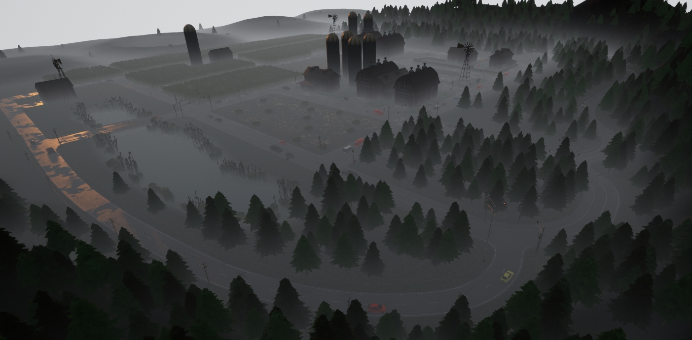
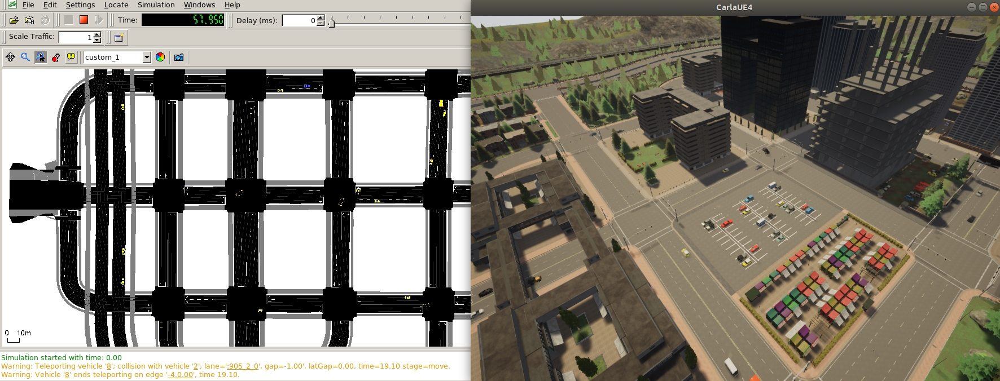
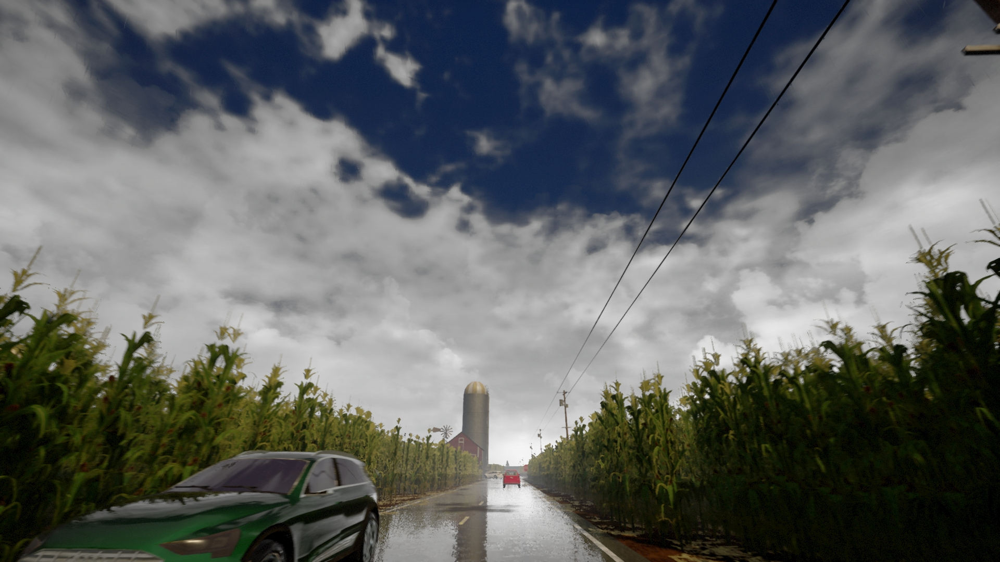
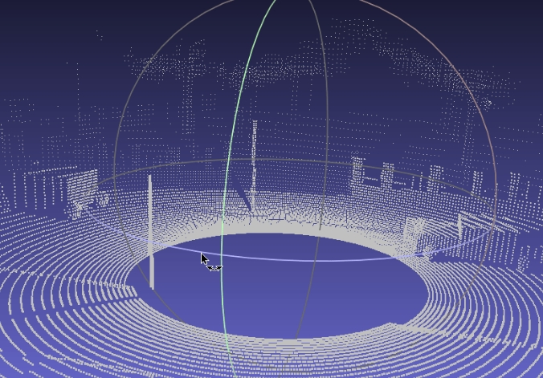

# 检索仿真数据

在 CARLA 中，学习一种有效的方法来检索仿真数据至关重要。这个整体教程适合新手和经验丰富的用户。它从头开始，逐渐深入探讨 Carla 中可用的许多选项。

首先，使用自定义设置和流量初始化仿真。一辆自我车辆将在城市中漫游，可选地配备一些基本传感器。记录仿真，以便以后查询以找到亮点。之后，原始仿真被回放，并被利用到极限。可以添加新的传感器来检索一致的数据。天气条件是可以改变的。记录器甚至可以用于测试具有不同输出的特定场景。 

*   [__概述__](#overview)  
*   [__设置仿真__](#set-the-simulation)  
	*   [地图设置](#map-setting)  
	*   [天气设置](#weather-setting)  
*   [__设置交通流量__](#set-traffic)  
	*   [CARLA 交通和行人](#carla-traffic-and-pedestrians)  
	*   [SUMO 协同仿真交通](#sumo-co-simulation-traffic)  
*   [__设置自我车辆__](#set-the-ego-vehicle)  
	*   [生成自我车辆](#spawn-the-ego-vehicle)  
	*   [放置观察者](#place-the-spectator)  
*   [__设置基本传感器__](#set-basic-sensors)  
	*   [RGB 相机](#rgb-camera)  
	*   [检测器](#detectors)  
	*   [其他传感器](#other-sensors)  
*   [__设置高级传感器__](#set-advanced-sensors)  
	*   [深度相机](#depth-camera)  
	*   [语义分割相机](#semantic-segmentation-camera)  
	*   [激光雷达光线投射传感器](#lidar-raycast-sensor)  
	*   [雷达传感器](#radar-sensor)  
*   [__非渲染模式__](#no-rendering-mode)  
	*   [快速仿真](#simulate-at-a-fast-pace)  
	*   [无需渲染的手动控制](#manual-control-without-rendering)  
*   [__记录和检索数据__](#record-and-retrieve-data)  
	*   [开始记录](#start-recording)  
	*   [捕获并记录](#capture-and-record)  
	*   [停止记录](#stop-recording)  
*   [__利用记录__](#exploit-the-recording)  
	*   [查询事件](#query-the-events)  
	*   [选择一个片段](#choose-a-fragment)  
	*   [检索更多数据](#retrieve-more-data)  
	*   [改变天气](#change-the-weather)  
	*   [尝试新的结果](#try-new-outcomes)  
*   [__教程脚本__](#tutorial-scripts)  

---
## 概述

在检索仿真数据的过程中存在一些常见错误。仿真器中充斥着传感器、存储无用的数据或努力寻找特定事件都是一些例子。然而，可以提供该过程的一些概要。目标是确保数据可以检索和复制，并且可以随意检查和更改仿真。

!!! 笔记
    本教程使用 [__CARLA 0.9.8 deb 包__](start_quickstart.md)。根据您的 CARLA 版本和安装，可能会有细微的变化，特别是在路径方面。

本教程为不同步骤提供了多种选项。一直以来，都会提到不同的脚本。并不是所有的都会被使用，这取决于具体的用例。其中大多数已在 CARLA 中提供用于通用目的。

* __config.py__ 更改仿真设置。地图、渲染选项、设置固定时间步长...  
	* `carla/PythonAPI/util/config.py`
* __dynamic_weather.py__ 创建有趣的天气条件。
	* `carla/PythonAPI/examples/dynamic_weather.py`
* __spawn_npc.py__ spawn_npc.py生成一些人工智能控制的车辆和行人。 
	* `carla/PythonAPI/examples/spawn_npc.py`
* __manual_control.py__ 生成一个自我车辆，并提供对其的控制。
	* `carla/PythonAPI/examples/manual_control.py`

但是，教程中提到的两个脚本在 CARLA 中找不到。它们包含引用的代码片段。这有双重目的。首先，鼓励用户构建自己的脚本。充分理解代码的作用非常重要。除此之外，本教程只是一个大纲，可能而且应该根据用户的喜好而有很大的不同。这两个脚本只是一个示例。

* __tutorial_ego.py__ 生成带有一些基本传感器的自我车辆，并启用自动驾驶仪。观察者被放置在生成位置。记录器从一开始就启动，并在脚本完成时停止。
* __tutorial_replay.py__ 重新执行 __tutorial_ego.py__ 记录的仿真。有不同的代码片段可以查询记录、生成一些高级传感器、改变天气条件以及重新执行记录片段。

完整的代码可以在教程的最后部分找到。请记住，这些并不严格，而是可以定制的。在 CARLA 中检索数据的功能正如用户所希望的那样强大。

!!! 重要
    本教程需要一些 Python 知识。

---
## 设置仿真

要做的第一件事是将仿真设置为所需的环境。

运行 CARLA。 

```sh
cd /opt/carla/bin
./CarlaUE.sh
```

### 地图设置

选择要运行仿真的地图。查看 [地图文档](core_map.md#carla-maps) 以了解有关其特定属性的更多信息。在本教程中，选择 __Town07__ 。

打开一个新终端。使用 __config.py__ 脚本更改地图。


```
cd /opt/carla/PythonAPI/utils
python3 config.py --map Town01
```
该脚本可以启用不同的设置。其中一些将在教程中提及，另一些则不会。下面有一个简短的总结。

<details>
<summary> <b>config.py</b> 中的可选参数  </summary>

```sh
  -h, --help            show this help message and exit
  --host H              IP of the host CARLA Simulator (default: localhost)
  -p P, --port P        TCP port of CARLA Simulator (default: 2000)
  -d, --default         set default settings
  -m MAP, --map MAP     load a new map, use --list to see available maps
  -r, --reload-map      reload current map
  --delta-seconds S     set fixed delta seconds, zero for variable frame rate
  --fps N               set fixed FPS, zero for variable FPS (similar to
                        --delta-seconds)
  --rendering           enable rendering
  --no-rendering        disable rendering
  --no-sync             disable synchronous mode
  --weather WEATHER     set weather preset, use --list to see available
                        presets
  -i, --inspect         inspect simulation
  -l, --list            list available options
  -b FILTER, --list-blueprints FILTER
                        list available blueprints matching FILTER (use '*' to
                        list them all)
  -x XODR_FILE_PATH, --xodr-path XODR_FILE_PATH
                        load a new map with a minimum physical road
                        representation of the provided OpenDRIVE
```
</details>
<br>


<div style="text-align: right"><i>Aerial view of Town07</i></div>

### 天气设置

每个城镇都有适合它的特定天气，但是可以随意设置。有两个脚本提供了解决此问题的不同方法。第一个设置了动态天气，随着时间的推移，情况会发生变化。另一个设置自定义天气条件。还可以对天气条件进行编码。稍后 [天气条件发生变化](#change-the-weather) 时将对此进行介绍。 

* __设置动态天气__ 。打开一个新终端并运行 __dynamic_weather.py__ 。该脚本允许设置天气变化的比率，默认设置是`1.0`。

```sh
cd /opt/carla/PythonAPI/examples

python3 dynamic_weather.py --speed 1.0
```

* __设置自定义条件__ 使用脚本 __environment.py__ 。有很多可能的设置。查看可选参数以及 [carla.WeatherParameters](python_api.md#carla.WeatherParameters) 的文档。

```sh
cd /opt/carla/PythonAPI/util
python3 environment.py --clouds 100 --rain 80 --wetness 100 --puddles 60 --wind 80 --fog 50

```
<details>
<summary> <b>environment.py</b> 中的可选参数 </summary>

```sh
  -h, --help            show this help message and exit
  --host H              IP of the host server (default: 127.0.0.1)
  -p P, --port P        TCP port to listen to (default: 2000)
  --sun SUN             Sun position presets [sunset | day | night]
  --weather WEATHER     Weather condition presets [clear | overcast | rain]
  --altitude A, -alt A  Sun altitude [-90.0, 90.0]
  --azimuth A, -azm A   Sun azimuth [0.0, 360.0]
  --clouds C, -c C      Clouds amount [0.0, 100.0]
  --rain R, -r R        Rain amount [0.0, 100.0]
  --puddles Pd, -pd Pd  Puddles amount [0.0, 100.0]
  --wind W, -w W        Wind intensity [0.0, 100.0]
  --fog F, -f F         Fog intensity [0.0, 100.0]
  --fogdist Fd, -fd Fd  Fog Distance [0.0, inf)
  --wetness Wet, -wet Wet
                        Wetness intensity [0.0, 100.0]
```
</details>
<br>


<div style="text-align: right"><i>Weather changes applied</i></div>

---
## 设置交通流量

仿真交通是让地图栩栩如生的最佳方法之一。还需要检索城市环境的数据。在 CARLA 中有不同的选择可以实现这一点。

### CARLA 交通和行人

CARLA 交通流量由 [交通管理器](adv_traffic_manager.md) 模块管理。至于行人，他们每个人都有自己的[carla.WalkerAIController](python_api.md#carla.WalkerAIController)。

打开一个新终端，然后运行 __spawn_npc.py__ 来生成车辆和步行者。让我们生成 50 辆车和相同数量的步行者。

```sh
cd /opt/carla/PythonAPI/examples
python3 spawn_npc.py -n 50 -w 50 --safe
```
<details>
<summary> <b>spawn_npc.py</b> 中的可选参数 </summary>

```sh
  -h, --help            show this help message and exit
  --host H              IP of the host server (default: 127.0.0.1)
  -p P, --port P        TCP port to listen to (default: 2000)
  -n N, --number-of-vehicles N
                        number of vehicles (default: 10)
  -w W, --number-of-walkers W
                        number of walkers (default: 50)
  --safe                avoid spawning vehicles prone to accidents
  --filterv PATTERN     vehicles filter (default: "vehicle.*")
  --filterw PATTERN     pedestrians filter (default: "walker.pedestrian.*")
  -tm_p P, --tm-port P  port to communicate with TM (default: 8000)
  --async               Asynchronous mode execution
```
</details>
<br>

<div style="text-align: right"><i>Vehicles spawned to simulate traffic.</i></div>

### SUMO 协同仿真交通

CARLA 可以与 SUMO 运行联合仿真。这允许在 SUMO 中创建将传播到 CARLA 的交通流量。这种联合仿真是双向的。在 CARLA 中生成的车辆将在 SUMO 中生成。有关此功能的具体文档可以在 [此处](adv_sumo.md) 找到。

此功能适用于 CARLA 0.9.8 及更高版本的 __Town01__ 、__Town04__ 和 __Town05__。第一个是最稳定的。

!!! 笔记
    联合仿真将在 CARLA 中启用同步模式。阅读 [文档](adv_synchrony_timestep.md) 以了解更多相关信息。

* 首先，安装SUMO。 
```sh
sudo add-apt-repository ppa:sumo/stable
sudo apt-get update
sudo apt-get install sumo sumo-tools sumo-doc
```
* 设置环境变量 SUMO_HOME。
```sh
echo "export SUMO_HOME=/usr/share/sumo" >> ~/.bashrc && source ~/.bashrc
```
* 在 CARLA 服务器打开的情况下，运行 [SUMO-CARLA 同步脚本](https://github.com/carla-simulator/carla/blob/master/Co-Simulation/Sumo/run_synchronization.py) 。 
```sh
cd ~/carla/Co-Simulation/Sumo
python3 run_synchronization.py examples/Town01.sumocfg --sumo-gui
```
* SUMO 窗口应该已打开。__按“运行”__ 以在两个仿真中启动交通流量。
```
> "Play" on SUMO window.
```

该脚本生成的流量是 CARLA 团队创建的示例。默认情况下，它会沿着相同的路线生成相同的车辆。用户可以在 SUMO 中更改这些内容。


<div style="text-align: right"><i>SUMO and CARLA co-simulating traffic.</i></div>

!!! 警告
    目前，SUMO 联合仿真还是测试版功能。车辆没有物理特性，也不考虑 CARLA 交通灯。

---
## 设置自我车辆

从现在到记录器停止的那一刻，将会有一些属于 __tutorial_ego.py__ 的代码片段。该脚本生成自我车辆，可选一些传感器，并记录仿真，直到用户完成脚本。

### 生成自我车辆

用户控制的车辆在 CARLA 中通常通过将属性 `role_name` 设置为 `ego` 来区分。可以设置其他属性，其中一些具有推荐值。

下面，从 [蓝图库](bp_library.md) 中检索特斯拉模型，并使用随机推荐的颜色生成。选择地图推荐的生成点之一来放置自我车辆。

```py        
# --------------
# Spawn ego vehicle
# --------------
ego_bp = world.get_blueprint_library().find('vehicle.tesla.model3')
ego_bp.set_attribute('role_name','ego')
print('\nEgo role_name is set')
ego_color = random.choice(ego_bp.get_attribute('color').recommended_values)
ego_bp.set_attribute('color',ego_color)
print('\nEgo color is set')

spawn_points = world.get_map().get_spawn_points()
number_of_spawn_points = len(spawn_points)

if 0 < number_of_spawn_points:
    random.shuffle(spawn_points)
    ego_transform = spawn_points[0]
    ego_vehicle = world.spawn_actor(ego_bp,ego_transform)
    print('\nEgo is spawned')
else: 
    logging.warning('Could not found any spawn points')
```

### 放置观察者

观察者参与者控制仿真视图。通过脚本移动它是可选的，但它可能有助于找到自我车辆。 

```py
# --------------
# Spectator on ego position
# --------------
spectator = world.get_spectator()
world_snapshot = world.wait_for_tick() 
spectator.set_transform(ego_vehicle.get_transform())
```

---
## 设置基本传感器

生成任何传感器的过程都非常相似。 

__1.__ 使用库查找传感器蓝图。
__2.__ 设置传感器的特定属性。这一点至关重要。属性将塑造检索到的数据。
__3.__ 将传感器连接至自我车辆。该变换是相对于其父级的。[carla.AttachmentType](python_api.md#carlaattachmenttype) 将确定传感器位置的更新方式。 
__4.__ 添加`listen()`方法。这是关键要素。每次传感器侦听数据时都会调用的 [__lambda__](https://www.w3schools.com/python/python_lambda.asp) 方法。参数是检索到的传感器数据。 

牢记这一基本准则，让我们为自我车辆设置一些基本传感器。

### RGB 相机

[RGB 相机](ref_sensors.md#rgb-camera) 生成逼真的场景图片。它是所有传感器中可设置属性较多的传感器，但它也是一个基本的传感器。它应该被理解为一个真正的相机，具有诸如`focal_distance`、`shutter_speed`或`gamma`确定其内部如何工作的属性。还有一组特定的属性来定义镜头畸变，以及许多高级属性。例如，`lens_circle_multiplier`可以用来实现类似于眼睛鱼镜头的效果。在文档中了解有关它们的更多信息。

为了简单起见，脚本仅设置该传感器最常用的属性。 

* __`image_size_x` 和 `image_size_y`__ 将改变输出图像的分辨率。 
* __`fov`__ 是相机的水平视野。  

设置属性后，就可以生成传感器了。脚本将摄像机放置在汽车引擎盖中，并指向前方。它将捕捉汽车的前视图。

每一步都会以 [carla.Image](python_api.md#carla.Image) 的形式检索数据。Listen 方法将它们保存到磁盘。路径可以随意改变。每张图像的名称均根据拍摄镜头的模拟帧进行编码。 

```py
# --------------
# Spawn attached RGB camera
# --------------
cam_bp = None
cam_bp = world.get_blueprint_library().find('sensor.camera.rgb')
cam_bp.set_attribute("image_size_x",str(1920))
cam_bp.set_attribute("image_size_y",str(1080))
cam_bp.set_attribute("fov",str(105))
cam_location = carla.Location(2,0,1)
cam_rotation = carla.Rotation(0,180,0)
cam_transform = carla.Transform(cam_location,cam_rotation)
ego_cam = world.spawn_actor(cam_bp,cam_transform,attach_to=ego_vehicle, attachment_type=carla.AttachmentType.Rigid)
ego_cam.listen(lambda image: image.save_to_disk('tutorial/output/%.6d.jpg' % image.frame))
```

<div style="text-align: right"><i>RGB camera output</i></div>

### 检测器

当它们所附加的对象注册特定事件时，这些传感器会检索数据。检测器传感器分为三种类型，每种都描述一种类型的事件。

* [__碰撞检测器。__](ref_sensors.md#collision-detector) 检索其父级与其他参与者之间的碰撞。
* [__车道入侵检测器。__](ref_sensors.md#lane-invasion-detector) 当其父级穿过车道标记时进行注册。
* [__障碍物检测器。__](ref_sensors.md#obstacle-detector) 检测其父级前方可能存在的障碍物。

他们检索到的数据将有助于稍后决定要重新执行仿真的哪一部分。事实上，可以使用记录器显式查询冲突。这是准备打印的。

只有障碍物检测器蓝图有需要设置的属性。以下是一些重要的内容。

* __`sensor_tick`__ 设置传感器仅在 `x` 秒钟后检索数据。这是检索每一步数据的传感器的常见属性。 
* __`distance` 和 `hit-radius`__ 塑造用于检测前方障碍物的调试线。
* __`only_dynamics`__ 确定是否应考虑静态对象。默认情况下，任何对象都会被考虑。

该脚本将障碍物检测器设置为仅考虑动态对象。如果车辆与任何静态物体发生碰撞，碰撞传感器都会检测到。

```py
# --------------
# Add collision sensor to ego vehicle. 
# --------------

col_bp = world.get_blueprint_library().find('sensor.other.collision')
col_location = carla.Location(0,0,0)
col_rotation = carla.Rotation(0,0,0)
col_transform = carla.Transform(col_location,col_rotation)
ego_col = world.spawn_actor(col_bp,col_transform,attach_to=ego_vehicle, attachment_type=carla.AttachmentType.Rigid)
def col_callback(colli):
    print("Collision detected:\n"+str(colli)+'\n')
ego_col.listen(lambda colli: col_callback(colli))

# --------------
# Add Lane invasion sensor to ego vehicle. 
# --------------

lane_bp = world.get_blueprint_library().find('sensor.other.lane_invasion')
lane_location = carla.Location(0,0,0)
lane_rotation = carla.Rotation(0,0,0)
lane_transform = carla.Transform(lane_location,lane_rotation)
ego_lane = world.spawn_actor(lane_bp,lane_transform,attach_to=ego_vehicle, attachment_type=carla.AttachmentType.Rigid)
def lane_callback(lane):
    print("Lane invasion detected:\n"+str(lane)+'\n')
ego_lane.listen(lambda lane: lane_callback(lane))

# --------------
# Add Obstacle sensor to ego vehicle. 
# --------------

obs_bp = world.get_blueprint_library().find('sensor.other.obstacle')
obs_bp.set_attribute("only_dynamics",str(True))
obs_location = carla.Location(0,0,0)
obs_rotation = carla.Rotation(0,0,0)
obs_transform = carla.Transform(obs_location,obs_rotation)
ego_obs = world.spawn_actor(obs_bp,obs_transform,attach_to=ego_vehicle, attachment_type=carla.AttachmentType.Rigid)
def obs_callback(obs):
    print("Obstacle detected:\n"+str(obs)+'\n')
ego_obs.listen(lambda obs: obs_callback(obs))
```

<div style="text-align: right"><i>Output for detector sensors</i></div>

### 其他传感器

暂时只考虑该类别的两个传感器。

* [__全球导航卫星系统传感器。__](ref_sensors.md#gnss-sensor) 检索传感器的地理位置。
* [__IMU 传感器。__](ref_sensors.md#imu-sensor) 包括加速度计、陀螺仪和指南针。

为了获得车辆对象的一般测量值，这两个传感器以车辆对象为中心生成。

这些传感器可用的属性主要设置测量噪声模型中的平均值或标准偏差参数。这对于获得更现实的措施很有用。然而，在 __tutorial_ego.py__ 中只设置了一个属性。

* __`sensor_tick`__. 由于此测量值在步骤之间不应有显着变化，因此可以经常检索数据。在本例中，设置为每三秒打印一次。 

```py
# --------------
# Add GNSS sensor to ego vehicle. 
# --------------

gnss_bp = world.get_blueprint_library().find('sensor.other.gnss')
gnss_location = carla.Location(0,0,0)
gnss_rotation = carla.Rotation(0,0,0)
gnss_transform = carla.Transform(gnss_location,gnss_rotation)
gnss_bp.set_attribute("sensor_tick",str(3.0))
ego_gnss = world.spawn_actor(gnss_bp,gnss_transform,attach_to=ego_vehicle, attachment_type=carla.AttachmentType.Rigid)
def gnss_callback(gnss):
    print("GNSS measure:\n"+str(gnss)+'\n')
ego_gnss.listen(lambda gnss: gnss_callback(gnss))

# --------------
# Add IMU sensor to ego vehicle. 
# --------------

imu_bp = world.get_blueprint_library().find('sensor.other.imu')
imu_location = carla.Location(0,0,0)
imu_rotation = carla.Rotation(0,0,0)
imu_transform = carla.Transform(imu_location,imu_rotation)
imu_bp.set_attribute("sensor_tick",str(3.0))
ego_imu = world.spawn_actor(imu_bp,imu_transform,attach_to=ego_vehicle, attachment_type=carla.AttachmentType.Rigid)
def imu_callback(imu):
    print("IMU measure:\n"+str(imu)+'\n')
ego_imu.listen(lambda imu: imu_callback(imu))
```


<div style="text-align: right"><i>GNSS and IMU sensors output</i></div>

---
## 设置高级传感器

脚本 __tutorial_replay.py__ 除其他外还包含更多传感器的定义。它们的工作方式与基本的相同，但理解可能有点困难。

### 深度相机

[深度相机](ref_sensors.md#depth-camera) 生成场景的图片，将每个像素映射到灰度深度图中。然而，输出并不简单。相机的深度缓冲区使用 RGB 颜色空间进行映射。必须将其转换为灰度才能理解。

为此，只需将图像保存为 RGB 相机的图像，但对其应用[carla.ColorConverter](python_api.md#carla.ColorConverter) 即可。深度相机有两种可用的转换。

* __carla.ColorConverter.Depth__ 以毫米级精度转换原始深度。
* __carla.ColorConverter.LogarithmicDepth__ 也具有毫米级粒度，但在近距离内提供更好的结果，而对于较远的元素则稍差一些。

深度相机的属性仅设置之前在 RGB 相机中所述的元素：`fov`、`image_size_x`、`image_size_y`和`sensor_tick`。该脚本将此传感器设置为与之前使用的 RGB 相机相匹配。

```py
# --------------
# Add a Depth camera to ego vehicle. 
# --------------
depth_cam = None
depth_bp = world.get_blueprint_library().find('sensor.camera.depth')
depth_location = carla.Location(2,0,1)
depth_rotation = carla.Rotation(0,180,0)
depth_transform = carla.Transform(depth_location,depth_rotation)
depth_cam = world.spawn_actor(depth_bp,depth_transform,attach_to=ego_vehicle, attachment_type=carla.AttachmentType.Rigid)
# This time, a color converter is applied to the image, to get the semantic segmentation view
depth_cam.listen(lambda image: image.save_to_disk('tutorial/new_depth_output/%.6d.jpg' % image.frame,carla.ColorConverter.LogarithmicDepth))
```


<div style="text-align: right"><i>Depth camera output. Simple conversion on the left, logarithmic on the right.</i></div>

### 语义分割相机

[语义分割相机](ref_sensors.md#semantic-segmentation-camera) 根据元素的标记方式将场景中的元素渲染为不同的颜色。标签由仿真器根据用于生成的资源的路径创建。例如，标记为 `Pedestrians` 的网格体是使用存储在 `Unreal/CarlaUE4/Content/Static/Pedestrians` 中的内容生成的。

与任何相机一样，输出是图像，但每个像素都包含在红色通道中编码的标签。必须使用 __ColorConverter.CityScapesPalette__ 转换此原始图像。可以创建新标签，请阅读 [文档](ref_sensors.md#semantic-segmentation-camera) 了解更多信息。

该相机可用的属性与深度相机完全相同。该脚本还将其设置为与原始 RGB 相机相匹配。

```py
# --------------
# Add a new semantic segmentation camera to my ego
# --------------
sem_cam = None
sem_bp = world.get_blueprint_library().find('sensor.camera.semantic_segmentation')
sem_bp.set_attribute("image_size_x",str(1920))
sem_bp.set_attribute("image_size_y",str(1080))
sem_bp.set_attribute("fov",str(105))
sem_location = carla.Location(2,0,1)
sem_rotation = carla.Rotation(0,180,0)
sem_transform = carla.Transform(sem_location,sem_rotation)
sem_cam = world.spawn_actor(sem_bp,sem_transform,attach_to=ego_vehicle, attachment_type=carla.AttachmentType.Rigid)
# This time, a color converter is applied to the image, to get the semantic segmentation view
sem_cam.listen(lambda image: image.save_to_disk('tutorial/new_sem_output/%.6d.jpg' % image.frame,carla.ColorConverter.CityScapesPalette))
```


<div style="text-align: right"><i>Semantic segmentation camera output</i></div>

### 激光雷达光线投射传感器

[激光雷达传感器](ref_sensors.md#lidar-raycast-sensor) 仿真旋转激光雷达。它创建了一个以三维形式映射场景的点云。激光雷达包含一组以特定频率旋转的激光器。激光投射撞击距离，并将每次射击存储为一个点。

可以使用不同的传感器属性来设置激光器阵列的布置方式。

* __`upper_fov` 和 `lower_fov`__ 分别是最高和最低激光的角度。
* __`channels`__ 设置要使用的激光数量。这些沿着所需的  _fov_ 分布。

其他属性设置该点的计算方式。它们确定每个激光器每一步计算的点数： `points_per_second / (FPS * channels)`.  

* __`range`__ 是捕获的最大距离。
* __`points_per_second`__ 是每秒获得的点数。该数量除以 `channels`的数量。
* __`rotation_frequency`__ 是激光雷达每秒旋转的次数。

点云输出被描述为 [carla.LidarMeasurement]。它可以作为 [carla.Location] 列表进行迭代或保存为 _.ply_ 标准文件格式。

```py
# --------------
# Add a new LIDAR sensor to my ego
# --------------
lidar_cam = None
lidar_bp = world.get_blueprint_library().find('sensor.lidar.ray_cast')
lidar_bp.set_attribute('channels',str(32))
lidar_bp.set_attribute('points_per_second',str(90000))
lidar_bp.set_attribute('rotation_frequency',str(40))
lidar_bp.set_attribute('range',str(20))
lidar_location = carla.Location(0,0,2)
lidar_rotation = carla.Rotation(0,0,0)
lidar_transform = carla.Transform(lidar_location,lidar_rotation)
lidar_sen = world.spawn_actor(lidar_bp,lidar_transform,attach_to=ego_vehicle)
lidar_sen.listen(lambda point_cloud: point_cloud.save_to_disk('tutorial/new_lidar_output/%.6d.ply' % point_cloud.frame))
```

_.ply_ 输出可以使用 __Meshlab__ 进行可视化。

__1.__ 安装 [Meshlab](http://www.meshlab.net/#download) 。
```sh
sudo apt-get update -y
sudo apt-get install -y meshlab
```
__2.__ 打开 Meshlab 。
```sh
meshlab
```
__3.__ 打开其中一个 _.ply_ 文件。 `File > Import mesh...` 


<div style="text-align: right"><i>经过Meshlab处理后的激光雷达输出。</i></div>

### 雷达传感器

[雷达传感器](ref_sensors.md#radar-sensor) 与 激光雷达类似。它创建一个圆锥视图，并向内部发射激光以射线投射其影响。输出是[carla.RadarMeasurement](python_api.md#carlaradarmeasurement)。它包含由激光器检索到的 [carla.RadarDetection](python_api.md#carlaradardetection) 的列表。这些不是空间中的点，而是使用有关传感器的数据进行的检测：

该传感器的属性主要决定了激光器的定位方式。

* __`horizontal_fov` 和 `vertical_fov`__ 确定圆锥视图的振幅。
* __`channels`__ 置要使用的激光数量。这些沿着所需 `fov` 的分布。
* __`range`__ 是激光光线投射的最大距离。
* __`points_per_second`__ 设置要捕获的点的数量，这些点将在指定的通道之间分配。 

该脚本将传感器放置在汽车引擎盖上，并向上旋转一点。这样，输出将映射汽车的前视图。`horizontal_fov`是增加的，`vertical_fov`是减少的。感兴趣的区域特别是车辆和步行者通常移动的高度。距离`range`也从 100m 更改为 10m，以便仅检索车辆正前方的数据。

这次的回调有点复杂，显示了它的更多功能。它将实时绘制雷达捕获的点。这些点将根据它们相对于自我车辆的速度而着色。 

* __Blue__ 表示接近车辆的点。
* __Red__ 表示远离接近车辆的点。
* __White__ 代表关于自我车辆的静态点。

```py
# --------------
# Add a new radar sensor to my ego
# --------------
rad_cam = None
rad_bp = world.get_blueprint_library().find('sensor.other.radar')
rad_bp.set_attribute('horizontal_fov', str(35))
rad_bp.set_attribute('vertical_fov', str(20))
rad_bp.set_attribute('range', str(20))
rad_location = carla.Location(x=2.0, z=1.0)
rad_rotation = carla.Rotation(pitch=5)
rad_transform = carla.Transform(rad_location,rad_rotation)
rad_ego = world.spawn_actor(rad_bp,rad_transform,attach_to=ego_vehicle, attachment_type=carla.AttachmentType.Rigid)
def rad_callback(radar_data):
    velocity_range = 7.5 # m/s
    current_rot = radar_data.transform.rotation
    for detect in radar_data:
        azi = math.degrees(detect.azimuth)
        alt = math.degrees(detect.altitude)
        # The 0.25 adjusts a bit the distance so the dots can
        # be properly seen
        fw_vec = carla.Vector3D(x=detect.depth - 0.25)
        carla.Transform(
            carla.Location(),
            carla.Rotation(
                pitch=current_rot.pitch + alt,
                yaw=current_rot.yaw + azi,
                roll=current_rot.roll)).transform(fw_vec)

        def clamp(min_v, max_v, value):
            return max(min_v, min(value, max_v))

        norm_velocity = detect.velocity / velocity_range # range [-1, 1]
        r = int(clamp(0.0, 1.0, 1.0 - norm_velocity) * 255.0)
        g = int(clamp(0.0, 1.0, 1.0 - abs(norm_velocity)) * 255.0)
        b = int(abs(clamp(- 1.0, 0.0, - 1.0 - norm_velocity)) * 255.0)
        world.debug.draw_point(
            radar_data.transform.location + fw_vec,
            size=0.075,
            life_time=0.06,
            persistent_lines=False,
            color=carla.Color(r, g, b))
rad_ego.listen(lambda radar_data: rad_callback(radar_data))
```


<div style="text-align: right"><i>雷达输出。车辆停在红绿灯处，因此其前面的静态元素显示为白色。</i></div>

---
## 非渲染模式

[无渲染模式](adv_rendering_options.md) 对于运行初始仿真非常有用，稍后将再次播放该仿真以检索数据。特别是如果该仿真存在一些极端条件，例如交通密集。 

### 快速仿真

禁用渲染将为仿真节省大量工作。由于不使用 GPU，服务器可以全速工作。这对于快速仿真复杂的条件很有用。最好的方法是设置固定的时间步长。以固定时间步长运行异步服务器并且不进行渲染，仿真的唯一限制是服务器的内部逻辑。 

相同的 `config.py` 用于 [设置地图](#map-setting) 可以禁用渲染，并设置固定的时间步长。

```
cd /opt/carla/PythonAPI/utils
python3 config.py --no-rendering --delta-seconds 0.05 # Never greater than 0.1s
```

!!! 警告
    在使用同步和时间步之前，请先阅读 [文档](adv_synchrony_timestep.md) 。

### 无需渲染的手动控制

脚本`PythonAPI/examples/no_rendering_mode.py`提供了模拟的概述。它使用 Pygame 创建了一个简约的鸟瞰图，它将跟随自我车辆。这可以与 __manual_control.py__ 一起使用来生成一条几乎没有成本的路线，记录它，然后回放并利用它来收集数据。

```
cd /opt/carla/PythonAPI/examples
python3 manual_control.py
```

```
cd /opt/carla/PythonAPI/examples
python3 no_rendering_mode.py --no-rendering
```

<details>
<summary> <b>no_rendering_mode.py</b> 中的可选参数 </summary>

```sh
  -h, --help           show this help message and exit
  -v, --verbose        print debug information
  --host H             IP of the host server (default: 127.0.0.1)
  -p P, --port P       TCP port to listen to (default: 2000)
  --res WIDTHxHEIGHT   window resolution (default: 1280x720)
  --filter PATTERN     actor filter (default: "vehicle.*")
  --map TOWN           start a new episode at the given TOWN
  --no-rendering       switch off server rendering
  --show-triggers      show trigger boxes of traffic signs
  --show-connections   show waypoint connections
  --show-spawn-points  show recommended spawn points
```
</details>
<br>


<div style="text-align: right"><i>no_rendering_mode.py working in Town07</i></div>

!!! 笔记
    在此模式下，基于 GPU 的传感器将检索空数据。摄像头没用，但探测器等其他传感器可以正常工作。

---
## 记录和检索数据

### 开始记录

[__记录器__](adv_recorder.md) 可以随时启动。脚本从一开始就这样做，以便捕捉一切，包括第一批参与者的产生。如果没有详细路径，日志将保存到`CarlaUE4/Saved`。

```py
# --------------
# 开始记录
# --------------
client.start_recorder('~/tutorial/recorder/recording01.log')
```

### 捕获并记录

有许多不同的方法可以做到这一点。大多数情况下，它会因为让它四处漫游或手动控制而出现故障。产生的传感器的数据将被即时检索。请务必在记录时进行检查，以确保一切设置正确。

* __启用自动驾驶。__ 这会将车辆注册到 [交通管理器](adv_traffic_manager.md)。它将无休止地在城市中漫游。该脚本执行此操作，并创建一个循环以阻止脚本完成。录制将继续进行，直到用户完成脚本。或者，可以设置计时器以在特定时间后完成脚本。  

```py
# --------------
# 捕获数据
# --------------
ego_vehicle.set_autopilot(True)
print('\nEgo autopilot enabled')

while True:
    world_snapshot = world.wait_for_tick()
```

* __手动控制。__ 在客户端中运行脚本 `PythonAPI/examples/manual_control.py`，在另一个客户端中运行记录器。驾驶自我车辆来创建所需的路线，并在完成后停止记录仪。__tutorial_ego.py__ 脚本可用于管理记录器，但请确保注释其他代码片段。

```
cd /opt/carla/PythonAPI/examples
python3 manual_control.py
```

!!! 笔记
    为了避免渲染并节省计算成本，请启用 [__无渲染模式__] 。该脚本`/PythonAPI/examples/no_rendering_mode.py`在创建简单的鸟瞰图时执行此操作。

### 停止记录 

停止调用甚至比开始调用更简单。录音完成后，录音将保存在前面指定的路径中。

```py
# --------------
# 停止记录
# --------------
client.stop_recorder()
```

---
## 利用记录

到目前为止，仿真已经被记录下来。现在，是时候检查记录，找到最引人注目的时刻，并利用它们。这些步骤集中在脚本 __tutorial_replay.py__ 中。该大纲由注释的不同代码段构成。

现在是运行新仿真的时候了。

```sh
./CarlaUE4.sh
```

要重新进行仿真，请 [选择一个片段](#choose-a-fragment) 并运行包含播放代码的脚本。


```sh
python3 tuto_replay.py
```

### 查询事件

[__记录器文档__](adv_recorder.md) 中详细介绍了不同的查询。总之，它们检索特定事件或帧的数据。使用查询来研究记录。找到聚光灯时刻，追踪感兴趣的内容。 

```py
# --------------
# Query the recording
# --------------
# Show only the most important events in the recording.  
print(client.show_recorder_file_info("~/tutorial/recorder/recording01.log",False))
# Show actors not moving 1 meter in 10 seconds.  
print(client.show_recorder_actors_blocked("~/tutorial/recorder/recording01.log",10,1))
# Filter collisions between vehicles 'v' and 'a' any other type of actor.  
print(client.show_recorder_collisions("~/tutorial/recorder/recording01.log",'v','a'))
```

!!! 笔记
    记录器不需要打开即可进行查询。


<div style="text-align: right"><i>显示重要事件的查询。这是自我车辆产生的框架。</i></div>


<div style="text-align: right"><i>查询显示参与者被阻止。在此仿真中，自我车辆保持阻塞状态 100 秒。</i></div>


<div style="text-align: right"><i>显示自我车辆与“其他”类型的对象之间的碰撞的查询。</i></div>

!!! 笔记
    获取每一帧的详细文件信息可能会让人不知所措。在其他查询之后使用它来了解要查看的位置。 

### 选择一个片段

查询之后，在乱搞之前回放一些仿真片段可能是个好主意。这样做非常简单，而且非常有帮助。了解有关仿真的更多信息。这是以后节省时间的最佳方法。

该方法允许选择播放的开始点和结束点以及要跟随的参与者。

```py
# --------------
# Reenact a fragment of the recording
# --------------
client.replay_file("~/tutorial/recorder/recording01.log",45,10,0)
```

以下是现在可以做的事情的列表。

* __使用查询中的信息。__ 找出事件中涉及的时刻和参与者，然后再次播放。在事件发生前几秒钟启动记录器。
* __跟随不同的参与者。__ 不同的视角将显示查询中未包含的新事件。  
* __自由地观察周围的情况。__ 将 `actor_id` 设为`0`，并获得仿真的总体视图。借助记录录音，您可以随时随地。

!!! 笔记
    当记录停止时，仿真不会停止。行人将静止不动，车辆将继续行驶。如果日志结束或播放到达指定的结束点，则可能会发生这种情况。

### 检索更多数据

记录器将在此仿真中重新创建与原始条件完全相同的条件。这确保了不同播放中的数据一致。

收集重要时刻、参与者和事件的列表。需要时添加传感器并回放仿真。该过程与之前完全相同。脚本 __tutorial_replay.py__ 提供了不同的示例，这些示例已在 [__“设置高级传感器”__](#set-advanced-sensors) 部分中进行了彻底解释。其他已在 [__设置基本传感器__](#set-basic-sensors) 部分中进行了解释。 

根据需要添加尽可能多的传感器。根据需要多次回放仿真并检索尽可能多的数据。

### 改变天气

记录将重现原始的天气状况。然而，这些可以随意改变。在保持其余事件相同的情况下，比较它如何影响传感器可能会很有趣。 

获取当前天气并自由修改。请记住，[carla.WeatherParameters](python_api.md#carla.WeatherParameters) 有一些可用的预设。该脚本会将环境更改为有雾的日落。

```py
# --------------
# 为回放改变天气
# --------------
weather = world.get_weather()
weather.sun_altitude_angle = -30
weather.fog_density = 65
weather.fog_distance = 10
world.set_weather(weather)
```

### 尝试新的结果

新的仿真与记录没有严格的联系。它可以随时修改，即使记录器停止，仿真也会继续。

这对于用户来说是有利可图的。例如，可以通过回放几秒钟前的仿真并生成或摧毁参与者来强制或避免碰撞。在特定时刻结束记录也很有用。这样做，车辆可能会采取不同的路径。 

改变条件并扰乱仿真。没有什么可失去的，因为记录器允许初始仿真始终可以重新进行。这是充分发挥 CARLA 潜力的关键。

---
## 教程脚本

下面是收集本教程代码片段的两个脚本。大多数代码都带有注释，因为需要对其进行修改以适应特定目的。

<details>
<summary><b>tutorial_ego.py</b> </summary>

```py
import glob
import os
import sys
import time

try:
    sys.path.append(glob.glob('../carla/dist/carla-*%d.%d-%s.egg' % (
        sys.version_info.major,
        sys.version_info.minor,
        'win-amd64' if os.name == 'nt' else 'linux-x86_64'))[0])
except IndexError:
    pass

import carla

import argparse
import logging
import random


def main():
    argparser = argparse.ArgumentParser(
        description=__doc__)
    argparser.add_argument(
        '--host',
        metavar='H',
        default='127.0.0.1',
        help='IP of the host server (default: 127.0.0.1)')
    argparser.add_argument(
        '-p', '--port',
        metavar='P',
        default=2000,
        type=int,
        help='TCP port to listen to (default: 2000)')
    args = argparser.parse_args()

    logging.basicConfig(format='%(levelname)s: %(message)s', level=logging.INFO)

    client = carla.Client(args.host, args.port)
    client.set_timeout(10.0)

    try:

        world = client.get_world()
        ego_vehicle = None
        ego_cam = None
        ego_col = None
        ego_lane = None
        ego_obs = None
        ego_gnss = None
        ego_imu = None

        # --------------
        # Start recording
        # --------------
        """
        client.start_recorder('~/tutorial/recorder/recording01.log')
        """

        # --------------
        # Spawn ego vehicle
        # --------------
        """
        ego_bp = world.get_blueprint_library().find('vehicle.tesla.model3')
        ego_bp.set_attribute('role_name','ego')
        print('\nEgo role_name is set')
        ego_color = random.choice(ego_bp.get_attribute('color').recommended_values)
        ego_bp.set_attribute('color',ego_color)
        print('\nEgo color is set')

        spawn_points = world.get_map().get_spawn_points()
        number_of_spawn_points = len(spawn_points)

        if 0 < number_of_spawn_points:
            random.shuffle(spawn_points)
            ego_transform = spawn_points[0]
            ego_vehicle = world.spawn_actor(ego_bp,ego_transform)
            print('\nEgo is spawned')
        else: 
            logging.warning('Could not found any spawn points')
        """

        # --------------
        # Add a RGB camera sensor to ego vehicle. 
        # --------------
        """
        cam_bp = None
        cam_bp = world.get_blueprint_library().find('sensor.camera.rgb')
        cam_bp.set_attribute("image_size_x",str(1920))
        cam_bp.set_attribute("image_size_y",str(1080))
        cam_bp.set_attribute("fov",str(105))
        cam_location = carla.Location(2,0,1)
        cam_rotation = carla.Rotation(0,180,0)
        cam_transform = carla.Transform(cam_location,cam_rotation)
        ego_cam = world.spawn_actor(cam_bp,cam_transform,attach_to=ego_vehicle, attachment_type=carla.AttachmentType.Rigid)
        ego_cam.listen(lambda image: image.save_to_disk('~/tutorial/output/%.6d.jpg' % image.frame))
        """

        # --------------
        # Add collision sensor to ego vehicle. 
        # --------------
        """
        col_bp = world.get_blueprint_library().find('sensor.other.collision')
        col_location = carla.Location(0,0,0)
        col_rotation = carla.Rotation(0,0,0)
        col_transform = carla.Transform(col_location,col_rotation)
        ego_col = world.spawn_actor(col_bp,col_transform,attach_to=ego_vehicle, attachment_type=carla.AttachmentType.Rigid)
        def col_callback(colli):
            print("Collision detected:\n"+str(colli)+'\n')
        ego_col.listen(lambda colli: col_callback(colli))
        """

        # --------------
        # Add Lane invasion sensor to ego vehicle. 
        # --------------
        """
        lane_bp = world.get_blueprint_library().find('sensor.other.lane_invasion')
        lane_location = carla.Location(0,0,0)
        lane_rotation = carla.Rotation(0,0,0)
        lane_transform = carla.Transform(lane_location,lane_rotation)
        ego_lane = world.spawn_actor(lane_bp,lane_transform,attach_to=ego_vehicle, attachment_type=carla.AttachmentType.Rigid)
        def lane_callback(lane):
            print("Lane invasion detected:\n"+str(lane)+'\n')
        ego_lane.listen(lambda lane: lane_callback(lane))
        """
        
        # --------------
        # Add Obstacle sensor to ego vehicle. 
        # --------------
        """
        obs_bp = world.get_blueprint_library().find('sensor.other.obstacle')
        obs_bp.set_attribute("only_dynamics",str(True))
        obs_location = carla.Location(0,0,0)
        obs_rotation = carla.Rotation(0,0,0)
        obs_transform = carla.Transform(obs_location,obs_rotation)
        ego_obs = world.spawn_actor(obs_bp,obs_transform,attach_to=ego_vehicle, attachment_type=carla.AttachmentType.Rigid)
        def obs_callback(obs):
            print("Obstacle detected:\n"+str(obs)+'\n')
        ego_obs.listen(lambda obs: obs_callback(obs))
        """

        # --------------
        # Add GNSS sensor to ego vehicle. 
        # --------------
        """
        gnss_bp = world.get_blueprint_library().find('sensor.other.gnss')
        gnss_location = carla.Location(0,0,0)
        gnss_rotation = carla.Rotation(0,0,0)
        gnss_transform = carla.Transform(gnss_location,gnss_rotation)
        gnss_bp.set_attribute("sensor_tick",str(3.0))
        ego_gnss = world.spawn_actor(gnss_bp,gnss_transform,attach_to=ego_vehicle, attachment_type=carla.AttachmentType.Rigid)
        def gnss_callback(gnss):
            print("GNSS measure:\n"+str(gnss)+'\n')
        ego_gnss.listen(lambda gnss: gnss_callback(gnss))
        """

        # --------------
        # Add IMU sensor to ego vehicle. 
        # --------------
        """
        imu_bp = world.get_blueprint_library().find('sensor.other.imu')
        imu_location = carla.Location(0,0,0)
        imu_rotation = carla.Rotation(0,0,0)
        imu_transform = carla.Transform(imu_location,imu_rotation)
        imu_bp.set_attribute("sensor_tick",str(3.0))
        ego_imu = world.spawn_actor(imu_bp,imu_transform,attach_to=ego_vehicle, attachment_type=carla.AttachmentType.Rigid)
        def imu_callback(imu):
            print("IMU measure:\n"+str(imu)+'\n')
        ego_imu.listen(lambda imu: imu_callback(imu))
        """

        # --------------
        # Place spectator on ego spawning
        # --------------
        """
        spectator = world.get_spectator()
        world_snapshot = world.wait_for_tick() 
        spectator.set_transform(ego_vehicle.get_transform())
        """

        # --------------
        # Enable autopilot for ego vehicle
        # --------------
        """
        ego_vehicle.set_autopilot(True)
        """

        # --------------
        # Game loop. Prevents the script from finishing.
        # --------------
        while True:
            world_snapshot = world.wait_for_tick()

    finally:
        # --------------
        # Stop recording and destroy actors
        # --------------
        client.stop_recorder()
        if ego_vehicle is not None:
            if ego_cam is not None:
                ego_cam.stop()
                ego_cam.destroy()
            if ego_col is not None:
                ego_col.stop()
                ego_col.destroy()
            if ego_lane is not None:
                ego_lane.stop()
                ego_lane.destroy()
            if ego_obs is not None:
                ego_obs.stop()
                ego_obs.destroy()
            if ego_gnss is not None:
                ego_gnss.stop()
                ego_gnss.destroy()
            if ego_imu is not None:
                ego_imu.stop()
                ego_imu.destroy()
            ego_vehicle.destroy()

if __name__ == '__main__':

    try:
        main()
    except KeyboardInterrupt:
        pass
    finally:
        print('\nDone with tutorial_ego.')

```
</details>
<br>
<details>
<summary><b>tutorial_replay.py</b></summary>

```py
import glob
import os
import sys
import time
import math
import weakref

try:
    sys.path.append(glob.glob('../carla/dist/carla-*%d.%d-%s.egg' % (
        sys.version_info.major,
        sys.version_info.minor,
        'win-amd64' if os.name == 'nt' else 'linux-x86_64'))[0])
except IndexError:
    pass

import carla

import argparse
import logging
import random

def main():
    client = carla.Client('127.0.0.1', 2000)
    client.set_timeout(10.0)

    try:
        
        world = client.get_world() 
        ego_vehicle = None
        ego_cam = None
        depth_cam = None
        depth_cam02 = None
        sem_cam = None
        rad_ego = None
        lidar_sen = None

        # --------------
        # Query the recording
        # --------------
        """
        # Show the most important events in the recording.  
        print(client.show_recorder_file_info("~/tutorial/recorder/recording05.log",False))
        # Show actors not moving 1 meter in 10 seconds.  
        #print(client.show_recorder_actors_blocked("~/tutorial/recorder/recording04.log",10,1))
        # Show collisions between any type of actor.  
        #print(client.show_recorder_collisions("~/tutorial/recorder/recording04.log",'v','a'))
        """

        # --------------
        # Reenact a fragment of the recording
        # --------------
        """
        client.replay_file("~/tutorial/recorder/recording03.log",0,30,0)
        """

        # --------------
        # Set playback simulation conditions
        # --------------
        """
        ego_vehicle = world.get_actor(322) #Store the ID from the simulation or query the recording to find out
        """

        # --------------
        # Place spectator on ego spawning
        # --------------
        """
        spectator = world.get_spectator()
        world_snapshot = world.wait_for_tick() 
        spectator.set_transform(ego_vehicle.get_transform())
        """

        # --------------
        # Change weather conditions
        # --------------
        """
        weather = world.get_weather()
        weather.sun_altitude_angle = -30
        weather.fog_density = 65
        weather.fog_distance = 10
        world.set_weather(weather)
        """

        # --------------
        # Add a RGB camera to ego vehicle.
        # --------------
        """
        cam_bp = None
        cam_bp = world.get_blueprint_library().find('sensor.camera.rgb')
        cam_location = carla.Location(2,0,1)
        cam_rotation = carla.Rotation(0,180,0)
        cam_transform = carla.Transform(cam_location,cam_rotation)
        cam_bp.set_attribute("image_size_x",str(1920))
        cam_bp.set_attribute("image_size_y",str(1080))
        cam_bp.set_attribute("fov",str(105))
        ego_cam = world.spawn_actor(cam_bp,cam_transform,attach_to=ego_vehicle, attachment_type=carla.AttachmentType.Rigid)
        ego_cam.listen(lambda image: image.save_to_disk('~/tutorial/new_rgb_output/%.6d.jpg' % image.frame))
        """

        # --------------
        # Add a Logarithmic Depth camera to ego vehicle. 
        # --------------
        """
        depth_cam = None
        depth_bp = world.get_blueprint_library().find('sensor.camera.depth')
        depth_bp.set_attribute("image_size_x",str(1920))
        depth_bp.set_attribute("image_size_y",str(1080))
        depth_bp.set_attribute("fov",str(105))
        depth_location = carla.Location(2,0,1)
        depth_rotation = carla.Rotation(0,180,0)
        depth_transform = carla.Transform(depth_location,depth_rotation)
        depth_cam = world.spawn_actor(depth_bp,depth_transform,attach_to=ego_vehicle, attachment_type=carla.AttachmentType.Rigid)
        # This time, a color converter is applied to the image, to get the semantic segmentation view
        depth_cam.listen(lambda image: image.save_to_disk('~/tutorial/de_log/%.6d.jpg' % image.frame,carla.ColorConverter.LogarithmicDepth))
        """
        # --------------
        # Add a Depth camera to ego vehicle. 
        # --------------
        """
        depth_cam02 = None
        depth_bp02 = world.get_blueprint_library().find('sensor.camera.depth')
        depth_bp02.set_attribute("image_size_x",str(1920))
        depth_bp02.set_attribute("image_size_y",str(1080))
        depth_bp02.set_attribute("fov",str(105))
        depth_location02 = carla.Location(2,0,1)
        depth_rotation02 = carla.Rotation(0,180,0)
        depth_transform02 = carla.Transform(depth_location02,depth_rotation02)
        depth_cam02 = world.spawn_actor(depth_bp02,depth_transform02,attach_to=ego_vehicle, attachment_type=carla.AttachmentType.Rigid)
        # This time, a color converter is applied to the image, to get the semantic segmentation view
        depth_cam02.listen(lambda image: image.save_to_disk('~/tutorial/de/%.6d.jpg' % image.frame,carla.ColorConverter.Depth))
        """

        # --------------
        # Add a new semantic segmentation camera to ego vehicle
        # --------------
        """
        sem_cam = None
        sem_bp = world.get_blueprint_library().find('sensor.camera.semantic_segmentation')
        sem_bp.set_attribute("image_size_x",str(1920))
        sem_bp.set_attribute("image_size_y",str(1080))
        sem_bp.set_attribute("fov",str(105))
        sem_location = carla.Location(2,0,1)
        sem_rotation = carla.Rotation(0,180,0)
        sem_transform = carla.Transform(sem_location,sem_rotation)
        sem_cam = world.spawn_actor(sem_bp,sem_transform,attach_to=ego_vehicle, attachment_type=carla.AttachmentType.Rigid)
        # This time, a color converter is applied to the image, to get the semantic segmentation view
        sem_cam.listen(lambda image: image.save_to_disk('~/tutorial/new_sem_output/%.6d.jpg' % image.frame,carla.ColorConverter.CityScapesPalette))
        """
        
        # --------------
        # Add a new radar sensor to ego vehicle
        # --------------
        """
        rad_cam = None
        rad_bp = world.get_blueprint_library().find('sensor.other.radar')
        rad_bp.set_attribute('horizontal_fov', str(35))
        rad_bp.set_attribute('vertical_fov', str(20))
        rad_bp.set_attribute('range', str(20))
        rad_location = carla.Location(x=2.8, z=1.0)
        rad_rotation = carla.Rotation(pitch=5)
        rad_transform = carla.Transform(rad_location,rad_rotation)
        rad_ego = world.spawn_actor(rad_bp,rad_transform,attach_to=ego_vehicle, attachment_type=carla.AttachmentType.Rigid)
        def rad_callback(radar_data):
            velocity_range = 7.5 # m/s
            current_rot = radar_data.transform.rotation
            for detect in radar_data:
                azi = math.degrees(detect.azimuth)
                alt = math.degrees(detect.altitude)
                # The 0.25 adjusts a bit the distance so the dots can
                # be properly seen
                fw_vec = carla.Vector3D(x=detect.depth - 0.25)
                carla.Transform(
                    carla.Location(),
                    carla.Rotation(
                        pitch=current_rot.pitch + alt,
                        yaw=current_rot.yaw + azi,
                        roll=current_rot.roll)).transform(fw_vec)

                def clamp(min_v, max_v, value):
                    return max(min_v, min(value, max_v))

                norm_velocity = detect.velocity / velocity_range # range [-1, 1]
                r = int(clamp(0.0, 1.0, 1.0 - norm_velocity) * 255.0)
                g = int(clamp(0.0, 1.0, 1.0 - abs(norm_velocity)) * 255.0)
                b = int(abs(clamp(- 1.0, 0.0, - 1.0 - norm_velocity)) * 255.0)
                world.debug.draw_point(
                    radar_data.transform.location + fw_vec,
                    size=0.075,
                    life_time=0.06,
                    persistent_lines=False,
                    color=carla.Color(r, g, b))
        rad_ego.listen(lambda radar_data: rad_callback(radar_data))
        """

        # --------------
        # Add a new LIDAR sensor to ego vehicle
        # --------------
        """
        lidar_cam = None
        lidar_bp = world.get_blueprint_library().find('sensor.lidar.ray_cast')
        lidar_bp.set_attribute('channels',str(32))
        lidar_bp.set_attribute('points_per_second',str(90000))
        lidar_bp.set_attribute('rotation_frequency',str(40))
        lidar_bp.set_attribute('range',str(20))
        lidar_location = carla.Location(0,0,2)
        lidar_rotation = carla.Rotation(0,0,0)
        lidar_transform = carla.Transform(lidar_location,lidar_rotation)
        lidar_sen = world.spawn_actor(lidar_bp,lidar_transform,attach_to=ego_vehicle,attachment_type=carla.AttachmentType.Rigid)
        lidar_sen.listen(lambda point_cloud: point_cloud.save_to_disk('/home/adas/Desktop/tutorial/new_lidar_output/%.6d.ply' % point_cloud.frame))
        """

        # --------------
        # Game loop. Prevents the script from finishing.
        # --------------
        while True:
            world_snapshot = world.wait_for_tick()

    finally:
        # --------------
        # Destroy actors
        # --------------
        if ego_vehicle is not None:
            if ego_cam is not None:
                ego_cam.stop()
                ego_cam.destroy()
            if depth_cam is not None:
                depth_cam.stop()
                depth_cam.destroy()
            if sem_cam is not None:
                sem_cam.stop()
                sem_cam.destroy()
            if rad_ego is not None:
                rad_ego.stop()
                rad_ego.destroy()
            if lidar_sen is not None:
                lidar_sen.stop()
                lidar_sen.destroy()
            ego_vehicle.destroy()
        print('\nNothing to be done.')
        

if __name__ == '__main__':

    try:
        main()
    except KeyboardInterrupt:
        pass
    finally:
        print('\nDone with tutorial_replay.')
```
</details>
<br>

---
这是关于如何从仿真中正确检索数据的总结。确保尝试一下，改变仿真器的条件，尝试传感器设置。可能性是无止境。


请访问论坛，发表在阅读过程中想到的任何疑问或建议。

<div text-align: center>
<div class="build-buttons">
<p>
<a href="https://github.com/carla-simulator/carla/discussions/" target="_blank" class="btn btn-neutral" title="CARLA forum">
CARLA 论坛</a>
</p>
</div>
</div>
