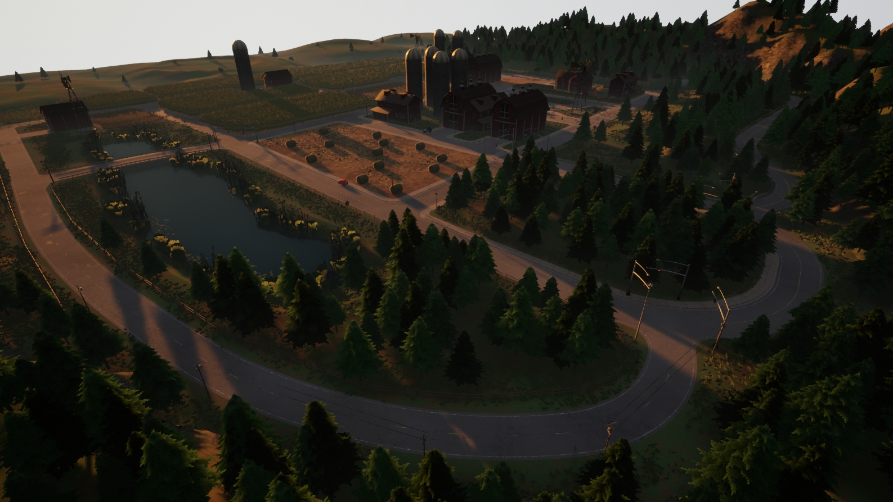
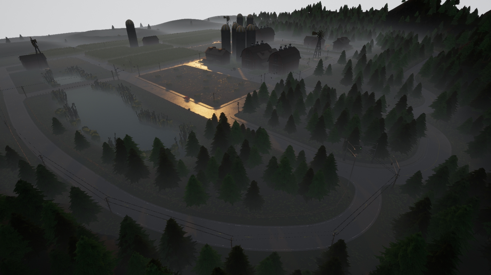
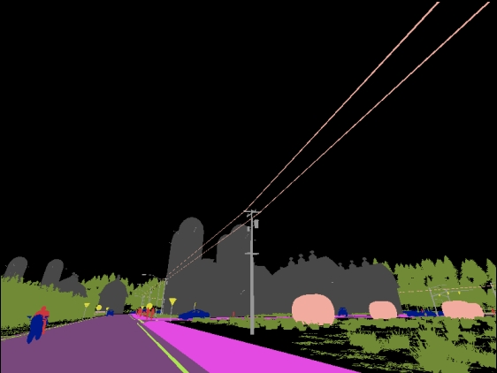
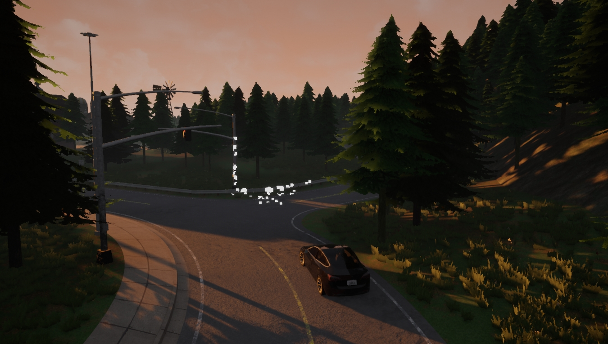
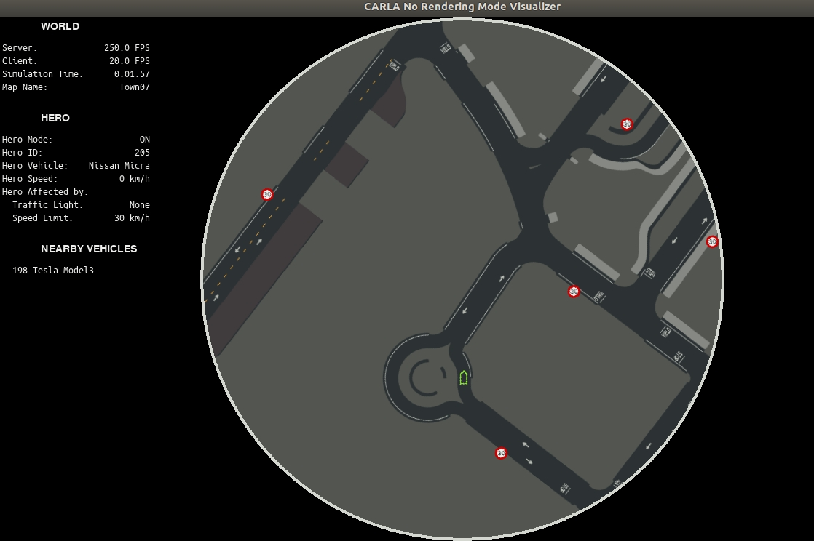

# 检索仿真数据

在 CARLA 中，学习一种有效的方法来检索仿真数据至关重要。这个整体教程适合新手和经验丰富的用户。它从头开始，逐渐深入探讨 Carla 中可用的许多选项。

首先，使用自定义设置和流量初始化仿真。一辆自我车辆将在城市中漫游，可选地配备一些基本传感器。记录仿真，以便以后查询以找到亮点。之后，原始仿真被回放，并被利用到极限。可以添加新的传感器来检索一致的数据。天气条件是可以改变的。记录器甚至可以用于测试具有不同输出的特定场景。 

*   [__概述__](#overview)  
*   [__设置仿真__](#set-the-simulation)  
	*   [地图设置](#map-setting)  
	*   [天气设置](#weather-setting)  
*   [__设置交通流量__](#set-traffic)  
	*   [CARLA 交通和行人](#carla-traffic-and-pedestrians)  
	*   [SUMO 协同仿真交通](#sumo-co-simulation-traffic)  
*   [__设置自我车辆__](#set-the-ego-vehicle)  
	*   [生成自我车辆](#spawn-the-ego-vehicle)  
	*   [放置观察者](#place-the-spectator)  
*   [__设置基本传感器__](#set-basic-sensors)  
	*   [RGB 相机](#rgb-camera)  
	*   [检测器](#detectors)  
	*   [其他传感器](#other-sensors)  
*   [__设置高级传感器__](#set-advanced-sensors)  
	*   [深度相机](#depth-camera)  
	*   [语义分割相机](#semantic-segmentation-camera)  
	*   [激光雷达光线投射传感器](#lidar-raycast-sensor)  
	*   [雷达传感器](#radar-sensor)  
*   [__非渲染模式__](#no-rendering-mode)  
	*   [快速仿真](#simulate-at-a-fast-pace)  
	*   [无需渲染的手动控制](#manual-control-without-rendering)  
*   [__记录和检索数据__](#record-and-retrieve-data)  
	*   [开始记录](#start-recording)  
	*   [捕获并记录](#capture-and-record)  
	*   [停止记录](#stop-recording)  
*   [__利用记录__](#exploit-the-recording)  
	*   [查询事件](#query-the-events)  
	*   [选择一个片段](#choose-a-fragment)  
	*   [检索更多数据](#retrieve-more-data)  
	*   [改变天气](#change-the-weather)  
	*   [尝试新的结果](#try-new-outcomes)  
*   [__教程脚本__](#tutorial-scripts)  

---
## 概述

在检索仿真数据的过程中存在一些常见错误。仿真器中充斥着传感器、存储无用的数据或努力寻找特定事件都是一些例子。然而，可以提供该过程的一些概要。目标是确保数据可以检索和复制，并且可以随意检查和更改仿真。

!!! 笔记
    本教程使用 [__CARLA 0.9.8 deb 包__](start_quickstart.md)。根据您的 CARLA 版本和安装，可能会有细微的变化，特别是在路径方面。

本教程为不同步骤提供了多种选项。一直以来，都会提到不同的脚本。并不是所有的都会被使用，这取决于具体的用例。其中大多数已在 CARLA 中提供用于通用目的。

* __config.py__ 更改仿真设置。地图、渲染选项、设置固定时间步长...  
	* `carla/PythonAPI/util/config.py`
* __dynamic_weather.py__ 创建有趣的天气条件。
	* `carla/PythonAPI/examples/dynamic_weather.py`
* __spawn_npc.py__ spawn_npc.py生成一些人工智能控制的车辆和行人。 
	* `carla/PythonAPI/examples/spawn_npc.py`
* __manual_control.py__ 生成一个自我车辆，并提供对其的控制。
	* `carla/PythonAPI/examples/manual_control.py`

但是，教程中提到的两个脚本在 CARLA 中找不到。它们包含引用的代码片段。这有双重目的。首先，鼓励用户构建自己的脚本。充分理解代码的作用非常重要。除此之外，本教程只是一个大纲，可能而且应该根据用户的喜好而有很大的不同。这两个脚本只是一个示例。

* __tutorial_ego.py__ 生成带有一些基本传感器的自我车辆，并启用自动驾驶仪。观察者被放置在生成位置。记录器从一开始就启动，并在脚本完成时停止。
* __tutorial_replay.py__ 重新执行 __tutorial_ego.py__ 记录的仿真。有不同的代码片段可以查询记录、生成一些高级传感器、改变天气条件以及重新执行记录片段。

完整的代码可以在教程的最后部分找到。请记住，这些并不严格，而是可以定制的。在 CARLA 中检索数据的功能正如用户所希望的那样强大。

!!! 重要
    本教程需要一些 Python 知识。

---
## 设置仿真

要做的第一件事是将仿真设置为所需的环境。

运行 CARLA。 

```sh
cd /opt/carla/bin
./CarlaUE.sh
```

### 地图设置

选择要运行仿真的地图。查看 [地图文档](core_map.md#carla-maps) 以了解有关其特定属性的更多信息。在本教程中，选择 __Town07__ 。

打开一个新终端。使用 __config.py__ 脚本更改地图。


```
cd /opt/carla/PythonAPI/utils
python3 config.py --map Town01
```
该脚本可以启用不同的设置。其中一些将在教程中提及，另一些则不会。下面有一个简短的总结。

<details>
<summary> <b>config.py</b> 中的可选参数  </summary>

```sh
  -h, --help            show this help message and exit
  --host H              IP of the host CARLA Simulator (default: localhost)
  -p P, --port P        TCP port of CARLA Simulator (default: 2000)
  -d, --default         set default settings
  -m MAP, --map MAP     load a new map, use --list to see available maps
  -r, --reload-map      reload current map
  --delta-seconds S     set fixed delta seconds, zero for variable frame rate
  --fps N               set fixed FPS, zero for variable FPS (similar to
                        --delta-seconds)
  --rendering           enable rendering
  --no-rendering        disable rendering
  --no-sync             disable synchronous mode
  --weather WEATHER     set weather preset, use --list to see available
                        presets
  -i, --inspect         inspect simulation
  -l, --list            list available options
  -b FILTER, --list-blueprints FILTER
                        list available blueprints matching FILTER (use '*' to
                        list them all)
  -x XODR_FILE_PATH, --xodr-path XODR_FILE_PATH
                        load a new map with a minimum physical road
                        representation of the provided OpenDRIVE
```
</details>
<br>


<div style="text-align: right"><i>Aerial view of Town07</i></div>

### 天气设置

每个城镇都有适合它的特定天气，但是可以随意设置。有两个脚本提供了解决此问题的不同方法。第一个设置了动态天气，随着时间的推移，情况会发生变化。另一个设置自定义天气条件。还可以对天气条件进行编码。稍后 [天气条件发生变化](#change-the-weather) 时将对此进行介绍。 

* __设置动态天气__ 。打开一个新终端并运行 __dynamic_weather.py__ 。该脚本允许设置天气变化的比率，默认设置是`1.0`。

```sh
cd /opt/carla/PythonAPI/examples

python3 dynamic_weather.py --speed 1.0
```

* __设置自定义条件__ 使用脚本 __environment.py__ 。有很多可能的设置。查看可选参数以及 [carla.WeatherParameters](python_api.md#carla.WeatherParameters) 的文档。

```sh
cd /opt/carla/PythonAPI/util
python3 environment.py --clouds 100 --rain 80 --wetness 100 --puddles 60 --wind 80 --fog 50

```
<details>
<summary> <b>environment.py</b> 中的可选参数 </summary>

```sh
  -h, --help            show this help message and exit
  --host H              IP of the host server (default: 127.0.0.1)
  -p P, --port P        TCP port to listen to (default: 2000)
  --sun SUN             Sun position presets [sunset | day | night]
  --weather WEATHER     Weather condition presets [clear | overcast | rain]
  --altitude A, -alt A  Sun altitude [-90.0, 90.0]
  --azimuth A, -azm A   Sun azimuth [0.0, 360.0]
  --clouds C, -c C      Clouds amount [0.0, 100.0]
  --rain R, -r R        Rain amount [0.0, 100.0]
  --puddles Pd, -pd Pd  Puddles amount [0.0, 100.0]
  --wind W, -w W        Wind intensity [0.0, 100.0]
  --fog F, -f F         Fog intensity [0.0, 100.0]
  --fogdist Fd, -fd Fd  Fog Distance [0.0, inf)
  --wetness Wet, -wet Wet
                        Wetness intensity [0.0, 100.0]
```
</details>
<br>


<div style="text-align: right"><i>Weather changes applied</i></div>

---
## 设置交通流量

仿真交通是让地图栩栩如生的最佳方法之一。还需要检索城市环境的数据。在 CARLA 中有不同的选择可以实现这一点。

### CARLA 交通和行人

CARLA 交通流量由 [交通管理器](adv_traffic_manager.md) 模块管理。至于行人，他们每个人都有自己的[carla.WalkerAIController](python_api.md#carla.WalkerAIController)。

打开一个新终端，然后运行 __spawn_npc.py__ 来生成车辆和步行者。让我们生成 50 辆车和相同数量的步行者。

```sh
cd /opt/carla/PythonAPI/examples
python3 spawn_npc.py -n 50 -w 50 --safe
```
<details>
<summary> <b>spawn_npc.py</b> 中的可选参数 </summary>

```sh
  -h, --help            show this help message and exit
  --host H              IP of the host server (default: 127.0.0.1)
  -p P, --port P        TCP port to listen to (default: 2000)
  -n N, --number-of-vehicles N
                        number of vehicles (default: 10)
  -w W, --number-of-walkers W
                        number of walkers (default: 50)
  --safe                avoid spawning vehicles prone to accidents
  --filterv PATTERN     vehicles filter (default: "vehicle.*")
  --filterw PATTERN     pedestrians filter (default: "walker.pedestrian.*")
  -tm_p P, --tm-port P  port to communicate with TM (default: 8000)
  --async               Asynchronous mode execution
```
</details>
<br>

<div style="text-align: right"><i>Vehicles spawned to simulate traffic.</i></div>

### SUMO 协同仿真交通

CARLA 可以与 SUMO 运行联合仿真。这允许在 SUMO 中创建将传播到 CARLA 的交通流量。这种联合仿真是双向的。在 CARLA 中生成的车辆将在 SUMO 中生成。有关此功能的具体文档可以在 [此处](adv_sumo.md) 找到。

此功能适用于 CARLA 0.9.8 及更高版本的 __Town01__ 、__Town04__ 和 __Town05__。第一个是最稳定的。

!!! 笔记
    联合仿真将在 CARLA 中启用同步模式。阅读 [文档](adv_synchrony_timestep.md) 以了解更多相关信息。

* 首先，安装SUMO。 
```sh
sudo add-apt-repository ppa:sumo/stable
sudo apt-get update
sudo apt-get install sumo sumo-tools sumo-doc
```
* 设置环境变量 SUMO_HOME。
```sh
echo "export SUMO_HOME=/usr/share/sumo" >> ~/.bashrc && source ~/.bashrc
```
* 在 CARLA 服务器打开的情况下，运行 [SUMO-CARLA 同步脚本](https://github.com/carla-simulator/carla/blob/master/Co-Simulation/Sumo/run_synchronization.py) 。 
```sh
cd ~/carla/Co-Simulation/Sumo
python3 run_synchronization.py examples/Town01.sumocfg --sumo-gui
```
* SUMO 窗口应该已打开。__按“运行”__ 以在两个仿真中启动交通流量。
```
> "Play" on SUMO window.
```

该脚本生成的流量是 CARLA 团队创建的示例。默认情况下，它会沿着相同的路线生成相同的车辆。用户可以在 SUMO 中更改这些内容。


<div style="text-align: right"><i>SUMO and CARLA co-simulating traffic.</i></div>

!!! 警告
    目前，SUMO 联合仿真还是测试版功能。车辆没有物理特性，也不考虑 CARLA 交通灯。

---
## 设置自我车辆

从现在到记录器停止的那一刻，将会有一些属于 __tutorial_ego.py__ 的代码片段。该脚本生成自我车辆，可选一些传感器，并记录仿真，直到用户完成脚本。

### 生成自我车辆

用户控制的车辆在 CARLA 中通常通过将属性 `role_name` 设置为 `ego` 来区分。可以设置其他属性，其中一些具有推荐值。

下面，从 [蓝图库](bp_library.md) 中检索特斯拉模型，并使用随机推荐的颜色生成。选择地图推荐的生成点之一来放置自我车辆。

```py        
# --------------
# Spawn ego vehicle
# --------------
ego_bp = world.get_blueprint_library().find('vehicle.tesla.model3')
ego_bp.set_attribute('role_name','ego')
print('\nEgo role_name is set')
ego_color = random.choice(ego_bp.get_attribute('color').recommended_values)
ego_bp.set_attribute('color',ego_color)
print('\nEgo color is set')

spawn_points = world.get_map().get_spawn_points()
number_of_spawn_points = len(spawn_points)

if 0 < number_of_spawn_points:
    random.shuffle(spawn_points)
    ego_transform = spawn_points[0]
    ego_vehicle = world.spawn_actor(ego_bp,ego_transform)
    print('\nEgo is spawned')
else: 
    logging.warning('Could not found any spawn points')
```

### 放置观察者

观察者参与者控制仿真视图。通过脚本移动它是可选的，但它可能有助于找到自我车辆。 

```py
# --------------
# Spectator on ego position
# --------------
spectator = world.get_spectator()
world_snapshot = world.wait_for_tick() 
spectator.set_transform(ego_vehicle.get_transform())
```

---
## 设置基本传感器

生成任何传感器的过程都非常相似。 

__1.__ 使用库查找传感器蓝图。
__2.__ 设置传感器的特定属性。这一点至关重要。属性将塑造检索到的数据。
__3.__ 将传感器连接至自我车辆。该变换是相对于其父级的。[carla.AttachmentType](python_api.md#carlaattachmenttype) 将确定传感器位置的更新方式。 
__4.__ 添加`listen()`方法。这是关键要素。每次传感器侦听数据时都会调用的 [__lambda__](https://www.w3schools.com/python/python_lambda.asp) 方法。参数是检索到的传感器数据。 

牢记这一基本准则，让我们为自我车辆设置一些基本传感器。

### RGB 相机

[RGB 相机](ref_sensors.md#rgb-camera) 生成逼真的场景图片。它是所有传感器中可设置属性较多的传感器，但它也是一个基本的传感器。它应该被理解为一个真正的相机，具有诸如`focal_distance`、`shutter_speed`或`gamma`确定其内部如何工作的属性。还有一组特定的属性来定义镜头畸变，以及许多高级属性。例如，`lens_circle_multiplier`可以用来实现类似于眼睛鱼镜头的效果。在文档中了解有关它们的更多信息。

为了简单起见，脚本仅设置该传感器最常用的属性。 

* __`image_size_x` 和 `image_size_y`__ 将改变输出图像的分辨率。 
* __`fov`__ 是相机的水平视野。  

设置属性后，就可以生成传感器了。脚本将摄像机放置在汽车引擎盖中，并指向前方。它将捕捉汽车的前视图。

每一步都会以 [carla.Image](python_api.md#carla.Image) 的形式检索数据。Listen 方法将它们保存到磁盘。路径可以随意改变。每张图像的名称均根据拍摄镜头的模拟帧进行编码。 

```py
# --------------
# Spawn attached RGB camera
# --------------
cam_bp = None
cam_bp = world.get_blueprint_library().find('sensor.camera.rgb')
cam_bp.set_attribute("image_size_x",str(1920))
cam_bp.set_attribute("image_size_y",str(1080))
cam_bp.set_attribute("fov",str(105))
cam_location = carla.Location(2,0,1)
cam_rotation = carla.Rotation(0,180,0)
cam_transform = carla.Transform(cam_location,cam_rotation)
ego_cam = world.spawn_actor(cam_bp,cam_transform,attach_to=ego_vehicle, attachment_type=carla.AttachmentType.Rigid)
ego_cam.listen(lambda image: image.save_to_disk('tutorial/output/%.6d.jpg' % image.frame))
```

<div style="text-align: right"><i>RGB camera output</i></div>

### 检测器

当它们所附加的对象注册特定事件时，这些传感器会检索数据。检测器传感器分为三种类型，每种都描述一种类型的事件。

* [__碰撞检测器。__](ref_sensors.md#collision-detector) 检索其父级与其他参与者之间的碰撞。
* [__车道入侵检测器。__](ref_sensors.md#lane-invasion-detector) 当其父级穿过车道标记时进行注册。
* [__障碍物检测器。__](ref_sensors.md#obstacle-detector) 检测其父级前方可能存在的障碍物。

他们检索到的数据将有助于稍后决定要重新执行仿真的哪一部分。事实上，可以使用记录器显式查询冲突。这是准备打印的。

只有障碍物检测器蓝图有需要设置的属性。以下是一些重要的内容。

* __`sensor_tick`__ 设置传感器仅在 `x` 秒钟后检索数据。这是检索每一步数据的传感器的常见属性。 
* __`distance` 和 `hit-radius`__ 塑造用于检测前方障碍物的调试线。
* __`only_dynamics`__ 确定是否应考虑静态对象。默认情况下，任何对象都会被考虑。

该脚本将障碍物检测器设置为仅考虑动态对象。如果车辆与任何静态物体发生碰撞，碰撞传感器都会检测到。

```py
# --------------
# Add collision sensor to ego vehicle. 
# --------------

col_bp = world.get_blueprint_library().find('sensor.other.collision')
col_location = carla.Location(0,0,0)
col_rotation = carla.Rotation(0,0,0)
col_transform = carla.Transform(col_location,col_rotation)
ego_col = world.spawn_actor(col_bp,col_transform,attach_to=ego_vehicle, attachment_type=carla.AttachmentType.Rigid)
def col_callback(colli):
    print("Collision detected:\n"+str(colli)+'\n')
ego_col.listen(lambda colli: col_callback(colli))

# --------------
# Add Lane invasion sensor to ego vehicle. 
# --------------

lane_bp = world.get_blueprint_library().find('sensor.other.lane_invasion')
lane_location = carla.Location(0,0,0)
lane_rotation = carla.Rotation(0,0,0)
lane_transform = carla.Transform(lane_location,lane_rotation)
ego_lane = world.spawn_actor(lane_bp,lane_transform,attach_to=ego_vehicle, attachment_type=carla.AttachmentType.Rigid)
def lane_callback(lane):
    print("Lane invasion detected:\n"+str(lane)+'\n')
ego_lane.listen(lambda lane: lane_callback(lane))

# --------------
# Add Obstacle sensor to ego vehicle. 
# --------------

obs_bp = world.get_blueprint_library().find('sensor.other.obstacle')
obs_bp.set_attribute("only_dynamics",str(True))
obs_location = carla.Location(0,0,0)
obs_rotation = carla.Rotation(0,0,0)
obs_transform = carla.Transform(obs_location,obs_rotation)
ego_obs = world.spawn_actor(obs_bp,obs_transform,attach_to=ego_vehicle, attachment_type=carla.AttachmentType.Rigid)
def obs_callback(obs):
    print("Obstacle detected:\n"+str(obs)+'\n')
ego_obs.listen(lambda obs: obs_callback(obs))
```

<div style="text-align: right"><i>Output for detector sensors</i></div>

### 其他传感器

暂时只考虑该类别的两个传感器。

* [__全球导航卫星系统传感器。__](ref_sensors.md#gnss-sensor) 检索传感器的地理位置。
* [__IMU 传感器。__](ref_sensors.md#imu-sensor) 包括加速度计、陀螺仪和指南针。

为了获得车辆对象的一般测量值，这两个传感器以车辆对象为中心生成。

这些传感器可用的属性主要设置测量噪声模型中的平均值或标准偏差参数。这对于获得更现实的措施很有用。然而，在 __tutorial_ego.py__ 中只设置了一个属性。

* __`sensor_tick`__. 由于此测量值在步骤之间不应有显着变化，因此可以经常检索数据。在本例中，设置为每三秒打印一次。 

```py
# --------------
# Add GNSS sensor to ego vehicle. 
# --------------

gnss_bp = world.get_blueprint_library().find('sensor.other.gnss')
gnss_location = carla.Location(0,0,0)
gnss_rotation = carla.Rotation(0,0,0)
gnss_transform = carla.Transform(gnss_location,gnss_rotation)
gnss_bp.set_attribute("sensor_tick",str(3.0))
ego_gnss = world.spawn_actor(gnss_bp,gnss_transform,attach_to=ego_vehicle, attachment_type=carla.AttachmentType.Rigid)
def gnss_callback(gnss):
    print("GNSS measure:\n"+str(gnss)+'\n')
ego_gnss.listen(lambda gnss: gnss_callback(gnss))

# --------------
# Add IMU sensor to ego vehicle. 
# --------------

imu_bp = world.get_blueprint_library().find('sensor.other.imu')
imu_location = carla.Location(0,0,0)
imu_rotation = carla.Rotation(0,0,0)
imu_transform = carla.Transform(imu_location,imu_rotation)
imu_bp.set_attribute("sensor_tick",str(3.0))
ego_imu = world.spawn_actor(imu_bp,imu_transform,attach_to=ego_vehicle, attachment_type=carla.AttachmentType.Rigid)
def imu_callback(imu):
    print("IMU measure:\n"+str(imu)+'\n')
ego_imu.listen(lambda imu: imu_callback(imu))
```


<div style="text-align: right"><i>GNSS and IMU sensors output</i></div>

---
## 设置高级传感器

脚本 __tutorial_replay.py__ 除其他外还包含更多传感器的定义。它们的工作方式与基本的相同，但理解可能有点困难。

### 深度相机

[深度相机](ref_sensors.md#depth-camera) 生成场景的图片，将每个像素映射到灰度深度图中。然而，输出并不简单。相机的深度缓冲区使用 RGB 颜色空间进行映射。必须将其转换为灰度才能理解。

为此，只需将图像保存为 RGB 相机的图像，但对其应用[carla.ColorConverter](python_api.md#carla.ColorConverter) 即可。深度相机有两种可用的转换。

* __carla.ColorConverter.Depth__ 以毫米级精度转换原始深度。
* __carla.ColorConverter.LogarithmicDepth__ 也具有毫米级粒度，但在近距离内提供更好的结果，而对于较远的元素则稍差一些。

深度相机的属性仅设置之前在 RGB 相机中所述的元素：`fov`、`image_size_x`、`image_size_y`和`sensor_tick`。该脚本将此传感器设置为与之前使用的 RGB 相机相匹配。

```py
# --------------
# Add a Depth camera to ego vehicle. 
# --------------
depth_cam = None
depth_bp = world.get_blueprint_library().find('sensor.camera.depth')
depth_location = carla.Location(2,0,1)
depth_rotation = carla.Rotation(0,180,0)
depth_transform = carla.Transform(depth_location,depth_rotation)
depth_cam = world.spawn_actor(depth_bp,depth_transform,attach_to=ego_vehicle, attachment_type=carla.AttachmentType.Rigid)
# This time, a color converter is applied to the image, to get the semantic segmentation view
depth_cam.listen(lambda image: image.save_to_disk('tutorial/new_depth_output/%.6d.jpg' % image.frame,carla.ColorConverter.LogarithmicDepth))
```


<div style="text-align: right"><i>Depth camera output. Simple conversion on the left, logarithmic on the right.</i></div>

### 语义分割相机

[语义分割相机](ref_sensors.md#semantic-segmentation-camera) 根据元素的标记方式将场景中的元素渲染为不同的颜色。标签由仿真器根据用于生成的资源的路径创建。例如，标记为 `Pedestrians` 的网格体是使用存储在 `Unreal/CarlaUE4/Content/Static/Pedestrians` 中的内容生成的。

与任何相机一样，输出是图像，但每个像素都包含在红色通道中编码的标签。必须使用 __ColorConverter.CityScapesPalette__ 转换此原始图像。可以创建新标签，请阅读 [文档](ref_sensors.md#semantic-segmentation-camera) 了解更多信息。

该相机可用的属性与深度相机完全相同。该脚本还将其设置为与原始 RGB 相机相匹配。

```py
# --------------
# Add a new semantic segmentation camera to my ego
# --------------
sem_cam = None
sem_bp = world.get_blueprint_library().find('sensor.camera.semantic_segmentation')
sem_bp.set_attribute("image_size_x",str(1920))
sem_bp.set_attribute("image_size_y",str(1080))
sem_bp.set_attribute("fov",str(105))
sem_location = carla.Location(2,0,1)
sem_rotation = carla.Rotation(0,180,0)
sem_transform = carla.Transform(sem_location,sem_rotation)
sem_cam = world.spawn_actor(sem_bp,sem_transform,attach_to=ego_vehicle, attachment_type=carla.AttachmentType.Rigid)
# This time, a color converter is applied to the image, to get the semantic segmentation view
sem_cam.listen(lambda image: image.save_to_disk('tutorial/new_sem_output/%.6d.jpg' % image.frame,carla.ColorConverter.CityScapesPalette))
```


<div style="text-align: right"><i>Semantic segmentation camera output</i></div>

### 激光雷达光线投射传感器

[激光雷达传感器](ref_sensors.md#lidar-raycast-sensor) 仿真旋转激光雷达。它创建了一个以三维形式映射场景的点云。激光雷达包含一组以特定频率旋转的激光器。激光投射撞击距离，并将每次射击存储为一个点。

可以使用不同的传感器属性来设置激光器阵列的布置方式。

* __`upper_fov` 和 `lower_fov`__ 分别是最高和最低激光的角度。
* __`channels`__ 设置要使用的激光数量。这些沿着所需的  _fov_ 分布。

其他属性设置该点的计算方式。它们确定每个激光器每一步计算的点数： `points_per_second / (FPS * channels)`.  

* __`range`__ 是捕获的最大距离。
* __`points_per_second`__ 是每秒获得的点数。该数量除以 `channels`的数量。
* __`rotation_frequency`__ 是激光雷达每秒旋转的次数。

点云输出被描述为 [carla.LidarMeasurement]。它可以作为 [carla.Location] 列表进行迭代或保存为 _.ply_ 标准文件格式。

```py
# --------------
# Add a new LIDAR sensor to my ego
# --------------
lidar_cam = None
lidar_bp = world.get_blueprint_library().find('sensor.lidar.ray_cast')
lidar_bp.set_attribute('channels',str(32))
lidar_bp.set_attribute('points_per_second',str(90000))
lidar_bp.set_attribute('rotation_frequency',str(40))
lidar_bp.set_attribute('range',str(20))
lidar_location = carla.Location(0,0,2)
lidar_rotation = carla.Rotation(0,0,0)
lidar_transform = carla.Transform(lidar_location,lidar_rotation)
lidar_sen = world.spawn_actor(lidar_bp,lidar_transform,attach_to=ego_vehicle)
lidar_sen.listen(lambda point_cloud: point_cloud.save_to_disk('tutorial/new_lidar_output/%.6d.ply' % point_cloud.frame))
```

_.ply_ 输出可以使用 __Meshlab__ 进行可视化。

__1.__ 安装 [Meshlab](http://www.meshlab.net/#download) 。
```sh
sudo apt-get update -y
sudo apt-get install -y meshlab
```
__2.__ 打开 Meshlab 。
```sh
meshlab
```
__3.__ 打开其中一个 _.ply_ 文件。 `File > Import mesh...` 


<div style="text-align: right"><i>经过Meshlab处理后的激光雷达输出。</i></div>

### 雷达传感器

[雷达传感器](ref_sensors.md#radar-sensor) 与 激光雷达类似。它创建一个圆锥视图，并向内部发射激光以射线投射其影响。输出是[carla.RadarMeasurement](python_api.md#carlaradarmeasurement)。它包含由激光器检索到的 [carla.RadarDetection](python_api.md#carlaradardetection) 的列表。这些不是空间中的点，而是使用有关传感器的数据进行的检测：

该传感器的属性主要决定了激光器的定位方式。

* __`horizontal_fov` 和 `vertical_fov`__ 确定圆锥视图的振幅。
* __`channels`__ 置要使用的激光数量。这些沿着所需 `fov` 的分布。
* __`range`__ 是激光光线投射的最大距离。
* __`points_per_second`__ 设置要捕获的点的数量，这些点将在指定的通道之间分配。 

The script places the sensor on the hood of the car, and rotated a bit upwards. That way, the output will map the front view of the car. The `horizontal_fov` is incremented, and the `vertical_fov` diminished. The area of interest is specially the height where vehicles and walkers usually move on. The `range` is also changed from 100m to 10m, in order to retrieve data only right ahead of the vehicle. 

The callback is a bit more complex this time, showing more of its capabilities. It will draw the points captured by the radar on the fly. The points will be colored depending on their velocity regarding the ego vehicle.  

* __Blue__ for points approaching the vehicle.  
* __Read__ for points moving away from it. 
* __White__ for points static regarding the ego vehicle. 

```py
# --------------
# Add a new radar sensor to my ego
# --------------
rad_cam = None
rad_bp = world.get_blueprint_library().find('sensor.other.radar')
rad_bp.set_attribute('horizontal_fov', str(35))
rad_bp.set_attribute('vertical_fov', str(20))
rad_bp.set_attribute('range', str(20))
rad_location = carla.Location(x=2.0, z=1.0)
rad_rotation = carla.Rotation(pitch=5)
rad_transform = carla.Transform(rad_location,rad_rotation)
rad_ego = world.spawn_actor(rad_bp,rad_transform,attach_to=ego_vehicle, attachment_type=carla.AttachmentType.Rigid)
def rad_callback(radar_data):
    velocity_range = 7.5 # m/s
    current_rot = radar_data.transform.rotation
    for detect in radar_data:
        azi = math.degrees(detect.azimuth)
        alt = math.degrees(detect.altitude)
        # The 0.25 adjusts a bit the distance so the dots can
        # be properly seen
        fw_vec = carla.Vector3D(x=detect.depth - 0.25)
        carla.Transform(
            carla.Location(),
            carla.Rotation(
                pitch=current_rot.pitch + alt,
                yaw=current_rot.yaw + azi,
                roll=current_rot.roll)).transform(fw_vec)

        def clamp(min_v, max_v, value):
            return max(min_v, min(value, max_v))

        norm_velocity = detect.velocity / velocity_range # range [-1, 1]
        r = int(clamp(0.0, 1.0, 1.0 - norm_velocity) * 255.0)
        g = int(clamp(0.0, 1.0, 1.0 - abs(norm_velocity)) * 255.0)
        b = int(abs(clamp(- 1.0, 0.0, - 1.0 - norm_velocity)) * 255.0)
        world.debug.draw_point(
            radar_data.transform.location + fw_vec,
            size=0.075,
            life_time=0.06,
            persistent_lines=False,
            color=carla.Color(r, g, b))
rad_ego.listen(lambda radar_data: rad_callback(radar_data))
```


<div style="text-align: right"><i>Radar output. The vehicle is stopped at a traffic light, so the static elements in front of it appear in white.</i></div>

---
## 非渲染模式

The [no-rendering mode](adv_rendering_options.md) can be useful to run an initial simulation that will be later played again to retrieve data. Especially if this simulation has some extreme conditions, such as dense traffic.  

### 快速仿真

Disabling the rendering will save up a lot of work to the simulation. As the GPU is not used, the server can work at full speed. This could be useful to simulate complex conditions at a fast pace. The best way to do so would be by setting a fixed time-step. Running an asynchronous server with a fixed time-step and no rendering, the only limitation for the simulation would be the inner logic of the server.  

The same `config.py` used to [set the map](#map-setting) can disable rendering, and set a fixed time-step. 

```
cd /opt/carla/PythonAPI/utils
python3 config.py --no-rendering --delta-seconds 0.05 # Never greater than 0.1s
```

!!! Warning
    Read the [documentation](adv_synchrony_timestep.md) before messing around with with synchrony and time-step.

### 无需渲染的手动控制

The script `PythonAPI/examples/no_rendering_mode.py` provides an overview of the simulation. It creates a minimalistic aerial view with Pygame, that will follow the ego vehicle. This could be used along with __manual_control.py__ to generate a route with barely no cost, record it, and then play it back and exploit it to gather data. 

```
cd /opt/carla/PythonAPI/examples
python3 manual_control.py
```

```
cd /opt/carla/PythonAPI/examples
python3 no_rendering_mode.py --no-rendering
```

<details>
<summary> Optional arguments in <b>no_rendering_mode.py</b> </summary>

```sh
  -h, --help           show this help message and exit
  -v, --verbose        print debug information
  --host H             IP of the host server (default: 127.0.0.1)
  -p P, --port P       TCP port to listen to (default: 2000)
  --res WIDTHxHEIGHT   window resolution (default: 1280x720)
  --filter PATTERN     actor filter (default: "vehicle.*")
  --map TOWN           start a new episode at the given TOWN
  --no-rendering       switch off server rendering
  --show-triggers      show trigger boxes of traffic signs
  --show-connections   show waypoint connections
  --show-spawn-points  show recommended spawn points
```
</details>
<br>


<div style="text-align: right"><i>no_rendering_mode.py working in Town07</i></div>

!!! Note
    In this mode, GPU-based sensors will retrieve empty data. Cameras are useless, but other sensors such as detectors will work properly. 

---
## 记录和检索数据

### 开始记录

The [__recorder__](adv_recorder.md) can be started at anytime. The script does it at the very beginning, in order to capture everything, including the spawning of the first actors. If no path is detailed, the log will be saved into `CarlaUE4/Saved`. 

```py
# --------------
# Start recording
# --------------
client.start_recorder('~/tutorial/recorder/recording01.log')
```

### 捕获并记录

There are many different ways to do this. Mostly it goes down as either let it roam around or control it manually. The data for the sensors spawned will be retrieved on the fly. Make sure to check it while recording, to make sure everything is set properly.  

* __Enable the autopilot.__ This will register the vehicle to the [Traffic Manager](adv_traffic_manager.md). It will roam around the city endlessly. The script does this, and creates a loop to prevent the script from finishing. The recording will go on until the user finishes the script. Alternatively, a timer could be set to finish the script after a certain time.  

```py
# --------------
# Capture data
# --------------
ego_vehicle.set_autopilot(True)
print('\nEgo autopilot enabled')

while True:
    world_snapshot = world.wait_for_tick()
```

* __Manual control.__ Run the script `PythonAPI/examples/manual_control.py` in a client, and the recorder in another one. Drive the ego vehicle around to create the desired route, and stop the recorder when finished. The __tutorial_ego.py__ script can be used to manage the recorder, but make sure to comment other fragments of code.  

```
cd /opt/carla/PythonAPI/examples
python3 manual_control.py
```

!!! Note
    To avoid rendering and save up computational cost, enable [__no rendering mode__](adv_rendering_options.md#no-rendering-mode). The script `/PythonAPI/examples/no_rendering_mode.py` does this while creating a simple aerial view.  

### 停止记录 

The stop call is even simpler than the start call was. When the recorder is done, the recording will be saved in the path stated previously. 

```py
# --------------
# Stop recording
# --------------
client.stop_recorder()
```

---
## 利用记录

So far, a simulation has been recorded. Now, it is time to examine the recording, find the most remarkable moments, and work with them. These steps are gathered in the script, __tutorial_replay.py__.  The outline is structured in different segments of code commented.  

It is time to run a new simulation. 

```sh
./CarlaUE4.sh
```
To reenact the simulation, [choose a fragment](#choose-a-fragment) and run the script containing the code for the playback.  

```sh
python3 tuto_replay.py
```

### 查询事件

The different queries are detailed in the [__recorder documentation__](adv_recorder.md). In summary, they retrieve data for specific events or frames. Use the queries to study the recording. Find the spotlight moments, and trace what can be of interest.  

```py
# --------------
# Query the recording
# --------------
# Show only the most important events in the recording.  
print(client.show_recorder_file_info("~/tutorial/recorder/recording01.log",False))
# Show actors not moving 1 meter in 10 seconds.  
print(client.show_recorder_actors_blocked("~/tutorial/recorder/recording01.log",10,1))
# Filter collisions between vehicles 'v' and 'a' any other type of actor.  
print(client.show_recorder_collisions("~/tutorial/recorder/recording01.log",'v','a'))
```

!!! Note
    The recorder does not need to be on, in order to do the queries.


<div style="text-align: right"><i>Query showing important events. This is the frame where the ego vehicle was spawned.</i></div>


<div style="text-align: right"><i>Query showing actors blocked. In this simulation, the ego vehicle remained blocked for 100 seconds.</i></div>


<div style="text-align: right"><i>Query showing a collision between the ego vehicle and an object of type "other".</i></div>

!!! Note
    Getting detailed file info for every frame can be overwhelming. Use it after other queries to know where to look at. 

### 选择一个片段

After the queries, it may be a good idea play some moments of the simulation back, before messing around. It is very simple to do so, and it could be really helpful. Know more about the simulation. It is the best way to save time later.  

The method allows to choose the beginning and ending point of the playback, and an actor to follow. 

```py
# --------------
# Reenact a fragment of the recording
# --------------
client.replay_file("~/tutorial/recorder/recording01.log",45,10,0)
```

Here is a list of possible things to do now. 

* __Use the information from the queries.__ Find out the moment and the actors involved in an event, and play that again. Start the recorder a few seconds before the event.  
* __Follow different actors.__ Different perspectives will show new events that are not included in the queries.  
* __Rom around with a free spectator view.__ Set the `actor_id` to `0`, and get a general view of the simulation. Be wherever and whenever wanted thanks to the recording.  

!!! Note
    When the recording stops, the simulation doesn't. Walkers will stand still, and vehicles will continue roaming around. This may happen either if the log ends, or the playback gets to the ending point stated. 

### 检索更多数据

The recorder will recreate in this simulation, the exact same conditions as the original. That ensures consistent data within different playbacks.  

Gather a list of the important moments, actors and events. Add sensors whenever needed and play the simulation back. The process is exactly the same as before. The script __tutorial_replay.py__ provides different examples that have been thoroughly explained in the [__Set advanced sensors__](#set-advanced-sensors) section. Others have been explained in the section [__Set basic sensors__](#set-basic-sensors). 

Add as many sensors as needed, wherever they are needed. Play the simulation back as many times as desired and retrieve as much data as desired.  

### 改变天气

The recording will recreate the original weather conditions. However, these can be altered at will. This may be interesting to compare how does it affect sensors, while mantaining the rest of events the same.  

Get the current weather and modify it freely. Remember that [carla.WeatherParameters](python_api.md#carla.WeatherParameters) has some presets available. The script will change the environment to a foggy sunset. 

```py
# --------------
# Change weather for playback
# --------------
weather = world.get_weather()
weather.sun_altitude_angle = -30
weather.fog_density = 65
weather.fog_distance = 10
world.set_weather(weather)
```

### 尝试新的结果

The new simulation is not strictly linked to the recording. It can be modified anytime, and even when the recorder stops, the simulation goes on. 

This can be profitable for the user. For instance, collisions can be forced or avoided by playing back the simulation a few seconds before, and spawning or destroying an actor. Ending the recording at a specific moment can also be useful. Doing so, vehicles may take different paths. 

Change the conditions and mess with the simulation. There is nothing to lose, as the recorder grants that the initial simulation can always be reenacted. This is the key to exploit the full potential of CARLA. 

---
## 教程脚本

Hereunder are the two scripts gathering the fragments of code for this tutorial. Most of the code is commented, as it is meant to be modified to fit specific purposes.

<details>
<summary><b>tutorial_ego.py</b> </summary>

```py
import glob
import os
import sys
import time

try:
    sys.path.append(glob.glob('../carla/dist/carla-*%d.%d-%s.egg' % (
        sys.version_info.major,
        sys.version_info.minor,
        'win-amd64' if os.name == 'nt' else 'linux-x86_64'))[0])
except IndexError:
    pass

import carla

import argparse
import logging
import random


def main():
    argparser = argparse.ArgumentParser(
        description=__doc__)
    argparser.add_argument(
        '--host',
        metavar='H',
        default='127.0.0.1',
        help='IP of the host server (default: 127.0.0.1)')
    argparser.add_argument(
        '-p', '--port',
        metavar='P',
        default=2000,
        type=int,
        help='TCP port to listen to (default: 2000)')
    args = argparser.parse_args()

    logging.basicConfig(format='%(levelname)s: %(message)s', level=logging.INFO)

    client = carla.Client(args.host, args.port)
    client.set_timeout(10.0)

    try:

        world = client.get_world()
        ego_vehicle = None
        ego_cam = None
        ego_col = None
        ego_lane = None
        ego_obs = None
        ego_gnss = None
        ego_imu = None

        # --------------
        # Start recording
        # --------------
        """
        client.start_recorder('~/tutorial/recorder/recording01.log')
        """

        # --------------
        # Spawn ego vehicle
        # --------------
        """
        ego_bp = world.get_blueprint_library().find('vehicle.tesla.model3')
        ego_bp.set_attribute('role_name','ego')
        print('\nEgo role_name is set')
        ego_color = random.choice(ego_bp.get_attribute('color').recommended_values)
        ego_bp.set_attribute('color',ego_color)
        print('\nEgo color is set')

        spawn_points = world.get_map().get_spawn_points()
        number_of_spawn_points = len(spawn_points)

        if 0 < number_of_spawn_points:
            random.shuffle(spawn_points)
            ego_transform = spawn_points[0]
            ego_vehicle = world.spawn_actor(ego_bp,ego_transform)
            print('\nEgo is spawned')
        else: 
            logging.warning('Could not found any spawn points')
        """

        # --------------
        # Add a RGB camera sensor to ego vehicle. 
        # --------------
        """
        cam_bp = None
        cam_bp = world.get_blueprint_library().find('sensor.camera.rgb')
        cam_bp.set_attribute("image_size_x",str(1920))
        cam_bp.set_attribute("image_size_y",str(1080))
        cam_bp.set_attribute("fov",str(105))
        cam_location = carla.Location(2,0,1)
        cam_rotation = carla.Rotation(0,180,0)
        cam_transform = carla.Transform(cam_location,cam_rotation)
        ego_cam = world.spawn_actor(cam_bp,cam_transform,attach_to=ego_vehicle, attachment_type=carla.AttachmentType.Rigid)
        ego_cam.listen(lambda image: image.save_to_disk('~/tutorial/output/%.6d.jpg' % image.frame))
        """

        # --------------
        # Add collision sensor to ego vehicle. 
        # --------------
        """
        col_bp = world.get_blueprint_library().find('sensor.other.collision')
        col_location = carla.Location(0,0,0)
        col_rotation = carla.Rotation(0,0,0)
        col_transform = carla.Transform(col_location,col_rotation)
        ego_col = world.spawn_actor(col_bp,col_transform,attach_to=ego_vehicle, attachment_type=carla.AttachmentType.Rigid)
        def col_callback(colli):
            print("Collision detected:\n"+str(colli)+'\n')
        ego_col.listen(lambda colli: col_callback(colli))
        """

        # --------------
        # Add Lane invasion sensor to ego vehicle. 
        # --------------
        """
        lane_bp = world.get_blueprint_library().find('sensor.other.lane_invasion')
        lane_location = carla.Location(0,0,0)
        lane_rotation = carla.Rotation(0,0,0)
        lane_transform = carla.Transform(lane_location,lane_rotation)
        ego_lane = world.spawn_actor(lane_bp,lane_transform,attach_to=ego_vehicle, attachment_type=carla.AttachmentType.Rigid)
        def lane_callback(lane):
            print("Lane invasion detected:\n"+str(lane)+'\n')
        ego_lane.listen(lambda lane: lane_callback(lane))
        """
        
        # --------------
        # Add Obstacle sensor to ego vehicle. 
        # --------------
        """
        obs_bp = world.get_blueprint_library().find('sensor.other.obstacle')
        obs_bp.set_attribute("only_dynamics",str(True))
        obs_location = carla.Location(0,0,0)
        obs_rotation = carla.Rotation(0,0,0)
        obs_transform = carla.Transform(obs_location,obs_rotation)
        ego_obs = world.spawn_actor(obs_bp,obs_transform,attach_to=ego_vehicle, attachment_type=carla.AttachmentType.Rigid)
        def obs_callback(obs):
            print("Obstacle detected:\n"+str(obs)+'\n')
        ego_obs.listen(lambda obs: obs_callback(obs))
        """

        # --------------
        # Add GNSS sensor to ego vehicle. 
        # --------------
        """
        gnss_bp = world.get_blueprint_library().find('sensor.other.gnss')
        gnss_location = carla.Location(0,0,0)
        gnss_rotation = carla.Rotation(0,0,0)
        gnss_transform = carla.Transform(gnss_location,gnss_rotation)
        gnss_bp.set_attribute("sensor_tick",str(3.0))
        ego_gnss = world.spawn_actor(gnss_bp,gnss_transform,attach_to=ego_vehicle, attachment_type=carla.AttachmentType.Rigid)
        def gnss_callback(gnss):
            print("GNSS measure:\n"+str(gnss)+'\n')
        ego_gnss.listen(lambda gnss: gnss_callback(gnss))
        """

        # --------------
        # Add IMU sensor to ego vehicle. 
        # --------------
        """
        imu_bp = world.get_blueprint_library().find('sensor.other.imu')
        imu_location = carla.Location(0,0,0)
        imu_rotation = carla.Rotation(0,0,0)
        imu_transform = carla.Transform(imu_location,imu_rotation)
        imu_bp.set_attribute("sensor_tick",str(3.0))
        ego_imu = world.spawn_actor(imu_bp,imu_transform,attach_to=ego_vehicle, attachment_type=carla.AttachmentType.Rigid)
        def imu_callback(imu):
            print("IMU measure:\n"+str(imu)+'\n')
        ego_imu.listen(lambda imu: imu_callback(imu))
        """

        # --------------
        # Place spectator on ego spawning
        # --------------
        """
        spectator = world.get_spectator()
        world_snapshot = world.wait_for_tick() 
        spectator.set_transform(ego_vehicle.get_transform())
        """

        # --------------
        # Enable autopilot for ego vehicle
        # --------------
        """
        ego_vehicle.set_autopilot(True)
        """

        # --------------
        # Game loop. Prevents the script from finishing.
        # --------------
        while True:
            world_snapshot = world.wait_for_tick()

    finally:
        # --------------
        # Stop recording and destroy actors
        # --------------
        client.stop_recorder()
        if ego_vehicle is not None:
            if ego_cam is not None:
                ego_cam.stop()
                ego_cam.destroy()
            if ego_col is not None:
                ego_col.stop()
                ego_col.destroy()
            if ego_lane is not None:
                ego_lane.stop()
                ego_lane.destroy()
            if ego_obs is not None:
                ego_obs.stop()
                ego_obs.destroy()
            if ego_gnss is not None:
                ego_gnss.stop()
                ego_gnss.destroy()
            if ego_imu is not None:
                ego_imu.stop()
                ego_imu.destroy()
            ego_vehicle.destroy()

if __name__ == '__main__':

    try:
        main()
    except KeyboardInterrupt:
        pass
    finally:
        print('\nDone with tutorial_ego.')

```
</details>
<br>
<details>
<summary><b>tutorial_replay.py</b></summary>

```py
import glob
import os
import sys
import time
import math
import weakref

try:
    sys.path.append(glob.glob('../carla/dist/carla-*%d.%d-%s.egg' % (
        sys.version_info.major,
        sys.version_info.minor,
        'win-amd64' if os.name == 'nt' else 'linux-x86_64'))[0])
except IndexError:
    pass

import carla

import argparse
import logging
import random

def main():
    client = carla.Client('127.0.0.1', 2000)
    client.set_timeout(10.0)

    try:
        
        world = client.get_world() 
        ego_vehicle = None
        ego_cam = None
        depth_cam = None
        depth_cam02 = None
        sem_cam = None
        rad_ego = None
        lidar_sen = None

        # --------------
        # Query the recording
        # --------------
        """
        # Show the most important events in the recording.  
        print(client.show_recorder_file_info("~/tutorial/recorder/recording05.log",False))
        # Show actors not moving 1 meter in 10 seconds.  
        #print(client.show_recorder_actors_blocked("~/tutorial/recorder/recording04.log",10,1))
        # Show collisions between any type of actor.  
        #print(client.show_recorder_collisions("~/tutorial/recorder/recording04.log",'v','a'))
        """

        # --------------
        # Reenact a fragment of the recording
        # --------------
        """
        client.replay_file("~/tutorial/recorder/recording03.log",0,30,0)
        """

        # --------------
        # Set playback simulation conditions
        # --------------
        """
        ego_vehicle = world.get_actor(322) #Store the ID from the simulation or query the recording to find out
        """

        # --------------
        # Place spectator on ego spawning
        # --------------
        """
        spectator = world.get_spectator()
        world_snapshot = world.wait_for_tick() 
        spectator.set_transform(ego_vehicle.get_transform())
        """

        # --------------
        # Change weather conditions
        # --------------
        """
        weather = world.get_weather()
        weather.sun_altitude_angle = -30
        weather.fog_density = 65
        weather.fog_distance = 10
        world.set_weather(weather)
        """

        # --------------
        # Add a RGB camera to ego vehicle.
        # --------------
        """
        cam_bp = None
        cam_bp = world.get_blueprint_library().find('sensor.camera.rgb')
        cam_location = carla.Location(2,0,1)
        cam_rotation = carla.Rotation(0,180,0)
        cam_transform = carla.Transform(cam_location,cam_rotation)
        cam_bp.set_attribute("image_size_x",str(1920))
        cam_bp.set_attribute("image_size_y",str(1080))
        cam_bp.set_attribute("fov",str(105))
        ego_cam = world.spawn_actor(cam_bp,cam_transform,attach_to=ego_vehicle, attachment_type=carla.AttachmentType.Rigid)
        ego_cam.listen(lambda image: image.save_to_disk('~/tutorial/new_rgb_output/%.6d.jpg' % image.frame))
        """

        # --------------
        # Add a Logarithmic Depth camera to ego vehicle. 
        # --------------
        """
        depth_cam = None
        depth_bp = world.get_blueprint_library().find('sensor.camera.depth')
        depth_bp.set_attribute("image_size_x",str(1920))
        depth_bp.set_attribute("image_size_y",str(1080))
        depth_bp.set_attribute("fov",str(105))
        depth_location = carla.Location(2,0,1)
        depth_rotation = carla.Rotation(0,180,0)
        depth_transform = carla.Transform(depth_location,depth_rotation)
        depth_cam = world.spawn_actor(depth_bp,depth_transform,attach_to=ego_vehicle, attachment_type=carla.AttachmentType.Rigid)
        # This time, a color converter is applied to the image, to get the semantic segmentation view
        depth_cam.listen(lambda image: image.save_to_disk('~/tutorial/de_log/%.6d.jpg' % image.frame,carla.ColorConverter.LogarithmicDepth))
        """
        # --------------
        # Add a Depth camera to ego vehicle. 
        # --------------
        """
        depth_cam02 = None
        depth_bp02 = world.get_blueprint_library().find('sensor.camera.depth')
        depth_bp02.set_attribute("image_size_x",str(1920))
        depth_bp02.set_attribute("image_size_y",str(1080))
        depth_bp02.set_attribute("fov",str(105))
        depth_location02 = carla.Location(2,0,1)
        depth_rotation02 = carla.Rotation(0,180,0)
        depth_transform02 = carla.Transform(depth_location02,depth_rotation02)
        depth_cam02 = world.spawn_actor(depth_bp02,depth_transform02,attach_to=ego_vehicle, attachment_type=carla.AttachmentType.Rigid)
        # This time, a color converter is applied to the image, to get the semantic segmentation view
        depth_cam02.listen(lambda image: image.save_to_disk('~/tutorial/de/%.6d.jpg' % image.frame,carla.ColorConverter.Depth))
        """

        # --------------
        # Add a new semantic segmentation camera to ego vehicle
        # --------------
        """
        sem_cam = None
        sem_bp = world.get_blueprint_library().find('sensor.camera.semantic_segmentation')
        sem_bp.set_attribute("image_size_x",str(1920))
        sem_bp.set_attribute("image_size_y",str(1080))
        sem_bp.set_attribute("fov",str(105))
        sem_location = carla.Location(2,0,1)
        sem_rotation = carla.Rotation(0,180,0)
        sem_transform = carla.Transform(sem_location,sem_rotation)
        sem_cam = world.spawn_actor(sem_bp,sem_transform,attach_to=ego_vehicle, attachment_type=carla.AttachmentType.Rigid)
        # This time, a color converter is applied to the image, to get the semantic segmentation view
        sem_cam.listen(lambda image: image.save_to_disk('~/tutorial/new_sem_output/%.6d.jpg' % image.frame,carla.ColorConverter.CityScapesPalette))
        """
        
        # --------------
        # Add a new radar sensor to ego vehicle
        # --------------
        """
        rad_cam = None
        rad_bp = world.get_blueprint_library().find('sensor.other.radar')
        rad_bp.set_attribute('horizontal_fov', str(35))
        rad_bp.set_attribute('vertical_fov', str(20))
        rad_bp.set_attribute('range', str(20))
        rad_location = carla.Location(x=2.8, z=1.0)
        rad_rotation = carla.Rotation(pitch=5)
        rad_transform = carla.Transform(rad_location,rad_rotation)
        rad_ego = world.spawn_actor(rad_bp,rad_transform,attach_to=ego_vehicle, attachment_type=carla.AttachmentType.Rigid)
        def rad_callback(radar_data):
            velocity_range = 7.5 # m/s
            current_rot = radar_data.transform.rotation
            for detect in radar_data:
                azi = math.degrees(detect.azimuth)
                alt = math.degrees(detect.altitude)
                # The 0.25 adjusts a bit the distance so the dots can
                # be properly seen
                fw_vec = carla.Vector3D(x=detect.depth - 0.25)
                carla.Transform(
                    carla.Location(),
                    carla.Rotation(
                        pitch=current_rot.pitch + alt,
                        yaw=current_rot.yaw + azi,
                        roll=current_rot.roll)).transform(fw_vec)

                def clamp(min_v, max_v, value):
                    return max(min_v, min(value, max_v))

                norm_velocity = detect.velocity / velocity_range # range [-1, 1]
                r = int(clamp(0.0, 1.0, 1.0 - norm_velocity) * 255.0)
                g = int(clamp(0.0, 1.0, 1.0 - abs(norm_velocity)) * 255.0)
                b = int(abs(clamp(- 1.0, 0.0, - 1.0 - norm_velocity)) * 255.0)
                world.debug.draw_point(
                    radar_data.transform.location + fw_vec,
                    size=0.075,
                    life_time=0.06,
                    persistent_lines=False,
                    color=carla.Color(r, g, b))
        rad_ego.listen(lambda radar_data: rad_callback(radar_data))
        """

        # --------------
        # Add a new LIDAR sensor to ego vehicle
        # --------------
        """
        lidar_cam = None
        lidar_bp = world.get_blueprint_library().find('sensor.lidar.ray_cast')
        lidar_bp.set_attribute('channels',str(32))
        lidar_bp.set_attribute('points_per_second',str(90000))
        lidar_bp.set_attribute('rotation_frequency',str(40))
        lidar_bp.set_attribute('range',str(20))
        lidar_location = carla.Location(0,0,2)
        lidar_rotation = carla.Rotation(0,0,0)
        lidar_transform = carla.Transform(lidar_location,lidar_rotation)
        lidar_sen = world.spawn_actor(lidar_bp,lidar_transform,attach_to=ego_vehicle,attachment_type=carla.AttachmentType.Rigid)
        lidar_sen.listen(lambda point_cloud: point_cloud.save_to_disk('/home/adas/Desktop/tutorial/new_lidar_output/%.6d.ply' % point_cloud.frame))
        """

        # --------------
        # Game loop. Prevents the script from finishing.
        # --------------
        while True:
            world_snapshot = world.wait_for_tick()

    finally:
        # --------------
        # Destroy actors
        # --------------
        if ego_vehicle is not None:
            if ego_cam is not None:
                ego_cam.stop()
                ego_cam.destroy()
            if depth_cam is not None:
                depth_cam.stop()
                depth_cam.destroy()
            if sem_cam is not None:
                sem_cam.stop()
                sem_cam.destroy()
            if rad_ego is not None:
                rad_ego.stop()
                rad_ego.destroy()
            if lidar_sen is not None:
                lidar_sen.stop()
                lidar_sen.destroy()
            ego_vehicle.destroy()
        print('\nNothing to be done.')
        

if __name__ == '__main__':

    try:
        main()
    except KeyboardInterrupt:
        pass
    finally:
        print('\nDone with tutorial_replay.')
```
</details>
<br>

---
That is a wrap on how to properly retrieve data from the simulation. Make sure to play around, change the conditions of the simulator, experiment with sensor settings. The possibilities are endless. 


Visit the forum to post any doubts or suggestions that have come to mind during this reading.  

<div text-align: center>
<div class="build-buttons">
<p>
<a href="https://github.com/carla-simulator/carla/discussions/" target="_blank" class="btn btn-neutral" title="CARLA forum">
CARLA forum</a>
</p>
</div>
</div>
