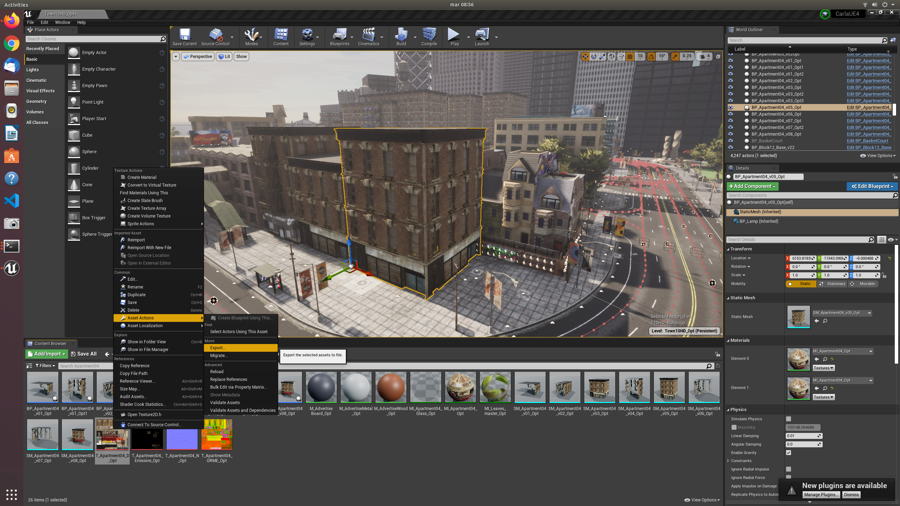
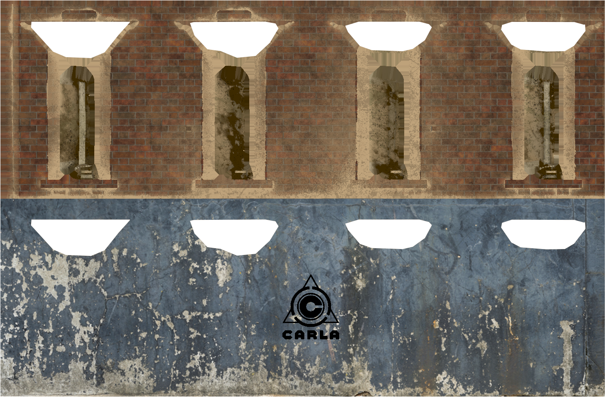
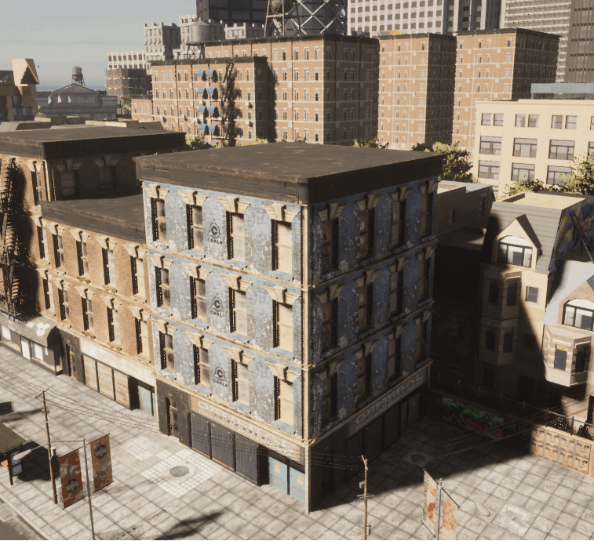

# 通过 API 更改纹理

Carla API 可用于在运行时修改资源纹理。在本教程中，我们将学习如何选择资源，然后在 Carla 仿真运行时修改其纹理。

## 在虚幻编辑器中选择一个资源

首先，我们需要加载虚幻编辑器并加载 Carla 地图，按照 Linux 或 Windows 的说明从源代码构建 Carla，然后构建并启动虚幻编辑器。让我们打开加载了 Town 10（默认城镇）的编辑器，然后选择要使用的建筑物：


我们选择 __BP_Apartment04_v05_Opt__ 进行纹理操作，名称可以在“世界大纲视图(World Outliner)”面板中看到。确保将鼠标悬停在世界大纲视图中的名称上并使用工具提示中定义的名称。内部名称可能与列表中显示的标题不同。在本例中，内部名称实际上是 __BP_Apartment04_v05_Opt_2__ 。


## 导出纹理以供使用

现在我们已经选择了建筑物，我们可以修改用于控制建筑物外观的纹理。选择建筑物后，在“细节”面板中，您将看到资产的一些详细信息，例如位置、旋转和缩放。单击“StaticMesh（继承）”以打开网格体属性，然后在面板的“静态网格体”部分中单击放大镜图标。这会将属于资源的材质和纹理置于内容浏览器中的焦点。在本例中，我们要检查 __T_Apartment04_D_Opt__ 纹理。如果双击纹理，您可以在虚幻编辑器中检查它，但是，在本例中我们想要导出它，以便我们可以修改它。单击 __T_Apartment04_D_Opt__ 并右键选择*资产操作 > 导出*。以适当的格式保存文件（我们在这里选择 TGA 格式）。



在您喜欢的图像处理软件中打开导出的纹理，并根据需要编辑纹理。在下图中，上半部分可以看到原始纹理，下半部分显示修改后的纹理。



将修改后的纹理导出到适当的位置，然后打开代码编辑器运行一些 Python 来更新正在运行的 Carla 仿真中的纹理。

## 通过API更新纹理

如果尚未启动，请从命令行启动 Carla 仿真，或在虚幻编辑器中启动仿真。我们将使用 [__Python 图像库 (PIL)__](https://pillow.readthedocs.io/en/stable/) 从图像处理软件导出的图像文件中读取纹理。


## 连接到仿真器

```py

import carla
from PIL import Image

# Connect to client
client = carla.Client('127.0.0.1', 2000)
client.set_timeout(2.0)

```

## 更新纹理

加载修改后的图像后，实例化[carla.TextureColor](python_api.md#carla.TextureColor)对象并填充加载图像中的像素数据。

使用 [carla.World](python_api.md#carla.World) 对象的 `apply_color_texture_to_object(...)` 方法来更新纹理。您应该在 UE4 观察者视图中看到纹理更新。


```py

# Load the modified texture
image = Image.open('BP_Apartment04_v05_modified.tga')
height = image.size[1]
width = image.size[0]

# Instantiate a carla.TextureColor object and populate
# the pixels with data from the modified image
texture = carla.TextureColor(width ,height)
for x in range(0,width):
    for y in range(0,height):
        color = image.getpixel((x,y))
        r = int(color[0])
        g = int(color[1])
        b = int(color[2])
        a = 255
        texture.set(x, y, carla.Color(r,g,b,a))

# Now apply the texture to the building asset
world.apply_color_texture_to_object('BP_Apartment04_v05_Opt_2', carla.MaterialParameter.Diffuse, texture)

```



## 通过 API 查找对象名称

要在不依赖虚幻编辑器的情况下查找对象，您还可以使用`world.get_names_of_all_objects()`查询对象名称。通过使用 Python 的内置`filter(...)`方法，您可以将目标对象归零。


```py
# Filter world objects for those with 'Apartment' in the name
list(filter(lambda k: 'Apartment' in k, world.get_names_of_all_objects()))
```