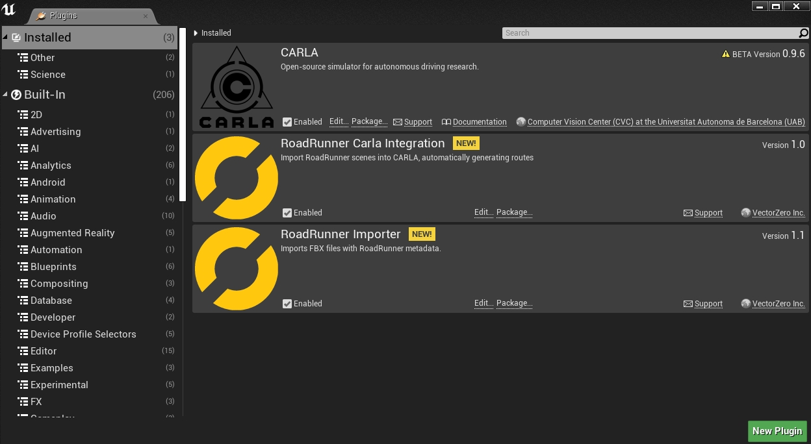
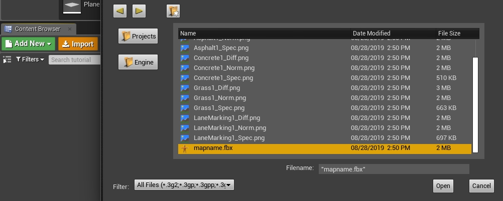
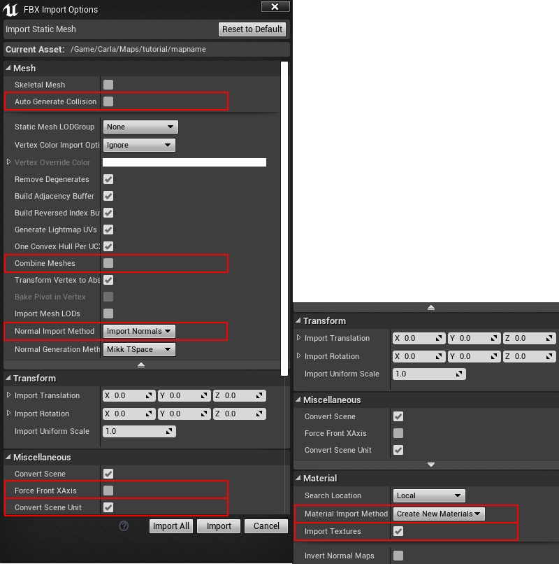
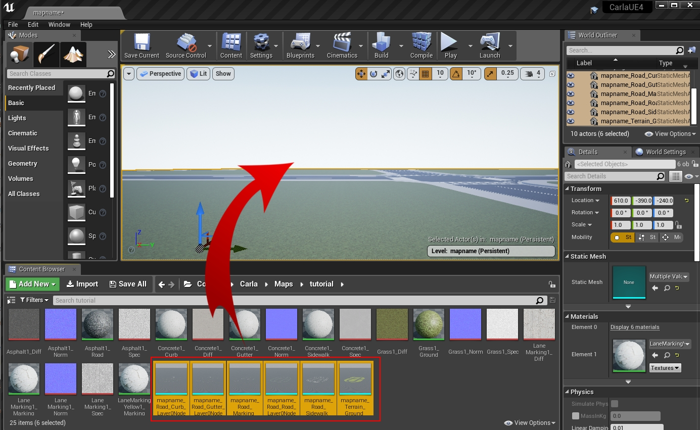
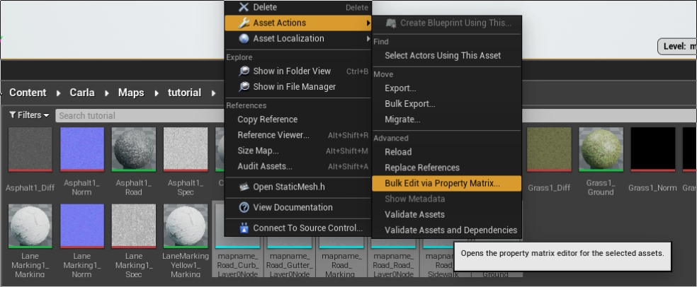
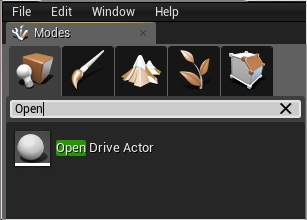
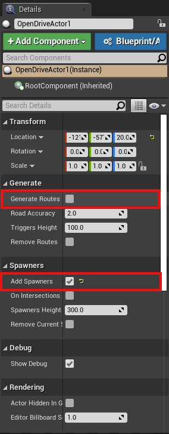

# 导入地图的替代方法

本指南介绍了将地图导入 CARLA 的替代方法。这些方法涉及比[包](tuto_M_add_map_package.md) 和 [源代码](tuto_M_add_map_source.md) 导入指南中描述的过程更多的手动步骤。首先我们将介绍 RoadRuner 插件，然后介绍手动导入方法。


- [__RoadRunner 插件导入__](#roadrunner-plugin-import)
- [__手动导入__](#manual-import)

---

## RoadRunner 插件导入

MathWorks 的 RoadRunner 软件提供了虚幻引擎插件，以帮助简化将地图导入 CARLA 的过程。

#### 插件安装

__1.__ 插件可从 [MathWorks 网站](https://www.mathworks.com/help/roadrunner/ug/Downloading-Plugins.html) 下载。MathWorks 还有一个 [完整的教程](https://www.mathworks.com/help/roadrunner/ug/Exporting-to-CARLA.html) ，与此类似，介绍如何使用插件将地图导入 CARLA。 

__2.__ 解压下载文件夹的内容并将 `RoadRunnerImporter` 和 `RoadRunnerMaterials` 文件夹移动到 `<carla>/Unreal/CarlaUE4/Plugins/`。

__3.__ 按照以下说明重建插件： 

*   __在 Windows 上。__  
	* 右键单击 `<carla>/Unreal/CarlaUE4` 中的 `.uproject` 文件，并选择 `Generate Visual Studio project files`。
	* 在 CARLA 的根文件夹中，运行命令：

```sh
make launch
```

*   __在 Linux 上。__  
	* 运行以下命令：
```sh
UE4_ROOT/GenerateProjectFiles.sh -project="carla/Unreal/CarlaUE4/CarlaUE4.uproject" -game -engine
```

__4.__ 在虚幻引擎窗口中，确保选中两个插件的复选框 `Edit > Plugins` 选中。



### 导入地图

__1.__ 使用 `Import` 按钮将 `<mapName>.fbx` 文件导入到 `/Content/Carla/Maps` 下面的新文件夹中。  



__2.__ 将 `Scene > Hierarchy Type` 设置为 _Create One Blueprint Asset_ （默认选择）。
__3.__ 将 `Static Meshes > Normal Import Method` 设置为 _Import Normals_ 。


__4.__ 点击 `Import`。  
__5.__ 保存当前关卡 `File` -> `Save Current As...` -> `<mapname>` 。  

新地图现在应该出现在虚幻引擎 _内容浏览器_ 中其他地图的旁边。


!!! 笔记
    语义分割的标签将根据资产名称分配。该资源将被移动到 `Content/Carla/PackageName/Static` 中的相应文件夹中。要更改这些，请在导入后手动移动它们。

---

## 手动导入

这种导入地图的方法可以与通用 `.fbx` 和 `.xodr` 文件一起使用。如果您使用 RoadRunner，则应使用 `Firebox (.fbx)`、`OpenDRIVE (.xodr)` 或 `Unreal (.fbx + .xml)` 导出方法。不要使用该`Carla Exporter`选项，因为您将遇到`.fbx`文件的兼容性问题。

要将地图手动导入虚幻引擎：

__1.__ 在系统的文件资源管理器中，将`.xodr`文件复制到 `<carla-root>/Unreal/CarlaUE4/Content/Carla/Maps/OpenDrive`。

__2.__ 通过在 carla 根目录中运行 `make launch` 来打开虚幻引擎编辑器。在编辑器的 _内容浏览器_ 中，导航到 `Content/Carla/Maps/BaseMap` 并复制 `BaseMap` 。这将提供带有默认天空和照明对象的空白地图。

>>

__3.__ 在目录 `Content/Carla/Maps` 中创建一个以您的地图包名称命名的新文件夹，并以与您的 `.fbx` 和 `.xodr` 文件相同的名称保存复制的地图。

__4.__ 在虚幻引擎编辑器的 _内容浏览器_ 中，导航回`Content/Carla/Maps`。右键单击灰色区域并在标题 _Import Asset_ 下选择`Import to /Game/Carla/Maps...`。 

>>

__5.__ 在弹出的配置窗口中，确保：

>- 这些选项未选中：
    *   自动生成碰撞(Auto Generate Collision)  
    *   组合网格(Combine Meshes)  
    *   Force Front xAxis
- 在以下下拉列表中，选择相应的选项：
    *   法线导入方法 - _Import Normals_  
    *   材质导入方法 - _Create New Materials_
- 检查这些选项：
    *   Convert Scene Unit
    *   Import Textures

>>

__6.__ 单击 `Import`。

__7.__ 网格将出现在 _内容浏览器_ 中。选择网格并将它们拖到场景中。

>>

__8.__ 将网格置于 0,0,0 中心。

>>

__9.__ 在 _内容浏览器_ 中，选择所有需要有碰撞器的网格体。这是指与行人或车辆交互的任何网格。碰撞器防止他们掉入深渊。右键单击选定的网格并选择`Asset Actions > Bulk Edit via Property Matrix...`。 

>>

__10.__ 在搜索框中搜索 _碰撞(collision)_。 

__11.__ 将 `Collision Complexity` 从 `Project Default` 改为 `Use Complex Collision As Simple` 并关闭窗口。

>>

__12.__ 按 `Alt + c` 确认碰撞设置已正确应用。您会在网格上看到黑色的网。

__13.__ 要为语义分割传感器创建真实数据，请将静态网格物体移动到`Carla/Static/<segment>`遵循以下结构的相应文件夹：

        Content
        └── Carla
            ├── Blueprints
            ├── Config
            ├── Exported Maps
            ├── HDMaps
            ├── Maps
            └── Static
                ├── Terrain
                │   └── mapname
                │       └── Static Meshes
                │
                ├── Road
                │   └── mapname
                │       └── Static Meshes
                │
                ├── RoadLines  
                |   └── mapname
                |       └── Static Meshes
                └── Sidewalks  
                    └── mapname
                        └── Static Meshes

__14.__ 在 _“模式(Modes)”_ 面板中，搜索 __Open Drive Actor__ 并将其拖到场景中。 

>>

__15.__ 在“详细信息(_Details_)”面板中，选中`Add Spawners`并单击 `Generate Routes` 旁边的框。这将在 `<carla-root>/Unreal/CarlaUE4/Content/Carla/Maps/OpenDrive` 目录中找到具有相同地图名称的 `.xodr` 文件，并使用它来生成一系列 _RoutePlanner_ 和 _VehicleSpawnPoint_ 参与者。 

>>

---

## 下一步

您现在可以在虚幻编辑器中打开地图并运行仿真。从这里，您将能够自定义地图并生成行人导航数据。我们建议在所有自定义完成后生成行人导航，这样就不会有障碍物阻挡行人路径。

CARLA 提供了多种工具和指南来帮助自定义地图：

- [在地图中实现子关卡。](tuto_M_custom_layers.md)
- [添加和配置交通灯和标志。](tuto_M_custom_add_tl.md)
- [使用程序化构建工具添加建筑物。](tuto_M_custom_buildings.md)
- [使用道路画家工具自定义道路。](tuto_M_custom_road_painter.md)
- [自定义天气](tuto_M_custom_weather_landscape.md#weather-customization)
- [使用序列化网格自定义景观。](tuto_M_custom_weather_landscape.md#add-serial-meshes)

完成定制后，您可以 [生成行人导航信息](tuto_M_generate_pedestrian_navigation.md) 。

---

建议使用 [CARLA 包](tuto_M_add_map_package.md) 和 [CARLA 源代码构建](tuto_M_add_map_source.md) 指南中详细介绍的自动化流程来导入地图，但是如果需要，可以使用本节中列出的方法。如果您在使用其他方法时遇到任何问题，请随时在论坛中发帖。

