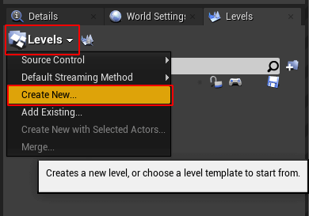
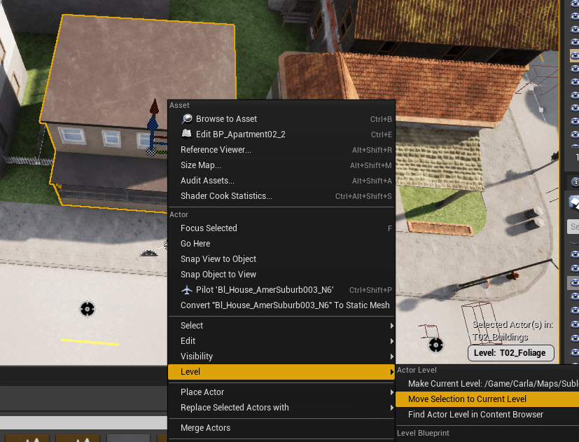
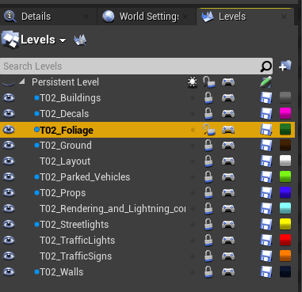

# Customizing Maps: Layered Maps

Utilizing levels in your custom map enables multiple people to work on a single map concurrently. It also allows you to use the Python API to load and unload layers on your map during a simulation, just like the [layered CARLA maps](core_map.md#layered-maps).

This guide will explain how to add a new level, how to add assets to a level, and how to configure a level to be always loaded or not.

- [__Add a new level__](#add-a-new-level)
- [__Add assets to a level__](#add-assets-to-a-level)
- [__Configure level loading options__](#configure-level-loading-options)
- [__Next steps__](#next-steps)

---

## Add a new level

All new levels in your map will be nested within the parent level, known as the _Persistent Level_. To create a new level:

__1. Open the levels panel.__

1. In the Unreal Engine editor, open _Window_ from the menu bar.
2. Click on _Levels_.

__2. Create a new level.__

1. In the _Levels_ panel, click on _Levels_ and select _Create New..._.
2. Choose _Empty Level_.
3. Save the level in `Content/Carla/Maps/Sublevels/<map_name>/`. To integrate the level with the CARLA Python API, use the naming convention `<map_name>_<layer_name>`, e.g., `TutorialMap_Buildings`. For a list of available layers, check [here](core_map.md#carla-maps).

>>>>>>

---

## Add assets to a level

__1. Select the level to which you want to add assets__.

In the _Levels_ panel, double-click the level to which you would like to add assets. Make sure the level is unlocked by toggling the lock icon.

__2. Select the assets to add.__

1. Select all the assets you would like to add to the level.
2. Right-click and go to _Level_.
3. Click on _Move Selection to Current Level_.

__3. Save the level.__

If a level has pending changes to save, you will see a pencil icon next to it in the _Levels_ panel. Click this to save the changes.

---

## Configure level loading options

Levels can be configured to be able to be toggled or to be always loaded. To configure the level for either option:

1. Right-click the level in the _Levels_ panel and go to _Change Streaming Method_.
2. Choose the desired setting:
    1. _Always Loaded_: The level __will not be able__ to be toggled via the Python API.
    2. _Blueprint_: The level __will be able__ to be toggled via the Python API. A blue dot will appear beside the level name.

Regardless of the setting, you will still be able to toggle the level in the editor by pressing the eye icon.

>>>>>>

---

## Next steps

Continue customizing your map using the tools and guides below:

- [Add and configure traffic lights and signs.](tuto_M_custom_add_tl.md)
- [Add buildings with the procedural building tool.](tuto_M_custom_buildings.md)
- [Customize the road with the road painter tool.](tuto_M_custom_road_painter.md)
- [Customize the weather](tuto_M_custom_weather_landscape.md#weather-customization)
- [Customize the landscape with serial meshes.](tuto_M_custom_weather_landscape.md#add-serial-meshes)

Once you have finished with the customization, you can [generate the pedestrian navigation information](tuto_M_generate_pedestrian_navigation.md).

---

If you have any questions about the process, then you can ask in the [forum](https://github.com/carla-simulator/carla/discussions).

<a href="https://github.com/carla-simulator/carla/discussions" target="_blank" class="btn btn-neutral" title="Go to the CARLA forum">
CARLA forum</a>

