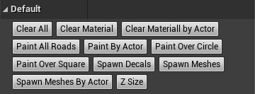
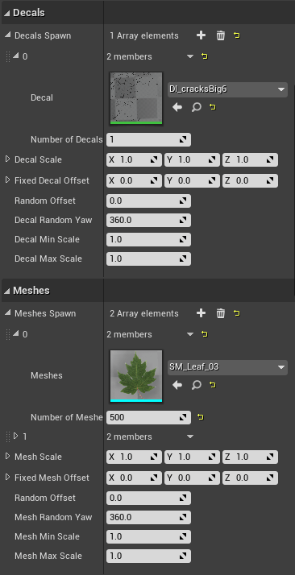
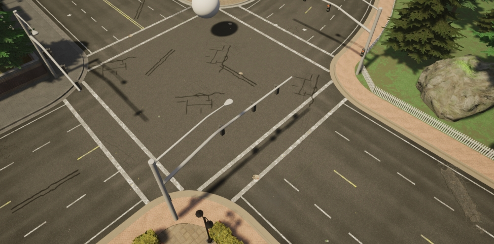

# Customizing Maps: Road Painter

This guide explains what the road painter tool is, how to use it to customize the appearance of the road by combining different textures, how to add decals and meshes and how to update the appearance of lane markings according to the road texture.

- [__What is the road painter?__](#what-is-the-road-painter)
- [__Before you begin__](#before-you-begin)
- [__Establish the road painter, master material and render target__](#establish-the-road-painter-master-material-and-render-target)
- [__Prepare the master material__](#prepare-the-master-material)
- [__Paint the road__](#paint-the-road)
- [__Update the appearance of lane markings__](#update-the-appearance-of-lane-markings)
- [__Next steps__](#next-steps)

---

## What is the road painter?

The Road Painter tool is a blueprint that uses OpenDRIVE information to paint roads quickly. It takes a master material and applies it to a render target of the road to use as a canvas. The master material is made up of a collection of materials that can be blended using brushes and applied as masks. There is no need to apply photometry techniques nor consider the UVs of the geometry.

---

## Before you begin

The road painter uses the OpenDRIVE information to paint the roads. Make sure that your `.xodr` file has the same name as your map for this to work correctly.

---

## Establish the road painter, master material and render target

__1. Create the `RoadPainter` actor.__

1. In the _Content Browser_, navigate to `Content/Carla/Blueprints/LevelDesign`.
2. Drag the `RoadPainter` into the scene.

__2. Create the Render Target.__

1. In the _Content Browser_, navigate to `Content/Carla/Blueprints/LevelDesign/RoadPainterAssets`.
2. Right-click on the `RenderTarget` file and select `Duplicate`.
3. Rename to `Tutorial_RenderTarget`.

__3. Create the master material instance.__

1. In the _Content Browser_, navigate to `Game/Carla/Static/GenericMaterials/RoadPainterMaterials`.
2. Right-click on `M_RoadMaster` and select _Create Material Instance_.
3. Rename to `Tutorial_RoadMaster`.

__4. Re-calibrate the _Map Size (Cm)_ so that it is equal to the actual size of the map.__

1. Select the `RoadPainter` actor in the scene.
2. Go to the _Details_ panel and press the _Z-Size_ button. You will see the value in _Map Size (Cm)_ change.

>>>>>

__5. Synchronize the map size between the `RoadPainter` and `Tutorial_RoadMaster`.__

1. In the _Content Browser_, open `Tutorial_RoadMaster`.
2. Copy the value _Map Size (Cm)_ from the previous step and paste it to _Global Scalar Parameter Values -> Map units (CM)_ in the `Tutorial_RoadMaster` window.
3. Press save.

>>>>>>

__6. Create the communication link between the road painter and the master material.__

The `Tutorial_RenderTarget` will be the communication link between the road painter and `Tutorial_RoadMaster`.

1. In the `Tutorial_RoadMaster` window, apply the `Tutorial_RenderTarget` to _Global Texture Parameter Values -> Texture Mask_.
2. Save and close.
3. In the main editor window, select the road painter actor, go to the _Details_ panel and apply the `Tutorial_RenderTarget` to _Paint -> Render Target_.

---

## Prepare the master material

The `Tutorial_RoadMaster` material you created holds the base material, extra material information, and parameters that will be applied via your `Tutorial_RenderTarget`. You can configure one base material and up to three additional materials.

>>

To configure the materials, double-click the `Tutorial_RoadMaster` file. In the window that appears, you can select and adjust the following values for each material according to your needs:

- Brightness
- Hue
- Saturation
- AO Intensity
- NormalMap Intensity
- Roughness Contrast
- Roughness Intensity

You can change the textures for each material by selecting the following values and searching for a texture in the search box:

- Diffuse
- Normal
- ORMH

Explore some of the CARLA textures available in `Game/Carla/Static/GenericMaterials/Asphalt/Textures`.

---

### Paint the road

__1. Create the link between the road painter and the roads.__

1. In the main editor window, search for `Road_Road` in the _World Outliner_ search box.
2. Press `Ctrl + A` to select all the roads.
3. In the _Details_ panel, go to the _Materials_ section and apply `Tutorial_RoadMaster` to _Element 0_, _Element 1_, _Element 2_, and _Element 3_.

__2. Choose the material to customize.__

Each of the materials we added to `Tutorial_RoadMaster` are applied to the roads separately and application is configured with the _Brush_ tool. To apply and customize a material:

1. Select the road painter actor
2. In the _Details_ panel, select the material to work with in the _Mask Color_ dropdown menu.

>>>>>>

__3. Set the brush and stencil parameters.__

There are a variety of stencils to choose from in `GenericMaterials/RoadStencil/Alphas`. The stencil is used to paint the road according to your needs and can be adjusted using the following values:

- _Stencil size_ — Size of the brush.
- _Brush strength_ — Roughness of the outline.
- _Spacebeween Brushes_ — Distance between strokes.
- _Max Jitter_ — Size variation of the brush between strokes.
- _Stencil_ — The brush to use.
- _Rotation_ — Rotation applied to the stroke.

>>>>>>

<i>Brush panel.</i>

 

<i>Different types of brushes.</i>

 
__4. Apply each material to the desired portions of the road.__

Choose where to apply the selected material via the buttons in the _Default_ section of the _Details_ panel:

* _Paint all roads_ — Paint all the roads.
* _Paint by actor_ — Paint a specific, selected actor.
* _Paint over circle_ — Paint using a circular pattern, useful to provide variation.
* _Paint over square_ — Paint using a square pattern, useful to provide variation.

This section also contains options to erase the applied changes.

* _Clear all_ — Erase all the painted material.
* _Clear materials_ — Remove the currently active materials.
* _Clear material by actor_ — Remove the material closest to the selected actor.

>>>>>>

<i>Different painting and erasing options.</i>

 
__5. Add decals and meshes.__

You can explore the available decals and meshes in `Content/Carla/Static/Decals` and `Content/Carla/Static`. Add them to road painter by extending and adding to the _Decals Spawn_ and _Meshes Spawn_ arrays. For each one you can configure the following parameters:

- _Number of Decals/Meshes_ - The amount of each decal or mesh to paint.
- _Decal/Mesh Scale_ — Scale of the decal/mesh per axis.
- _Fixed Decal/Mesh Offset_ — Deviation from the center of the lane per axis.
- _Random Offset_ — Max deviation from the center of the lane per axis.
- _Decal/Mesh Random Yaw_ — Max random yaw rotation.
- _Decal/Mesh Min Scale_ — Minimum random scale applied to the decal/mesh.
- _Decal/Mesh Max Scale_ — Max random scale applied to the decal/mesh.

>>>>>>

<i>Decals and Meshes panels.</i>

 

Once you have configured your meshes and decals, spawn them by pressing `Spawn decals` and `Spawn meshes`.

!!! Note
    Make sure that meshes and decals do not have collisions enabled that can interfere with cars on the road and lower any bounding boxes to the level of the road.

__7. Experiment to get your desired appearance.__ 

Experiment with different materials, textures, settings, decals, and meshes to get your desired look. Below are some example images of how the appearance of the road changes during the process of painting each material.

<i>Example of base road material.</i>

 

<i>Example after material 1 is applied.</i>

 

<i>Example after material 2 is applied.</i>

 

<i>Example after material 3 is applied.</i>

 

<i>Example after decals are applied.</i>

 

<i>Example after meshes are applied.</i>

 

---

## Update the appearance of lane markings

After you have painted the roads, you can update the appearance of the road markings by following these steps:

__1. Make a copy of the master material.__

1. In the _Content Browser_, navigate to `Game/Carla/Static/GenericMaterials/RoadPainterMaterials`.
2. Right-click on `Tutorial_RoadMaster` and select _Create Material Instance_.
3. Rename to `Tutorial_LaneMarkings`.

__2. Configure the lane marking material.__

1. In the _Content Browser_, double-click on `Tutorial_LaneMarkings`.
2. In the _Details_ panel, go to the _Global Static Switch Parameter Values_ section and check the boxes on the left and right of _LaneMark_.
3. Go to the _Texture_ section and check the boxes for _LaneColor_ and _Uv Size_.
4. Choose your preferred color for the lane markings in _LaneColor_.
5. _Save_ and close.

__3. Select the road marking meshes.__

Drag the material onto the lane markings you wish to color. Repeat the whole process for different colors of lane markings if required.

---

## Next steps

Continue customizing your map using the tools and guides below:

- [Implement sub-levels in your map.](tuto_M_custom_layers.md)
- [Add and configure traffic lights and signs.](tuto_M_custom_add_tl.md)
- [Add buildings with the procedural building tool.](tuto_M_custom_buildings.md)
- [Customize the weather](tuto_M_custom_weather_landscape.md#weather-customization)
- [Customize the landscape with serial meshes.](tuto_M_custom_weather_landscape.md#add-serial-meshes)

Once you have finished with the customization, you can [generate the pedestrian navigation information](tuto_M_generate_pedestrian_navigation.md).

---

If you have any questions about the process, then you can ask in the [forum](https://github.com/carla-simulator/carla/discussions).

<a href="https://github.com/carla-simulator/carla/discussions" target="_blank" class="btn btn-neutral" title="Go to the CARLA forum">
CARLA forum</a>

