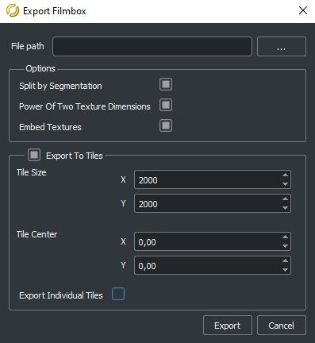

# 在 RoadRunner 中生成地图

RoadRunner 是推荐的软件，用于创建要导入 Carla 的地图。本指南概述了 RoadRunner 是什么、构建地图时需要考虑的事项以及如何导出自定义地图以准备导入 Carla。

- [__RoadRunner 简介__](#introduction-to-roadrunner)
- [__在你开始之前__](#before-you-start)
- [__在 RoadRunner 中构建地图__](#build-a-map-in-roadrunner)
- [__在 RoadRunner 中导出地图__](#export-a-map-in-roadrunner)
- [__下一步__](#next-steps)
---
## RoadRunner 简介

RoadRunner 是一款交互式编辑器，可让您设计用于仿真和测试自动驾驶系统的 3D 场景。它可用于创建道路布局以及随附的 OpenDRIVE 和几何信息。 在 [此处][rr_home] 能了解到更多 RoadRunner 的更多信息。

RoadRunner 是 MATLAB Campus-Wide License 的一部分，因此许多大学都可以提供无限制的学术访问。 [检查][rr_eligibility] 您的大学是否有权访问。如果您对辅助功能有任何疑问或困难，请联系 *automated-driving@mathworks.com* 。 还有 [试用版][rr_trial_version] 可用。

参加 Carla 排行榜的每个人都可以获得 RoadRunner 许可证。点击 [此处][rr_leaderboard] 了解更多信息。

[rr_home]: https://www.mathworks.com/products/roadrunner.html
[rr_trial_version]: https://www.mathworks.com/products/roadrunner.html
[rr_eligibility]: https://www.mathworks.com/academia/tah-support-program/eligibility.html
[rr_leaderboard]: https://www.mathworks.com/academia/student-competitions/carla-autonomous-driving-challenge.html

---
## 在你开始之前

您需要安装 RoadRunner。您可以按照 Mathworks 网站上的 [安装指南][rr_docs] 进行操作。   

[rr_docs]: https://www.mathworks.com/help/roadrunner/ug/install-and-activate-roadrunner.html

---

## 在 RoadRunner 中构建地图

关于如何在RoadRunner中构建地图的细节超出了本指南的范围，但是， [RoadRuner文档][rr_tutorials] 中提供了视频教程。

__请记住，包含大量道具的地图会显着减慢导入过程。__ 这是因为虚幻引擎需要将每个网格物体转换为虚幻资源。如果您计划将地图导入到 Carla 的源构建版本中，我们强烈建议您仅在 RoadRunner 中创建道路布局，并在将地图导入到虚幻引擎之前保留任何自定义设置。 Carla 提供了多种工具，您可以在虚幻引擎编辑器中使用这些工具来简化自定义过程。

---

## 在 RoadRunner 中导出地图

[rr_tutorials]: https://www.mathworks.com/support/search.html?fq=asset_type_name:video%20category:roadrunner/index&page=1&s_tid=CRUX_topnav

以下是从 RoadRunner 导出自定义地图的基本指南。您可以在 [MathWorks 文档][exportlink] 中找到有关如何导出到 Carla 的更多详细信息。

[exportlink]: https://www.mathworks.com/help/roadrunner/ug/Exporting-to-CARLA.html

在 RoadRunner 中制作地图后，您就可以将其导出。请注意， __道路布局导出后无法修改。__ 导出前，请确保：

- 地图以 (0,0) 为中心，以确保地图可以在虚幻引擎中正确可视化。
- 地图定义是正确的。
- 地图验证是正确的，密切关注连接和几何形状。

>>>>

地图准备就绪后，单击 `OpenDRIVE Preview Tool` 按钮即可可视化 OpenDRIVE 道路网络并对所有内容进行最后一次检查。

>>>>

!!! 笔记
    _OpenDrive Preview Tool_ 可以更轻松地测试地图的完整性。如果连接有任何错误，请单击 `Maneuver Tool` 和 `Rebuild Maneuver Roads`。

当您准备好导出时：

__1.__ 使用 Carla 选项导出场景：

  - 在主工具栏中，选择 `File` -> `Export` -> `CARLA (.fbx, .xodr, .rrdata.xml)`

__2.__ 在弹出的窗口中：

>- C检查以下选项：
    - _Split by Segmentation_: 通过语义分割来划分网格。
    - _Power of Two Texture Dimensions_: 提高性能。
    - _Embed Textures_: 确保纹理嵌入到网格中。
    - _Export to Tiles_: 选择图块的大小或仅保留一块不选中。

>- Leave unchecked:
    - _导出单个图块_: 生成一个包含所有地图片段的 `.fbx` 文件。

>>>>

__3.__ 选择要将文件导出到的目录，然后单击 `Export`。这将生成 `<mapName>.fbx` 和 `<mapName>.xodr`  文件等。
  
!!! 笔记
    确保 `.xodr` 和 `.fbx` 文件具有相同的名称。

---

## 下一步

您现在已准备好将地图导入 Carla。下一步将取决于您使用的 Carla 安装类型：

* __对于从源代码构建的 Carla 用户__，请按照 [__此处__](tuto_M_add_map_source.md) 的指南进行操作。
* __对于 Carla 打包（二进制）版本的用户__，请按照 [__此处__](tuto_M_add_map_package.md) 的指南进行操作。

---

如果您对此流程有任何疑问，可以在 [论坛](https://github.com/carla-simulator/carla/discussions) 中提问。

<a href="https://github.com/carla-simulator/carla/discussions" target="_blank" class="btn btn-neutral" title="跳转至 Carla 论坛">
Carla 论坛</a>

