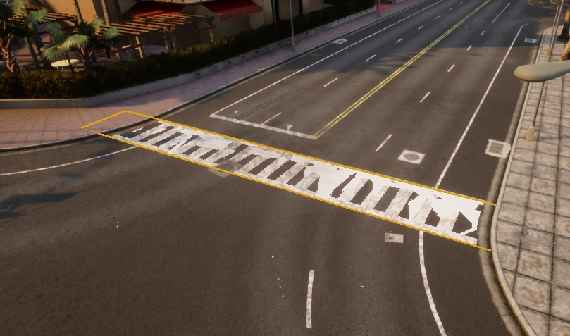

# 生成行人导航

为了允许行人导航地图，您需要生成行人导航文件。本指南详细介绍了要使用的网格以及如何生成文件。

- [__在你开始之前__](#before-you-begin)
- [__行人导航网格__](#pedestrian-navigable-meshes)
- [__可选的行人导航选项__](#optional-pedestrian-navigation-options)
- [__生成行人导航__](#generate-the-pedestrian-navigation)

---

## 在你开始之前

地图定制（添加建筑物、绘制道路、添加景观特征等）应在生成行人导航之前完成，以避免两者之间发生干扰或碰撞，导致需要再次生成行人导航。

---

## 行人导航网格

行人只能导航特定的网格。您需要根据下表中的术语命名要包含在行人导航中的网格：

| 类型   | 包含的名称                                                                                                                                   | 描述 |
|------|-----------------------------------------------------------------------------------------------------------------------------------------|-------------|
| 地面   | `Road_Sidewalk` 或 `Roads_Sidewalk`                                                                                                      | 行人可以自由地在这些网格上行走。 |
| 人行横道 | `Road_Crosswalk` 或 `Roads_Crosswalk`                                                                                                    | 如果找不到地面，行人将在这些网格上行走作为第二种选择。 |
| 草地   | `Road_Grass` 或 `Roads_Grass`                                                                                                            | 行人不会在此网格上行走，除非您指定一定比例的行人这样做。 |
| 马路   | `Road_Road` 或 `Roads_Road` <br> `Road_Curb` 或 `Roads_Curb` <br> `Road_Gutter` 或 `Roads_Gutter` <br> `Road_Marking` 或 `Roads_Marking` | 行人只能通过这些网格过马路。 |

<br>

---

## 可选的行人导航选项

以下步骤对于生成行人导航不是必需的，但允许您在一定程度上自定义行人活动。

- __生成新的人行横道__。

如果已在 `.xodr` 文件中定义人行横道，请避免执行此操作，因为这会导致重复：

1. 创建一个平面网格（plane mesh，如果看不到，需要在“视图选项”中选中“显示引擎内容”），稍微延伸到要连接的两条人行道上。
2. 将网格放置在地面上并禁用其物理和渲染。
3. 将网格名称更改为 `Road_Crosswalk` 或 `Roads_Crosswalk`。

  

---
## 生成行人导航

__1.__ 要防止地图太大而无法导出，请选择 __BP_Sky 对象__ 并添加一个 `NoExport` 标签。如果您有任何其他不参与行人导航的特别大的网格，也请向它们添加 `NoExport` 标记。 

 

__2.__ 仔细检查您的网格名称。网格名称应以下面列出的任何适当格式开头，以便被识别为行人可以行走的区域。默认情况下，行人将能够在人行道、人行横道和草地上行走（对其余部分影响较小）：

*   人行道 = `Road_Sidewalk` 或 `Roads_Sidewalk` 
*   人行横道 = `Road_Crosswalk` 或 `Roads_Crosswalk` 
*   草地 = `Road_Grass` 或 `Roads_Grass`

 

__3.__ 按 `ctrl + A` 选择所有内容（报错则只选择和行人相关的网格）并通过选择 `File` -> `Carla Exporter` 导出地图。将在 `Unreal/CarlaUE4/Saved` 中创建 `<mapName>.obj` 文件。

__4.__ 将 `<mapName>.obj` 和 `<mapName>.xodr` 移动到 `Util/DockerUtils/dist`。

__5.__ 运行以下命令生成导航文件：  

*   __Windows__ 
```sh
build.bat <mapName> # <mapName> 没有扩展名
```
*   __Linux__
```sh
./build.sh <mapName> # <mapName> 没有扩展名
```

__6.__ 将创建一个 `<mapName>.bin` 文件。此文件包含地图上的行人导航信息。将此文件移动到包含地图的包的 `Nav` 文件夹中。

__7.__ 通过启动仿真并运行 `PythonAPI/examples` 中的示例脚本 `generate_traffic.py` 来测试行人导航。

---

If you have any questions about the process, then you can ask in the [forum](https://github.com/carla-simulator/carla/discussions).

<div class="build-buttons">
<p>
<a href="https://github.com/carla-simulator/carla/discussions" target="_blank" class="btn btn-neutral" title="Go to the Carla forum">
Carla 论坛</a>
</p>
</div>