# 内容创作 - 地图

CARLA 提供了大量的资源，可用于创建开箱即用的驾驶仿真。然而，CARLA 的真正力量在于其全面的可扩展性，允许用户创建完全自定义的环境，其中包含建筑物、长凳、垃圾桶、雕像、路灯和公交车站等定制资产。

在本教程中，我们将介绍创建与 CARLA 一起使用的简单地图的过程。我们将使用两个软件包来创建地图的各个部分。我们将使用 [__RoadRunner__](https://es.mathworks.com/products/roadrunner.html) 创建道路网络，然后通过 [__虚幻编辑器__](https://www.unrealengine.com/en-US/features/the-unreal-editor) 将资源添加到地图中。

* __[先决条件](#prerequisites)__  
* __[大地图](#large-maps)__
* __[数字孪生工具](#digital-twin-tool)__
* __[RoadRunner](#create-a-road-network-using-roadrunner)__  
* __[导入 CARLA](#importing-your-road-network-into-carla)__
* __[导入资产](#importing-assets-and-adding-them-to-the-map)__
* __[交通灯](#traffic-lights)__
* __[交通标志](#traffic-signs)__ 
* __[Materials](#materials)__
* __[道路画家](#road-painter)__
    * [什么是道路画家？](#what-is-the-road-painter)
    * [道路画家参与者、主材质和渲染对象](#establish-the-road-painter-master-material-and-render-target)
    * [准备主材料](#prepare-the-master-material)
    * [描绘道路](#paint-the-road)
    * [更新车道线外观](#update-the-appearance-of-lane-markings)
    * [下一步](#next-steps)
* __[树木和植被](#trees-and-vegetation)__
    * [树叶工具](#foliage-tool)

## 先决条件

要遵循本指南，您需要从源代码构建 CARLA，以便您可以使用虚幻编辑器。请遵循相关操作系统的 [__构建说明__](build_carla.md) 。您还需要 RoadRunner 的许可副本。您可能还需要 Maya、3DS Max 或 Blender 等三维建模应用程序来为自定义地图创建三维资产。您应该确保已完成构建 CARLA 的所有步骤并确保虚幻编辑器正在运行，这可能需要一些时间来构建应用程序。如果您想为地图创建三维资产，则应使用适当的三维设计应用程序，例如 Blender、Maya、3DsMax 或 Modo。

## 大地图

以下文本详细介绍了创建和装饰标准地图的过程。从版本 0.9.12 开始，CARLA 具有大地图功能。大型地图的比例比标准地图更大，最大可达 100 km2。由于硬件限制，大型地图的工作方式与标准地图略有不同，即使在高端显卡中也是如此。大地图被分割成图块，并且在模拟过程中仅加载立即需要的图块（即最接近自我车辆的图块）。其他图块处于休眠状态，直到需要数据为止。这有助于实现 CARLA 模拟的最高性能。接下来的大多数细节与构建大地图时类似，但还有一些额外的步骤。请按照 [本指南](content_authoring_large_maps.md) 为 CARLA 构建大地图。

## 数字孪生工具

CARLA 提供了一个程序化地图生成工具，它从 OpenStreetMap 获取道路网络数据，并用建筑物和植被程序化地装饰地图。请在 [此处](adv_digital_twin.md) 阅读有关如何使用该工具的信息。

## 使用 RoadRunner 创建路网

打开 RoadRunner 并创建一个新场景。选择道路规划工具(Road Plan Tool)并在工作区中 __右键__ 单击以放置道路的第一个控制点和第二个控制点。单击并拖动道路尽头的红点以移动和延长道路。

出于本教程的目的，我们使用中间有一个交叉路口的简单椭圆形道路。要构建更高级的网络，请参阅 [__Roadrunner 文档__](https://es.mathworks.com/products/roadrunner.html) 。

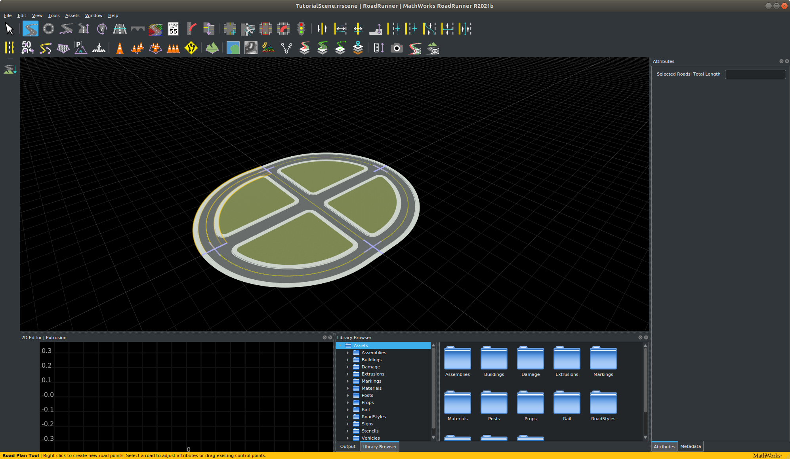

在 RoadRunner 中制作地图后，您就可以将其导出。请注意，__道路布局导出后无法修改__。导出之前，请确保：

- 地图以 (0,0) 为中心，以确保地图可以在虚幻引擎中正确可视化。
- 地图定义是正确的。
- 地图验证是正确的，密切关注连接和几何形状。

>>>>

地图准备好后，单击`OpenDRIVE Preview Tool`按钮即可可视化 OpenDRIVE 道路网络并对所有内容进行最后一次检查。

>>>>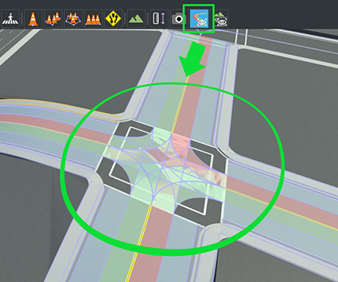

!!! 笔记
    _OpenDrive Preview Tool_ 可以更轻松地测试地图的完整性。如果连接有任何错误，请单击`Maneuver Tool`和`Rebuild Maneuver Roads`。 

创建所需的道路网络后，在 RoadRunner 菜单栏中选择`File > Export > Carla Filmbox (.fbx, .xodr, .rrdata.xml)` 并导出到适当的位置。

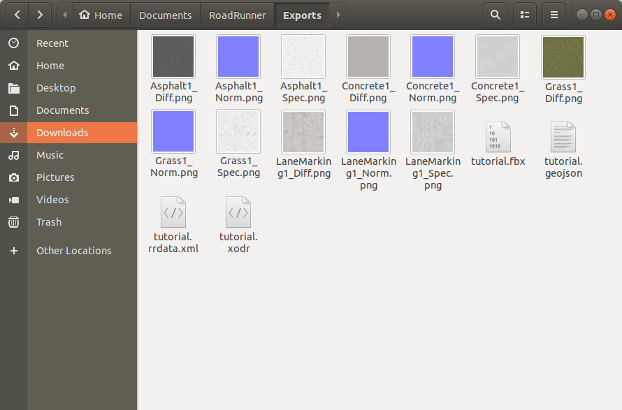

RoadRunner 是创建自定义地图的最佳应用程序。还有一些替代方案，例如 [__OpenStreetMap__](tuto_G_openstreetmap.md)，专注于从真实的道路地图生成地图。

## TrueVision 设计器

RoadRunner 是一款需要 MATLAB 的专有软件。大学等一些机构可能与 MathWorks 达成了协议，以便某些用户可以获得 RoadRunner 许可证。如果您没有许可证预算，RoadRunner 的一个方便的开源替代方案是[__TrueVision Designer__](https://www.truevision.ai/designer) 。此应用程序具有许多与 RoadRunner 相同的功能，如果您无法获得 RoadRunner 的许可证，该应用程序会非常有用。

## 将您的路网导入 CARLA

CARLA需要的重要导出文件是 `.xodr` 文件和 `.fbx` 文件。将这些文件复制或移动到您从源代码构建的 CARLA 存储库根目录内的 `Import` 文件夹中。

现在在 CARLA 源目录的根目录中打开一个终端并运行`make import`. 这会将道路网络导入 CARLA。

您现在可以在虚幻编辑器中看到新地图。在 CARLA 源目录的根目录下运行 `make launch` 以启动虚幻编辑器。您现在将在内容浏览器中看到一个名为 `map_package` 的新目录。在此目录 `Content > map_package > Maps > tutorial` 中，您现在将找到您的新地图。

!!! 笔记
    可以参考 [链接](https://zhuanlan.zhihu.com/p/552983835) 通过鼠标右键的方式直接导入。

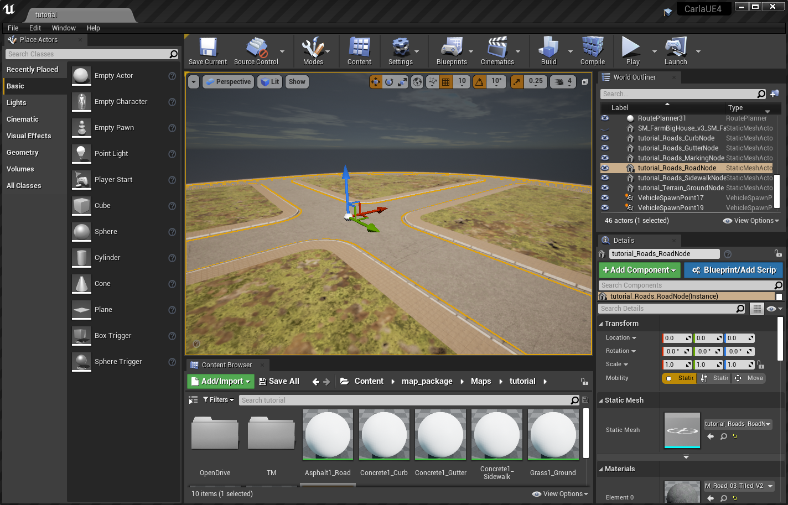

您现在已经创建了道路网络，这是地图的基础。

## 导入资产并将它们添加到地图

现在我们已经有了道路网络作为地图的基础，我们现在想要为地图创建一些内容，例如建筑物。这些资源可以使用三维建模应用程序（例如 Autodesk Maya、3DS Max、Blender 或具有适当导出选项的任何其他三维应用程序）创建。重要的是，应用程序至少能够导出`.fbx`。

在 CARLA 中创建资产需要几个元素：

- [__网格__](https://en.wikipedia.org/wiki/Polygon_mesh) - 一组 3D 坐标顶点和关联的连接边。
- [__UV 贴图__](https://en.wikipedia.org/wiki/UV_mapping) - 将三维顶点和边映射到二维纹理空间，以将纹理与三维位置进行匹配。
- [__纹理__](https://en.wikipedia.org/wiki/Texture_mapping) - 定义三维对象表面上显示的颜色和图案的二维图像。
- [__法线贴图__](https://en.wikipedia.org/wiki/Normal_mapping) - 定义目标表面法线方向的二维图像，以向目标表面添加三维变化。
- ORM 贴图 - 定义金属度(Metallicity)、粗糙度(Roughness)和环境光遮挡(Occlusion)区域的贴图

ORM 贴图利用标准 RGBA 编码图像的通道对金属区域、粗糙度和环境遮挡的贴图进行编码。当我们在这里定义贴图时，红色通道定义金属贴图，绿色通道定义粗糙度，蓝色通道定义环境光遮挡。这些贴图（以及漫反射贴图和法线贴图）可以使用 [__Adobe Substance 3D painter__](https://www.adobe.com/products/substance3d-painter.html) 等应用程序创建。

使用虚幻内容浏览器在某个适当的位置创建一个新文件夹。在此文件夹中，您可以右键单击并`Import to PATH/TO/FOLDER`在上下文菜单顶部附近进行选择，也可以将文件直接拖放到内容浏览器中。

我们将导入一个包含从 Blender 导出的基础网格和 UV 贴图的 FBX 文件。

在上下文菜单中，对于 `Normal Import Method` 确保“网格”部分选择了“导入法线(`Import Normals`)，并且在“材质(__Material__)”部分中选择了`Do Not Create Material`。在“材质”部分中取消选择，因为我们将手动导入它们。如果您想使用 FBX 文件中已嵌入的某些纹理，这些选择将会有所不同。

选择`Import All`。导入完成后，双击内容浏览器中显示的导入资源进行编辑。

我们现在应该导入纹理、漫反射颜色的漫反射纹理、法线贴图和 ORM 贴图。

通过双击打开 ORM 贴图并取消选择`sRGB`选项，以确保正确应用纹理。

右键单击内容浏览器并从菜单中选择`Material`。将在内容浏览器中创建新材料。双击进行编辑。按住 Shift 键选择导入的纹理并将其拖到材质编辑窗口中，现在您将在材质节点编辑器中获得 3 个新节点。

现在根据以下规则连接节点：

- Diffuse RGB --> Base Color
- Normal RGB --> Normal
- ORM R --> Ambient occlusion
- ORM G --> Roughness
- ORM B --> Metallic

您的材质节点图现在应该与此类似：

保存材质，然后再次打开资源并将材质拖入材质槽中。您的资源现在应该已完全纹理化。

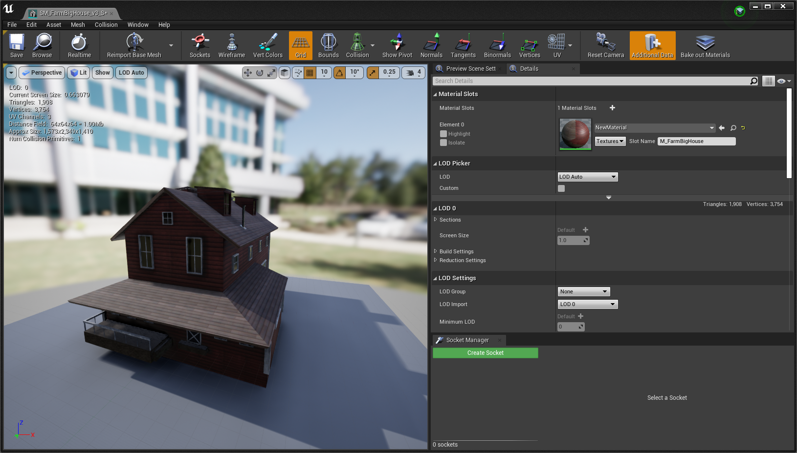

现在保存资产，即可在地图中使用。您现在可以从内容浏览器中拖动资源并将其放入地图中：

现在，您可以使用工作区左上角的“保存当前”选项保存地图，即可使用。开始仿真。

地图作者指南到此结束。现在您知道如何创建道路网络并导入三维资产以在 CARLA 中使用。您现在可以阅读如何 [__打包地图以在 CARLA 独立版本中使用__](tuto_M_manual_map_package.md) 。

## 交通灯

要将红绿灯添加到新地图：

__1.__ 从 _内容浏览器_, 导航至 `Content > Carla > Static > TrafficLight > StreetLights_01`。您会发现几种不同的交通灯蓝图可供选择。

__2.__ 将交通灯拖到场景中并将其放置在所需位置。按键盘上的空格键可在定位、旋转和缩放工具之间切换。

__3.__ 通过选择“详细(_Details_)” 面板中的 _BoxTrigger_ 组件并调整 _Transform_ 部分的值，为每个红绿灯调整 [`trigger volume`][triggerlink] 。这将确定红绿灯的影响范围。

>>

__4.__ 对于路口，将`BP_TrafficLightGroup`参与者拖入关卡中。通过将路口处的所有交通灯添加到“详细信息(_Details_)”面板中的“交通灯(_Traffic Lights_)”数组，将它们分配给交通灯组。

>>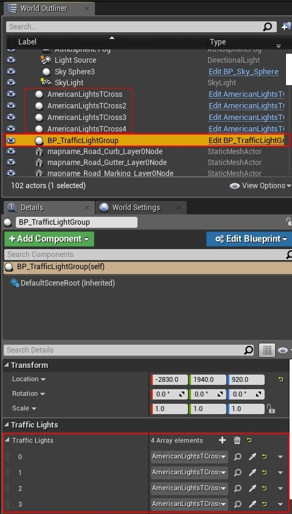

__5.__ 交通灯计时只能通过Python API 进行配置。请参阅 [此处](core_actors.md#traffic-signs-and-traffic-lights) 的文档以获取更多信息。

>>

> _例如：交通标志、交通信号灯和转弯停车。_

[triggerlink]: python_api.md#carla.TrafficSign.trigger_volume

## 交通标志

要将交通标志添加到新地图：

__1.__ 从 _内容浏览器_，导航至 `Content > Carla > Static > TrafficSign`。您会发现几种不同的交通灯蓝图可供选择。

__2.__ 将交通灯拖到场景中并将其放置在所需位置。按键盘上的空格键可在定位、旋转和缩放工具之间切换。

__3.__ 通过在“详细信息( _Details_ )”面板中选择 _BoxTrigger_ 组件并调整“变换(_Transform_)”部分中的值，调整每个交通标志的[`trigger volume`][triggerlink]。这将确定交通灯的影响区域。并非所有交通标志都有触发音量。此类标志包括让行标志、停车标志和限速标志。

## 材质

CARLA 内容库拥有大量有用的材料，可随时用于更改地图的外观。在内容浏览器中，导航至`Carla > Static > GenericMaterials`。在这里您会发现许多可用于改变地图外观的材料。

您可以通过拖放到地图元素上来快速测试材质：

# 道路画家

道路画家是一种可用于自定义道路外观的工具，通过附加纹理、贴花和网格添加额外的真实感。

## 什么是道路画家？

The Road Painter tool is a blueprint that uses OpenDRIVE information to paint roads quickly. It takes a master material and applies it to a render target of the road to use as a canvas. The master material is made up of a collection of materials that can be blended using brushes and applied as masks. There is no need to apply photometry techniques nor consider the UVs of the geometry.

The road painter uses the OpenDRIVE information to paint the roads. Make sure that your `.xodr` file has the same name as your map for this to work correctly.

## 建立道路画家、掌握材质和渲染对象

__1. Create the `RoadPainter` actor.__

1. In the _Content Browser_, navigate to `Content > Carla > Blueprints > LevelDesign`.
2. Drag the `RoadPainter` into the scene.

__2. Create the Render Target.__

1. In the _Content Browser_, navigate to `Content > Carla > Blueprints > LevelDesign > RoadPainterAssets`.
2. Right-click on the `RenderTarget` file and select `Duplicate`.
3. Rename to `Tutorial_RenderTarget`.

__3. Create the master material instance.__

1. In the _Content Browser_, navigate to `Game > Carla > Static > GenericMaterials > RoadPainterMaterials`.
2. Right-click on `M_RoadMaster` and select _Create Material Instance_.
3. Rename to `Tutorial_RoadMaster`.

__4. Re-calibrate the _Map Size (Cm)_ so that it is equal to the actual size of the map.__

1. Select the `RoadPainter` actor in the scene.
2. Go to the _Details_ panel and press the _Z-Size_ button. You will see the value in _Map Size (Cm)_ change.

>>>>>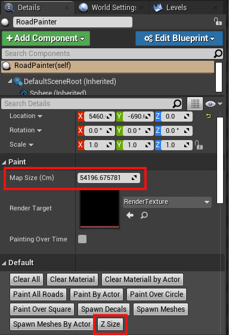

__5. Synchronize the map size between the `RoadPainter` and `Tutorial_RoadMaster`.__

1. In the _Content Browser_, open `Tutorial_RoadMaster`.
2. Copy the value _Map Size (Cm)_ from the previous step and paste it to _Global Scalar Parameter Values -> Map units (CM)_ in the `Tutorial_RoadMaster` window.
3. Press save.

>>>>>>

__6. Create the communication link between the road painter and the master material.__

The `Tutorial_RenderTarget` will be the communication link between the road painter and `Tutorial_RoadMaster`.

1. In the `Tutorial_RoadMaster` window, apply the `Tutorial_RenderTarget` to _Global Texture Parameter Values -> Texture Mask_.
2. Save and close.
3. In the main editor window, select the road painter actor, go to the _Details_ panel and apply the `Tutorial_RenderTarget` to _Paint -> Render Target_.

---

## 准备主材料

The `Tutorial_RoadMaster` material you created holds the base material, extra material information, and parameters that will be applied via your `Tutorial_RenderTarget`. You can configure one base material and up to three additional materials.

>>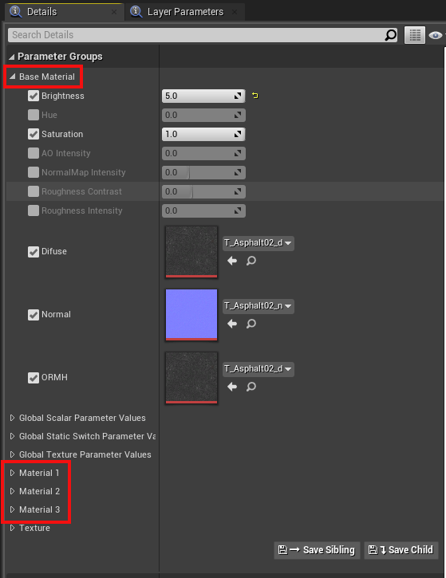

To configure the materials, double-click the `Tutorial_RoadMaster` file. In the window that appears, you can select and adjust the following values for each material according to your needs:

- Brightness
- Hue
- Saturation
- AO Intensity
- NormalMap Intensity
- Roughness Contrast
- Roughness Intensity

You can change the textures for each material by selecting the following values and searching for a texture in the search box:

- Diffuse
- Normal
- ORMH

Explore some of the CARLA textures available in `Game > Carla > Static > GenericMaterials > Asphalt > Textures`.

---

### Paint the road

__1. Create the link between the road painter and the roads.__

1. In the main editor window, search for `Road_Road` in the _World Outliner_ search box.
2. Press `Ctrl + A` to select all the roads.
3. In the _Details_ panel, go to the _Materials_ section and apply `Tutorial_RoadMaster` to _Element 0_, _Element 1_, _Element 2_, and _Element 3_.

__2. Choose the material to customize.__

Each of the materials we added to `Tutorial_RoadMaster` are applied to the roads separately and application is configured with the _Brush_ tool. To apply and customize a material:

1. Select the road painter actor
2. In the _Details_ panel, select the material to work with in the _Mask Color_ dropdown menu.

>>>>>>

__3. Set the brush and stencil parameters.__

There are a variety of stencils to choose from in `GenericMaterials/RoadStencil/Alphas`. The stencil is used to paint the road according to your needs and can be adjusted using the following values:

- _Stencil size_ — Size of the brush.
- _Brush strength_ — Roughness of the outline.
- _Spacebeween Brushes_ — Distance between strokes.
- _Max Jitter_ — Size variation of the brush between strokes.
- _Stencil_ — The brush to use.
- _Rotation_ — Rotation applied to the stroke.

>>>>>>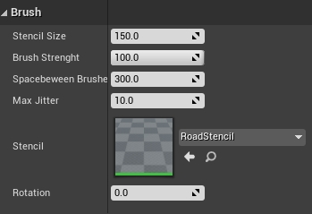

<i>Brush panel.</i>

 

<i>Different types of brushes.</i>

 
__4. Apply each material to the desired portions of the road.__

Choose where to apply the selected material via the buttons in the _Default_ section of the _Details_ panel:

* _Paint all roads_ — Paint all the roads.
* _Paint by actor_ — Paint a specific, selected actor.
* _Paint over circle_ — Paint using a circular pattern, useful to provide variation.
* _Paint over square_ — Paint using a square pattern, useful to provide variation.

This section also contains options to erase the applied changes.

* _Clear all_ — Erase all the painted material.
* _Clear materials_ — Remove the currently active materials.
* _Clear material by actor_ — Remove the material closest to the selected actor.

>>>>>>

<i>Different painting and erasing options.</i>

 
__5. Add decals and meshes.__

You can explore the available decals and meshes in `Content > Carla Static > Decals` and `Content > Carla > Static`. Add them to road painter by extending and adding to the _Decals Spawn_ and _Meshes Spawn_ arrays. For each one you can configure the following parameters:

- _Number of Decals/Meshes_ - The amount of each decal or mesh to paint.
- _Decal/Mesh Scale_ — Scale of the decal/mesh per axis.
- _Fixed Decal/Mesh Offset_ — Deviation from the center of the lane per axis.
- _Random Offset_ — Max deviation from the center of the lane per axis.
- _Decal/Mesh Random Yaw_ — Max random yaw rotation.
- _Decal/Mesh Min Scale_ — Minimum random scale applied to the decal/mesh.
- _Decal/Mesh Max Scale_ — Max random scale applied to the decal/mesh.

>>>>>>

<i>Decals and Meshes panels.</i>

 

Once you have configured your meshes and decals, spawn them by pressing `Spawn decals` and `Spawn meshes`.

!!! Note
    Make sure that meshes and decals do not have collisions enabled that can interfere with cars on the road and lower any bounding boxes to the level of the road.

__7. Experiment to get your desired appearance.__ 

Experiment with different materials, textures, settings, decals, and meshes to get your desired look. Below are some example images of how the appearance of the road changes during the process of painting each material.

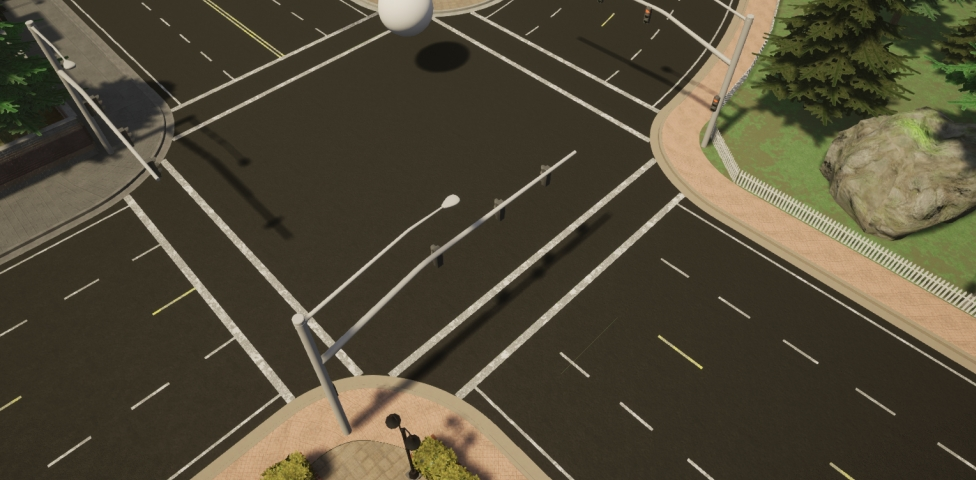

<i>Example of base road material.</i>

 

<i>Example after material 1 is applied.</i>

 

<i>Example after material 2 is applied.</i>

 

<i>Example after material 3 is applied.</i>

 
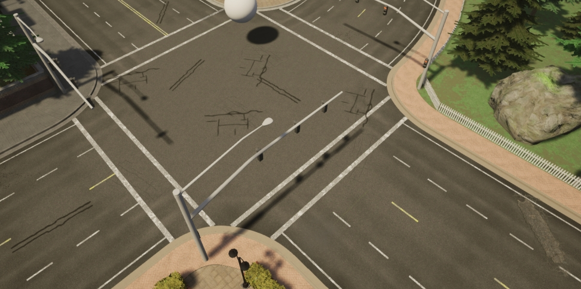

<i>Example after decals are applied.</i>

 

<i>Example after meshes are applied.</i>

 

---

## 更新车道线外观

After you have painted the roads, you can update the appearance of the road markings by following these steps:

__1. Make a copy of the master material.__

1. In the _Content Browser_, navigate to `Game > Carla > Static > GenericMaterials > RoadPainterMaterials`.
2. Right-click on `Tutorial_RoadMaster` and select _Create Material Instance_.
3. Rename to `Tutorial_LaneMarkings`.

__2. Configure the lane marking material.__

1. In the _Content Browser_, double-click on `Tutorial_LaneMarkings`.
2. In the _Details_ panel, go to the _Global Static Switch Parameter Values_ section and check the boxes on the left and right of _LaneMark_.
3. Go to the _Texture_ section and check the boxes for _LaneColor_ and _Uv Size_.
4. Choose your preferred color for the lane markings in _LaneColor_.
5. _Save_ and close.

__3. Select the road marking meshes.__

Drag the material onto the lane markings you wish to color. Repeat the whole process for different colors of lane markings if required.

---

## 树木和植被

The CARLA content library has a comprehensive set of vegetation blueprints for you to add further realism to the off-road areas of your maps like sidewalks, parks, hillsides, fields and forrest. 

Navigate to the vegetation folder in the CARLA content library: `Carla > Static > Visitation`. You will find blueprints for multiple types of trees, bushes, shrubs. You can drag these elements into your map from the content browser. 

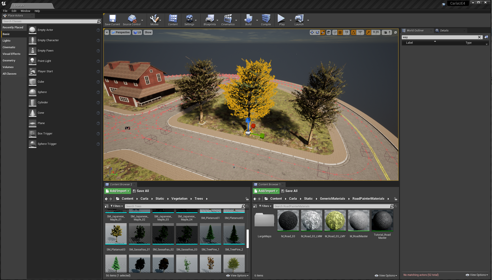

### Foliage tool

A useful tool for trees and vegetation is the [__Unreal Engine foliage tool__](https://docs.unrealengine.com/4.27/en-US/BuildingWorlds/Foliage/). Activate the tool by selecting the `mode` from the mode dropdown in the toolbar.

Drag your desired foliage item into the box labeled `+ Drop Foliage Here`. Set an appropriate density in the density field, then paint into the map with your foliage item. 

## 下一步

Continue customizing your map using the tools and guides below:

- [Implement sub-levels in your map.](tuto_M_custom_layers.md)
- [Add buildings with the procedural building tool.](tuto_M_custom_buildings.md)
- [Customize the weather](tuto_M_custom_weather_landscape.md#weather-customization)
- [Customize the landscape with serial meshes.](tuto_M_custom_weather_landscape.md#add-serial-meshes)
Once you have finished with the customization, you can [generate the pedestrian navigation information](tuto_M_generate_pedestrian_navigation.md).

---

If you have any questions about the process, then you can ask in the [forum](https://github.com/carla-simulator/carla/discussions).

<a href="https://github.com/carla-simulator/carla/discussions" target="_blank" class="btn btn-neutral" title="Go to the CARLA forum">
CARLA forum</a>

