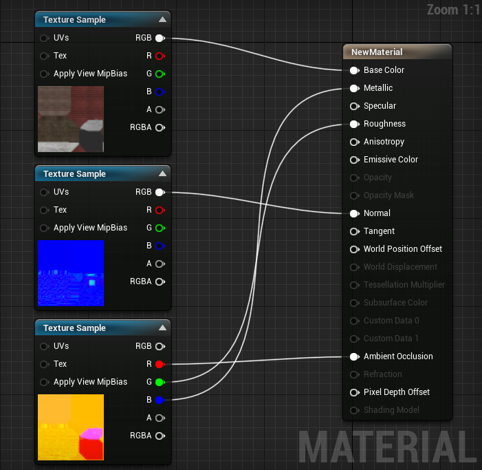
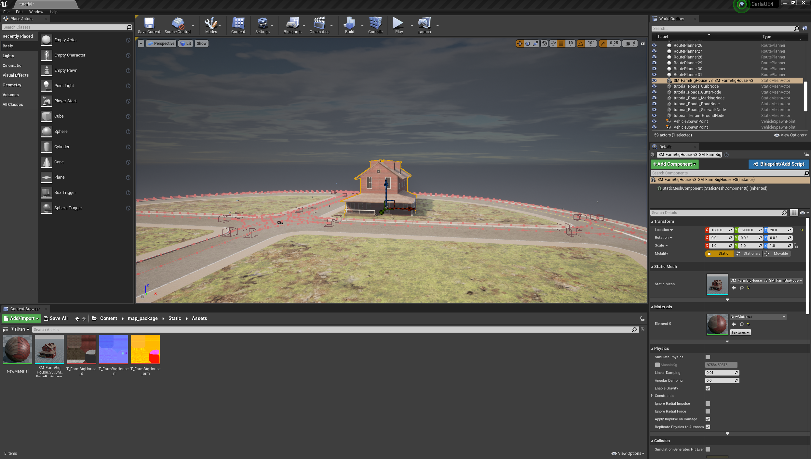
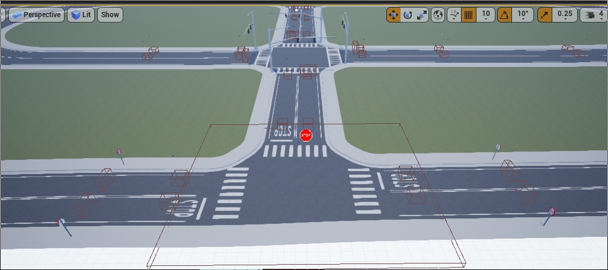
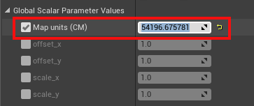
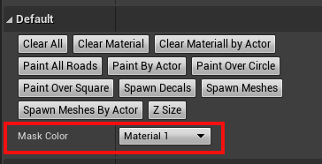
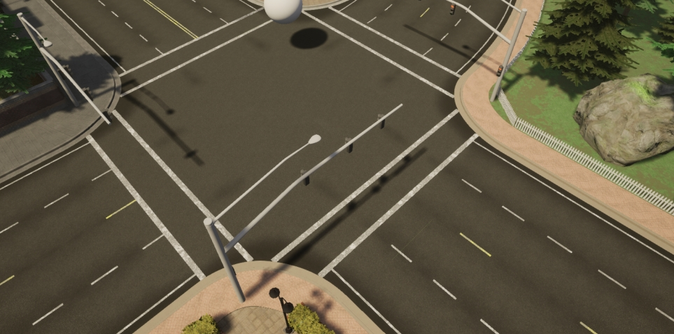
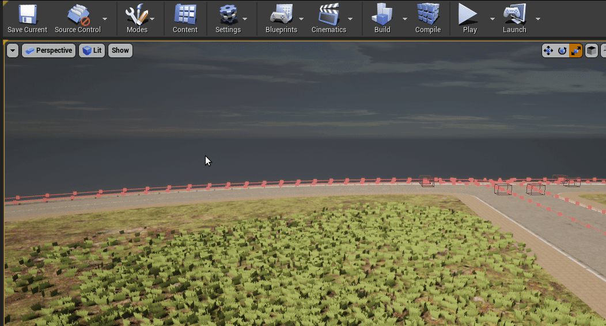

# 内容创作 - 地图

Carla 提供了大量的资源，可用于创建开箱即用的驾驶仿真。然而，Carla 的真正力量在于其全面的可扩展性，允许用户创建完全自定义的环境，其中包含建筑物、长凳、垃圾桶、雕像、路灯和公交车站等定制资产。之前稳定的[地图定制方法](map_customization.md)。

在本教程中，我们将介绍创建与 Carla 一起使用的简单地图的过程。我们将使用两个软件包来创建地图的各个部分。我们将使用 [__RoadRunner__](https://es.mathworks.com/products/roadrunner.html) 创建道路网络，然后通过 [__虚幻编辑器__](https://www.unrealengine.com/en-US/features/the-unreal-editor) 将资源添加到地图中。

* __[先决条件](#prerequisites)__  
* __[大地图](#large-maps)__
* __[数字孪生工具](#digital-twin-tool)__
* __[RoadRunner](#create-a-road-network-using-roadrunner)__  
* __[导入 Carla](#importing-your-road-network-into-carla)__
* __[导入资产](#importing-assets-and-adding-them-to-the-map)__
* __[交通灯](#traffic-lights)__
* __[交通标志](#traffic-signs)__ 
* __[Materials](#materials)__
* __[道路画家](#road-painter)__
    * [什么是道路画家？](#what-is-the-road-painter)
    * [道路画家参与者、主材质和渲染对象](#establish-the-road-painter-master-material-and-render-target)
    * [准备主材料](#prepare-the-master-material)
    * [描绘道路](#paint-the-road)
    * [更新车道线外观](#update-the-appearance-of-lane-markings)
    * [下一步](#next-steps)
* __[树木和植被](#trees-and-vegetation)__
    * [树叶工具](#foliage-tool)

## 先决条件

要遵循本指南，您需要从源代码构建 Carla，以便您可以使用虚幻编辑器。请遵循相关操作系统的 [__构建说明__](build_carla.md) 。您还需要 RoadRunner 的许可副本。您可能还需要 Maya、3DS Max 或 Blender 等三维建模应用程序来为自定义地图创建三维资产。您应该确保已完成构建 Carla 的所有步骤并确保虚幻编辑器正在运行，这可能需要一些时间来构建应用程序。如果您想为地图创建三维资产，则应使用适当的三维设计应用程序，例如 Blender、Maya、3DsMax 或 Modo。

## 大地图

以下文本详细介绍了创建和装饰标准地图的过程。从版本 0.9.12 开始，Carla 具有大地图功能。大地图的比例比标准地图更大，最大可达 100 km2。由于硬件限制，大地图的工作方式与标准地图略有不同，即使在高端显卡中也是如此。大地图被分割成图块，并且在仿真过程中仅加载立即需要的图块（即最接近自我车辆的图块）。其他图块处于休眠状态，直到需要数据为止。这有助于实现 Carla 仿真的最高性能。接下来的大多数细节与构建大地图时类似，但还有一些额外的步骤。请按照 [本指南](content_authoring_large_maps.md) 为 Carla 构建大地图。

## 数字孪生工具

Carla 提供了一个程序化地图生成工具，它从 OpenStreetMap 获取道路网络数据，并用建筑物和植被程序化地装饰地图。请在 [此处](adv_digital_twin.md) 阅读有关如何使用该工具的信息。

## 使用 RoadRunner 创建路网

打开 RoadRunner 并创建一个新场景。选择道路规划工具(Road Plan Tool)并在工作区中 __右键__ 单击以放置道路的第一个控制点和第二个控制点。单击并拖动道路尽头的红点以移动和延长道路。

出于本教程的目的，我们使用中间有一个交叉路口的简单椭圆形道路。要构建更高级的网络，请参阅 [__Roadrunner 文档__](https://es.mathworks.com/products/roadrunner.html) 。

在 RoadRunner 中制作地图后，您就可以将其导出。请注意，__道路布局导出后无法修改__。导出之前，请确保：

- 地图以 (0,0) 为中心，以确保地图可以在虚幻引擎中正确可视化。
- 地图定义是正确的。
- 地图验证是正确的，密切关注连接和几何形状。

>>>>

地图准备好后，单击`OpenDRIVE Preview Tool`按钮即可可视化 OpenDRIVE 道路网络并对所有内容进行最后一次检查。

>>>>

!!! 笔记
    _OpenDrive Preview Tool_ 可以更轻松地测试地图的完整性。如果连接有任何错误，请单击`Maneuver Tool`和`Rebuild Maneuver Roads`。 

创建所需的道路网络后，在 RoadRunner 菜单栏中选择`File > Export > Carla Filmbox (.fbx, .xodr, .rrdata.xml)` 并导出到适当的位置。

RoadRunner 是创建自定义地图的最佳应用程序。还有一些替代方案，例如 [__OpenStreetMap__](tuto_G_openstreetmap.md)，专注于从真实的道路地图生成地图。

## TrueVision 设计器

RoadRunner 是一款需要 MATLAB 的专有软件。大学等一些机构可能与 MathWorks 达成了协议，以便某些用户可以获得 RoadRunner 许可证。如果您没有许可证预算，RoadRunner 的一个方便的开源替代方案是[__TrueVision Designer__](https://www.truevision.ai/designer) 。此应用程序具有许多与 RoadRunner 相同的功能，如果您无法获得 RoadRunner 的许可证，该应用程序会非常有用。

## 将您的路网导入 Carla

Carla 需要的重要导出文件是 `.xodr` 文件和 `.fbx` 文件。将这些文件复制或移动到您从源代码构建的 Carla 存储库根目录内的 `Import` 文件夹中。

现在在 Carla 源目录的根目录中打开一个终端并运行`make import`. 这会将道路网络导入 Carla。

您现在可以在虚幻编辑器中看到新地图。在 Carla 源目录的根目录下运行 `make launch` 以启动虚幻编辑器。您现在将在内容浏览器中看到一个名为 `map_package` 的新目录。在此目录 `Content > map_package > Maps > tutorial` 中，您现在将找到您的新地图。

!!! 笔记
    可以参考 [链接](https://zhuanlan.zhihu.com/p/552983835) 通过鼠标右键的方式直接导入。

您现在已经创建了道路网络，这是地图的基础。

## 导入资产并将它们添加到地图

现在我们已经有了道路网络作为地图的基础，我们现在想要为地图创建一些内容，例如建筑物。这些资源可以使用三维建模应用程序（例如 Autodesk Maya、3DS Max、Blender 或具有适当导出选项的任何其他三维应用程序）创建。重要的是，应用程序至少能够导出`.fbx`。

在 Carla 中创建资产需要几个元素：

- [__网格__](https://en.wikipedia.org/wiki/Polygon_mesh) - 一组 3D 坐标顶点和关联的连接边。
- [__UV 贴图__](https://en.wikipedia.org/wiki/UV_mapping) - 将三维顶点和边映射到二维纹理空间，以将纹理与三维位置进行匹配。
- [__纹理__](https://en.wikipedia.org/wiki/Texture_mapping) - 定义三维对象表面上显示的颜色和图案的二维图像。
- [__法线贴图__](https://en.wikipedia.org/wiki/Normal_mapping) - 定义目标表面法线方向的二维图像，以向目标表面添加三维变化。
- ORM 贴图 - 定义金属度(Metallicity)、粗糙度(Roughness)和环境光遮挡(Occlusion)区域的贴图

ORM 贴图利用标准 RGBA 编码图像的通道对金属区域、粗糙度和环境遮挡的贴图进行编码。当我们在这里定义贴图时，红色通道定义金属贴图，绿色通道定义粗糙度，蓝色通道定义环境光遮挡。这些贴图（以及漫反射贴图和法线贴图）可以使用 [__Adobe Substance 3D painter__](https://www.adobe.com/products/substance3d-painter.html) 等应用程序创建。

使用虚幻内容浏览器在某个适当的位置创建一个新文件夹。在此文件夹中，您可以右键单击并`Import to PATH/TO/FOLDER`在上下文菜单顶部附近进行选择，也可以将文件直接拖放到内容浏览器中。

我们将导入一个包含从 Blender 导出的基础网格和 UV 贴图的 FBX 文件。

在上下文菜单中，对于 `Normal Import Method` 确保“网格”部分选择了“导入法线(`Import Normals`)，并且在“材质(__Material__)”部分中选择了`Do Not Create Material`。在“材质”部分中取消选择，因为我们将手动导入它们。如果您想使用 FBX 文件中已嵌入的某些纹理，这些选择将会有所不同。

选择`Import All`。导入完成后，双击内容浏览器中显示的导入资源进行编辑。

我们现在应该导入纹理、漫反射颜色的漫反射纹理、法线贴图和 ORM 贴图。

通过双击打开 ORM 贴图并取消选择`sRGB`选项，以确保正确应用纹理。

右键单击内容浏览器并从菜单中选择`Material`。将在内容浏览器中创建新材料。双击进行编辑。按住 Shift 键选择导入的纹理并将其拖到材质编辑窗口中，现在您将在材质节点编辑器中获得 3 个新节点。

现在根据以下规则连接节点：

- Diffuse RGB --> Base Color
- Normal RGB --> Normal
- ORM R --> Ambient occlusion
- ORM G --> Roughness
- ORM B --> Metallic

您的材质节点图现在应该与此类似：

保存材质，然后再次打开资源并将材质拖入材质槽中。您的资源现在应该已完全纹理化。

现在保存资产，即可在地图中使用。您现在可以从内容浏览器中拖动资源并将其放入地图中：

现在，您可以使用工作区左上角的“保存当前”选项保存地图，即可使用。开始仿真。

地图作者指南到此结束。现在您知道如何创建道路网络并导入三维资产以在 Carla 中使用。您现在可以阅读如何 [__打包地图以在 Carla 独立版本中使用__](tuto_M_manual_map_package.md) 。

## 交通灯

要将红绿灯添加到新地图：

__1.__ 从 _内容浏览器_, 导航至 `Content > Carla > Static > TrafficLight > StreetLights_01`。您会发现几种不同的交通灯蓝图可供选择。

__2.__ 将交通灯拖到场景中并将其放置在所需位置。按键盘上的空格键可在定位、旋转和缩放工具之间切换。

__3.__ 通过选择“详细(_Details_)” 面板中的 _BoxTrigger_ 组件并调整 _Transform_ 部分的值，为每个红绿灯调整 [`trigger volume`][triggerlink] 。这将确定红绿灯的影响范围。

>>

__4.__ 对于路口，将`BP_TrafficLightGroup`参与者拖入关卡中。通过将路口处的所有交通灯添加到“详细信息(_Details_)”面板中的“交通灯(_Traffic Lights_)”数组，将它们分配给交通灯组。

>>

__5.__ 交通灯计时只能通过Python API 进行配置。请参阅 [此处](core_actors.md#traffic-signs-and-traffic-lights) 的文档以获取更多信息。

>>

> _例如：交通标志、交通信号灯和转弯停车。_

[triggerlink]: python_api.md#carla.TrafficSign.trigger_volume

## 交通标志

要将交通标志添加到新地图：

__1.__ 从 _内容浏览器_，导航至 `Content > Carla > Static > TrafficSign`。您会发现几种不同的交通灯蓝图可供选择。

__2.__ 将交通灯拖到场景中并将其放置在所需位置。按键盘上的空格键可在定位、旋转和缩放工具之间切换。

__3.__ 通过在“详细信息( _Details_ )”面板中选择 _BoxTrigger_ 组件并调整“变换(_Transform_)”部分中的值，调整每个交通标志的[`trigger volume`][triggerlink]。这将确定交通灯的影响区域。并非所有交通标志都有触发音量。此类标志包括让行标志、停车标志和限速标志。

## 材质

Carla 内容库拥有大量有用的材料，可随时用于更改地图的外观。在内容浏览器中，导航至`Carla > Static > GenericMaterials`。在这里您会发现许多可用于改变地图外观的材料。

您可以通过拖放到地图元素上来快速测试材质：

# 道路画家

道路画家是一种可用于自定义道路外观的工具，通过附加纹理、贴花和网格添加额外的真实感。

## 什么是道路画家？

道路画家工具是一个使用 OpenDRIVE 信息快速绘制道路的蓝图。它采用主材质并将其应用到道路的渲染目标以用作画布。主材质由一系列材质组成，这些材质可以使用画笔混合并用作蒙版。无需应用光度测定技术，也无需考虑几何体的 UV。

道路画家使用 OpenDRIVE 信息来油漆道路。确保您的`.xodr`文件与地图同名，这样才能正常工作。

## 建立道路画家、掌握材质和渲染对象

__1. 创建 `RoadPainter` 参与者。__

1. 在 _内容浏览器_ 中，导航至 `Content > Carla > Blueprints > LevelDesign`。
2. 将 `RoadPainter` 拖入场景中。

__2. 创建渲染目标。__

1. 在 _内容浏览器_ ，导航至 `Content > Carla > Blueprints > LevelDesign > RoadPainterAssets`.
2. 右键单击 `RenderTarget` 文件并选择 `Duplicate`。
3. 重命名为 `Tutorial_RenderTarget`。

__3. 创建主材质实例。__

1. 在 _内容浏览器_ 中，导航至 `Game > Carla > Static > GenericMaterials > RoadPainterMaterials`.
2. 右键单击 `M_RoadMaster` 并选择 _Create Material Instance_。
3. 重命名为 `Tutorial_RoadMaster`。

__4. 重新校准“地图尺寸”(_Map Size (Cm)_ ) ，使其等于地图的实际尺寸。__

1. 选择 `RoadPainter` 场景中的参与者。
2. 转到“详细信息( _Details_ )”  面板并按 _Z-Size_ 按钮。 您将看到”地图尺寸 (Cm)(_Map Size (Cm)_)“中的值发生变化。

>>>>>

__5. 同步`RoadPainter` 和 `Tutorial_RoadMaster` 之间的地图尺寸。__

1. 在 _内容浏览器_中，打开 `Tutorial_RoadMaster`。
2. 复制上一步中 _Map Size (Cm)_ 的值，并将其粘贴到 `Tutorial_RoadMaster` 窗口中的 _Global Scalar Parameter Values -> Map units (CM)_ 。
3. 点击保存。

>>>>>>

__6. 创建道路画家和主材质之间的通信链接。__

`Tutorial_RenderTarget`  将是道路画家和 `Tutorial_RoadMaster` 之间的通信纽带。

1. 在 `Tutorial_RoadMaster` 窗口中，将 `Tutorial_RenderTarget` 应用于 _Global Texture Parameter Values -> Texture Mask_。
2. 保存并关闭。
3. 在主编辑器窗口中，选择道路画家参与者，转到“详细信息(_Details_)”面板并将 `Tutorial_RenderTarget` 应用_Paint -> Render Target_ 。

---

## 准备主材质

您创建的`Tutorial_RoadMaster`材质包含基础材质、额外材质信息以及将通过您的`Tutorial_RenderTarget`。您可以配置一种基础材质和最多三种附加材质。

>>

要配置材料，请双击该`Tutorial_RoadMaster`文件。在出现的窗口中，您可以根据需要为每种材料选择和调整以下值：

- 亮度(Brightness)
- 色调(Hue)
- 饱和度(Saturation)
- AO 强度(Intensity)
- 法线贴图强度(NormalMap Intensity)
- 粗糙度对比(Roughness Contrast)
- 粗糙度强度(Roughness Intensity)

您可以通过选择以下值并在搜索框中搜索纹理来更改每种材质的纹理：

- Diffuse
- Normal
- ORMH

探索 `Game > Carla > Static > GenericMaterials > Asphalt > Textures` 中可用的一些 Carla 纹理。

---

### 描绘道路

__1. 在道路画家和道路之间创建链接。__

1. 在主编辑器窗口中，在 _World Outliner_ 搜索框中进行 `Road_Road` 的搜索。
2. 按 `Ctrl + A` 选择所有道路。
3. 在“详细信息( _Details_ )”  面板中，转到 _Materials_ 部分并给  _Element 0_、 _Element 1_、 _Element 2_ 和 _Element 3_ 应用 `Tutorial_RoadMaster`。

__2. 选择要定制的材质。__

我们添加的每种材质 `Tutorial_RoadMaster` 都单独应用于道路，并使用画笔工具配置应用程序。要应用和自定义材质：

1. 选择道路画家参与者
2. 在“详细信息( _Details_ )” 面板中，在 _Mask Color_ 下拉菜单中选择要使用的材质。

>>>>>>

__3. 设置画笔和模板参数。__

`GenericMaterials/RoadStencil/Alphas` 中有多种模板可供选择。模板用于根据您的需要绘制道路，可以使用以下值进行调整：

- _Stencil size_ — 画笔的尺寸。
- _Brush strength_ — 轮廓的粗糙度。
- _Spacebeween Brushes_ — 笔划之间的距离。
- _Max Jitter_ — 笔划之间画笔的大小变化。
- _Stencil_ — 要使用的画笔。
- _Rotation_ — 应用于笔画的旋转。

>>>>>>

<i>刷子面板。</i>

 

<i>不同类型的刷子。</i>

 

__4. 将每种材质涂抹到道路的所需部分。__

通过“详细信息( _Details_ )”面板的“默认( _Default_ )”部分中的按钮选择应用所选材质的位置：

* _Paint all roads_ — 粉刷所有道路。
* _Paint by actor_ — 绘画特定的、选定的参与者。
* _Paint over circle_ — 使用圆形图案进行绘制，有助于提供变化。
* _Paint over square_ — 使用正方形图案进行绘制，有助于提供变化。

此部分还包含用于删除已应用更改的选项。

* _Clear all_ — 擦除所有绘制的材质。
* _Clear materials_ — 删除当前活动的材质。
* _Clear material by actor_ — 删除最接近所选参与者的材质。

>>>>>>

<i>Different painting and erasing options.</i>

 

__5.添加贴花和网格。__

您可以在 `Content > Carla Static > Decals` 和 `Content > Carla > Static` 中探索可用的贴花和网格。通过扩展并添加到 _Decals Spawn_ 和 _Meshes Spawn_ 数组，将它们添加到道路绘制器中。对于每一项，您都可以配置以下参数：

- _Number of Decals/Meshes_ - 要绘制的每个贴花或网格的数量。
- _Decal/Mesh Scale_ — 每个轴的贴花/网格比例。
- _Fixed Decal/Mesh Offset_ — 每个轴与车道中心的偏差。
- _Random Offset_ — 每个轴与车道中心的最大偏差。
- _Decal/Mesh Random Yaw_ — 最大随机偏航旋转。
- _Decal/Mesh Min Scale_ — 应用于贴花/网格的最小随机比例。
- _Decal/Mesh Max Scale_ — 应用于贴花/网格的最大随机比例。

>>>>>>

<i>贴花和网格面板。</i>

 

配置好网格和贴花后，通过按`Spawn decals`和生`Spawn meshes`。

!!! 笔记
    确保网格和贴花没有启用碰撞，以免干扰道路上的汽车并将任何边界框降低到道路水平。

__7. 尝试获得您想要的外观。__ 

尝试不同的材质、纹理、设置、贴花和网格以获得您想要的外观。下面是一些示例图像，显示了在绘制每种材质的过程中道路外观如何变化。

<i>基础道路材料示例。</i>

 

<i>应用材料 1 后的示例。</i>

 

<i>应用材料 2 后的示例。</i>

 

<i>应用材料 3 后的示例。</i>

 

<i>应用贴花后的示例。</i>

 

<i>应用网格后的示例。</i>

 

---

## 更新车道线外观

绘制道路后，您可以按照以下步骤更新车道线的外观：

__1. 复制主材料。__

1. 在 _内容浏览器_ 中，导航至 `Game > Carla > Static > GenericMaterials > RoadPainterMaterials`。
2. 右键单击 `Tutorial_RoadMaster` 并选择 _Create Material Instance_。
3. 重命名为 `Tutorial_LaneMarkings`。

__2. 配置车道线材质。__

1. 在 _内容浏览器_ 中，双击 `Tutorial_LaneMarkings`。
2. 在“详细信息(_Details_)”面板中，转到 _Global Static Switch Parameter Values_ 分，然后选中 _LaneMark_ 左侧和右侧的框。
3. 转到 _Texture_ 部分并选中 _LaneColor_ 和 _Uv Size_ 复选框。
4. 在 _LaneColor_ 中选择您喜欢的车道标记颜色。
5. _Save_ 并关闭。

__3. 选择车道线网格。__

将材料拖到您想要着色的车道线上。如果需要，对不同颜色的车道线重复整个过程。

---

## 树木和植被

Carla 内容库拥有一套全面的植被蓝图，供您为地图的越野区域（如人行道、公园、山坡、田野和森林）增添更多真实感。

导航到 Carla 内容库中的植被文件夹：`Carla > Static > Visitation`。您会找到多种树木、灌木丛的蓝图。您可以将这些元素从内容浏览器拖到地图中。

### 树叶工具

对于树木和植被来说，一个有用的工具是 [__虚幻引擎树叶工具__](https://docs.unrealengine.com/4.27/en-US/BuildingWorlds/Foliage/) 。通过从工具栏的`mode`下拉列表中选择来激活该工具。

将所需的树叶项目拖到标有 `+ Drop Foliage Here` 的框中。在密度字段中设置适当的密度，然后使用树叶项目绘制到地图上。

## 下一步

使用以下工具和指南继续自定义您的地图：

- [在地图中实施子关卡。.](tuto_M_custom_layers.md)
- [使用程序化构建工具添加建筑物。](tuto_M_custom_buildings.md)
- [自定义天气](tuto_M_custom_weather_landscape.md#weather-customization)
- [使用序列化网格自定义景观。](tuto_M_custom_weather_landscape.md#add-serial-meshes)
完成定制后，您可以 [生成行人导航信息](tuto_M_generate_pedestrian_navigation.md) 。

---

如果您对流程有任何疑问，可以在 [论坛](https://github.com/carla-simulator/carla/discussions) 中提问。

<a href="https://github.com/carla-simulator/carla/discussions" target="_blank" class="btn btn-neutral" title="Go to the CARLA forum">
Carla 论坛</a>

