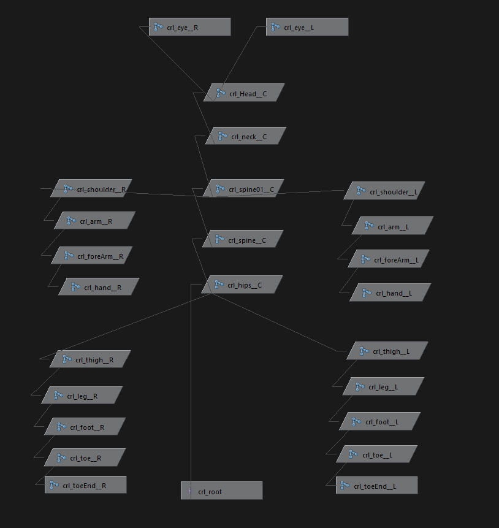
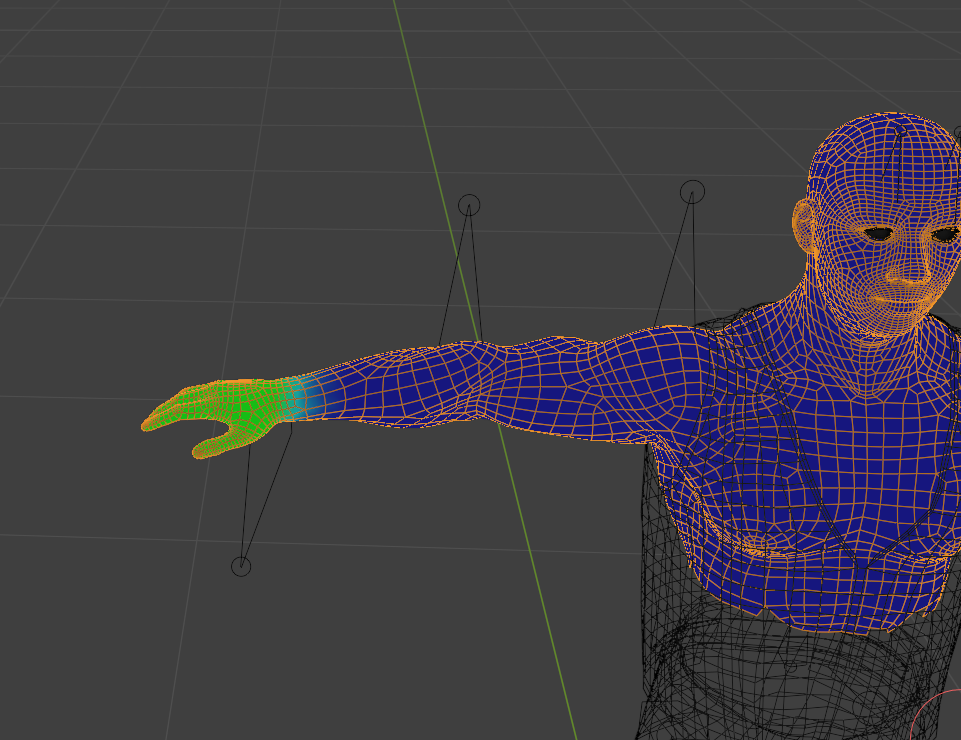
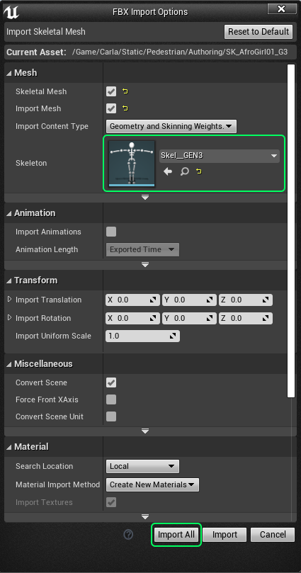
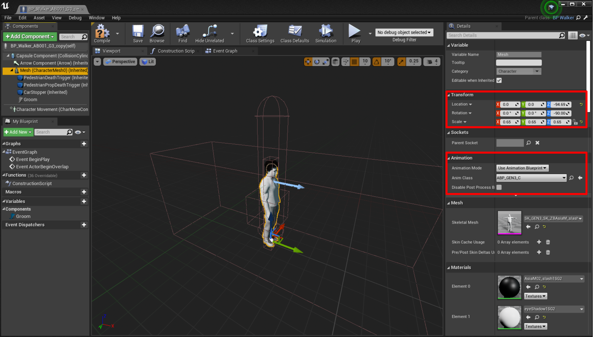

# [内容创作 - 行人](https://github.com/carla-simulator/carla/commit/b08f74990c83b145850a0a5cb2ddcdd6bdc8b35d) 

Carla 在 WalkerFactory 蓝图中提供了一套全面开箱即用的行人。用户可以通过自定义行人进行扩展。为3D动画建模人体解剖学非常复杂，超出了本文档的范围。因此，我们向用户推荐替代资源，以学习如何在3D建模应用程序中对人进行建模。本指南介绍如何导入和配置一个完整的三维人体模型，以便在 Carla 使用行人。

* __[建模](#modeling)__
	* [命名约定](#naming-conventions)
* __[动画绑定](#rigging-the-vehicle-using-an-armature)__
	* [导入](#import)
	* [Armature](#add-an-armature)
    * [Parenting](#parenting)
    * [分配](#assigning-car-parts-to-bones)
	* [Blender 插件](#blender-ue4-vehicle-rigging-add-on)
    * [Export](#export)
* __[导入到虚幻引擎](#importing-into-unreal-engine)__
	* [物理资产](#setting-the-physics-asset)
	* [动画](#creating-the-animation)
    * [蓝图](#creating-the-blueprint)
* __[材质](#materials)__
	* [应用材质](#applying-a-material-to-your-vehicle)
		* [颜色](#color)
		* [透明涂层](#clear-coat)
		* [橙皮纹路](#orange-peel)
		* [鳞片](#flakes)
		* [灰尘](#dust)
* __[玻璃](#glass)__
	* [玻璃网格](#glass-meshes)
	* [玻璃材质](#glass-material)
	* [单层玻璃](#single-layer-glass)
* __[Wheels](#wheels)__
	* [车轮蓝图](#wheel-blueprint)
	* [碰撞网格](#collision-mesh)
	* [轮胎配置](#tire-configuration)
	* [车轮尺寸](#wheel-dimensions)
* __[光照](#lights)__
	* [UV 贴图](#uv-map)
	* [导入](#importing)

## 建模

行人是绑定到关节和骨骼的骨骼层次的几何体的组合。它们应该作为**骨架网格**导入到虚幻引擎中。网格将绑定到骨架定义。有关骨骼定义的信息可以封装在从3D应用程序导出的FBX文件中。 

* __几何__  

    行人应该有30000到50000个面。这应该包括所有的解剖和衣服。理想情况下，模型应该具有人体尺寸，如果需要，可以在导入后重新缩放。

    !!! 注意
        请仔细注意3D应用程序的单位。一些应用程序以米为单位工作，而另一些应用程序以厘米或任意单位工作。

* __骨骼层次__  

    骨骼层次应遵循 Carla 的 GEN3 骨骼层次，[下载模板](https://drive.google.com/file/d/1SYUvH096VxoD_qEMafL9Y4qR5Zhz3IPH/view?usp=sharing) 以与您自己的模型一起使用。您可以删除人体几何图形并将其替换为您自己的。这将与虚幻引擎中 Carla 的预生成骨骼定义相匹配。

	

* __蒙皮和权重绘制__  

	准备 3D 模型以使其正确移动的一部分是确保模型的各个顶点以正确的方式受到骨架中每根骨骼的影响。例如，控制 3D 角色手腕的骨骼应该控制手和手腕的顶点。它应该对前臂稍远的顶点产生轻微影响，但不应该影响肘部附近的任何顶点。因此，您应该使用 3D 应用程序的权重绘制工具来微调每根骨骼对网格的影响。这是一个复杂的过程，我们建议用户参考其他资源以了解有关人类角色蒙皮和权重绘制的更多信息。

	

## 将行人导入 Carla

完成网格的几何形状并将其绑定到骨架后，您应该将其从 3D 应用程序中以 FBX 格式导出。完成导出后，在 Carla 内容库中找到合适的文件夹位置，然后将 FBX 拖放到内容浏览器中。您可能希望将自定义行人放置在现有行人 `Content > Carla > Static > Pedestrians` 旁边。

在导入选项弹出对话框中，确保选择了*Skeletal Mesh*和*Import Mesh*，并且*Import Content Type*设置为*Geometry and Skinning Weights*。在*Skeleton*部分，选择 Carla 的预生成骨架定义*Skel_GEN3*。然后按*Import All*。

*Skel_GEN3*定义已指定行人动画。

## 通过 Python API 让你的新行人可以访问

成功将行人导入 Carla 的内容库后，您现在必须通过 API 使行人可用。

导航到现有行人蓝图的位置 `Content > Carla > Blueprints > Walkers`。复制 GEN3 蓝图，例如 BP_Walker_AB001_G3 并重命名。

双击复制的蓝图以在编辑器中打开它。您需要将蓝图的*Mesh*组件更改为新的行人模型。将刚刚从内容浏览器导入的骨架网格拖放到*Skeletal Mesh*插槽中。

