# 内容创作 - 车辆

Carla 在蓝图库中提供了一套开箱即用的全面车辆。Carla 允许用户使用定制车辆对此进行扩展，以实现最大的可扩展性。

详细车辆的三维建模非常复杂，需要很高的技能。因此，我们建议读者参考有关三维建模的其他文档来源，因为这超出了本指南的范围。然而，免费和专有的在线存储库中有大量的车辆模型来源。因此，用户有多种选择来创建用于 Carla 的定制车辆。

为 Carla 准备定制车辆的关键因素在于装配车辆骨架，然后导入到虚幻引擎中。装配和导入后，需要为汽车和车轮设置蓝图。然后应用材料并添加车辆的玻璃部件。我们将在以下指南中介绍这些步骤。

* __[建模](#modeling)__   
	* [命名约定](#naming-conventions)  
* __[使用电枢装配车辆](#rigging-the-vehicle-using-an-armature)__   
	* [导入](#import)  
	* [添加电枢](#add-an-armature)
    * [设置父级](#parenting)
    * [将汽车零件分配给骨骼](#assigning-car-parts-to-bones) 
	* [Blender 的虚幻引擎 4 车辆装配插件](#blender-ue4-vehicle-rigging-add-on)
    * [导出](#export)  
* __[导入虚幻引擎](#importing-into-unreal-engine)__   
	* [设置物理资产](#setting-the-physics-asset)  
	* [创建动画](#creating-the-animation)
    * [创建蓝图](#creating-the-blueprint)
* __[材质](#materials)__   
	* [给车辆应用材质](#applying-a-material-to-your-vehicle)
		* [颜色](#color)
		* [透明涂层](#clear-coat)
		* [粒状表面](#orange-peel)
		* [薄片](#flakes)
		* [灰尘](#dust)
* __[玻璃](#glass)__   
	* [玻璃网格](#glass-meshes)
	* [玻璃材质](#glass-material)
	* [单层玻璃](#single-layer-glass)
* __[车轮](#wheels)__   
    * [车轮蓝图](#wheel-blueprint)
    * [碰撞网格](#collision-mesh)
    * [轮胎配置](#tire-configuration)
    * [车轮尺寸](#wheel-dimensions)
    * [悬架特性](#suspension_characteristic)
* __[灯](#lights)__
	* [UV 贴图](#uv-map)
	* [导入](#importing)

## 建模 <span id="modeling"></span>

车辆应有 5 万到 10 万个面片。作为最佳实践，我们建议在导出之前对模型进行三角测量。Carla 车辆是参考实际汽车的尺寸和比例进行建模的。请确保您特别注意三维应用程序的单位。有些以厘米为单位，有些则以米为单位。

### 命名约定 <span id="naming-conventions"></span>

为了方便和一致，我们建议您将车辆分为以下部分并相应命名。玻璃和灯的具体细节将在后面的部分中介绍：

>1. __车身(Bodywork)__: 车辆的金属部分。该材质已更改为虚幻引擎材质。可以添加徽标和细节，但为了可见，必须使用虚幻引擎编辑器中的 Alpha 通道将它们绘制为不同的颜色。
>2. __Glass_Ext__: 一层玻璃，可以从车辆外部看到内部。
>3. __Glass_Int__: 一层玻璃，允许从车辆内部到外部的可见性。
>4. __Lights__: 头灯、指示灯等
>5. __LightGlass_Ext__: 一层玻璃，允许从外部到内部的灯光可见性。
>6. __LightGlass_Int__: 一层玻璃，允许从内部到外部看到光。
>7. __LicensePlate__: 29x12 厘米的矩形平面。您可以使用提供的  Carla 以获得最佳结果，请在 [此处](https://carla-assets.s3.eu-west-3.amazonaws.com/fbx/LicensePlate.rar) 下载 `.fbx`。纹理将在虚幻引擎中自动分配。
>8. __内饰(Interior)__: 任何其他不适合上述部分的细节都可以进入 _内饰_。

材质(Material)应使用格式 `M_CarPart_CarName` 命名，例如, `M_Bodywork_Mustang`。纹理的大小应为 2048x2048。

## 使用电枢装配车辆 <span id="rigging-the-vehicle-using-an-armature"></span>

为了在模拟中看起来更真实，汽车需要有旋转轮子，前一对轮子可以随着转向输入而转动。因此，要为 Carla 准备车辆，需要在汽车上安装电枢以识别车轮并允许其移动。

### 导入  <span id="import"></span>

在三维建模应用程序中导入或建模车辆模型网格。在本指南中，我们将使用 Blender 3D。确保轮子与主体分离。每个轮子必须可以作为一个不同的对象进行访问。


确保车辆面向正 X 方向非常重要，因此引擎盖和挡风玻璃应面向正 X 方向。汽车的方向还应使地板到车顶方向处于正 Z 方向。车轮应该正好擦过 XY 平面，并且原点应该位于您期望车辆质心位于 XY 平面（但不是 Z 平面）的位置。

### 添加电枢 <span id="add-an-armature"></span>

现在在车辆的中心添加一个骨架，确保物体正确居中，骨架骨骼的根部应设置在原点。切换到编辑模式并将骨架绕 x 轴旋转 90 度。

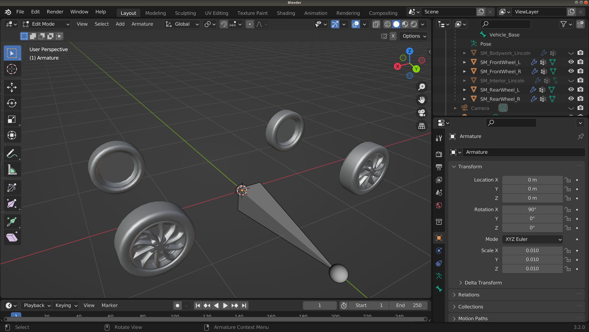

现在选择骨架并添加 4 个骨骼。这些骨骼中的每一个都需要定位，使得骨骼的根部与每个轮子的中心重合。这可以通过在编辑模式下将三维光标定位在每个滚轮的中心来实现。在对象模式下选择其中一个轮子，选择一个顶点，按 A 选择所有顶点，然后`Shift+S`选择`Cursor to selected`。这会将光标定位在滚轮的中心。然后，在对象模式下，选择骨架，切换到编辑模式，选择骨骼并选择`Selection to cursor`。您的骨骼现在将与轮子重合。旋转每个骨骼，使其与骨架底部对齐。

对于每个轮子，建议根据需要耦合的轮子来命名骨骼，这将有助于稍后在需要为每个骨骼分配顶点组时进行识别。

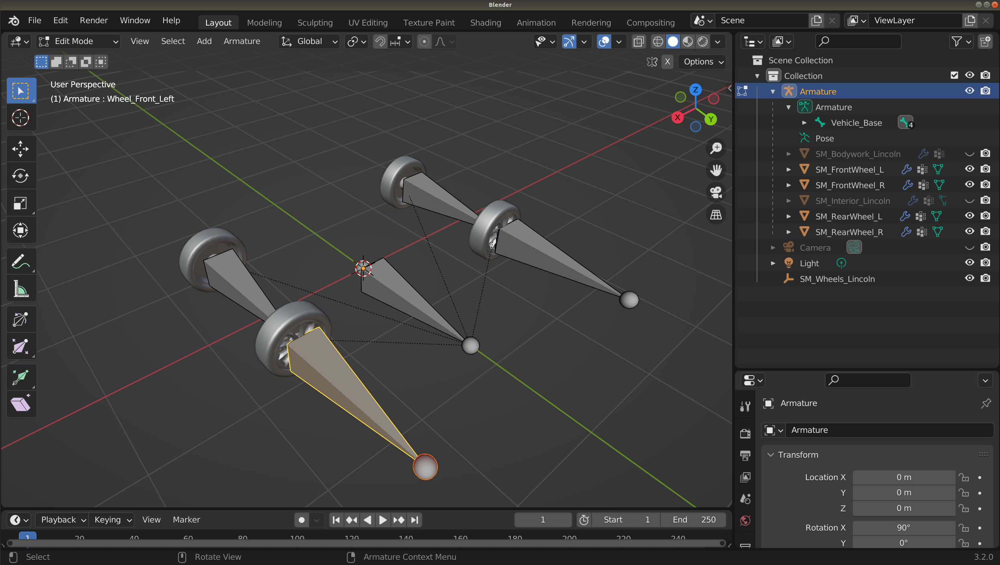

### 设置父级  <span id="parenting"></span>

现在在项目大纲中使用 shift 或 control 选择身体的所有部分和所有4个轮子，然后控制选择您创建的骨架（这个顺序很重要，如果您以相反的顺序选择它们将不起作用）。按`Ctrl+p`并选择`With empty groups`将网格绑定到骨架。


现在您已将网格体设置为骨架的父级，现在需要将每个轮子分配给其各自的骨骼。在大纲视图或编辑器中选择一个轮子。切换到编辑模式，然后选择轮子的所有顶点（快捷键 - a）。

### 将汽车零件分配给骨骼 <span id="assigning-car-parts-to-bones"></span>

选择属性的网格选项卡（绿色三角形）。在网格属性面板的顶点组选项卡中，您现在应该看到骨架的骨骼。选择与您正在编辑的轮子对应的骨骼，然后选择`Assign`。安装好车轮后，将车辆的所有其他部件安装到基骨上。

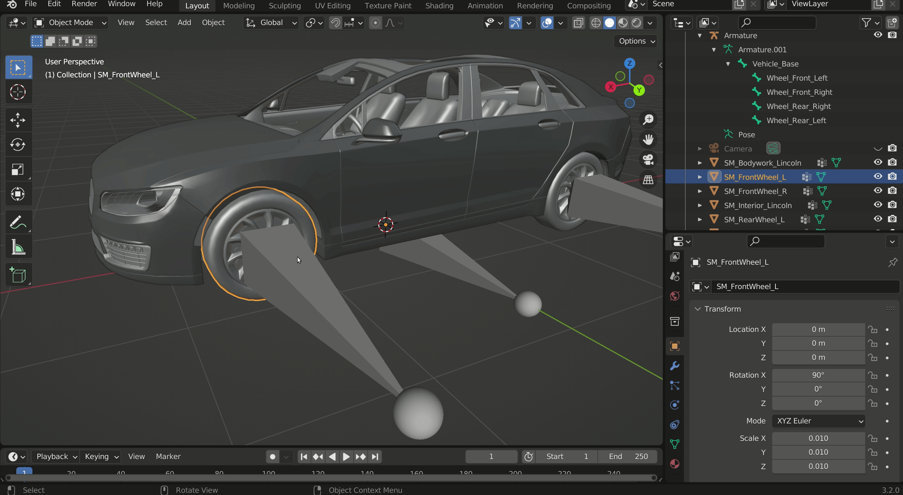

将所有网格部件分配给骨架后，您可以通过选择骨架并移动到姿势模式并移动相关骨骼来测试它是否有效。车辆基骨应移动整个车辆，而轮骨应分别移动并旋转各自的车轮。`Ctrl+Z`确保撤消您可能做出的任何姿势。


### Blender 的虚幻引擎 4 车辆装配插件 <span id="blender-ue4-vehicle-rigging-add-on"></span>

Blender 有一个非常有用的插件，用于装配车辆以导入 Carla，有助于简化上述步骤。请参阅 [__插件网页__](https://continuebreak.com/creations/ue4-vehicle-rigging-addon-blender/) 以获取说明。


### 导出 <span id="export"></span>

现在，我们将装配模型导出为 FBX 格式，以便导入到虚幻引擎中。从“文件”菜单中选择`Export > FBX (.fbx)`。在`Include` 面板的 `Object Types` 部分中，按住 Shift 键选择`Armature`和`Mesh`选项。

在`Transform`面板中。更改`Forward`为`X Forward`，并更改`Up`为`Z Up`. 这对于确保车辆在虚幻引擎中正确定向非常重要。

在`Armature`部分中取消`Add Leaf Bones`选中并取消`Bake Animation`选中。


## 导入虚幻引擎 <span id="importing-into-unreal-engine"></span>

从 Carla 根目录（您从源代码构建 Carla 的目录）中使用 `make launch` 命令启动虚幻编辑器。打开内容浏览器，设置适当的目录，然后右键单击并选择`Import to ....`。选择您之前从 Blender（或其他三维建模应用程序）导出的 FBX 文件。使用默认设置导入。

### 设置物理资产 <span id="setting-the-physics-asset"></span>

现在，您的内容浏览器目录中将包含 3 个内容：网格、骨架和物理资源。双击物理资源进行调整。

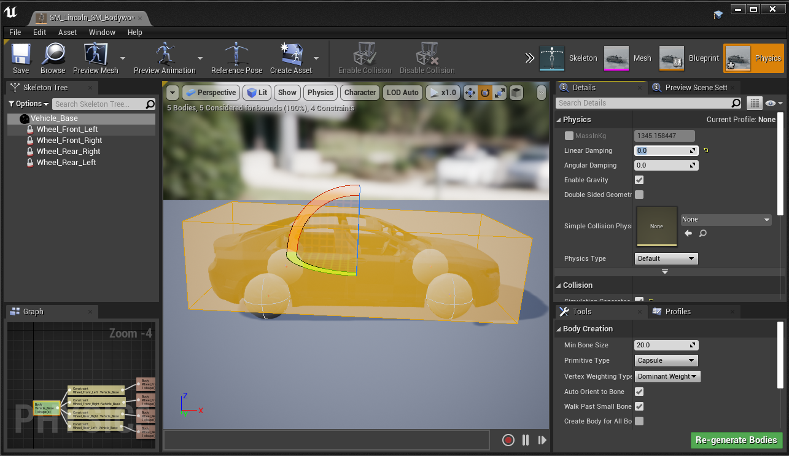

首先，选择车体，在右侧`Details`菜单中，将 `Physics` 部分中的`Linear Damping` 更改为 0.0，检查 `Collision` 部分的 `Simulation Generates Hit Events`，在 `Body Creation` 部分将`Primitive Type`从`Capsule`改为`Box`。然后按`Regenerate bodies`。胶囊现在将变成一个矩形盒子。然后选择轮子。


现在选择所有轮子（在`Skeleton Tree`左侧部分）。


将 `Linear Damping` 改为 0.0，将 `Physics Type` 设置为`Kinematic`，将`Collision Response`设置为`Disabled`，并选择`Primitive Type` 作为`Sphere`。再按`Re-generate Bodies`一次。


### 创建动画 <span id="creating-the-animation"></span>

在您拥有新车辆资产的**内容浏览器**目录中，右键单击空白地方并选择`动画(Animation) > 动画蓝图(Animation Blueprint)`。在打开的弹出窗口中，在`父类(Parent Class)`部分中搜索`VehicleAnimInstance`，然后搜索`目标骨骼(Target Skeleton)`与您的新车相对应的骨架，您应该能够在内容浏览器中看到该名称。选择这两项后按确定。这将为您的车辆创建一个新的动画蓝图。

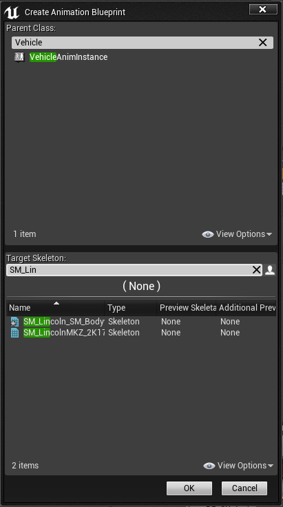

为了简化事情，我们可以从另一辆车复制动画。在第二个内容浏览器中，打开`内容(Content) > Carla > Static > Car > 4Wheeled`并选择任意车辆。打开所选车辆的动画蓝图，然后将除此`输出姿势(Output pose)`节点之外的所有节点复制到新的动画蓝图中。通过拖动最终节点与输出节点之间的新连接来连接节点。按编译，动画蓝图现已设置。


### 创建蓝图 <span id="creating-the-blueprint"></span>

使用内容浏览器导航到`内容(Content) > Carla > Blueprints > Vehicles > LincolnMKZ2017`或类似的车辆。在这里您将找到一组为 4 个轮子设置的蓝图。将它们复制到包含您自己的车辆的目录中并重命名它们以确保您以后可以区分它们。如果您愿意，您可以设置自己的自定义轮子，请参阅后面的 [__轮子部分__](#wheels) 。


右键单击新车辆资产所在的**内容浏览器**目录的空白地方并选择`蓝图 -> 蓝图类(Blueprint Class)`。在 `所有类(All Classes)` 菜单中搜索 `BaseVehiclePawn` 并选择此类。为蓝图命名并打开它。在左侧 `组件(Components)` 选项卡中进行 `网格体(Mesh)` 选择，然后将车辆网格拖动到右侧的“网格体”部分中。


在`Anim Class`搜索与您在上一步中设置的新车相对应的动画。

接下来，在蓝图类的`组件(Components)`菜单中选择`载具移动(Vehicle Movement)`，然后在右侧`细节(Details)`菜单中导航到该`车辆配置(Vehicle Setup) -> 车轮设置`部分。现在，对于每个车轮，找到您之前为`Wheel Class`属性复制并重命名的相关车轮蓝图。对每个轮子执行相同的操作。编译并保存。


现在导航到`Content > Carla > Blueprints > Vehicles > VehicleFactory`并双击它以打开车辆工厂。

选择`Vehicles`节点并展开右侧`默认值(Default value)`部分中的`Vehicles`项。


按加号图标添加您的新车。向下滚动到最后一个条目并将其展开，它应该是空的。命名您的车辆的品牌和型号，然后在 **类(Class)** 部分下找到您在上一部分中创建的蓝图类。将轮子数量保留为 4，并将世代设置为 2。编译并保存。为了安全起见，进行全局保存，您现在......准备在模拟中运行您的车辆。

按虚幻工具栏中的“运行”来进行模拟。运行后，打开终端并使用过滤器选项运行脚本 `manual_control.py` 来指定您的新车辆型号：

```sh
python manual_control.py --filter my_vehicle_make
```


事实上，车辆目前没有应用纹理或颜色。下一步是应用材料，使您的车辆具有像真正的公路车辆一样的外观。

## 材质 <span id="materials"></span>

将车辆作为基本资产导入并布置好网格和蓝图后，您现在需要向车辆添加材质，以促进虚幻引擎中的照片级真实感渲染，从而实现机器学习训练数据的最大保真度。

虚幻编辑器拥有全面的材质工作流程，有助于创建高度逼真的材质。然而，这确实显着增加了该过程的复杂性。因此，Carla 提供了一个大型材料原型库供您使用，而无需从头开始。

### 给车辆应用材质 <span id="applying-a-material-to-your-vehicle"></span>

Carla 提供了一种用于复制车辆光泽表面的原型材料，可以模拟多种不同类型的车辆喷漆工作和功能。打开虚幻编辑器并在内容浏览器中，找到`Content > Carla > Static > GenericMaterials > 00_MastersOpt`。基本材料称为`M_CarPaint_Master`。右键单击该材料并从上下文材质中选择`Create Material Instance`。为其命名并将其移动到存储新车辆内容的文件夹中。

在虚幻编辑器中，将观察则会移动到靠近地板的一点，然后将车辆的骨架网格物体从内容浏览器拖到场景中，车辆的车身现在将出现在那里。


现在，在右侧的详细信息面板中，将新材质实例拖动到 `Materials` 部分的 `Element 0` 位置。您将看到车身呈现出一种新的灰色、有光泽的材料特性。


双击内容浏览器中的材质，我们就可以开始编辑参数了。这里有许多参数可以改变各种属性，这些属性对于模拟现实世界的汽车喷漆工作非常重要。最重要的参数如下：

#### __颜色(Color)__ <span id="color"></span>

颜色设置决定汽车的整体颜色。基色只是汽车的主要颜色，它将控制整体颜色：


#### __透明涂层(Clear coat)__  <span id="clear-coat"></span>

透明涂层设置决定饰面的外观及其对光的反应。粗糙度使用纹理将缺陷应用到车辆表面，以更高的值散射更多的光，以创建哑光外观。建议进行微妙的调整和较低的值以获得逼真的外观。一般来说，汽车喷漆作业是光滑且反光的，但是，这种效果可能更广泛地用于对定制喷漆作业的专业哑光饰面进行建模。


控制汽车“光泽度的一个重要参数是`Clear Coat Intensity`。接近 1 的高值将使涂层闪亮且有光泽。

#### __粒状表面(Orange peel)__  <span id="orange-peel"></span>

真实汽车的饰面（特别是面向一般市场的批量生产的汽车）往往存在缺陷，表现为油漆上的轻微波纹。粒状表面模拟了这一点，使汽车看起来更真实。


#### __薄片(Flakes)__ <span id="flakes"></span>

有些汽车的油漆工作中包含其他材料的薄片，例如金属或陶瓷，以赋予汽车 `metallic` 或 `pearlescant` 外观，增加额外的闪光和反射，以有吸引力的方式与光线反应。薄片参数允许 Carla 模拟这一点。为了模拟金属饰面，它会是


#### __灰尘(Dust)__ <span id="dust"></span>

汽车车身上经常会积聚油脂和灰尘，这会增加车漆的质感，影响其反射光线的方式。灰尘参数允许您在涂层上添加破坏块，以模拟粘附在油漆上的异物。


## 玻璃 <span id="glass"></span>

在 Carla 中创建逼真的玻璃需要一些技巧来捕捉机动车辆中使用的玻璃的真实折射和反射行为。Carla 车库车辆有 4 层玻璃网格，采用 2 种不同的材料。各层之间间隔几毫米，内部和外部玻璃层采用不同的材料，以确保玻璃从车辆内部和外部看起来都很逼真。


从车辆外部看有 2 层玻璃，从车辆内部看有 2 层玻璃。玻璃之所以看起来像玻璃，是因为来自玻璃两个表面的反射使得反射非常微妙地加倍。

### 玻璃网格 <span id="glass-meshes"></span>

在这里，我们看到连接到林肯主体车身（不是车门或其他活动部件）的玻璃部件。


如果我们将组成的网格部分分开，我们可以看到玻璃轮廓被分为 4 个不同的层。


这 4 个层分为 2 组：外部层（法线面向车辆外部）和内部层（网格法线面向车辆内部）。下图演示了

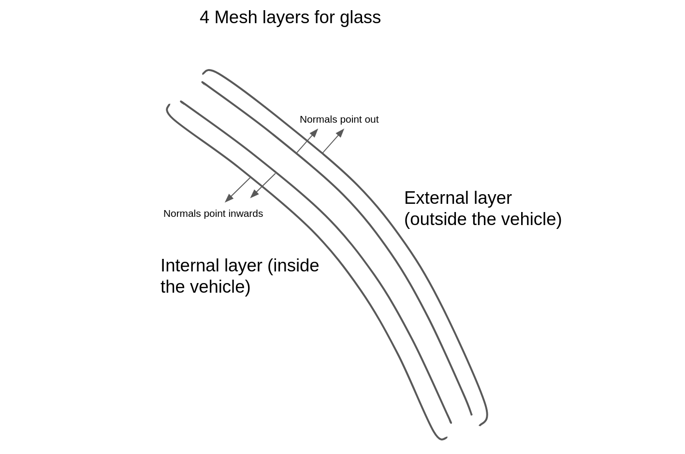

创建网格图层后，将内容浏览器中的它们导入到虚幻编辑器中存储车辆的文件夹中。

按住 Shift 键选择 4 个玻璃层并将它们拖到地图中以便您可以看到它们。


### 玻璃材质 <span id="glass-material"></span>

双击玻璃的外层，然后在第二个内容浏览器窗口中导航到`Content > Carla > Static > Vehicles > GeneralMaterials`并找到该`Glass`材质。将玻璃材质拖至网格物体的材质槽中。对玻璃的每一层重复此过程。

玻璃现在将是透明的，但具有反射附近物体和光源的反射率。您还应该检查内部玻璃，确保那里有适当的玻璃效果。


### 单层玻璃 <span id="single-layer-glass"></span>

为了更快地生产车辆玻璃部件，唯一的关键部件是最外层的玻璃层。您可以在虚幻编辑器中将玻璃材质应用于此，并获得可能适合您需求的结果，但是，从车内查看的视图（即，如果您在仪表板上或方向盘后面实例化摄像头）似乎具有无玻璃（无折射或反射）。我们建议采用上述工艺来生产最真实的玻璃。

现在您已经创建了蓝图，添加了网格，完成了装配，创建了油漆饰面和玻璃的材料，您应该拥有一辆外观非常逼真的车辆。


## 车轮 <span id="wheels"></span>

如果您在 [创建蓝图时](#creating-the-blueprint) 复制了车轮，并且您的车辆与 Carla 库中已有的车辆非常相似，那么这可能适合您的目的。但是，如果您的车辆具有非标准车轮尺寸或抓地力特性，则应按照本节设置车轮蓝图，以最好地匹配车辆车轮的物理特性。

对于 Carla 车辆的车轮，我们需要为每个车轮建立一个蓝图类来处理力学和碰撞属性。您将设置 4 个蓝图类，我们建议使用以下前缀或后缀来识别轮子：

- __RRW__ - **R**ear **R**ight **W**heel
- __RLW__ - **R**ear **L**eft **W**heel
- __FRW__ - **F**ront **R**ight **W**heel
- __FLW__ - **F**ront **L**eft **W**heel

### 车轮蓝图 <span id="wheel-blueprint"></span>

在您拥有新车的文件夹中，右键单击并选择创建一个新的蓝图类。搜索

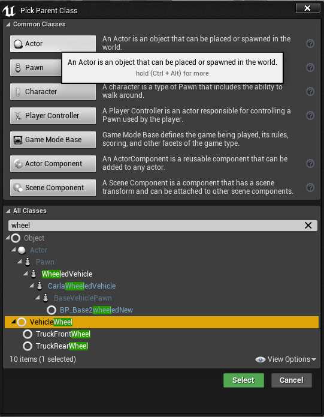

双击蓝图进行调整：

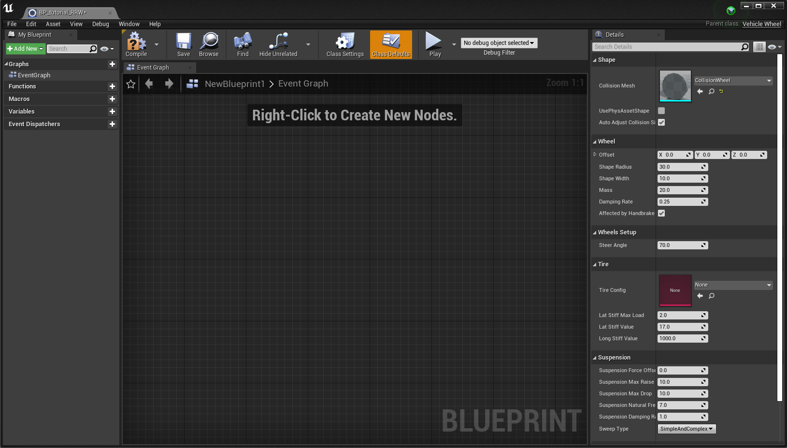

### 碰撞网格 <span id="collision-mesh"></span>

首先，用于碰撞网格的默认圆柱体具有高多边形数量，因此我们应该将其替换为低多边形版本。在内容浏览器中找到 `Content > Carla > Blueprints > Vehicles`内的 `CollisionWheel` 网格。蓝图详细信息面板中的插槽上。这将提高性能，而不会导致物理模拟出现任何明显的缺陷。

### 轮胎配置 <span id="tire-configuration"></span>

接下来，我们设置轮胎配置。在 `Content > Carla > Blueprints > Vehicles`  内找到`CommonTireConfig`配置并将其拖到`Tire Config`蓝图的部分上。如果双击蓝图中的轮胎配置，可以调整摩擦比例，可以修改车辆的道路操控行为。默认情况下，它设置为 3.5，该值适合大多数车辆使用情况。但是，如果您希望对带有光头轮胎的赛车进行建模，则这将是需要调整的适当参数。

### 车轮尺寸 <span id="wheel-dimensions"></span>

接下来，在三维应用程序中测量车轮的直径。在 Blender 中，可以在对象模式下按 `n` 打开的属性面板中查看尺寸。

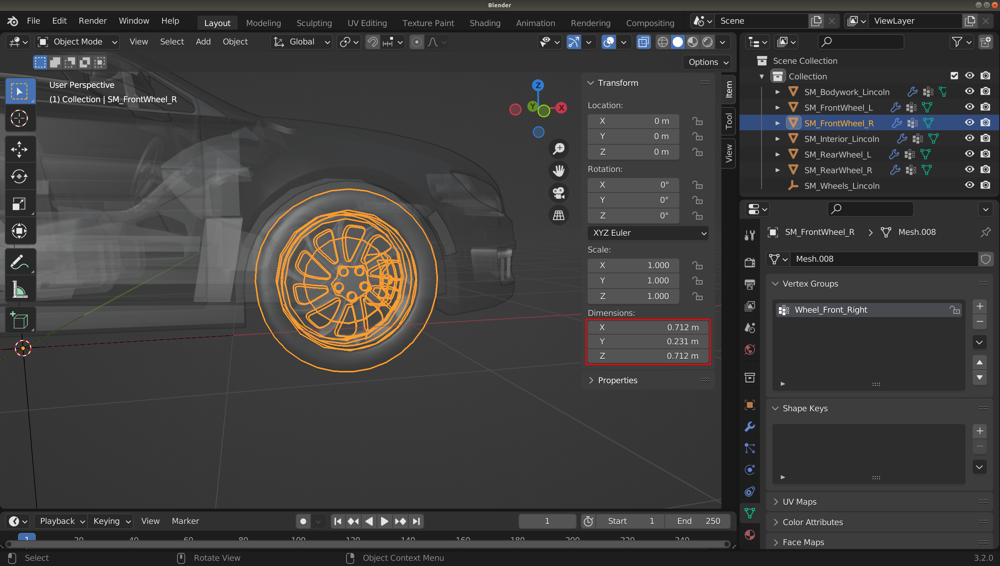

现在将这些数字插入到 `Wheel` 蓝图的部分中。请注意半径为直径的一半，并且虚幻编辑器以厘米为单位。对于车轮质量，我们建议在互联网上查找规格，找到正确的轮胎型号或类似的轮胎型号来估计正确的质量（以千克为单位）。

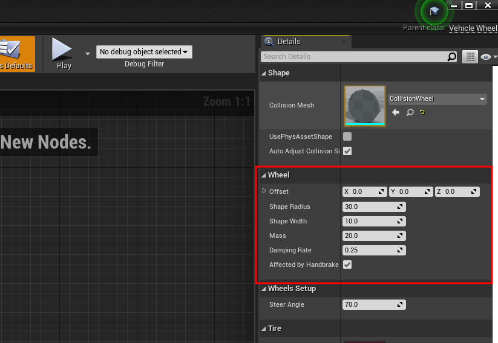


`Affected by handbrake` 应检查两个后轮。

`Steer angle` 对于两个前轮应设置为最大预期转向角，对于两个后轮应设置为零。

### __悬架特性__ <span id="suspension_characteristic"></span>

这里的默认值提供了一个合理的起点。查看 [__本指南__](tuto_D_customize_vehicle_suspension.md) 以设置适合您车辆类型的悬架特性。


## 灯 <span id="lights"></span>

完成 Carla 真实车辆的最后一个元素是灯、前灯、刹车灯、闪光灯等。在三维建模应用程序中，您应该对一些类似于您要复制的车辆灯的形状进行建模。对于大多数车头灯来说，这将是扁平圆盘或扁平长方体结构。有些车辆可能还配有 LED 灯条。

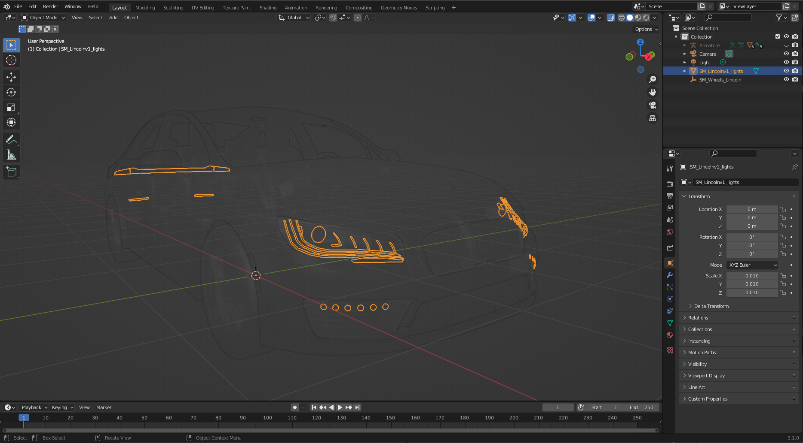

### UV 贴图 <span id="uv-map"></span>

不同类型的灯（前灯、闪光灯、刹车灯等）使用纹理来区分。您需要在 三维建模应用程序中创建 UV 贴图，并定位灯光以与纹理的相关区域相匹配。


### 导入 <span id="importing"></span>

将灯光网格导入虚幻编辑器 - 导入灯光网格后：

- 将网格物体拖动到 **_Components_** 面板中的 **_Mesh (VehicleMesh) (Inherited)_** 层次结构中。
- 选择层次结构中的额外网格并在“详细信息(**_Details_**)”面板中搜索 `Collision`。
- 将碰撞预设(**_Collision Presets_**)设置为`NoCollision`。
- 选择层次结构中的任何灯光网格。在“详细信息(**_Details_**)”面板中搜索 `Tag` 并添加 `emissive` 标签。