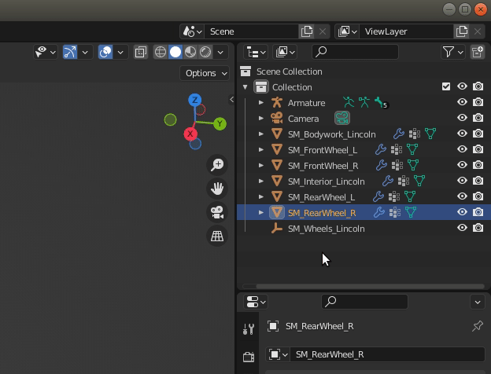
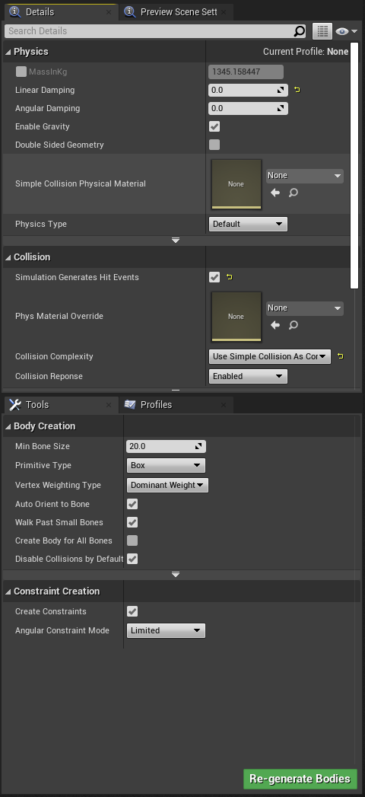
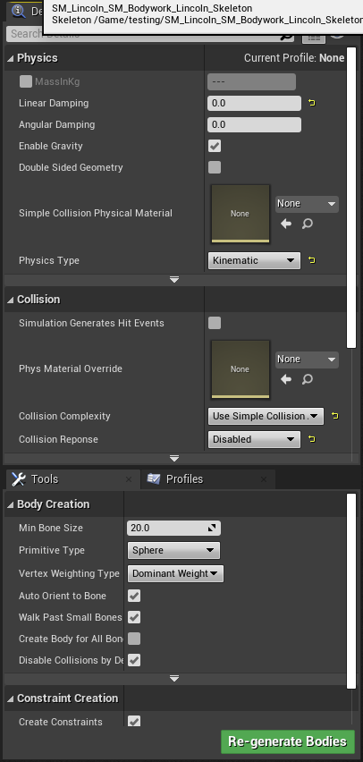
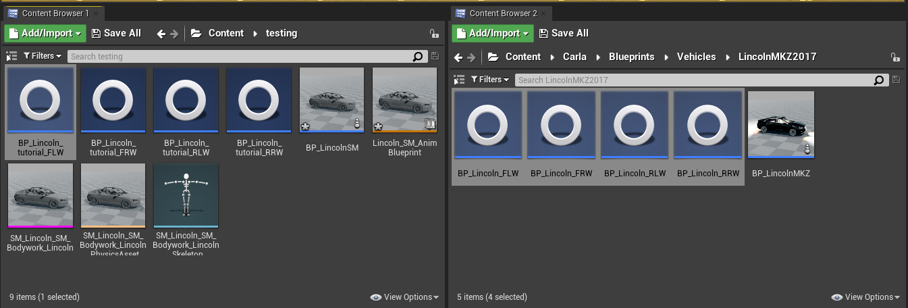
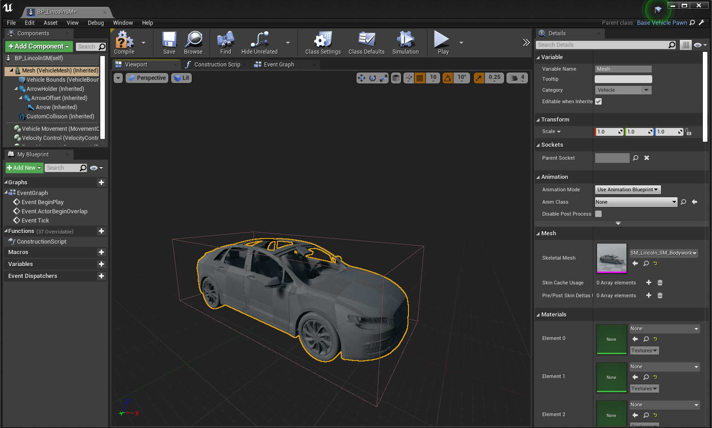
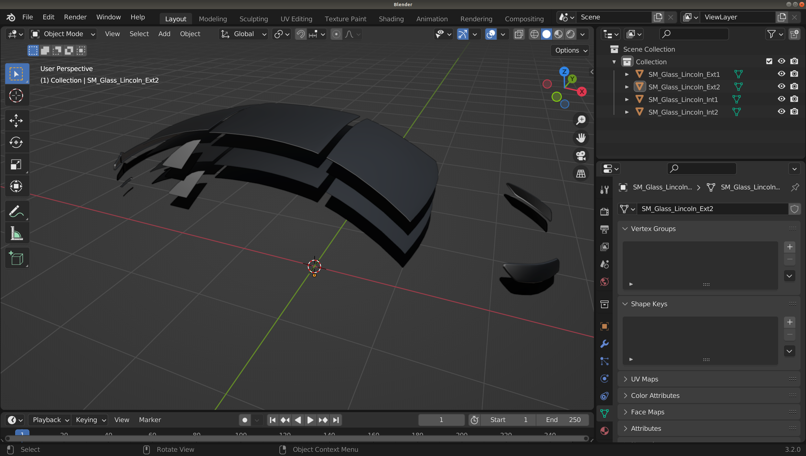
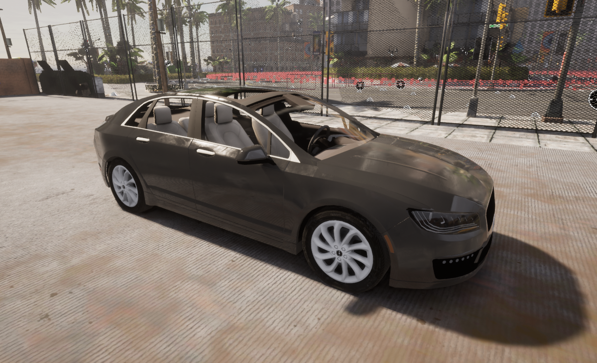
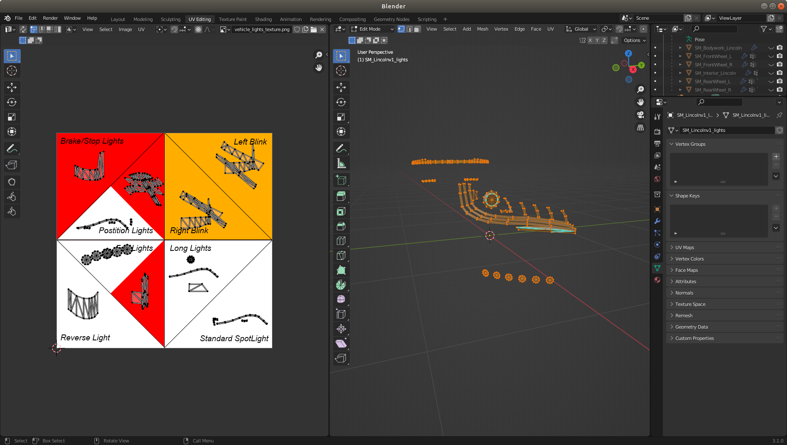

# 内容创作 - 车辆

CARLA 在蓝图库中提供了一套开箱即用的全面车辆。CARLA 允许用户使用定制车辆对此进行扩展，以实现最大的可扩展性。

详细车辆的三维建模非常复杂，需要很高的技能。因此，我们建议读者参考有关三维建模的其他文档来源，因为这超出了本指南的范围。然而，免费和专有的在线存储库中有大量的车辆模型来源。因此，用户有多种选择来创建用于 CARLA 的定制车辆。

为 CARLA 准备定制车辆的关键因素在于装配车辆骨架，然后导入到虚幻引擎中。装配和导入后，需要为汽车和车轮设置蓝图。然后应用材料并添加车辆的玻璃部件。我们将在以下指南中介绍这些步骤。

* __[建模](#modeling)__   
	* [命名约定](#naming-conventions)  
* __[装配](#rigging-the-vehicle-using-an-armature)__   
	* [导入](#import)  
	* [电枢](#add-an-armature)
    * [设置父级](#parenting)
    * [分配](#assigning-car-parts-to-bones) 
	* [Blender 插件](#blender-ue4-vehicle-rigging-add-on)
    * [导出](#export)  
* __[导入虚幻引擎](#importing-into-unreal-engine)__   
	* [物理资产](#setting-the-physics-asset)  
	* [动画](#creating-the-animation)
    * [蓝图](#creating-the-blueprint)
* __[材质](#materials)__   
	* [使用材质](#applying-a-material-to-your-vehicle)
		* [颜色](#color)
		* [透明涂层](#clear-coat)
		* [粒状表面](#orange-peel)
		* [薄片](#flakes)
		* [灰尘](#dust)
* __[玻璃](#glass)__   
	* [玻璃网格](#glass-meshes)
	* [玻璃材质](#glass-material)
	* [单层玻璃](#single-layer-glass)
* __[车轮](#wheels)__   
	* [车轮蓝图](#wheel-blueprint)
	* [碰撞网格](#collision-mesh)
	* [轮胎配置](#tire-configuration)
	* [车轮尺寸](#wheel-dimensions)
* __[灯](#lights)__
	* [UV 贴图](#uv-map)
	* [导入](#importing)

## 建模

车辆应有 5 万到 10 万个面片。作为最佳实践，我们建议在导出之前对模型进行三角测量。CARLA 车辆是参考实际汽车的尺寸和比例进行建模的。请确保您特别注意三维应用程序的单位。有些以厘米为单位，有些则以米为单位。

### 命名约定

为了方便和一致，我们建议您将车辆分为以下部分并相应命名。玻璃和灯的具体细节将在后面的部分中介绍：

>1. __车身(Bodywork)__: 车辆的金属部分。该材质已更改为虚幻引擎材质。可以添加徽标和细节，但为了可见，必须使用虚幻引擎编辑器中的 Alpha 通道将它们绘制为不同的颜色。
- __Glass_Ext__: 一层玻璃，可以从车辆外部看到内部。
- __Glass_Int__: 一层玻璃，允许从车辆内部到外部的可见性。
- __Lights__: 头灯、指示灯等
- __LightGlass_Ext__: 一层玻璃，允许从外部到内部的灯光可见性。
- __LightGlass_Int__: 一层玻璃，允许从内部到外部看到光。
- __LicensePlate__: 29x12 厘米的矩形平面。您可以使用提供的 CARLA以获得最佳结果，请在 [此处](https://carla-assets.s3.eu-west-3.amazonaws.com/fbx/LicensePlate.rar) 下载 `.fbx`。纹理将在虚幻引擎中自动分配。
- __内饰(Interior)__: 任何其他不适合上述部分的细节都可以进入 _内饰_。

材质(Material)应使用格式 `M_CarPart_CarName` 命名，例如, `M_Bodywork_Mustang`。纹理的大小应为 2048x2048。

## 使用电枢装配车辆

为了在仿真中看起来更真实，汽车需要有旋转轮子，前一对轮子可以随着转向输入而转动。因此，要为 CARLA 准备车辆，需要在汽车上安装电枢以识别车轮并允许其移动。

### 导入 

在三维建模应用程序中导入或建模车辆模型网格。在本指南中，我们将使用 Blender 3D。确保轮子与主体分离。每个轮子必须可以作为一个不同的对象进行访问。


确保车辆面向正 X 方向非常重要，因此引擎盖和挡风玻璃应面向正 X 方向。汽车的方向还应使地板到车顶方向处于正 Z 方向。车轮应该正好擦过 XY 平面，并且原点应该位于您期望车辆质心位于 XY 平面（但不是 Z 平面）的位置。

### 添加电枢

现在在车辆的中心添加一个骨架，确保物体正确居中，骨架骨骼的根部应设置在原点。切换到编辑模式并将骨架绕 x 轴旋转 90 度。


现在选择骨架并添加 4 个骨骼。这些骨骼中的每一个都需要定位，使得骨骼的根部与每个轮子的中心重合。这可以通过在编辑模式下将三维光标定位在每个滚轮的中心来实现。在对象模式下选择其中一个轮子，选择一个顶点，按 A 选择所有顶点，然后`Shift+S`选择`Cursor to selected`。这会将光标定位在滚轮的中心。然后，在对象模式下，选择骨架，切换到编辑模式，选择骨骼并选择`Selection to cursor`。您的骨骼现在将与轮子重合。旋转每个骨骼，使其与骨架底部对齐。

对于每个轮子，建议根据需要耦合的轮子来命名骨骼，这将有助于稍后在需要为每个骨骼分配顶点组时进行识别。


### 设置父级 

现在在项目大纲中使用 shift 或 control 选择身体的所有部分和所有4个轮子，然后控制选择您创建的骨架（这个顺序很重要，如果您以相反的顺序选择它们将不起作用）。按`Ctrl+p`并选择`With empty groups`将网格绑定到骨架。



现在您已将网格体设置为骨架的父级，现在需要将每个轮子分配给其各自的骨骼。在大纲视图或编辑器中选择一个轮子。切换到编辑模式，然后选择轮子的所有顶点（快捷键 - a）。

### 将汽车零件分配给骨骼

选择属性的网格选项卡（绿色三角形）。在网格属性面板的顶点组选项卡中，您现在应该看到骨架的骨骼。选择与您正在编辑的轮子对应的骨骼，然后选择`Assign`。安装好车轮后，将车辆的所有其他部件安装到基骨上。


将所有网格部件分配给骨架后，您可以通过选择骨架并移动到姿势模式并移动相关骨骼来测试它是否有效。车辆基骨应移动整个车辆，而轮骨应分别移动并旋转各自的车轮。`Ctrl+Z`确保撤消您可能做出的任何姿势。


### Blender 虚幻引擎 4 车辆装配插件

Blender 有一个非常有用的插件，用于装配车辆以导入 CARLA，有助于简化上述步骤。请参阅 [__插件网页__](https://continuebreak.com/creations/ue4-vehicle-rigging-addon-blender/) 以获取说明。


### 导出

现在，我们将装配模型导出为 FBX 格式，以便导入到虚幻引擎中。从“文件”菜单中选择`Export > FBX (.fbx)`。在`Include` 面板的 `Object Types` 部分中，按住 Shift 键选择`Armature`和`Mesh`选项。

在`Transform`面板中。更改`Forward`为`X Forward`，并更改`Up`为`Z Up`. 这对于确保车辆在虚幻引擎中正确定向非常重要。

在`Armature`部分中取消`Add Leaf Bones`选中并取消`Bake Animation`选中。


## 导入虚幻引擎

从 CARLA 根目录（您从源代码构建 CARLA 的目录）中使用 `make launch` 命令启动虚幻编辑器。打开内容浏览器，设置适当的目录，然后右键单击并选择`Import to ....`。选择您之前从 Blender（或其他三维建模应用程序）导出的 FBX 文件。使用默认设置导入。

### 设置物理资产

现在，您的内容浏览器目录中将包含 3 个内容：网格、骨架和物理资源。双击物理资源进行调整。


首先，选择车体，在右侧`Details`菜单中，将 `Physics` 部分中的`Linear Damping` 更改为 0.0，检查 `Collision` 部分的 `Simulation Generates Hit Events`，在 `Body Creation` 部分将`Primitive Type`从`Capsule`改为`Box`。然后按`Regenerate bodies`。胶囊现在将变成一个矩形盒子。然后选择轮子。



现在选择所有轮子（在`Skeleton Tree`左侧部分）。


将 `Linear Damping` 改为 0.0，将 `Physics Type` 设置为`Kinematic`，将`Collision Response`设置为`Disabled`，并选择`Primitive Type` 作为`Sphere`。再按`Re-generate Bodies`一次。



### 创建动画

在您拥有新车辆资产的内容浏览器目录中，右键单击并选择`Animation > Animation Blueprint`。在打开的弹出窗口中，在`Parent Class`部分中搜索`VehicleAnimInstance`，然后搜索`Target Skeleton`与您的新车相对应的骨架，您应该能够在内容浏览器中看到该名称。选择这两项后按确定。这将为您的车辆创建一个新的动画蓝图。


为了简化事情，我们可以从另一辆车复制动画。在第二个内容浏览器中，打开`Content > Carla > Static > Vehicles > 4Wheeled`并选择任意车辆。打开所选车辆的动画蓝图，然后将除此节点之外的所有节点复制`Output pose`到新的动画蓝图中。通过拖动最终节点与输出节点之间的新连接来连接节点。按编译，动画蓝图现已设置。


### 创建蓝图

使用内容浏览器导航到`Content > Carla > Blueprints > Vehicles > LincolnMKZ2017`或类似的车辆。在这里您将找到一组为 4 个轮子设置的蓝图。将它们复制到包含您自己的车辆的目录中并重命名它们以确保您以后可以区分它们。如果您愿意，您可以设置自己的自定义轮子，请参阅后面的 [__轮子部分__](#wheels) 。



右键单击新车辆资产所在的内容浏览器目录并选择`Blueprint Class`。在 `All Classes` 菜单中搜索 `BaseVehiclePawn` 并选择此类。为蓝图命名并打开它。在左侧 `Components` 选项卡中进行 `Mesh` 选择，然后将车辆网格拖动到右侧的“网格”部分中。




在`Anim Class`搜索与您在上一步中设置的新车相对应的动画。

接下来，在蓝图类的`Components`菜单中选择`Vehicle Movement`，然后在右侧`Details`菜单中导航到该`Vehicle Setup`部分。现在，对于每个车轮，找到您之前为`Wheel Class`属性复制并重命名的相关车轮蓝图。对每个轮子执行相同的操作。编译并保存。


现在导航到`Content > Carla > Blueprints > Vehicles > VehicleFactory`并双击它以打开车辆工厂。

选择`Vehicles`节点并展开右侧`Default value`部分中的`Vehicles`项。


按加号图标添加您的新车。向下滚动到最后一个条目并将其展开，它应该是空的。命名您的车辆的品牌和型号，然后在类部分下找到您在上一部分中创建的蓝图类。将轮子数量保留为 4，并将世代设置为 2。编译并保存。为了安全起见，进行全局保存，您现在......准备在仿真中运行您的车辆。

Press play in the unreal toolbar to run the simulation. Once it is running, open a terminal and run the `manual_control.py` script with the filter option to specify your new vehicle model:

```sh
python manual_control.py --filter my_vehicle_make
```


As it is, the vehicle currently has no textures or colors applied. The next step is to apply materials to give your vehicle a finish like a real road vehicle.

## 材质

Once you have your vehicle imported as a basic asset with the mesh and blueprints laid out, you now want to add materials to your vehicle to facilitate photorealistic rendering in the Unreal Engine, for maximum fidelity in your machine learning training data.

The Unreal Editor boasts a comprehensive materials workflow that facilitates the creation of highly realistic materials. This does, however, add a significant degree of complexity to the process. For this reason, CARLA is provided with a large library of material prototypes for you to use without having to start from scratch. 

### 给您的车辆应用使用材质

CARLA provides a prototype material for replicating the glossy finish of vehicles that can mimic numerous different types of vehicle paint jobs and features. Open Unreal editor and in the content browser, locate the material in `Content > Carla > Static > GenericMaterials > 00_MastersOpt`. The basic material is called `M_CarPaint_Master`. Right click on this material and choose `Create Material Instance` from the context material. Name it and move it into the folder where your new vehicle content is stored.

In the Unreal Editor, move the spectator to a point near the floor and drag the skeletal mesh of the vehicle from the content browser into the scene, the body of your vehicle will now appear there. 


Now, in the details panel on the right hand side, drag your new material instance into the `Element 0` position of the `Materials` section. You will see the bodywork take on a new grey, glossy material property.


Double click on the material in the content browser and we can start editing the parameters. There are a numerous parameters here that alter various properties that are important to mimic real world car paint jobs. The most important parameters are the following:

#### __颜色(Color)__

The color settings govern the overall color of the car. The base color is simply the primary color of the car this will govern the overall color:


#### __透明涂层(Clear coat)__ 

The clear coat settings govern the appearance of the finish and how it reacts to light. The roughness uses a texture to apply imperfections to the vehicle surface, scattering light more with higher values to create a matte look. Subtle adjustments and low values are recommended for a realistic look. Generally, car paint jobs are smooth and reflective, however, this effect might be used more generously to model specialist matte finishes of custom paint jobs.


An important parameter to govern the "shininess" or "glossiness" of your car is the `Clear Coat Intensity`. High values close to 1 will make the coat shiny and glossy.

#### __粒状表面(Orange peel)__ 

Finishes on real cars (particularly on mass produced cars for the general market) tend to have imperfections that appear as slight ripples in the paint. The orange peel effect mimics this and makes cars look more realistic.


#### __薄片(Flakes)__

Some cars have paint jobs that include flakes of other material, such as metals or ceramics, to give the car a `metallic` or `pearlescant` appearance, adding extra glints and reflections that react in an attractive way to light. The flakes parameters allows CARLA to mimic this. To mimic metallic finishes, it would be 


#### __灰尘(Dust)__

Cars often accumulate grease and dust on the body that adds additional texture to the paint, affecting the way it reflects the light. The dust parameters allow you to add patches of disruption to the coat to mimic foreign materials sticking to the paint. 


## 玻璃

Creating realistic glass in CARLA requires some tricks to capture the real refractive and reflective behavior of glass used in motor vehicles. The CARLA garage vehicles have 4 layers of meshes for the glass, with 2 different materials. The layers are separated by a few millimeters and there are separate materials for the interior and exterior facing glass layers to ensure that the glass looks realistic from both inside and outside the vehicle.

There are 2 layers of glass for the appearance of the vehicle from outside and 2 layers for the appearance of glass from the interior of the vehicle. What makes glass look like glass is the reflections coming from both surfaces of the glass that makes a very subtle doubling of the reflection.

### 玻璃网格

Here we see the glass parts attached to the main bodywork (not the doors or other moving parts) of the Lincoln.


If we separate the constituent mesh parts, we can see that the glass profile is separated into 4 different layers. 



The 4 layers are separated into 2 groups, the exterior layers, with normals facing out of the vehicle and the interior layers, with mesh normals facing into the vehicle interior. The following diagram demonstrates 


Once you have created your mesh layers, import them in the content browser into the Unreal Editor in the folder where you have stored your vehicle. 

Shift select the 4 glass layers and drag them into the map so you can see them.


### 玻璃材质

Double click the external layer of the glass, then navigate in a second content browser window to `Content > Carla > Static > Vehicles > GeneralMaterials` and find the `Glass` material. Drag the glass material to the material slot of the mesh item. Repeat this process for each layer of the glass.

The glass will now be transparent, but with reflectivity that reflects nearby objects and light sources. You should also check the interior glass, ensure there is a proper glass effect there.


### 单层玻璃

For a quicker way to produce the glass parts of vehicles, the only critical part is the outermost glass layer. You can apply the glass material to this in Unreal Editor and get a result that might be suitable to your needs, however, views from inside the vehicle (i.e. if you instantiate a camera on the dashboard or behind the steering wheel) will seem to have no glass (no refraction or reflection). We recommend the above process to produce maximally realistic glass.

Now you have created the blueprint, added meshes, completed rigging, created materials for the paint finish and the glass, you should have a very realistic looking vehicle.



## 车轮

If you copied the wheels when you were [creating the blueprint](#creating-the-blueprint), this might suit your purposes if your vehicle is very similar to vehicles that are already in the CARLA library. However, if your vehicle has non-standard wheel dimensions or grip characteristics, you should follow this section to set up your wheel blueprints to best match the physical characteristics of your vehicle's wheels.

For the wheels of CARLA vehicles, we need to set up a blueprint class for each wheel to deal with the mechanics and collision properties. You will set up 4 blueprint classes, we recommend the following prefixes or suffixes to identify the wheels:

- __RRW__ - **R**ear **R**ight **W**heel
- __RLW__ - **R**ear **L**eft **W**heel
- __FRW__ - **F**ront **R**ight **W**heel
- __FLW__ - **F**ront **L**eft **W**heel

### 车轮蓝图

Inside the folder where you have your new vehicle, right click and choose to create a new blueprint class. Search for 


Double click on the blueprint to adjust it:


### 碰撞网格

Firstly, the default cylinder used for the collision mesh has a high polygon count, so we should replace this with a low polygon version. In the content browser locate the `CollisionWheel` mesh inside `Content > Carla > Blueprints > Vehicles`. Drag it onto the 
`Collision Mesh` slot in the details panel of the blueprint. This will improve performance without any noticeable deficit to physics simulation.

### 轮胎配置

Next, we  set the tire configuration. Inside `Content > Carla > Blueprints > Vehicles` locate the `CommonTireConfig` configuration and drag it onto the `Tire Config` section of the blueprint. If you double click on the Tire Config in the blueprint, you can adjust the Friction Scale, you can modify the behavior of the vehicle's road handling. By default it is set at 3.5, a value suitable for most vehicle use cases. However, if you wish to model for example a racing vehicle with slick tires, this would be the appropriate parameter to adjust. 

### 车轮尺寸

Next, in your 3D application, measure the diameter of your wheel. In Blender, the dimensions can be viewed in the properties panel opened by pressing `n` in object mode.


Now plug these numbers into the `Wheel` section of the blueprint.Take care to remember to half the diameter for the radius and also that Unreal Editor works in units of centimeters. For the wheel mass, we recommend looking for specifications on the internet, find the right tire model or a similar one to estimate the correct mass (in kilograms).


`Affected by handbrake` should be checked for both rear wheels. 

`Steer angle` should be set to the maximum intended steer angle for both front wheels and set to zero for both rear wheels.

### __Suspension characteristics__

The default values here provide a reasonable starting point. View [__this guide__](tuto_D_customize_vehicle_suspension.md) to set suspension characteristics appropriate to your vehicle type. 


## 灯

The last element to complete a realistic vehicle for CARLA is the lights, headlights, brake lights, blinkers etc. In your 3D modelling application, you should model some shapes that resemble the lights of the vehicle you are replicating. This would be flat discs or flat cuboid structures for most headlights. Some vehicles may also have strips of LEDs. 


### UV 贴图

The different types of lights (headlights, blinkers, brake lights, etc.) are distinguished using a texture. You need to create a UV map in your 3D modelling application and position the lights to match up with the relevant region of the texture. 



### 导入

Import the light mesh into the Unreal Editor- After importing the light mesh:

- Drag the mesh item(s) into the **_Mesh (VehicleMesh) (Inherited)_** hierarchy in the **_Components_** panel.
- Select the extra meshes in the hierarchy and search for `Collision` in the **_Details_** panel.
- Set **_Collision Presets_** to `NoCollision`.
- Select any lights meshes in the hierarchy. Search for `Tag` in the **_Details_** panel and add the tag `emissive`.