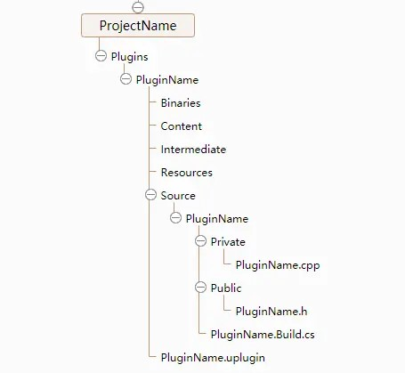
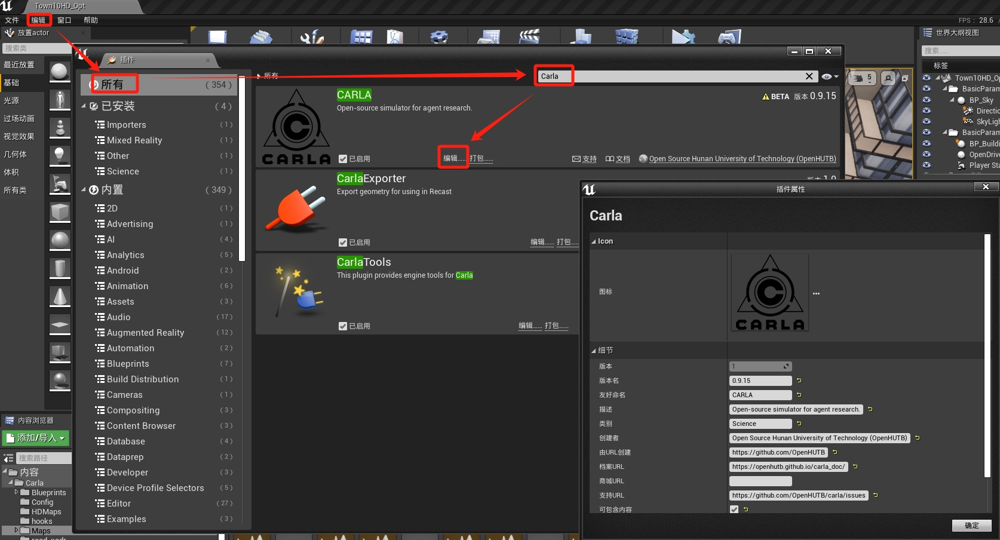

# Carla 插件


* Binaries：编译后的dll文件存放位置
* Content：游戏资源Asset文件存放位置
* Intermediate：编译的中间文件存放位置
* Resources：一般为图标的存放位置
* Source：代码存放位置
* .uplugin：插件模块配置文件，JSON格式
* .Build.cs：每个.Build.cs文件声明派生自**ModuleRules**基类的类，并设置属性控制器从构造函数进行编译的方式。由虚幻编译工具编译，并被构造来确定整体编译环境。使用C#语法。


## 插件的描述文件 Carla.uplugin
`Carla.uplugin` 是插件json格式的插件描述文件，可以在插件编辑器中进行修改。



对应的文件内容为：
```json
{
	"FileVersion": 3,
	"Version": 1,
	"VersionName": "0.9.15",
	"FriendlyName": "CARLA",
	"Description": "Open-source simulator for autonomous driving research.",
	"Category": "Science",
	"CreatedBy": "Computer Vision Center (CVC) at the Universitat Autonoma de Barcelona (UAB)",
	"CreatedByURL": "http://carla.org",
	"DocsURL": "http://carla.readthedocs.io",
	"MarketplaceURL": "",
	"SupportURL": "https://github.com/carla-simulator/carla/issues",
	"CanContainContent": true,
	"IsBetaVersion": true,
	"Installed": true,
	"Modules": [
		{
			"Name": "Carla",
			"Type": "Runtime",
			"LoadingPhase": "PreDefault",
			"AdditionalDependencies": [
				"Engine"
			]
		}
	],
	"Plugins": [
		{
			"Name": "PhysXVehicles",
			"Enabled": true
		},
		{
			"Name": "ProceduralMeshComponent",
			"Enabled": true
		}
	]
}
```

**模块描述符Modules** 必须有Name和Type字段。

* Name：是插件模块的唯一命名，将随着插件而加载。在运行时，插件的Binaries文件夹中需存在正确的插件二进制文件，并带有指定模块命名。
* Type：是模块的类型，决定了该插件**适合于那种类型的应用程序加载**。有效的几项是：Runtime、RuntimeNoCommandlet、Developer、Editor；其中 **Runtime** 的模块在无论何时都会被加载，哪怕是在最终发行的游戏版本中也会。Developer 的模块只会在 **Development** 运行时或者编辑器版本中才会被加载，并不在在最终发行版本中加载。**Editor** 模块只会随着 Editor 的启动被加载。插件也可以使用几种不同类型的组合来达到所需要的目的。
* LoadingPhase：控制插件在引擎启动的何时被加载。


## 插件的编译配置文件 Carla.Build.cs 描述模块编译方法
<details>
<summary><b>Carla.Build.cs</b> </summary>

```json
// Copyright 1998-2017 Epic Games, Inc. All Rights Reserved.

using System;
using System.IO;
using UnrealBuildTool;

public class Carla : ModuleRules
{
  bool UsingCarSim = false;
  bool UsingChrono = false;
  bool UsingPytorch = false;
  bool UsingRos2 = false;
  private bool IsWindows(ReadOnlyTargetRules Target)
  {
    return (Target.Platform == UnrealTargetPlatform.Win64) || (Target.Platform == UnrealTargetPlatform.Win32);
  }

  public Carla(ReadOnlyTargetRules Target) : base(Target)
  {
    PrivatePCHHeaderFile = "Carla.h";

    if (IsWindows(Target))
    {
      bEnableExceptions = true;
    }

    // Read config about carsim
    string CarlaPluginPath = Path.GetFullPath( ModuleDirectory );
    string ConfigDir =  Path.GetFullPath(Path.Combine(CarlaPluginPath, "../../../../Config/"));
    string OptionalModulesFile = Path.Combine(ConfigDir, "OptionalModules.ini");
    string[] text = System.IO.File.ReadAllLines(OptionalModulesFile);
    foreach (string line in text)
    {
      if (line.Contains("CarSim ON"))
      {
        Console.WriteLine("Enabling carsim");
        UsingCarSim = true;
        PublicDefinitions.Add("WITH_CARSIM");
        PrivateDefinitions.Add("WITH_CARSIM");
      }
      if (line.Contains("Chrono ON"))
      {
        Console.WriteLine("Enabling chrono");
        UsingChrono = true;
        PublicDefinitions.Add("WITH_CHRONO");
        PrivateDefinitions.Add("WITH_CHRONO");
      }
      if (line.Contains("Pytorch ON"))
      {
        Console.WriteLine("Enabling pytorch");
        UsingPytorch = true;
        PublicDefinitions.Add("WITH_PYTORCH");
        PrivateDefinitions.Add("WITH_PYTORCH");
      }

      if (line.Contains("Ros2 ON"))
      {
        Console.WriteLine("Enabling ros2");
        UsingRos2 = true;
        PublicDefinitions.Add("WITH_ROS2");
        PrivateDefinitions.Add("WITH_ROS2");
      }
    }

    PublicIncludePaths.AddRange(
      new string[] {
        // ... add public include paths required here ...
      }
      );

    PrivateIncludePaths.AddRange(
      new string[] {
        // ... add other private include paths required here ...
      }
      );

    PublicDependencyModuleNames.AddRange(
      new string[]
      {
        "Core",
        "RenderCore",
        "RHI",
        "Renderer",
        "ProceduralMeshComponent",
        "MeshDescription"
        // ... add other public dependencies that you statically link with here ...
      }
      );
    if (UsingCarSim)
    {
      PublicDependencyModuleNames.AddRange(new string[] { "CarSim" });
    }

	 if (Target.Type == TargetType.Editor)
	 {
		PublicDependencyModuleNames.AddRange(new string[] { "UnrealEd" });
	 }

    PrivateDependencyModuleNames.AddRange(
      new string[]
      {
        "AIModule",
        "AssetRegistry",
        "CoreUObject",
        "Engine",
        "Foliage",
        "HTTP",
        "StaticMeshDescription",
        "ImageWriteQueue",
        "Json",
        "JsonUtilities",
        "Landscape",
        "PhysX",
        "PhysXVehicles",
        "PhysXVehicleLib",
        "Slate",
        "SlateCore",
        "PhysicsCore"
        // ... add private dependencies that you statically link with here ...
      }
      );
    if (UsingCarSim)
    {
      PrivateDependencyModuleNames.AddRange(new string[] { "CarSim" });
      PrivateIncludePathModuleNames.AddRange(new string[] { "CarSim" });
    }


    DynamicallyLoadedModuleNames.AddRange(
      new string[]
      {
        // ... add any modules that your module loads dynamically here ...
      }
      );

    AddCarlaServerDependency(Target);
  }

  private bool UseDebugLibs(ReadOnlyTargetRules Target)
  {
    if (IsWindows(Target))
    {
      // In Windows, Unreal uses the Release C++ Runtime (CRT) even in debug
      // mode, so unless we recompile the engine we cannot link the debug
      // libraries.
      return false;
    }
    else
    {
      return false;
    }
  }

  private void AddDynamicLibrary(string library)
  {
    PublicAdditionalLibraries.Add(library);
    RuntimeDependencies.Add(library);
    PublicDelayLoadDLLs.Add(library);
  }
  private void AddDllDependency(string PathToFolder, string DllName)
  {
    string Source = Path.Combine(PathToFolder, DllName);
    string Destination = Path.Combine("$(BinaryOutputDir)", DllName);
    RuntimeDependencies.Add(Destination, Source);
  }

  delegate string ADelegate(string s);

  private void AddBoostLibs(string LibPath)
  {
    string [] files = Directory.GetFiles(LibPath, "*boost*.lib");
    foreach (string file in files) PublicAdditionalLibraries.Add(file);
  }

  private void AddCarlaServerDependency(ReadOnlyTargetRules Target)
  {
    string LibCarlaInstallPath = Path.GetFullPath(Path.Combine(ModuleDirectory, "../../CarlaDependencies"));

    ADelegate GetLibName = (string BaseName) => {
      if (IsWindows(Target))
      {
        return BaseName + ".lib";
      }
      else
      {
        return "lib" + BaseName + ".a";
      }
    };

    // Link dependencies.
    if (IsWindows(Target))
    {
      AddBoostLibs(Path.Combine(LibCarlaInstallPath, "lib"));
      PublicAdditionalLibraries.Add(Path.Combine(LibCarlaInstallPath, "lib", GetLibName("rpc")));

      if (UseDebugLibs(Target))
      {
        PublicAdditionalLibraries.Add(Path.Combine(LibCarlaInstallPath, "lib", GetLibName("carla_server_debug")));
      }
      else
      {
        PublicAdditionalLibraries.Add(Path.Combine(LibCarlaInstallPath, "lib", GetLibName("carla_server")));
      }
      if (UsingChrono)
      {
        PublicAdditionalLibraries.Add(Path.Combine(LibCarlaInstallPath, "lib", GetLibName("ChronoEngine")));
        PublicAdditionalLibraries.Add(Path.Combine(LibCarlaInstallPath, "lib", GetLibName("ChronoEngine_vehicle")));
        PublicAdditionalLibraries.Add(Path.Combine(LibCarlaInstallPath, "lib", GetLibName("ChronoModels_vehicle")));
        PublicAdditionalLibraries.Add(Path.Combine(LibCarlaInstallPath, "lib", GetLibName("ChronoModels_robot")));
        AddDllDependency(Path.Combine(LibCarlaInstallPath, "dll"), "ChronoEngine.dll");
        AddDllDependency(Path.Combine(LibCarlaInstallPath, "dll"), "ChronoEngine_vehicle.dll");
        AddDllDependency(Path.Combine(LibCarlaInstallPath, "dll"), "ChronoModels_vehicle.dll");
        AddDllDependency(Path.Combine(LibCarlaInstallPath, "dll"), "ChronoModels_robot.dll");
        bUseRTTI = true;
      }

      //OsmToODR
      PublicAdditionalLibraries.Add(Path.Combine(LibCarlaInstallPath, "lib", "sqlite3.lib"));
      PublicAdditionalLibraries.Add(Path.Combine(LibCarlaInstallPath, "lib", "xerces-c_3.lib"));
      PublicAdditionalLibraries.Add(Path.Combine(LibCarlaInstallPath, "lib", "proj.lib"));
      PublicAdditionalLibraries.Add(Path.Combine(LibCarlaInstallPath, "lib", "osm2odr.lib"));
      PublicAdditionalLibraries.Add(Path.Combine(LibCarlaInstallPath, "lib", "zlibstatic.lib"));
    }
    else
    {
      PublicAdditionalLibraries.Add(Path.Combine(LibCarlaInstallPath, "lib", GetLibName("rpc")));
      if (UseDebugLibs(Target))
      {
        PublicAdditionalLibraries.Add(Path.Combine(LibCarlaInstallPath, "lib", GetLibName("carla_server_debug")));
      }
      else
      {
        PublicAdditionalLibraries.Add(Path.Combine(LibCarlaInstallPath, "lib", GetLibName("carla_server")));
      }
      if (UsingChrono)
      {
        AddDynamicLibrary(Path.Combine(LibCarlaInstallPath, "lib", "libChronoEngine.so"));
        AddDynamicLibrary(Path.Combine(LibCarlaInstallPath, "lib", "libChronoEngine_vehicle.so"));
        AddDynamicLibrary(Path.Combine(LibCarlaInstallPath, "lib", "libChronoModels_vehicle.so"));
        AddDynamicLibrary(Path.Combine(LibCarlaInstallPath, "lib", "libChronoModels_robot.so"));

        bUseRTTI = true;
      }

      if (UsingPytorch)
      {
        PublicAdditionalLibraries.Add(Path.Combine(LibCarlaInstallPath, "lib", GetLibName("carla_pytorch")));

        string LibTorchPath = LibCarlaInstallPath;
        PublicAdditionalLibraries.Add(Path.Combine(LibTorchPath, "lib", "libonnx_proto.a"));
        PublicAdditionalLibraries.Add(Path.Combine(LibTorchPath, "lib", "libfbgemm.a"));
        PublicAdditionalLibraries.Add(Path.Combine(LibTorchPath, "lib", "libgloo.a"));
        PublicAdditionalLibraries.Add(Path.Combine(LibTorchPath, "lib", "libXNNPACK.a"));
        PublicAdditionalLibraries.Add(Path.Combine(LibTorchPath, "lib", "libprotobuf-lite.a"));
        PublicAdditionalLibraries.Add(Path.Combine(LibTorchPath, "lib", "libprotobuf.a"));
        PublicAdditionalLibraries.Add(Path.Combine(LibTorchPath, "lib", "libasmjit.a"));
        PublicAdditionalLibraries.Add(Path.Combine(LibTorchPath, "lib", "libcpuinfo_internals.a"));
        PublicAdditionalLibraries.Add(Path.Combine(LibTorchPath, "lib", "libclog.a"));
        // PublicAdditionalLibraries.Add(Path.Combine(LibTorchPath, "lib", "libbreakpad_common.a"));
        PublicAdditionalLibraries.Add(Path.Combine(LibTorchPath, "lib", "libbenchmark.a"));
        PublicAdditionalLibraries.Add(Path.Combine(LibTorchPath, "lib", "libtensorpipe.a"));
        PublicAdditionalLibraries.Add(Path.Combine(LibTorchPath, "lib", "libpytorch_qnnpack.a"));
        PublicAdditionalLibraries.Add(Path.Combine(LibTorchPath, "lib", "libtensorpipe_cuda.a"));
        PublicAdditionalLibraries.Add(Path.Combine(LibTorchPath, "lib", "libnnpack_reference_layers.a"));
        PublicAdditionalLibraries.Add(Path.Combine(LibTorchPath, "lib", "libgmock.a"));
        PublicAdditionalLibraries.Add(Path.Combine(LibTorchPath, "lib", "libdnnl.a"));
        PublicAdditionalLibraries.Add(Path.Combine(LibTorchPath, "lib", "libpthreadpool.a"));
        PublicAdditionalLibraries.Add(Path.Combine(LibTorchPath, "lib", "libcpuinfo.a"));
        PublicAdditionalLibraries.Add(Path.Combine(LibTorchPath, "lib", "libqnnpack.a"));
        // PublicAdditionalLibraries.Add(Path.Combine(LibTorchPath, "lib", "libbreakpad.a"));
        PublicAdditionalLibraries.Add(Path.Combine(LibTorchPath, "lib", "libkineto.a"));
        PublicAdditionalLibraries.Add(Path.Combine(LibTorchPath, "lib", "libprotoc.a"));
        PublicAdditionalLibraries.Add(Path.Combine(LibTorchPath, "lib", "libgtest.a"));
        PublicAdditionalLibraries.Add(Path.Combine(LibTorchPath, "lib", "libgmock_main.a"));
        PublicAdditionalLibraries.Add(Path.Combine(LibTorchPath, "lib", "libgtest_main.a"));
        PublicAdditionalLibraries.Add(Path.Combine(LibTorchPath, "lib", "libbenchmark_main.a"));
        PublicAdditionalLibraries.Add(Path.Combine(LibTorchPath, "lib", "libfmt.a"));
        PublicAdditionalLibraries.Add(Path.Combine(LibTorchPath, "lib", "libtensorpipe_uv.a"));
        PublicAdditionalLibraries.Add(Path.Combine(LibTorchPath, "lib", "libfoxi_loader.a"));
        PublicAdditionalLibraries.Add(Path.Combine(LibTorchPath, "lib", "libgloo_cuda.a"));
        PublicAdditionalLibraries.Add(Path.Combine(LibTorchPath, "lib", "libnnpack.a"));
        PublicAdditionalLibraries.Add(Path.Combine(LibTorchPath, "lib", "libcaffe2_protos.a"));
        PublicAdditionalLibraries.Add(Path.Combine(LibTorchPath, "lib", "libonnx.a"));
        AddDynamicLibrary(Path.Combine(LibTorchPath, "lib", "libtorch.so"));
        AddDynamicLibrary(Path.Combine(LibTorchPath, "lib", "libnnapi_backend.so"));
        AddDynamicLibrary(Path.Combine(LibTorchPath, "lib", "libbackend_with_compiler.so"));
        AddDynamicLibrary(Path.Combine(LibTorchPath, "lib", "libcaffe2_nvrtc.so"));
        AddDynamicLibrary(Path.Combine(LibTorchPath, "lib", "libtorch_cuda_cpp.so"));
        AddDynamicLibrary(Path.Combine(LibTorchPath, "lib", "libc10_cuda.so"));
        AddDynamicLibrary(Path.Combine(LibTorchPath, "lib", "libtorchbind_test.so"));
        AddDynamicLibrary(Path.Combine(LibTorchPath, "lib", "libjitbackend_test.so"));
        AddDynamicLibrary(Path.Combine(LibTorchPath, "lib", "libc10.so"));
        AddDynamicLibrary(Path.Combine(LibTorchPath, "lib", "libtorch_cuda.so"));
        AddDynamicLibrary(Path.Combine(LibTorchPath, "lib", "libtorch_global_deps.so"));
        AddDynamicLibrary(Path.Combine(LibTorchPath, "lib", "libtorch_cpu.so"));
        AddDynamicLibrary(Path.Combine(LibTorchPath, "lib", "libshm.so"));
        AddDynamicLibrary(Path.Combine(LibTorchPath, "lib", "libtorch_cuda_cu.so"));
        AddDynamicLibrary(Path.Combine(LibTorchPath, "lib", "libtorchscatter.so"));
        AddDynamicLibrary(Path.Combine(LibTorchPath, "lib", "libtorchcluster.so"));
        // AddDynamicLibrary("/usr/local/cuda/lib64/stubs/libcuda.so");
        // AddDynamicLibrary("/usr/local/cuda/lib64/libnvrtc.so");
        // AddDynamicLibrary("/usr/local/cuda/lib64/libnvToolsExt.so");
        // AddDynamicLibrary("/usr/local/cuda/lib64/libcudart.so");
        // AddDynamicLibrary("/usr/lib/llvm-10/lib/libgomp.so");
        PublicAdditionalLibraries.Add("/usr/local/cuda/lib64/stubs/libcuda.so");
        PublicAdditionalLibraries.Add("/usr/local/cuda/lib64/libnvrtc.so");
        PublicAdditionalLibraries.Add("/usr/local/cuda/lib64/libnvToolsExt.so");
        PublicAdditionalLibraries.Add("/usr/local/cuda/lib64/libcudart.so");
        PublicAdditionalLibraries.Add("/usr/lib/llvm-10/lib/libgomp.so");
        RuntimeDependencies.Add(Path.Combine(LibTorchPath, "lib", "libcudart-a7b20f20.so.11.0"));
        RuntimeDependencies.Add(Path.Combine(LibTorchPath, "lib", "libgomp-a34b3233.so.1"));
        RuntimeDependencies.Add(Path.Combine(LibTorchPath, "lib", "libnvrtc-builtins-4730a239.so.11.3"));
        RuntimeDependencies.Add(Path.Combine(LibTorchPath, "lib", "libnvrtc-1ea278b5.so.11.2"));
        RuntimeDependencies.Add(Path.Combine(LibTorchPath, "lib", "libnvToolsExt-24de1d56.so.1"));
        PublicAdditionalLibraries.Add("stdc++");
        PublicAdditionalLibraries.Add("/usr/lib/x86_64-linux-gnu/libpython3.9.so");
      }

      if (UsingRos2)
      {
        PublicAdditionalLibraries.Add(Path.Combine(LibCarlaInstallPath, "lib", GetLibName("carla_fastdds")));

        string LibFastDDSPath = LibCarlaInstallPath;
        AddDynamicLibrary(Path.Combine(LibFastDDSPath, "lib", "libfoonathan_memory-0.7.3.so"));
        AddDynamicLibrary(Path.Combine(LibFastDDSPath, "lib", "libfastcdr.so"));
        AddDynamicLibrary(Path.Combine(LibFastDDSPath, "lib", "libfastrtps.so"));
        PublicAdditionalLibraries.Add("stdc++");
      }


      //OsmToODR
      PublicAdditionalLibraries.Add("/usr/lib/x86_64-linux-gnu/libc.so");
      PublicAdditionalLibraries.Add(Path.Combine(LibCarlaInstallPath, "lib", "libsqlite3.so"));
      PublicAdditionalLibraries.Add(Path.Combine(LibCarlaInstallPath, "lib", "libxerces-c.a"));
      PublicAdditionalLibraries.Add(Path.Combine(LibCarlaInstallPath, "lib", "libproj.a"));
      PublicAdditionalLibraries.Add(Path.Combine(LibCarlaInstallPath, "lib", "libosm2odr.a"));

    }
    bEnableExceptions = true;

    // Include path.
    string LibCarlaIncludePath = Path.Combine(LibCarlaInstallPath, "include");

    PublicIncludePaths.Add(LibCarlaIncludePath);
    PrivateIncludePaths.Add(LibCarlaIncludePath);

    PublicDefinitions.Add("ASIO_NO_EXCEPTIONS");
    PublicDefinitions.Add("BOOST_NO_EXCEPTIONS");
    PublicDefinitions.Add("LIBCARLA_NO_EXCEPTIONS");
    PublicDefinitions.Add("PUGIXML_NO_EXCEPTIONS");
    PublicDefinitions.Add("BOOST_DISABLE_ABI_HEADERS");
    PublicDefinitions.Add("BOOST_TYPE_INDEX_FORCE_NO_RTTI_COMPATIBILITY");
  }
}
```

</details>

### Build.cs与VS的关系
该插件模块编译配置，与配置VS中的项目属性类似，包含进了依赖库等。包括虚幻引擎、VS、Windows Kits的头文件目录：


读取配置文件`Unreal/CarlaUE4/Config/OptionalModules.ini`，决定是否加载某一模块，包括 Carsim、Chrono、Pytorch、Ros2。

### 插件头文件 Carla.h

插件的头文件中，一般只有一个类，而且以F开头，Module结尾。比如：[FCarlaModule](https://github.com/OpenHUTB/carla/blob/ue4-dev/Unreal/CarlaUE4/Plugins/Carla/Source/Carla/Carla.h) 。
还有两个函数
```json
virtual void StartupModule() override;//插件加载
virtual void ShutdownModule() override;//插件卸载
```

## 使用引擎插件
直接包含插件头文件是不行的。打开插件的 Carla.Build.cs 文件，在 PublicDependencyModuleNames 中，填入使用的插件名称：
```json
PublicDependencyModuleNames.AddRange(
      new string[]
      {
        "Core",
        "RenderCore",
        "RHI",
        "Renderer",
        "ProceduralMeshComponent",
        "MeshDescription"
        // ... add other public dependencies that you statically link with here ...
      }
      );
```


## 参考

* [Unreal 插件](https://www.jianshu.com/p/e41a810b10ca)