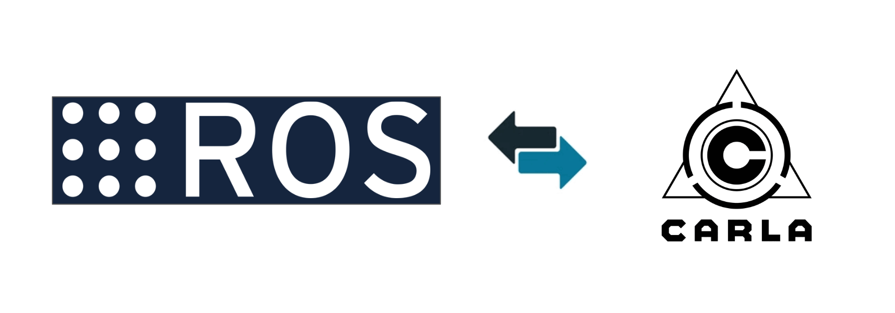

# 支持虚幻引擎 5 的 Carla 文档

CARLA 0.10.0 在 CARLA 的核心渲染引擎中引入了全新的 Lumen 和 Nanite 技术，从而增强了逼真度、细节和性能。该引擎升级通过 UE5 的增强型渲染技术大大提高了视觉传感器的保真度。目前支持场景 Town10、露天矿场，包括更逼真的车辆。此外，0.10.0 版还完成了与 Inverted AI 交通流仿真模型的集成、原生 ROS2 集成、更新的 Python 兼容性等，带来了最先进的生成式 AI 交通模拟！

<iframe width="730" height="411" src="https://www.youtube.com/embed/u2TxYhv3UKE" title="CARLA 0.10.0 release video" frameborder="0" allow="accelerometer; autoplay; clipboard-write; encrypted-media; gyroscope; picture-in-picture; web-share" referrerpolicy="strict-origin-when-cross-origin" allowfullscreen></iframe>

## 亮点介绍

1.提升视觉传感器的仿真性能

UE 5.5 显著增强了CARLA渲染高度详细几何体的能力，具有令人惊叹的真实光影和反射效果。新的Nanite虚拟化几何体系统可动态调整用于渲染资产的多边形数量，确保在远距离观察物体时性能高效，同时在近距离保留足够的细节。这意味着CARLA地图和资产现在几乎拥有无限的几何体资源，可以在不牺牲性能的情况下使用高度精细的 3D 资产。Lumen 通过更精确地模拟复杂的光照行为（如漫反射和镜面反射），将虚拟场景光照和反射的逼真度提升到了一个新的水平。这使得场景看起来更加自然，能够以逼真的方式动态适应光照变化。总之，UE 5.5 以惊人的效果增强了 CARLA 的整体视觉保真度。

2.新的虚拟环境和数字资产  

* 升级后的Town 10

作为 CARLA 底层基础的几何体处理系统为渲染数量更多的多边形和更加逼真的光照环境打开了大门。为了充分发挥这一优势，CARLA 新版本推出了升级的 Town 10地图，其中包括全新的建筑、人行道、道路和植被，所有这些都围绕着与之前版本相同的道路拓扑。 


新改造的Town 10包括采用了炫目的反光玻璃的新塔楼和底层的零售门店。新几何系统所允许的额外渲染细节在地图上多处华丽的古典风格建筑中得到了真实展现。


此外，Town 10还引入了一些新的建筑工地资产，给人一种城市景观不断演变的印象。


* 强化的道路拓扑

Town 10 在细节方面的改进延伸到了路面本身。Town 10 的道路现在具有逼真的外倾角和零星的路面变化，如坑洼和减速带，这进一步增强了道路外观，车辆运动状态和传感器仿真的逼真度。


* 升级后的车辆列表

除了Town 10的升级之外，0.10.0 版本还配备了 11 辆更逼真的车辆，利用更高的几何成本和改进的照明来更清晰地捕捉每一个细节。


UE 5 还引入了新的 Chaos 物理引擎，为车辆动力学建模提供了更多可配置选项。CARLA 0.10.0 中包含的所有车辆现在都使用了新引擎，从而使得车辆的悬挂更为逼真。


* 越野露天矿地图

在0.10.0版本中，Carla 推出了一个壮观的露天矿地图。该地图包括一个停车场，通过一系列小型通道与矿区相连。


此外，深信科创还提供了一台巨型矿车素材，用于模拟矿山地图上的交通场景。


3.Inverted AI 交通流仿真模型


Inverted AI 提供了基于生成式人工智能的最新交通模拟技术，该技术使用广泛的真实交通数据进行训练。Inverted AI 的交通流仿真模型为 CARLA 仿真中的模拟者提供反应灵敏、逼真、类人类的行为，这有助于安全应对驾驶员不可预测行为的自动驾驶智能体的开发。所有功能都通过方便的基于 Web 的 Python API 提供，与 CARLA 的集成非常简单。我们提供了一个示例脚本，帮助您开始使用逼真且行为多样的交通流。


4.ROS2 原生接口



0.10.0 版正式引入 CARLA 新的原生 ROS2 接口。这意味着 ROS2 接口直接内置于 CARLA 服务端中，无需中间桥接进程，从而降低了延迟并简化了 AD 栈设置。您可以使用新的命令行标志启用 ROS2 连接：

```shell
./CarlaUnreal.sh --ros2
```

5.SCENIC 3 集成


CARLA 0.10.0 现在完全支持 SCENIC 3。CARLA 用户可以利用 SCENIC 3 场景描述语言在 CARLA 0.10.0 中定义和执行场景。

6.更新的 Python 兼容性

最新版本的CARLA改进了对新Python版本的兼容性。CARLA 0.10.0 在 Ubuntu 和 Windows 中都支持 Python 版本的版本包括：3.8~3.12。此版本不再支持 Python 版本 3.7 及更低版本。


## CARLA 0.9.15 和 0.10.0 版本差异

CARLA 0.10.0 版本带来了令人难以置信的新功能。为此，CARLA 团队努力将尽可能多的功能从以前的版本迁移到新版本中。但这仍是一项进行中的工作，一些功能和内容仍待更新。以下是 0.10.0 版本中缺失或未测试的功能概览：


* **性能**：在内部测试中记录的当前峰值帧率大约为24/25 FPS，我们已经确定了一些提高性能的途径，详见GitHub上关于性能的说明。

* **硬件**要求：显存少于12GB的GPU可能无法加载默认地图（Town 10）。建议0.10.0版本至少需要16GB的显存。

* **天气**固定设置为白天。云层、雨水、雾和太阳位置无法修改。

* **地图**：CARLA 地图 1-9、11、12、13 和 15 尚未升级，不包括在内，Town 10 已升级

* 不支持地图层 API

* 不支持大型地图

* 不支持数字孪生处理管线

* 不支持新数字资产导入

* 车辆：11 辆车已更新并包含在 0.10.0 版本中：* 林肯 MKZ * 日产 patrol * 道奇充电器 * 道奇充电器警察 * 消防车 * 福特皇冠出租车 * 迷你库珀 * CarlaCola 卡车 * 福特救护车 * 梅赛德斯 Sprinter 面包车 * 三菱 Fusorosa 巴士 * 采矿推土机（来自深信科创） 所有其他车辆已从 0.10.0 的蓝图库中删除

* 可修改车辆灯光，但灯光强度和颜色调整尚未进行广泛的测试

* 道具：大部分道具仍然可用

* 不支持 OpenStreetMap 导入

* 联合仿真已禁用或未经测试：SUMO、Chrono、PTV Vissim

* 不支持 V2X

* 不支持获取 Gbuffer数据

* 应用纹理 API 仅适用于具有蓝图的对象

* 对于低于 1080p 的分辨率，将禁用运动模糊以避免伪影

* LightManager 和相关类已从 0.10.0 中删除


其他更改、修复和升级：


* 重新设计了语义分割和实例分割管线，以提高稳定性和性能

* 现在可以通过编辑器查看语义分割以进行调试

* 构建系统已重新设计，改为 Cmake

* 新增 Python 示例脚本


## 参考
- [CARLA 0.10.0正式发布](https://mp.weixin.qq.com/s/RJnuWGGIf8733ACsS9olIw)
- [CARLA UE 5.5 英文文档](carla-ue5.readthedocs.io)

